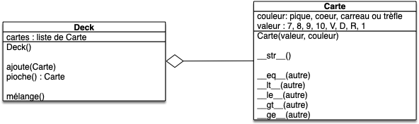

Nous allons ici continuer ce que nous avons commencé lors des précédents projets cartes et utiliser l'agrégation pour pouvoir jouer à la bataille.

Pour les besoins de ce projet, nous allons présupposer que vous avez une classe `Carte`{.language-} qui fonctionne. La version minimale que nous allons utiliser ici est disponible ci-après. Mais ne vous sentez pas obligé.e de l'utiliser.



fichier `carte.py`{.fichier} :

```python
class Carte:
    VALEURS = Enum(
        "valeur",
        [
            ("Sept", 7),
            ("Huit", 8),
            ("Neuf", 9),
            ("Dix", 10),
            ("Valet", 11),
            ("Dame", 12),
            ("Roi", 13),
            ("As", 14),
        ],
    )
    COULEURS = Enum(
        "Couleur", [("Pique", 4), ("Cœur", 3), ("Carreau", 2), ("Trèfle", 1)]
    )

    def __init__(self, valeur, couleur):
        self._couleur = couleur
        self._valeur = valeur

    def __str__(self):
        valeur = ["7", "8", "9", "10", "V", "D", "R", "1"]
        couleur = ["♣︎", "♦", "♥", "♠"]
        return valeur[self._valeur.value - 7] + couleur[self._couleur.value - 1]

    def __eq__(self, other):
        return (self._valeur == other._valeur) and (self._couleur == other._couleur)

    def __ge__(self, other):
        return (self._valeur.value > other._valeur.value) or (
            (self._valeur.value == other._valeur.value)
            and (self._couleur.value >= other._couleur.value)
        )

    def __ne__(self, other):
        return not (self == other)

    def __gt__(self, other):
        return (self != other) and (self >= other)

    def __le__(self, other):
        return other >= self

    def __lt__(self, other):
        return (other > self)

```

fichier `test_carte.py`{.fichier} :

```python
from carte import Carte


def test_constructeur():
    assert isinstance(Carte(Carte.VALEURS.sept, Carte.COULEURS.trèfle), Carte)


def test_str():
    assert str(Carte(Carte.VALEURS.sept, Carte.COULEURS.trèfle)) == "7♣︎"


def test_operator():
    dix_cœur = Carte(Carte.VALEURS.dix, Carte.COULEURS.cœur)
    dix_carreau = Carte(Carte.VALEURS.dix, Carte.COULEURS.carreau)
    
    assert dix_cœur == dix_cœur
    assert dix_cœur != dix_carreau
    assert dix_cœur <= dix_cœur
    assert dix_cœur > dix_carreau
    assert dix_carreau < dix_cœur

```




Le but des projets carters est de pouvoir jouer à une variante de [la bataille](https://fr.wikipedia.org/wiki/Bataille_(jeu)) :



On veut pouvoir mélanger un jeu de 32 cartes (sans joker) puis le séparer en 2 *pioches* de 16 cartes, un tas par joueur.

A chaque tour les deux joueurs prennent la première carte de leur pioche et la révèle. Le joueur ayant la plus grande carte (7 < 8 < 9 < 10 < V < D < R < 1 et si égalité de rang alors : ♠ > ♥ > ♦ > ♣︎) prend les deux cartes et les place dans sa pile de défausse (initialement vide).

Lorsqu'un joueur doit prendre une carte alors que sa pioche est vide, il mélange les cartes de sa défausse qui forment une nouvelle pioche. Si la pioche et la défausse sont vides, le joueur perd la partie.




## Classe `Deck`{.language-}

Vous allez implémenter une classe `Deck`{.language-} permettant de regrouper toutes les méthodes nécessaires au maniement d'un ensemble de cartes.



Proposez une modélisation d'une classe UML d'une classe `Deck`{.language-} permettant de jouer au jeu simplifié de la bataille en précisant son lien avec la classe `Carte`{.language-} si l'on suppose un deck initialement vide.
 






## Code


Implémentez la classe `Deck`{.language-} dans le fichier `deck.py`{.fichier}  et ses tests dans le fichier `test_deck.py`{.fichier}


Puisque l'attribut `cartes`{.language-} de la classe `Deck`{.language-} est une liste python, vous pourrez avantageusement utiliser :

- les méthodes `list.append`{.language-} et `list.pop`{.language-} des list pur respectivement ajouter et supprimer une carte au deck (voir [la partie 5.1 du tutoriel](https://docs.python.org/3/tutorial/datastructures.html#more-on-lists))
- [la fonction `shuffle`{.language-} du module `random`{.language-}](https://docs.python.org/3/library/random.html#random.shuffle) pour mélanger les cartes



Pour pouvoir jouer au jeu de la bataille, il faut une fonction qui crée un jeu :


Créez une fonction `jeu32()`{.language-} dans le fichier `deck.py`{.fichier} qui rend un `Deck`{.language-} contenant un jeu de 32 cartes.


Enfin, il faut un moyen de facilement transférer des cartes d'un Deck à l'autre :


Créez et testez une méthode `Deck.transfert(deck, nombre)`{.language-} qui transfère les `nombre`{.language-} premières cartes du deck au deck passé en paramètre.



## Jeu

Vous pouvez maintenant finir le projet en codant le jeu !

La règle du jeu est :

1. mélangez un jeu de 32 cartes en deux **pioches** de 16 cartes, une pour chaque joueur (vous pourrez commencer par créer un paquet de 32 cartes, puis le mélanger et enfin distributer les 16 première cartes à un joueur et les 16 dernières à l'autre)
2. chaque joueur dispose également d'une **défausse**, initialement vide
3. N = 1
4. chaque joueur dévoile la carte du dessus de leur pioche
5. le joueur ayant la carte la plus élevée remporte la carte de l'adversaire et pose les deux cartes (la sienne et celle de son adversaire) dans sa défausse
6. si un joueur n'a plus de cartes dans sa pioche, il mélange les cartes de sa défausse pour en faire un nouvelle pioche
7. si un joueur n'a plus de carte dans sa pioche, il perd la partie
8. N = N + 1
9. si N est inférieur ou au nombre maximum de tour, retour en 4, sinon le jeu s'arrête.


Codez le jeu dans un fichier `main.py`{.fichier}



