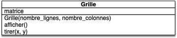
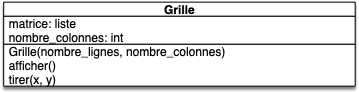
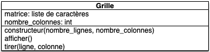

Vous allez coder une version simplifiée de la [bataille navale](https://fr.wikipedia.org/wiki/Bataille_navale_(jeu)).

Nous allons travailler avec la boucle de programmation classique en développement :



1. on code une petite fonctionnalité
2. on vérifie dans le programme principale ou dans un programme principal de test que cette fonctionnalité fonctionne
3. on convertit cette vérification en test que l'on conserve



On testera les fonctionnalités dans un fichier `main_fonctionnalité.py`{.fichier} qui sera refait à chaque test de fonctionnalité.

Le fichier `main.py`{.fichier} contiendra le jeu en lui même.

## Projet

### But

Nous voulons coder un jeu de [bataille navale](https://fr.wikipedia.org/wiki/Bataille_navale_(jeu)). Nous n'allons pas coder le jeu à deux joueurs, mais créer une interface pour un joueur. Il faut donc avoir à notre disposition :

- une grille de C colonnes et L lignes représentant notre terrain. Il faut pouvoir
  - tirer sur une case de la grille
  - afficher la grille
- des bateaux à placer sur la grille
  - chaque bateau à une longueur et il doit être placé sur la grille de façon horizontale ou verticale.
  - les bateaux placés sur la grille ne peuvent :
    - pas dépasser de la grille
    - se chevaucher
- on doit pouvoir marquer une case de la grille comme :
  - vierge
  - frappée d'un tir
- pour chaque bateau on doit pouvoir :
  - savoir s'il a été touché et si oui où
  - savoir s'il est coulé on non

### Vscode


Créez un dossier `projet-bataille-navale`{.fichier} sur votre ordinateur et ouvrez-le avec visual studio code pour en faire votre projet.


### UML

Il faudra créer quelques diagrammes UML, donc prévoyez également de quoi écrire.

## Grille

Commençons par l'objet grille. Pour l'instant, nous n'allons pas nous occuper des bateaux.


Proposez un modèle UML de la grille, dans l'hypothèse où il n'y a pas de bateaux





Créons une user story permettant de valider la grille :



- Nom : "Plouf dans l'eau"
- Utilisateur : un joueur
- Story : On veut pouvoir gérer les tirs de l'adversaire
- Actions :
  1. créer une grille à 5 lignes et 8 colonnes
  2. afficher la grille à l'écran
  3. demande à l'utilisateur de rentrer deux coordonnées x et y
  4. tier à l'endroit indiqué sur la grille
  5. retour en 2





Créez la user story dans un fichier `story_grille.py`{.fichier}. Commentez toutes les lignes de code non encore fonctionnelles.



On peut également tout de suite créer notre classe `Grille`{.language-} et préparer les tests :


Crée un ficher `grille.py`{.fichier} contenant une classe `Grille`{.language-} vide et testez avec la fonction de test `test_init()`{.language-} dans un fichier `test_grille.py`{.fichier} que l'on peut créer des objets de cette classe.


### Matrice en liste

Plutôt que de faire un tableau bi-dimensionnel pour encoder la grille, nous allons simuler une grille avec une liste.


Proser une méthode pour simuler une matrice à $C$ colonnes et $L$ lignes par une liste.


On crée une liste $L$ à $ C \cdot L$ cases. L’élément placé à la ligne $l$ et à la colonne $c$ sera placé à l'indice : $ l \cdot C + c$


Quels sont les attributs nécessaires pour implémenter cela dans la classe `Grille`{.language-} ? Modifier si nécessaire votre implémentation UML.


Il faut stocker, en plus de la grille, le nombre de colonnes de la grille :




Nous allons utiliser la grille pour stocker la position de nos bateau, là où l'ennemi a tiré et pour l'affichage. Nous allons donc utiliser un codage par caractère :

- sur une case vierge, on placera le caractère `'∿'`{.language-} (stockez ce caractère dans un attribut nommé `vide`{.language-})
- sur une case où l'adversaire a tiré, on placera le caractère `'x'`{.language-}


Ajoutez ces informations au diagramme UML pour se souvenir de tout ça.





On peut maintenant coder le tout :


Ajouter la création de la grille dans le constructeur de `Grille`{.language-} et la méthode `Grille.tirer(ligne, colonne)`{.language-}.

Vous testerez bien sur ces deux ajouts.


### Affichage

On va ici se concentrer sur un affichage en mode texte. On aimerait pouvoir effectuer le code suivant :

```python
>>> from grille import Grille
>>> g = Grille(5, 8)
>>> print(g)
........
........
........
........
........
>>> g.tirer(2, 3)
>>> print(g)
........
........
...x....
........
........
>>> 
```


Créer la méthode spéciale `__str__`{.language-} permettant de réaliser le code précédent, que vous transformerez en test.


### User story

Vous avez assez de code pour exécuter notre user story :


Exécutez et corrigez si nécessaire la user story *"Plouf dans l'eau"*.


## Bateau

On va ajouter des bateaux au jeu !

Pour l'instant décorrélons les bateaux de la grille.


Créez une classe `Bateau` dans le fichier `bateau.py`{.fichier}  qui doit posséder comme attributs (dans l'ordre) :

1. une ligne (pas de valeur par défaut)
2. une colonne (pas de valeur par défaut)
3. une longueur (par défaut 1)
4. un booléen nommé vertical qui est vrai si le bateau est placé à la vertical (par défaut `False`)

Créez aussi un constructeur qui devra considérer que par défaut la longueur du bateau est de 1 et qu'il est placé en position horizontale (il n'y a pas de paramètres par défaut pour la ligne et la colonne).

Vous testerez que les paramètres par défaut sont bien placés.


Pour pouvoir plus tard lier bateau et grille, ajoutons une méthode `Bateau.positions()`{.language-} :


Codez une méthode `Bateau.positions()`{.language-} qui rend une liste des différentes positions prisent par le bateau sur la grille. Cette liste doit être rangée par lignes (si le bateau est à la verticale) ou colonnes (si le bateau est à ll'horizontale) croissantes.

Vous pourrez tester le fait que :

- `Bateau(2, 3, longueur=3).positions()`{.language-} vaut `[(2, 3), (2, 4), (2, 5)]`{.language-}
- `Bateau(2, 3, longueur=3, vertical=True).positions()`{.language-} vaut `[(2, 3), (3, 3), (4, 3)]`{.language-}



Pour rendre les choses plus *pythonesques*, transformons cette méthode en attribut avec une `@property`{.language-}


En utilisant ce que vous avez fait dans [le projet dés](../projet-objets-dés#property){.interne}, modifier la méthode `Bateau.positions()`{.language-} pour qu'elle soit considérée comme un attribut.


Testons la fonctionnalité grâce à la user story suivante :



- Nom : "chevauchement"
- Utilisateur : un joueur
- Story : Positionner des bateaux sans chevauchement
- Actions :
  1. créer un bateau `b1`{.language-}
  2. créer un bateau `b2`{.language-}
  3. Vérifier si les deux bateaux se chevauchent




Codez la user story *"chevauchement"* dans le fichier `story_bateau.py`{.fichier}, avec un jeu de bateaux qui se chevauchent et un autre avec deux bateaux qui ne se se chevauchent pas.


## Grille et bateau

Pour permettre aux objets de type `Grille`{.language-} et `Bateau`{.language-} d'interagir, on va créer des méthodes.


Ajoutez une méthode `Grille.ajoute(bateau)`{.language-} qui place un bateau sur la grille en remplaçant le caractère par `⛵` aux positions du bateau. On ne pourra le faire que si le bateau rentre en entier dans la grille (vous le vérifierez).

Testez que la méthode fonctionne. Par exemple, vous pourrez vérifier que pour une grille `g`{.language-} de 2 lignes et 3 colonnes :

- la grille devient égale à `["∿", "∿", "∿", "⛵", "⛵", "∿"]`{.language-} après l'appel `g.ajoute(Bateau(1, 0, longueur=2, vertical=False))`{.language-}
- la grille est inchangée (elle reste égale à  `["∿", "∿", "∿", "∿", "∿", "∿"]`{.language}) après les appels aux méthodes : `g.ajoute(Bateau(1, 0, longueur=2, vertical=True))`{.language-} et `g.ajoute(Bateau(1, 0, longueur=4, vertical=True))`{.language-}



La méthode `Grille.ajoute(bateau)`{.language-} nous permet d'ajouter des bateaux à la grille. Il nous reste à savoir si un bateau est coulé pour avoir le matériel nécessaire au codage du jeu.


Ajoutez une méthode `coulé`{.language-} à la classe `Bateau`{.language-} qui vérifie s'il est coulé. La méthode `coulé`{.language-} prendra un paramètre la grille (on vérifiera s'il y a des `'x'`{.language-} sur toutes les cases du bateau).

Vous testerez cette méthode.


### Personnalisation

Pour une bataille navale qui se respecte, il faut plusieurs types de bateaux. Afin de permettre de particulariser les bateaux, on va assigner un identifiant à chaque bateau :


Ajoutez un cinquième paramètre au constructeur de bateau. Par défaut ce paramètre vaudra le caractère `"⛵"`{.language-}.

C'est ce caractère qui sera utilisé lors de l'ajout du bateau à la grille.

Vous testerez que le type est bien pris en compte lors de l'ajout d'un bateau à la grille.


Enfin, lorsque l'on touche un bateau, il faut que l'utilisateur le sache :



Ajoutez un paramètre `touche`{.language-} à la méthode `Grille.tirer(ligne, colonne, touche)` qui vaut par défaut `'x'`{.language-} et personnalise l'impact du tir sur la grille.



## Bataille navale

Nous avons tout le matériel nécessaire pour jouer au jeu de la bataille navale.

Pour cela il faudra tout d'abord créer une grille de 8 lignes et 10 colonnes.

Ensuite, vous créerez 4 bateaux placés de façon aléatoire sur la grille de façon à ce qu'ils ne se chevauchent pas (vous pourrez placer les bateau un à un, chaque bateau réduisant les possibilités de placement du prochain. A chaque placement, calculez tous les couples (case, orientation) ne produisant pas un chevauchement puis choisissez en un aléatoirement pour placer le bateau) :

- un porte avion de longueur 4 et de type "🚢"
- un croiseur de longueur 3 et de type "⛴"
- un torpilleur de longueur 2 et de type "🚣"
- un sous-marin de longueur 2 et de type "🐟"

Puis vous laissez l'utilisateur tirer un coup. Si un bateau est touché vous l'indiquez (utilisez le caractère "💣") et si un bateau est coulé vous affichez le bateau sur la carte. Lorsque les 4 bateaux sont détruits, vous stoppez le jeu en indiquant le nombre de coups qu'il a fallu pour en venir à bout.


Pour rendre l'interface de jeu sympathique, vous pourrez utiliser [le module pytermgui](https://github.com/bczsalba/pytermgui) pour gréer une interface textuelle complète.

