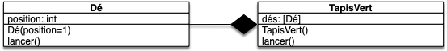

Dans les deux précédents projets dés, vous avez codé des classes toutes seules. Dans cette partie on va coder plusieurs classes enchevêtrées.

Pour les besoins de ce projet, nous allons présupposer que vous avez une classe `Dé`{.language-} qui fonctionne. La version minimale que nous allons utiliser ici est disponible ci-après. Mais ne vous sentez pas obliger de l'utiliser.

<span id="code-Dé"></span>



fichier `dé.py`{.fichier} :

```python
import random

class Dé:
    MIN_VALEUR = 1
    MAX_VALEUR = 6

    def __init__(self, position=1):
        self.position = position

    def lancer(self):
        self.position = random.randrange(self.MIN_VALEUR, self.MAX_VALEUR + 1)

        return self

    def __str__(self):
        if self.position == 1:
            return "⚀"
        elif self.position == 2:
            return "⚁"
        elif self.position == 3:
            return "⚂"
        elif self.position == 4:
            return "⚃"
        elif self.position == 5:
            return "⚄"
        else:
            return "⚅"

```

fichier `test_dé.py`{.fichier} :

```python
from dé import Dé


def test_init():
    assert isinstance(Dé(), Dé)


def test_position():
    assert Dé().position == 1
    assert Dé(position=4).position == 4


def test_lancer():
    dé = Dé()
    dé.lancer()
    assert Dé.MIN_VALEUR <= dé.position <= Dé.MAX_VALEUR


def test_str():
    dé = Dé()
    assert str(dé) == "⚀"
    dé.position = 4
    assert str(dé) == "⚃"

```



Il va nous falloir manipuler 5 dés ensemble pour atteindre le but de notre projet :



Jouer au [poker d'as](https://fr.wikipedia.org/wiki/Poker_d%27as).



Nous n'atteindrons pas ce but à la fin du projet, mais libre à vous de le continuer et de le finir.

## 5 dés

Méthode naïve pour manipuler 5 dés : la liste de dés.

Pour illustrer cette étape et progresser dans notre projet de jeu, faisons une petite user story :



- Nom : "jets de dés"
- Utilisateur : un joueur compulsif
- Story : On veut pouvoir lancer des dés et voir le résultat
- Actions :
  1. créer une liste
  2. créer 5 dés que l'on ajoute un à un à la liste
  3. lancer les 5 dés
  4. afficher chaque dés de la liste




Créez la user story dans le fichier `story_jets.py`{.fichier}


## Composition

L'utilisation d'une liste permet de grouper les 5 dés, mais il faut toujours les lancer individuellement. Cela pourrait être pratique de lancer automatiquement tous les dés.

### Classe `TapisVert`{.language-}

On aimerait avoir une structure, nommée `TapisVert`{.language-}, qui :

- crée et stocke 5 dés
- permette de lancer les dés stockés en une fois avec une méthode `lancer`{.language-}
- rendre les dés contenus dans sa structure via une liste ou un tuple



1. Proposez une modélisation UML de cette classe, montrez la relation qu'elle entretient avec la classe `Dé`{.language-}.
2. modifier la user story "jets de dés" pour qu'elle utilise cette classe





`story_jets.py`{.fichier} :

```python
from dé import TapisVert

tapis_vert = TapisVert()

tapis_vert.lancer()

for dé in tapis_vert.dés:
    print(dé)
```



Avant de commencer à coder, comprenez comment il est possible que la méthode `TapisVert.lancer()`{.language-} puisse utiliser la méthode `Dé.lancer()`{.language-} alors que les deux méthodes ont le même nom.

Maintenant que vous voyez comment faire, codez-la :


Ajoutez le code de la classe `TapisVert`{.language-} dans le fichier `dé.py`{.fichier}.

Ajoutez les tests de cette nouvelle classe au fichier `test_dé.py`{.fichier}. Vous pourrez par exemple tester  :

- qu'après la création d'un objet `TapisVert`{.language-} on dispose bien de 5 dés positionnés sur 1.
- qu'après avoir lancé les dés, leurs positions sont toujours cohérentes avec le nombre de faces.



### Affichage

On peut utiliser `Dé.__str__`{.language-} pour que `TapisVert.__str__`{.language-} soit facile à coder :


Créez une méthode `TapisVert.__str__`{.language-} qui permette d'écrire :

```python
>>> from dé import TapisVert
>>> tapis_vert = TapisVert()
>>> print(tapis_vert)
⚀ - ⚀ - ⚀ - ⚀ - ⚀
>>> tapis_vert.lancer()
>>> print(tapis_vert)
⚀ - ⚁ - ⚁ - ⚀ - ⚁
>>> 
```



On peut utiliser deux trucs. Le premier est de construire une liste avec les représentations sous la forme d'une chaîne de caractères des dés. Par exemple :

```python
>>> from dé import TapisVert
>>> tapis_vert = TapisVert()
>>>[str(x) for x in tapis_vert.dés]
['⚀', '⚀', '⚀', '⚀', '⚀']
```

Puis utiliser la méthode `str.join`{.language-} de python qui est super utile pour concaténer des listes de chaînes de caractères :

```python
>>> l = ["coucou", "les", "amis"]
>>> "*".join(l)
'coucou*les*amis'
```

Ces deux astuces nous permettent d'écrire le code :

```python
class TapisVert:
    # ...

    def __str__(self):
        return " - ".join([str(x) for x in self.dés])

    # ...

```



## Reconnaissance

Pour jouer au poker d'as, il nous faudra reconnaître des formes de jets de dés (comme les paires, ou encore les full). Créons une user story pour coder cette fonctionnalité :



- Nom : "formes de jets"
- Utilisateur : un joueur compulsif
- Story : On veut pouvoir savoir quelles formes de dés sont présentes
- Actions :
  1. jeter 5 dés
  2. vérifier s'il y a une paire, un brelan ou un carré
  3. recommencer en 1




Créez la story dans le fichier `story-formes-dés.py`{.fichier}.

Pour cela, l'utilisateur pourra appuyer sur la touche entrée pour lancer les dés d'un objet de type `TapisVert`{.language-}, afficher les 5 dés et indiquer s'il y a une paire, un brelan ou un carré avec des méthodes `TapisVert.possède_paire()`{.language-}, `TapisVert.possède_brelan()`{.language-}, et `TapisVert.possède_carré()`{.language-} qui rendent des booléens.


Et maintenant le code des différentes méthodes à implémenter :


Ajoutez dans `TapisVert`{.language-} les méthodes nécessaires et testez-les en simulant des lancers ayant une forme particulière.





Pour coder cela de façon simple, vous pourrez coder deux méthodes supports :

- une méthode qui rend une liste $L$ de taille 7 telle que $L[i]$ donne le nombre de dés ayant la position $i$ ($1 \leq i \leq 6$)
- une méthode qui prend en paramètre un nombre $n$ et qui rend `True`{.language-} s'il existe au moins $n$ dés ayant la même position. Ceci permettra de coder de la même manière les différentes fonctions demandées.


