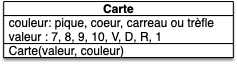

Encore un projet d'initiation dans le codage des objets. Vous allez coder une classe `Carte`{.language-}, ce qui permettra dans des projets ultérieurs de jouer à la bataille. La classe carte en elle-même ne fera pas grand chose, mais elle illustrera la notion de [value object](https://en.wikipedia.org/wiki/Value_object) :


Un **_value object_** est un objet ne pouvant pas être modifié une fois créé : il ne possède aucune méthode lui permettant de changer ses attributs qu'il faut renseigner à sa création.


## Projet

### Vscode


Créez un dossier `projet-cartes`{.fichier} sur votre ordinateur et ouvrez leu avec visual studio code pour un faire votre projet.


### But et User stories

Le but des projets carters est de pouvoir jouer à [la bataille](https://fr.wikipedia.org/wiki/Bataille_(jeu)).

Le projet nécessite de faire plein de choses. Pour vous aider à réaliser ce but, on va se placer des objectifs intermédiaires, sous la forme de user stories.

Je vous en propose une ci-après qui exhibe la capacité à créer un jeu de 32 cartes et à afficher les cartes à l'écran :



- Nom : "Voyance"
- Utilisateur : un voyant extralucide.
- Story : On veut pouvoir tirer les cartes
- Actions :
  1. créer un paquet de 32 cartes (sans joker)
  2. prendre au hasard 3 cartes du paquet
  3. afficher à l'écran les trois cartes, dans l'ordre où elles ont été tirées



Par rapport au jeu, il manque essentiellement la fonctionnalité permettant d'ordonner les cartes :


Créez une user story nommée *"Ordonnancement"* qui exhibe la fonctionnalité de pouvoir ordonner les cartes.

En affichant 10 cartes tirées avec remise dans l'ordre où elles ont été tirées, puis d'afficher la plus grande et la plus petite.




- Nom : "Ordonnancement"
- Utilisateur : un adepte de réussite
- Story : On veut pouvoir ranger les cartes par ordre croissant
- Actions :
  1. choisir 10 cartes au hasard (on peut avoir les mêmes cartes)
  2. afficher à l'écran les 10 cartes, dans l'ordre où elles ont été tirées
  3. afficher à l'écran la plus petite et la plus grande des 10 cartes



Créons les fichiers pour nos users stories, même si le code n'est pas encore clair. Par exemple pour la user story *"voyance"*, on crée un fichier `story_voyance.py`{.fichier} contenant :

```text
# création d'un paquet de 32 cartes
# prendre au hasard 3 cartes du paquet
# afficher à l'écran les trois cartes, dans l'ordre où elles ont été tirées
```

On ajoutera petit à petit le code permettant d'implémenter la story, au fur et à mesure de l'avancement du projet.


Créez les deux fichiers de story.


### Carte UML

La pioche et la défausse pouvant être facilement modélisées par des listes, il nous reste à créer une classe Carte pour avoir tous les éléments de base de notre projet.


Proposez une modélisation UML d'une classe Carte pour notre projet. A-t-elle besoin de méthodes ?



On a besoin que d'un constructeur :





## Code


Créez les fichiers qui nous permettront de coder la carte :

- `carte.py`{.fichier}
- `test_carte.py`{.fichier}



### Constructeur

Le constructeur d'une carte nécessite 2 paramètres : la valeur et la couleur.


En  considérant que les deux paramètres couleur et valeur sont des entiers, quelles sont les possibilités admissibles pour construire une carte ?



Il y en a plein bien sur. J'utilise les valeurs suivantes pour pouvoir facilement les ordonner :

- 7 pour `"sept"`{.language-}
- 8 pour `"huit"`{.language-}
- 9 pour `"neuf"`{.language-}
- 10 pour `"dix"`{.language-}
- 11 pour `"valet"`{.language-}
- 12 pour `"dame"`{.language-}
- 13 pour `"roi"`{.language-}
- 14 pour `"as"`{.language-}

Pour les couleurs :

- 4 pour `"pique"`{.language-}
- 3 pour `"cœur"`{.language-}
- 2 pour `"carreau"`{.language-}
- 1 pour `"trèfle"`{.language-}




Implémentez le constructeur de la classe `Carte`{.fichier} et ses tests en supposant que l'utilisateur entre les bonnes valeurs de paramètres.



### Affichage à l'écran

En revanche afficher une carte à l'écran uniquement avec ses attributs entiers n'est pas très parlant. Codons, comme on a fait pour les dés, une méthode permettant un affichage à l'écran plus convivial :


Codez une méthode `Carte.texte()`{.language-} d'une carte qui rend une chaîne de caractères. Le code suivant doit pouvoir fonctionner (en supposant que l'entier 13 correspond à l'as et l'entier 1 à pique) :

```python
>>> from carte import Carte
>>> ace_pique = Carte(13, 4)
>>> print(ace_pique.texte())
1♠
```

Faites un test de cette méthode en testant la représentation sous la forme d'une chaîne de caractères d'une `Carte`{.language-}.


### Ordre

Pour savoir si une carte est plus grande qu'une autre, le plus simple est d'ajouter des méthodes permettant de comparer les cartes entre elles.


Codez la méthode `Carte.plus_grande_ou_égale_que(other)`{.language-} qui prend une carte en paramètre et rend :

- `True`{.language-} si `self`{.language-} est plus grande ou égale que `other`{.language-}
- `False`{.language-} sinon 

Le code suivant doit pouvoir fonctionner (en supposant que l'entier 13 correspond à l'as et l'entier 1 à pique) :

```python
>>> from carte import Carte
>>> ace_pique = Carte(13, 4)
>>> valet_trèfle = Carte(11, 1)
>>> ace_pique.plus_grande_ou_égale_que(valet_trèfle)
True
```

Faites des tests de cette méthode.


### User story

Vous avez assez de matière pour coder notre seconde user story :


Codez la user story *"Ordonnancement"*.


## Constantes pour les attributs

Avant de pouvoir finir la partie de création d'une carte, il nous reste un problème à résoudre. Comment indiquer à l'utilisateur les possibilités de valeur et de couleurs et leurs correspondances ?

La solution communément utilisée pour cela est de créer des constantes :


Créez les constantes suivantes dans le fichier `cartes.py` :

- `SEPT`{.language-}, `HUIT`{.language-}, `NEUF`{.language-}, `DIX`{.language-}, `VALET`{.language-}, `DAME`{.language-}, `ROI`{.language-}, `AS`{.language-}
- `PIQUE`{.language-}, `COEUR`{.language-}, `CARREAU`{.language-}, `TREFLE`{.language-}

En leur associant les entiers adéquats.



On ajoute les constantes directement le module, au dessus de la définition de la classe :

```python
SEPT = 7
HUIT = 8
NEUF = 9
DIX = 10
VALET = 11
DAME = 12
ROI = 13
AS = 14

PIQUE = 4
COEUR = 3
CARREAU = 2
TREFLE = 1

class Carte:
    #  ... 
```

Ceci permet dans le programme principal de créer des objets en utilisant ces constantes en ajoutant un import du module directement. Par exemple :

```python
from carte import Carte
import carte

c = Carte(carte.SEPT, carte.PIQUE)

```

On pourrait aussi ne faire qu'un seul import :

```python
import carte

c = carte.Carte(carte.SEPT, carte.PIQUE)

```

Ou importer tous les noms nécessaires :

```python
from carte import Carte, SEPT, PIQUE

c = Carte(SEPT, PIQUE)

```

Les trois sont possibles, choisissez celui qui vous convient le mieux.



Il faudra utiliser ces constantes pour créer les cartes et ne plus directement utiliser des entiers comme 7.

Par exemple, on écrira `Carte(carte.AS, carte.TREFLE)`{.language-} plutôt que `Carte(13, 4)`{.language-}


Utilisez dans le code et les tests les constantes à la place des entiers.


Enfin, pour grouper ces constantes, vous pourrez :



Créer deux autres constantes (on utilise donc [des tuples](../..//bases-programmation/conteneurs/tuples/){.interne}), qui rassemblent les couleurs et les valeurs entre elles :

- `VALEURS = (SEPT, HUIT, NEUF, DIX, VALET, DAME, ROI, AS)`{.language-}
- `COULEURS = (TREFLE, CARREAU, COEUR, PIQUE)`{.language-}



Les deux constante précédentes vous permettrons de facilement créer un jeu de cartes en faisant deux boucles. imbriquées :

```python
from carte import Carte
import carte

jeu = []

for valeur in carte.VALEURS:
    for couleur in carte.COULEURS:
        jeu.append(Carte(valeur, couleur))
```



Connaître cette technique est fondamentale. L'utilisateur ne doit pas être au courant des entiers codant vos valeurs et couleurs : Il utilise des constantes explicites. Ceci permet de plus de garantir que les entrées du constructeur de la cartes sont toujours correctes.

C'est une application directe du mantra NO MAGIC NUMBERS :

<span id="mantra-no-magic-numbers"></span>



[NO MAGIC NUMBER](<https://fr.wikipedia.org/wiki/Nombre_magique_(programmation)#Constantes_num%C3%A9riques_non_nomm%C3%A9es>)



## User story voyance

Vous avez tous les outils nécessaires pour créer les user story *"voyance"*  :


Codez la user story *"voyance"*.


Vous pourrez :

1. créez une liste de 32 cartes constituant le paquet
2. tirer un indice $i$ aléatoire entre 0 et la longueur de la liste
3. stocker la carte d'indice $i$ et la supprimer du paquet
4. recommencer si vous an'avez pas tiré toutes les cartes


## User story ordonnancement


Codez la user story *"ordonnancement"*.


