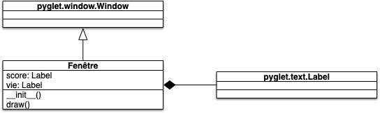
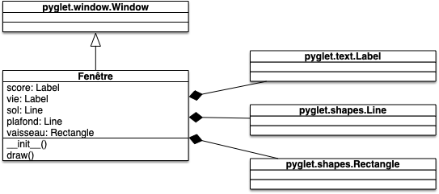
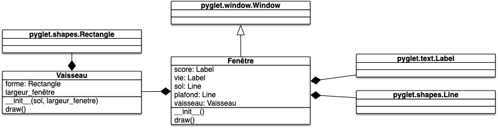
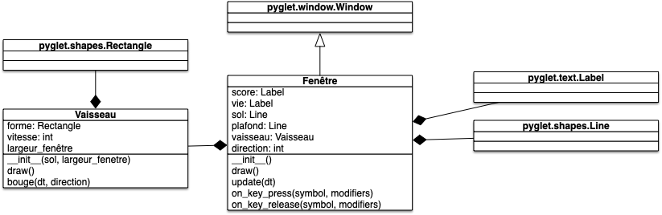
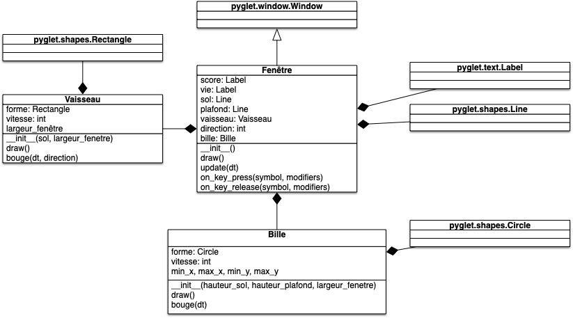
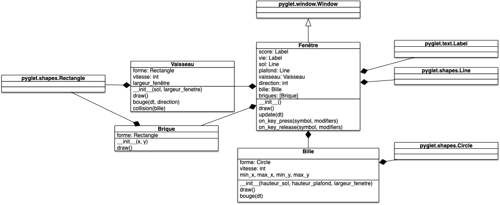
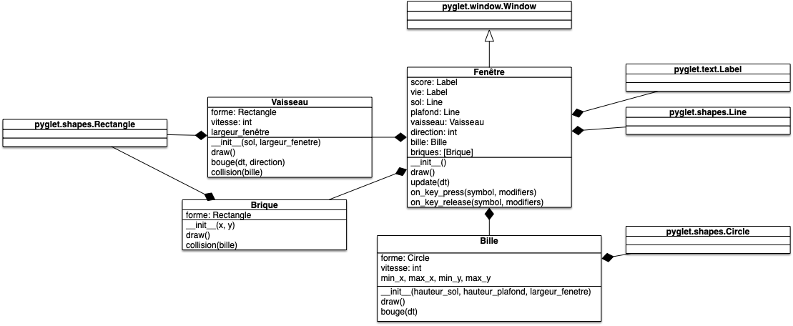

<!-- début résumé -->

Coder un jeu arkanoïd.

<!-- end résumé -->

Le but de ce projet est que vous créiez un jeu de type [Arkanoïd](https://fr.wikipedia.org/wiki/Arkanoid). De nombreuses parties d'Arkanoïd existent sur youtube, comme par exemple :

https://www.youtube.com/watch?v=Th-Z6QQ5AOQ

Une partie du jeu est visible. Vous devriez avoir les connaissances nécessaire en pyglet pour vous en sortir.

Pour ne pas passer des heures à coder sans résultats, découpez votre programme en plusieurs parties, toutes réalisables en environ 1/2 heure.

Prenez le temps de modéliser proprement vos objets et classes pour que tout votre programme ne soit qu'une imbrication de classes qui interagissent les unes avec les autres.

Pour chaque classe il faudra bien sur ses tests qui permettent de certifier que les méthodes fonctionnent. Il faut faire en sorte que chaque méthode soit testable sans `pyglet`, juste en simulant une partie.

## Mise en place



1. créez un dossier nommé `Arkanoid`{.fichier} où vous placerez vos fichiers
2. créez un projet vscode dans ce dossier
3. vérifiez que pyglet est bien installé en tentant d'importer pyglet dans un fichier



## Entités du projet

A priori, les objets dont vous aurez besoin sont :

- la fenêtre qui gère les différents événements du projet.
- le vaisseau qui doit pouvoir bouger de gauche à droite sans dépasser les limites de la fenêtre
- la balle qui doit vérifier à chaque déplacement qu'elle ne touche pas le bord de la fenêtre, une brique ou le vaisseau
- les briques qui peuvent être détruites par la balle et lâcher un bonus en mourant
- les bonus qui tombent de l'écran et qui peuvent être récupéré par le vaisseau( s'il y a collision) ou disparaissent en bas de l'écran
- le score
- ... ?


Lister les différentes classes et événements que vous devrez gérer pour mener à bien le projet. et essayer de construire un premier jet du modèle UML du projet. Ce modèle n'a pas besoin d'être précis, il doit servir de guide à votre découpage en tâche.


## Découpage du projet en tâche

Commencez par découper le projet en classes et déterminez leurs attributs et méthodes. Une fois ceci fait, décrivez votre 1ère tâche : quelle fonctionnalité du jeu est la plus simple à créer tout en ayant un jeu fonctionnel (même incomplet)


Chaque tâche doit correspondre à une fonctionnalité que vous ajoutez à votre jeu. Cette tâche doit :

- être constituée de méthodes et ou attributs à ajouter à une ou plusieurs classes
- aux tests de ces méthodes
- à l'ajoute de cette fonctionnalité au programme



Pour que votre première tâche ne soit pas *"faire un jeu Arkanoïd"* on ajoute les contraintes :


La fonctionnalité doit pouvoir être ajoutée en 1/2 heure.


Enfin :


On vous demande de garder dans un fichier Markdown les différentes taches que vous avez effectuées avec votre projet.


Si vous suivez ce principe, toutes les 1/2 heure votre jeu sera plus complet. **Ne passez pas 1 heure à coder quelque chose sans l'utiliser !**

## Déroulé

Conservez en plus de votre projet un fichier Markdown dans le quel vous décrirez chaque tâche que vous voulez implémenter, ainsi que l'heure de début et l'heure de fin de la tâche. Si vous voyez que votre tâche prend trop de temps à être créer, scindez votre tâche en tâches plus petites. Au bout de quelques tâches vous devriez être rodé.


Au début de chaque étape :

1. demandez l'aval de votre encadrant avant de commencer l'implémentation de la tâche
2. conservez dans le fichier markdown de votre projet la fonctionnalité que vous allez ajouter



Pour débuter le projet, si vous n'avez pas d'idée de déroulé, vous pouvez suivre celui ci-après. Il vous mènera jusqu'au début de l'implémentation des briques.

Ici nous créerons une classe `Fenetre`{.language-} qui contiendra notre interface. On ne testera pas l'interface (donc la classe `Fenetre`{.language-}), mais tout le reste devra être testé.

## Tâche 1

Création d'une fenêtre de 640x480 non redimensionnable avec :

- un label du nombre de vie (2 par défaut), en bas à gauche
- un label avec le score (0 par défaut), en haut à droite


Vous créerez une classe `Fenetre`{.language-} héritant de `pyglet.window.Window`{.language-} contenant les différents contenus. Votre programme principal consistera à créer un objet de la classe `Fenetre`{.language-} et d'exécuter pyglet avec la commande : `pyglet.app.run()`{.language-}.

À la fin de la tâche 1 vous devriez avoir deux fichiers :

- `fenêtre.py`{.fichier} qui contient la classe `Fenêtre`{.language-}
- `main.py`{.fichier} qui contient le programme principal (qui crée un objet de la classe `Fenêtre`{.language-} puis lance l'interface graphique)

Le diagramme UML de la classe `Fenêtre`{.language-} devrait être quelque chose du genre :



Le fichier `main.py`{.language-} ne bougera plus de tout le projet et doit être :

```python
import pyglet

from fenêtre import Fenêtre

window = Fenêtre()

print("Ça commence.")
pyglet.app.run()
print("C'est fini !")

```

## Tâche 2

- ajout du sol : une [ligne pyglet](https://pyglet.readthedocs.io/en/latest/modules/shapes.html#pyglet.shapes.Line) à hauteur $50$
- ajout du plafond : une [ligne pyglet](https://pyglet.readthedocs.io/en/latest/modules/shapes.html#pyglet.shapes.Line) à hauteur $480-50$
- ajout du vaisseau :
  - doit être placé sur le sol
  - sa forme est un [rectangle pyglet](https://pyglet.readthedocs.io/en/latest/modules/shapes.html#pyglet.shapes.Rectangle) (de hauteur 20 et de longueur 50) de couleur #47B6FF (il faudra faire une conversion pour correspondre au format de couleurs de pyglet)


Le diagramme UML de la classe `Fenêtre`{.language-} devrait maintenant être quelque chose du genre :



## Tâche 3

Faire déplacer le vaisseau de gauche à droite sans cogner les bords.

Comme la gestion des déplacement doit être interne au vaisseau, il faut qu'il puisse avoir sa classe à lui. On va donc réaliser cette tâche en 2 temps.

### Tache 3.1

Création de la classe :

- classe : `Vaisseau`{.language-} (dans le fichier `vaisseau.py`{.fichier})
- attributs :
  - `forme`{.language-} un [rectangle pyglet](https://pyglet.readthedocs.io/en/latest/modules/shapes.html#pyglet.shapes.Rectangle) de longueur 50, de hauteur 20, initialement placé au centre de la fenêtre (cette forme sera crée dans le constructeur de la classe).
- méthode :
  - `__init__(self, sol, largeur_fenetre)`{.language-} : position du sol et largeur de la fenêtre de jeu
  - `draw()`{.language-} : vous appellerez cette méthode depuis la méthode `draw`{.language-} de `Fenêtre`{.language-}

Les tests du vaisseau seront fait dans le fichier `Arkanoid/test_vaisseau.py`{.fichier}. Pour commencer les tests de cette classe, vous pourrez vérifier que le vaisseau est bien initialement placé au centre de la fenêtre en comparant :

- la valeur de `vaisseau.forme.x`{.language-} à sa valeur théorique selon la taille de l'écran.
- la valeur de `vaisseau.forme.y`{.language-} à la hauteur du sol



### Tâche 3.2

Ajout des méthodes et des attributs permettant de déplacer le vaisseau.

Il nous faut côté `Fenetre`{.language-} :

1. modifier la classe fenêtre pour qu'elle prenne en compte les touches "flèche gauche" et "flèche droite" en modifiant un nouveal attribut `direction`{.language-} qui  vaudra -1 lorsque la touche gauche est appuyée ; 1 lorsque c'est la touche droite et 0 sinon
2. que l'on change la position du vaisseau à au plus 60 fps (tous les 1/60 secondes)

On doit gérer les mouvement côté `Vaisseau`{.language-} en ajoutant :

- un attribut `vitesse`{.language-} qui donne le déplacement en pixel par seconde (500 pixel/s)
- une méthode `bouge(dt, direction)`{.language-} qui déplace le curseur selon :
  - la direction (-1 à gauche, 0 on ne bouge pas et +1 à droite)
  - par défaut le déplacement sera de sa vitesse fois `dt`{.language-} sauf si cela le fait dépasser l'écran à gauche ou à droite et dans ce cas là le vaisseau est collé au bord

Pour tester la méthode `bouge`{.language-} vous pourrez faire 4 tests :

- `test_bouge_droite()`{.language-} : qui vérifie que la position change bien lorsque l'on  veut se déplacer à droite
- `test_bouge_gauche()`{.language-} : qui vérifie que la position change bien lorsque l'on  veut se déplacer à gauche
- `test_bouge_negatif()`{.language-} : qui vérifie que l'on se cogne bien au bord gauche de l'écran
- `test_bouge_depasse_taille()`{.language-} : qui vérifie que l'on se cogne bien au bord droit de l'écran

Pour faire passer ces tests, vous pourrez modifier à la main les différents paramètres comme la vitesse (`vaisseau.vitesse`{.language-}) ou la position du vaisseau (`vaisseau.forme.x`{.language-}) pour que votre test soit facile à écrire.


Félicitations, votre programme doit pouvoir faire bouger le vaisseau ! Vérifiez le.




## Tâche 4

Création et gestion de la bille :

- la bille apparaît au milieu de l'écran avec une vitesse initiale.
- si elle passe sous le sol, on perd une vie
- à 0 vie, elle réapparait avec une vitesse nulle
- elle rebondit (selon la normale de la surface) sur :
  - 3 bords de l'écran sur 4
  - sur le vaisseau

Pour réaliser tout ça on va travailler par morceaux.

### Tache 4.1

Création d'une bille et de ses bornes de jeu. Pour cela, il nous faut commencer à créer une classe bille avec un cercle comme dessin.

Création de la classe :

- classe : `Bille`{.language-} (dans le fichier `bille.py`{.fichier)
- attributs :
  - `forme`{.language-} un [cercle pyglet](https://pyglet.readthedocs.io/en/latest/modules/shapes.html#pyglet.shapes.Circle) de rayon 5, initialement placé au centre de la fenêtre
- méthode :
  - `__init__(self, hauteur_sol, hauteur_plafond, largeur_fenetre)`{.language-} : position du sol, hauteur du plafond et largeur de la fenêtre de jeu pour déterminer les bornes de déplacement possible de la bille
  - `draw()`{.language-}

Les tests de la bille seront fait dans le fichier `Arkanoid/test_bille.py`{.fichier}. Testez que la position initiale de la bille est bien correcte.

Ajoutez la bille à l'interface :


### Tâche 4.2

Ajoutons une première version du déplacement de la bille :

- ajoutez un attribut `vitesse`{.language-} qui est un vecteur à 2 dimension à la classe `Bille`{.language-}
- ajoutez une méthode : `bouge(dt)`{.language-} qui déplacera la bille selon son vecteur vitesse. Pour l'instant ne prenez pas en compte les contraintes des bords et du vaisseau

Les tests de la bille seront fait dans le fichier `Arkanoid/test_bille.py`{.fichier}. Pour tester la méthode `bouge`{.language-}, vous pourrez faire 1 test `test_bouge()`{.language-} qui vérifie que pour `dt=2`{.language-} et une vitesse `(2, 5)`{.language-}, le déplacement de la bille est bien correct. N'hésitez pas à changer directement les attributs dans votre test.

Ajoutez la bille dans le jeu, avec une vitesse initiale de (0, -100)



### Tâche 4.3

Ajoutons le fait que si la bille sort de la fenêtre par le bas (sa position `y`{.language-} est inférieure à la hauteur du sol),  elle réapparait au milieu de l'écran avec la même vitesse.

Testez cette fonctionnalité.

### Tâche 4.4

Faite maintenant rebondir la bille sur les murs. Cela peut se faire en changeant la direction d'une des coordonnées du vecteur vitesse (cette coordonnée change selon le mur) dans la méthode `bouge`{.language-} de la bille si celle-ci devait dépasser le mur.

Testez ces fonctionnalités avec un test par mur en :

1. vous plaçant juste avant l'impact
2. effectuez une méthode `update`{.language-}
3. vérifier que la vitesse de la  bille a bien changé et que sa position est bien à nouveau dans les bornes de la fenêtre.

## Tâche 5

Le vaisseau doit se comporter comme un mur lorsque la bille le touche. Pour cela il faut gérer les collisions entre éléments du jeu.

Nous allons gérer ceci en plusieurs temps.

### Tâche 5.1

Ajoutez une méthode `collision(bille)`{.language-} au vaisseau. Cette méthode doit répondre `True`{.language-} si la bille touche le vaisseau, et `False` sinon. Pour cela vous pouvez utiliser l'algorithme suivant, qui regarde s'il y a collision entre un disque de centre $(x0, y0)$ et de rayon $R$ avec un rectangle dont le somment en bas à gauche est en $(x1, y1)$ :

```python
def collision_disque_rectangle(x0, y0, rayon, x1, y1, hauteur, largeur):
        dist_x = min(
            (x0 - x1) ** 2,
            (x0 - x1 - largeur) ** 2,
        )
        dist_y = min(
            (y0 - y1) ** 2,
            (y0 - y1 - hauteur) ** 2,
        )

        if (x1 <= x0 <= x1 + largeur) and (
            y1 <= y0 <= y1 + hauteur
        ):
            return True
        elif x1 <= x0 <= x1 + largeur:
            return dist_y < rayon ** 2
        elif y1 <= y0 <= y1 + hauteur:
            return dist_x < rayon ** 2
        else:
            return dist_x + dist_y < rayon ** 2
```

Testez cette méthode.


### Tâche 5.2

Après la mise à jour des position dans la méthode `update`{.language-}, testez s'il y a collision entre la bille et le vaisseau. Si oui, faite rebondir la bille.

## Tâche 6

Gestion de la vie et du score.

### Tâche 6.1

Lorsqu'il y a collision entre le vaisseau et la bille, le score augmente de 1.

### Tâche 6.2

Lorsque la la bille tombe dans le sol, on l'a faite réapparaitre au milieu de l'écran avec la même vitesse (tâche 4.3).

Pour gérer facilement la vie vous pouvez :

- faire réapparaître la bille avec une position nulle
- après la mise à jour des positions, si la vitesse de la bille est nulle c'est que l'on est mort. Décrémentez alors le nombre de vie. Si ce nombre reste positif, redonner de la vitesse à la bille.

## Tâche 7

Une brique doit se comporter comme le vaisseau lorsque la bille la touche (elle rebondit), puis disparaître. Commençons par dessiner les briques

Création de la classe :

- classe : `Brique`{.language-} (dans le fichier `brique.py`{.fichier})
- attributs :
   `forme`{.language-} un [rectangle pyglet](https://pyglet.readthedocs.io/en/latest/modules/shapes.html#pyglet.shapes.Rectangle) de longueur 40, de hauteur 20
- méthode :
  - `__init__(self, x, y)`{.language-} : création de la brique à la position `(x, y)`{.language-}
  - `draw()`{.language-}

Dans `Fenetre`{.language-} créez une liste `self.briques`{.language-} et ajoutez y un mur de briques à notre interface. On pourra créer 5 rangées de 12 briques, par exemple.



## Tâche 8

Pour finir, il reste à mettre en place la gestion des collisions entre a bille et les briques. Il n'y a presque rien à faire car tout va se passer comme pour le vaisseau.

Ajoutez une méthode `collision(bille)`{.language-} à la classe `Brique`{.language-}. Cette méthode doit répondre `True`{.language-} si la bille touche la brique, et `False`{.language-} sinon (il faut que le centre de la bille soit dans le rectangle du vaisseau augmenté du rayon de la bille, tout comme pour le vaisseau).

Après la mise à jour des positions dans la méthode `update`{.language-}, testez s'il y a collision entre la bille et une brique. Si oui, augmentez le score de 5, faite rebondir la bille et supprimez cette brique de la liste des briques.



