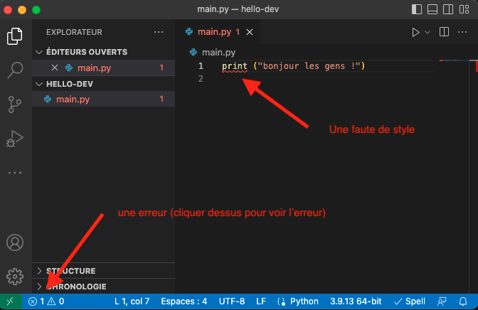

Un projet informatique a un début, lorsque l'on crée le dossier qui va le contenir, mais il n'a que rarement de fin : il y a toujours des fonctionnalités à ajouter et des bugs à corriger. Enfin, et c'est le plus important, un code est fait pour être utilisé.

De ces deux constatations, on en déduit trois règles fondamentales d'un code utile. Il faut qu'il soit :

- juste pour des utilisateurs puissent s'en servir
- facilement modifiable pour que l'ajout et la correction de fonctionnalités soient aisés
- lisible pour soi et pour les autres membres de l'équipe de développement

Le langage d'application n'a que peu d'intérêt en soit. On choisit celui qui est le plus adapté à notre but. Ici, on utilisera le python mais tout ce qu'on verra est transposable pour tout autre langage sérieux. L'éditeur de texte que l'on utilisera sera vscode. Il en existe d'autres très bien aussi et tout ce qu'on verra avec vscode (les raccourcis claviers, et aides au développement) sont transposables à d'autres éditeurs en lisant la doc.


Écrire du code nécessite de nombreuses automatisations et aides pour que ce ne soit pas pénible, ne vous privez pas d'outils parce que vous n'avez pas envie d'apprendre de nouvelles choses et que _ça suffit bien pour ce que je veux faire_. Vous allez au final perdre plus de temps que l'apprentissage initial (ce qui est tarte).


## Un projet

On va créer un projet pour comprendre comment tout ça fonctionne.

Nous allons préparer le projet dans lequel nous allons coder. Ceci se fait avec vscode en ouvrant un dossier. Ce dossier sera le départ de votre projet et s'appelle _workspace_.



1. Commencez par créer le dossier `hello-dev`{.fichier} dans un explorateur de fichier
2. dans vscode, choisissez : "_fichier > ouvrir le dossier..._" puis naviguez jusqu'à votre dossier `hello-dev`{.fichier}. On vous demande si vous faites confiances aux auteurs, puisque c'est vous dites oui.




Lorsque l'on code et que l'on ne veut pas de problèmes en développement, les noms de fichiers et de dossier doivent êtres **sans espaces et sans accents**.




Ce n'et pas juste un ensemble de fichiers.

Dans vscode, il faudra toujours choisir d'ouvrir un dossier lorsque l'on travaille sur un projet.


### Fichier python

On va créer notre premier fichier python :



1. allez dans _menu Fichier > Nouveau Fichier_
2. et sauvez le de suite : _menu Fichier > Enregistrer_ avec le nom `main.py`{.fichier}.



Vscode à compris que c'était du python, il l'écrit dans la barre de statut (la dernière ligne, en bleu, de la fenêtre vscode, voir [user interface](https://code.visualstudio.com/docs/getstarted/userinterface)).



Si vous n'avez pas suivi le tuto d'installation de vscode et son interaction avec python, il vous demandera peut-être de :

1. choisir un interpréteur : prenez le python de votre distribution
2. choisir un linter : supprimer la fenêtre de warning, on fera ça plus tard.
3. choisir des tests : supprimer la fenêtre de warning, on fera ça plus tard.



### Exécution d'un fichier



Écrivez dans le fichier `main.py`{.fichier} :

```python
print("bonjour les gens !")
```



En vous rappelant ce que vous avez vu [ici](../../bases-programmation/éditeur-vscode/python/#exécuter-programme){.interne} et [là](/cours/système-et-réseau/bases-système/terminal/terminal-vscode/){.interne} :


Exécutez le code de deux manières différentes :

- avec le terminal
- avec le petit triangle



## <spans id="linter"></span> Du joli code

Vous allez passer beaucoup de temps à lire du code, le votre et celui des autres. Il est important que ce soit facile. Pour cela il faut que le style de code soit cohérent. Python donne des règle de style, c'est ce qu'on appelle [la PEP8](https://www.python.org/dev/peps/pep-0008/).

### Linter

Un linter est un programme permettant de signaler les erreurs de style pour les corriger. Installer un linter vous permet de vous familiariser avec les règles d'un joli code.

Il existe de nombreux linter, nous allons utiliser [flake8](https://flake8.pycqa.org/en/latest/) qui s'intègre bien avec vscode.

#### Installation


[Installer flake8](./extensions-python-vscode/flake8){.interne}.


#### Utilisation

Vérifions qu'il remarque bien les fautes :



Modifiez le fichier `main.py`{.fichier} pour écrire :

```python
print ("bonjour les gens !")
```



Une fois le fichier sauvé vous devriez voir que l'espace entre print et la parenthèse est souligné en rouge :



On peut cliquer sur la status-bar pour voir l'erreur ou passer le curseur sur la partie rouge :


Parce qu'on ne voit pas immédiatement si c'est une fonction ou un nom de variable.


Vous devriez peut-être aussi avoir la parenthèse de fin souligné en jaune. C'est parce que la dernière ligne de votre fichier n'est pas vide. Si ce n'est pas le cas, c'est que vous avez bien que 2 lignes dans votre fichier, la seconde étant vide.


**style** : **la dernière ligne d'un fichier python est vide**



Prenez l'habitude d'écrire du code sans aucune erreur de style. Et, surtout, **apprenez pourquoi cette règle existe**. Suivre une règle sans comprendre pourquoi elle existe n'est pas efficace... Parce qu'on ne sait pas s'il faut la suivre ou pas.


Tout au long de ce projet et des prochains, il faut faire en sorte qu'il n'y ait jamais d'erreur de style. Soyez donc vigilant au début avant que cela devienne naturel.

### black

Il existe des outils permettant de formatter automatiquement le code, comme l'utilitaire [black](https://github.com/psf/black) par exemple.


[Installer black](./extensions-python-vscode/black){.interne}.


Une fois black installé, vous pouvez l'utiliser depuis un terminal ou depuis vscode.

## Séparer code et main



- le code : les fonctions utilisées
- le main : le programme principal, c'est ce qu'on exécute lorsque veut faire marcher le projet
- les tests : ce qui garantit que le code fonctionne



Pour séparer les différentes parties vous allez :


Créez deux fichiers dans notre projet, l'un nommé `le_code.py`{.fichier} qui contiendra notre code et l'autre nommé `main.py`{.fichier} qui sera notre programme principal


Fichier `le_code.py`{.fichier} :

```python
def bonjour():
    return "Bonjour les gens !"

```

Fichier `main.py`{.fichier} :

```python
from le_code import bonjour

print(bonjour())

```

On a importé le nom `bonjour`{.language-} défini dans le fichier `le_code.py`{.fichier} grâce à un import. L'autre façon aurait été d'importer juste le fichier code. On aurait alors eu :

```python
import le_code

print(le_code.bonjour())

```

La notation pointée se lit alors : exécute le nom `bonjour` définit dans `le_code.py`{.fichier}.


Ne **jamais jamais jamais** utiliser `from le_code import *`{.language-} qui importe tous les noms définis dans `le_code.py`{.fichier}. On ne sait pas vraiment ce qui a été importé en lisant `le_code.py`{.fichier}. : notre code n'est pas lisible ! Le gain d'écriture de `*`{.language-} plutôt que `bonjour`{.language-} sera perdu au centuple plus tard lorsque l'on devra chercher dans tous les fichiers du projet où l'on a bien pu définir `bonjour`{.language-}...



Comme on va passer plus de temps à lire/comprendre du code qu'à l'écrire, il faut **optimiser la lecture et non l'écriture de code**. On préférera toujours **la lisibilité à la rapidité**.


## Tests

Les tests permettent de vérifier que notre code fonctionne. Ils font partie du programme et on peut s'y référer quand on veut. Lorsque l'on modifie le code, on pourra toujours exécuter **tous les tests** pour vérifier que notre programme fonctionne aussi bien qu'avant.

On reprend [ce que l'on a déjà vu](../../tests-unitaires/){.interne} pour finaliser notre projet :

### Test du projet

Notre projet contient pour l'instant une fonction qui rend une constante. Tester une constante n'a pas de sens, modifions notre code pour que notre fonction ait plus de sens :


Modifiez le fichier `le_code.py`{.fichier} pour qu'il contienne le code :

```python
def bonjour(nom):
    return "bonjour " + nom + " !"

```



Créez le fichier `test_projet.py`{.fichier} pour qu'il contienne le code :

```python
from le_code import bonjour


def test_bonjour():
    assert bonjour("monde") == "bonjour monde !"
```

Exécutez les tests pour vérifier que votre code fonctionne.



Maintenant que les tests passent, on peut modifier le programme principal.


Modifiez le fichier `main.py`{.fichier} pour qu'il contienne le code :

```python
from le_code import bonjour

print(bonjour("monde"))

```

Exécutez le programme principal.



Félicitations, vous avez fait votre premier projet fonctionnel !
