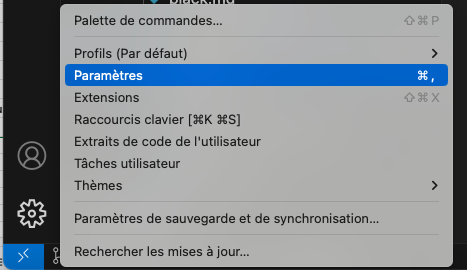
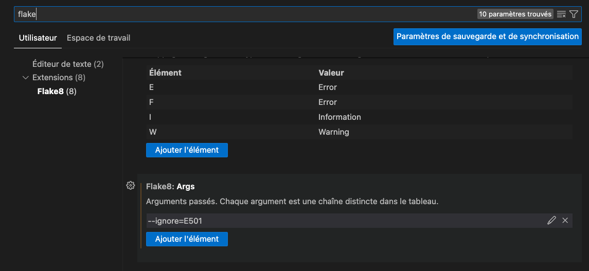

<!-- début résumé -->

[Le linting en python avec vscode](https://code.visualstudio.com/docs/python/linting) permet de souligner les fautes de style de python.

C'est une aide précieuse pour écrire du code qui est à la fois fonctionnel et lisible. Cela permet de supprimer la majorité des problèmes avant l'exécution.

<!-- fin résumé -->

Il faut installer des plugins pythons spécifiques pour le linting. Il en existe de nombreux. On vous propose ici d'utiliser [flake8](https://flake8.pycqa.org/en/latest/) qui permet de respecter la [PEP8](https://www.python.org/dev/peps/pep-0008/).

## <span id="installation-flake8"></span> Installation

### Extension vscode

Pour utiliser le linter avec vscode, **installez [l'extension vscode](../../../prise-en-main#extensions){.interne}** nommée "*flake8*" développé par microsoft.

Une fois l'extension installée, nous allons la configurer pour qu'elle ne nous embête pas si l'on écrit une ligne de plus de 80 caractères ([l'erreur 501](https://pycodestyle.pycqa.org/en/latest/intro.html#error-codes)), qui est une règle plus ou moins obsolète.

1. aller [dans les paramètres](https://code.visualstudio.com/docs/getstarted/settings#_settings-editor) : cliquez sur l'engrenage > paramètres 
2. en prenant garde d'ètre dans l'onglet utilisateur, tapez `flake8` dans la bvarre de recherche
3. dans la liste d'options, trouver la ligne `Flake8: args` et ajouter la ligne `--ignore=E501` 


Si vous trouvez qu'une erreur soulignée par le linter n'en est pas une (comme l'erreuir 501), il faut la supprimer des erreurs rendues. Si le linter souligne une erreur il **faut** que s'en soit une, sinon vous allez vite ne plus tenir compte de ses recommendations... Et le linter ne servira à rien, voir sera néfaste car il rendra votre code moins lisible en soulignant des choses.


### Module python

Dans [un terminal](../../../../ordinateur-développement/terminal){.interne}, qui peut être celui de vscode, tapez la commande :

```shell
python -m pip install flake8
```

Ceci vous permettra d'utiliser le linter dans le terminal. De plus, l'extension vscode va préférentiellement utiliser votre version de flake8 que la sienne.

## Utilisation

Une fois installée, l'extension est automatiquement activée et elle va souligner en rouge toute faute de  style.

## `flake8` dans le terminal

Vous pouvez aussi toujours exécuter la commande `flake8 mon-fichier.py` dans [un terminal intégré](../../../terminal#terminal-intégré){.interne} pour obtenir le linting de votre fichier. C'est moins pratique que lorsque vscode le fait puisque la ligne en question n'est pas soulignée dans l'interface.
