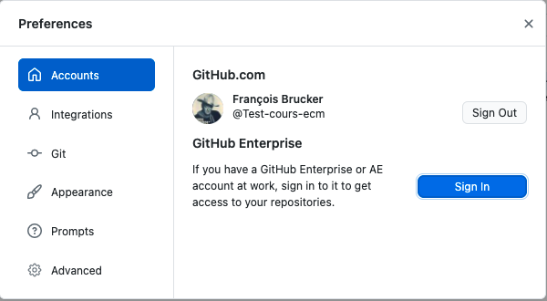
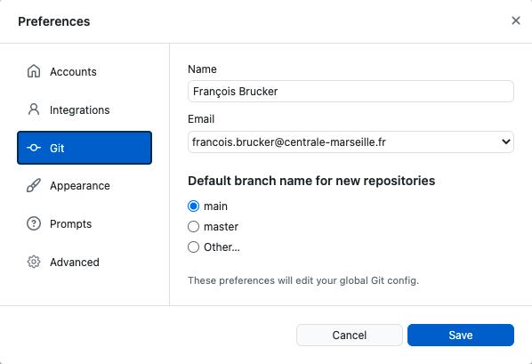

<!-- début résumé -->

Comment gérer les sources d'un projet avec git et github.

<!-- fin résumé -->

## Gestion des sources

https://www.youtube.com/watch?v=w3jLJU7DT5E

Marche aussi avec du texte. Comme un rapport écrit en markdown (ou en latex par exemple).

On doit pouvoir :

* travailler à plusieurs sur un projet et toujours avoir la dernière version
* travailler sur le même document
* avoir accès à toutes les versions du projet, quite à revenir en arrière si besoin


Dire que l'on connaît github parce qu'on s'en sert comme d'un drive est un mensonge et vous fera passer pour des rigolos...


### Création du compte github

1. créez votre compte avec github
   * On crée ici votre compte github pro, ne mettez pas de bêtises
   * Utilisez une adresse mail pérenne (genre votre adresse pro gmail ou votre adresse ecm)
2. modifier son profile :
   1. Allez dans la modification du profile :
      * en haut à droite de la fenêtre puis *"Your profile"*
      * ou <https://github.com/[votre login]> en remplaçant `[votre login]` par votre login.
   2. Il **faut** mettre de bonnes info car lorsque vous modifiez le code vous êtes responsable de ce que vous modifiez. Il faut donc :
       * savoir qui a modifier le code et pourvoir le retrouver
       * votre compte github est aussi votre book. Il permet de savoir ce que vous avez fait.
       * Mettez donc au moins :
         * un vrai nom
         * une vrai photo (rechargez la page pour avoir la nouvelle photo)

### Aide

<https://docs.github.com/en/get-started>

rebase and merge sur une pull request.
<https://docs.github.com/en/pull-requests/collaborating-with-pull-requests/incorporating-changes-from-a-pull-request/about-pull-request-merges>

## Test sous github


[Un projet uniquement avec github](projet-github)


## Que commiter ?

> TBD

### Projets et commandes

### Application

Avant toute chose, dans les préférences on lie son compte github :

L'application va faire le lien entre vos projets gérés avec git et le site github. Il faut donc que vous renseigniez des chose pour git dans les préférences Préférences git :

* votre nom
* votre email

Ceci va être important pour pouvoir retrouver ce que vous avez fait comme commit.

### Premier projet

> TBD :
>
> * rebase ?
> * staged puis commit
> * puis push
>