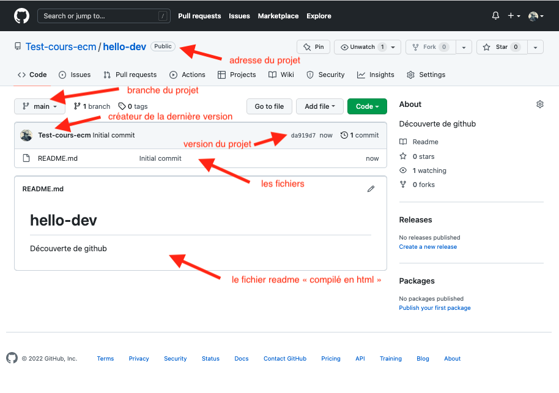
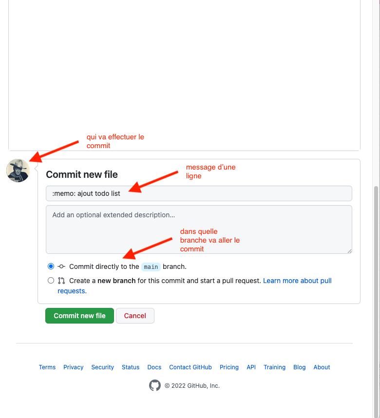

<!-- début résumé -->

Création et maintient d'un projet avec Github.

<!-- fin résumé -->

On en profitera pour voir le fonctionnement basique de git :

* commit
* branches
* merge

## Créer un projet

1. 
2. 

Résultat : 

Les *commit* sont les mises à jour du projet.



Chaque ***commit*** est associé à une ***branche*** (ici `main`) et est obligatoirement constitué de :

* du nom de la personne qui a effectué le commit, ici `Test-cours-ecm`
* du numéro du commit, ici `da919d7` (donné automatiquement)
* d'un message (d'une ligne) décrivant le commit, ici `initial commit`



## Faire des commits

### Ajout de fichiers

1. 
2. 
3. 
4. 


On a utilisé <https://gitmoji.dev/> pour le commit. Mettre un émoji en premier caractère du message permet de facilement identifier le but du commit.


Notre projet a maintenant 2 commits. En cliquant sur le texte *32 commits"*, on voit l'historique de notre projet sur la branche principale (`main`) :

En cliquant sur le numéro de commit, on voit le détail de celui-ci :

Nous rentrerons plus en détails de ce tout cci signifie un peut plus tard. Mais La façon dont est représenté le commit suit la syntaxe des [GNU `diffutils`](https://www.gnu.org/software/diffutils/manual/diffutils.html). Pour nous :

1. on a modifié le fichier `programme.txt`{.fichier}
2. `@@ -0,0 +1, 6 @@` : on a supprimé aucune ligne et on a ajouté les lignes 1 à 6.
3. à droite on voit les lignes ajoutées en vert avec un `+` devant elles

### Modifier un fichier

Nous allons maintenant modifier le fichier `readme.md`{.fichier} qui est aussi un fichier texte écrit au format [Markdown]({{ "/tutoriels/format-markdown.md" | url }}). POur que ce fichier soit agréable à la lecture, github le compile en html, mais — en vrai — c'est juste du texte.

1. 
2. 
3. 
4. 
5. 

Notre nouveau commit :

1. Notre fichier modifié est maintenant 
2. Son historique montre qu'il a été modifié par 2 commit 
3. Le dernier commit a modifié son contenu 

## changer de branche

Je suis content de mon projet, mais j'aimerai essayer de modifier

pourquoi ?

le faire

merger (et rebase)

## Plusieurs utilisateur

### Ajout d'un collaborateur

### Modification par plusieurs personnes

### conflit

changer de commit d'une version antérieur et soucis au merge
