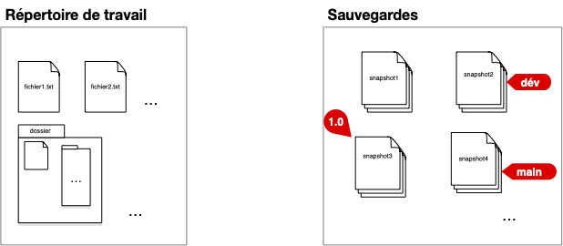
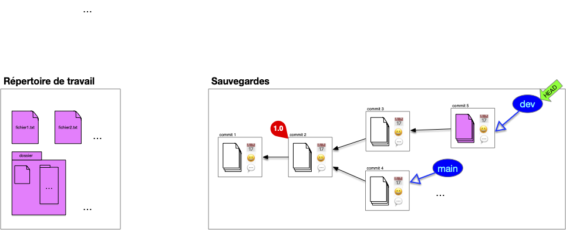

Examinons les besoins et les cas d'usage que devrait couvrir un SCM. De ces usages et besoins vont découler une architecture et des protocoles à mettre en place.

## Working directory

Supposons que notre projet soit de travailler sur un ensemble de documents (_e.g._ du code) regroupés au sein d'un répertoire de travail (_working directory_) dont le contenu évolue au cours du temps :

## Snapshots

Pour pouvoir modifier ses documents sans avoir peur de faire des erreurs, on peut épisodiquement sauvegarder tout le contenu du répertoire de travail (faire un _snapshot_) :

## Tags

Cette première organisation permet de faire une sauvegarde avant une modification, ou de garder des versions précédentes du projet. Le nom de la sauvegarde permet de tracer les étapes importantes du projet (`version1` par exemple dans la figure ci-dessus).

Le nom du fichier de sauvegarde étant unique, il ne permet pas de stocker plus d'une information (la version `1.0` pouvant être la version courante du projet par exemple). Une première amélioration de notre structure est d'ajouter des **labels** (_tags_) qui permettent de caractériser, si besoin, des sauvegardes :

La version `1.0` à son propre tag. Le tag `main` correspond à la version courante (par exemple une correction de bug de la `1.0`) et le tag `dev` àla version de développement avec des ajouts de fonctionnalités par rapport à la version courante.


Numérotation standard des versions appelée [Gestion sémantique de version (_semver_)](https://semver.org/lang/fr/).


## Commits

En utilisant un dossier partagé (un drive par exemple) si le projet est effectué par plusieurs personnes, chaque snapshot du dossier est associé :

- au moment où cette sauvegarde à été effectuée : QUAND
- à l'utilisateur qui a sauvegardé le dossier : QUI

Formalisons ceci avec la notion de **_commit_**, qui est constitué :

- d'une sauvegarde du répertoire de travail (un snapshot du working directory)
- de QUI a effectué cette sauvegarde
- de QUAND a été effectué cette sauvegarde

## DAG

Il nous manque cependant une information capitale, les versions antérieures qui ont permit de créer le document sauvé (les parents). Ceci permet de conserver un historique des modifications et de connaître ce qui différencie la version actuelle de son ou ses prédécesseurs.

On a alors la définition finale d'un commit :


Un **_commit_** d'un projet est constitué :

- d'une sauvegarde du répertoire de travail (un **snapshot** du working directory)
- de **QUI** a effectué cette sauvegarde
- de **QUAND** a été effectué cette sauvegarde
- du (ou des) commits **PARENT(S)**
- d'un descriptif des modifications effectuées (**QUOI**)



Et d'un tag :


Un **_tag_** est une référence vers un commit donné. Il est constitué :

- d'un nom
- d'un lien vers le commit qu'il référence



On obtient alors une structure de sauvegarde sous la forme d'[un DAG](https://fr.wikipedia.org/wiki/Graphe_orient%C3%A9_acyclique) avec le premier commit faisant office de **racine** (le seul élément du graphe des commit à ne pas avoir de parents).


Si habituellement un commit n'a qu'un seul parent (la version précédente du document), il peut arriver qu'un commit ait plusieurs, dans le cas d'un synthèse de plusieurs documents par exemple.


## Branches

Notre structure de sauvegarde permet de stocker tout ce qui est nécessaire pour retrouver un commit particulier. Cependant cette structure ne permet pas encore de gérer les lignes de développement qui permettent de diriger l'évolution du projet (par exemple en code, la ligne de développement dédiée aux corrections de bug de la version en production et la ligne dédiée aux ajout de nouvelles fonctionnalités). Pour cela, on peut utiliser une référence particulière : la branche :


Une **_branche_** est une référence vers un commit donné. L'historique d'une branche est constitué du commit qu'elle référence et de tous ses ancêtres.

Un utilisateur accède à la structure de sauvegarde via les branches qui constituent les différentes évolutions du projet.


À la différence d'un tag qui référence un commit particulier, une branche représente une histoire :

- le présent : la référence pointée par la branche,
- le passé : ses ancêtres
- le futur : la référence de la branche change à chaque ajout de commit : le prochain commit dont le parent sera cette branche sera la future référence de celle-ci

Dans le graphique ci-dessous on a remplacé les deux tag `main` et `dev` par des branches :

Les branches constituent le lien privilégié entre l'utilisateur et la structure. Les commits constituent la structure interne de sauvegarde et un utilisateur n'y accède jamais directement. Il est donc indispensable que toute feuille de notre structure soit associé à une branche pour que l'on puisse accéder à tout commit de la structure en remontant par ses descendants.

## Head

Notre structure de stockage est complète. Il nous reste à faire en sorte que les échanges entre cette structure de commits et le répertoire de travail soit aisé.

On dispose pour cela d'une référence sur la branche courante (ou un commit, mais c'est plus rare), appelé **_HEAD_**.

Dans la figure précédente, le pointeur courant est placé sur la branche `dev`. Si l'on décide de faire un commit, celui ci se fera avec `HEAD` comme parent. Puis `HEAD` (et la branche sur laquelle il pointe) se déplace sur le nouveau commit qui devient le commit courant :

Les fichiers du working directory sont égaux aux fichiers du commit.

Si l'on décide de changer de branche, le pointeur HEAD se déplace puis le working directory est mis à jour avec les fichiers stockés dans le commit. On peut ensuite continuer le développement depuis cette branche :

Enfin, on peut déplacer le pointeur courant sur un commit particulier, par exemple la version `1.0` :


Le pointeur courant **_HEAD_** est une référence vers une branche ou un commit donné. Il permet de faire le lien entre commit et working directory.

