Nous allons créer un projet sous github pour que le monde entier puisse l'utiliser s'il le désire.


L'[aide de github](https://docs.github.com/en/get-started) est très bien faite (la traduction en français est cependant automatique, donc souvent approximative), n'hésitez pas à y jeter un coup d'œil.


## Le code

Pour se fixer les idées utilisons ce projet :


1. Téléchargez le dossier suivant contenant un projet python de 3 fichiers : [le projet Numérologie](https://download-directory.github.io?url=https://github.com/FrancoisBrucker/cours_informatique/tree/main/docs/src/cours/gestion-des-sources/besoins-d%C3%A9p%C3%B4t/projet-d%C3%A9pot/num%C3%A9rologie/num%C3%A9rologie-v1?filename=projet-numérologie-v1)
2. Créez un projet vscode avec ces différents fichiers et exécutez le fichier `main.py`{.fichier}


Une fois le fichier `main.py`{.fichier} exécuté, **remarquez** qu'un dossier `__pycache__`{.fichier} a été créé. Il correspond à l'import du module `num`{.language-} par le programme principal.


## Créer un projet

1. 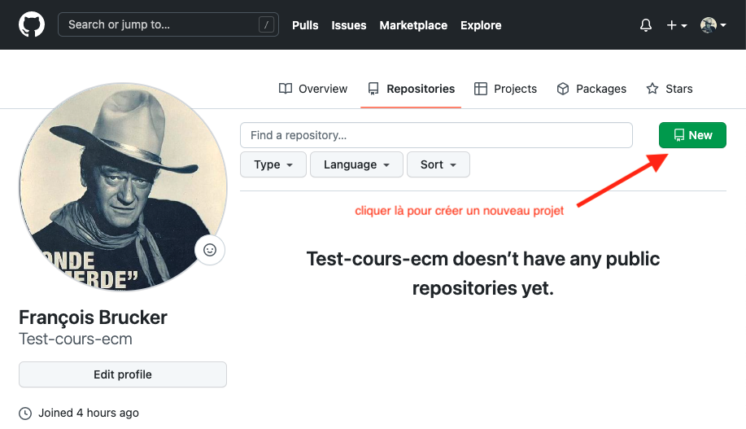
2. 

Résultat : 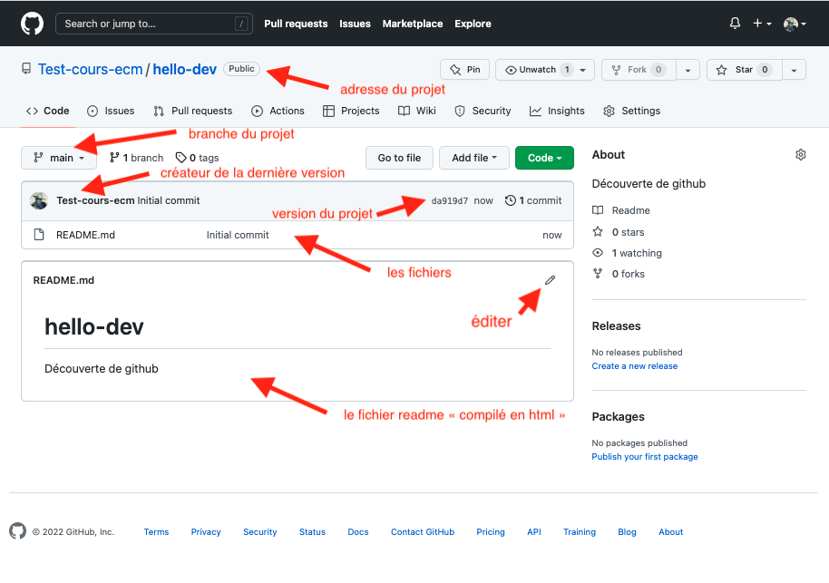

Félicitation vous avez fait votre premier commit !

Chaque **_commit_** est associé à une **_branche_** (ici `main`) et est obligatoirement constitué de :

- du nom de la personne qui a effectué le commit, ici `Test-cours-ecm`
- du numéro du commit, ici `da919d7` (donné automatiquement).
- d'un message (d'une ligne) décrivant le commit, ici `initial commit`

### Fichier `readme.md`{.fichier}

Le fichier n'est cependant pas celui qu'on veut :


Éditez le fichier `README.md`{.fichier} :

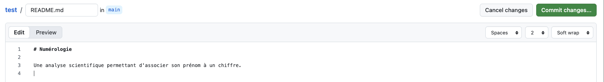

Puis cliquez sur le gros bouton vert `commit changes` pour voir apparaître cette fenêtre :

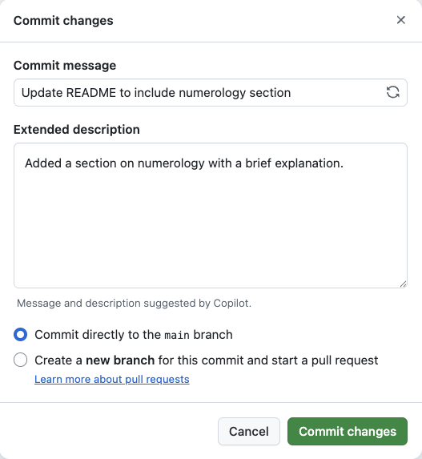

Puis cliquez sur `commit changes`.


Un deuxième commit !

### Upload des fichiers

Il nous reste à mettre les fichiers sur le dépôt :


Sur la page de votre projet, à gauche du bouton vert `code`, il y a un menu déroulant `add file`. Cliquez dessus et uploadez les 3 fichiers pythons :

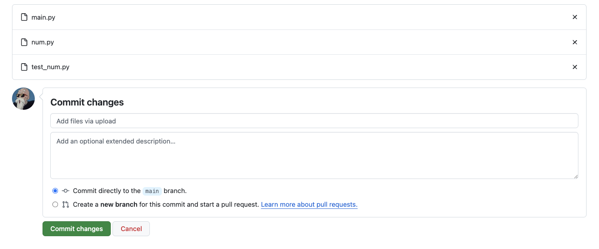

Puis commitez vos ajouts.


Il e faut pas uploader le dossier `__pycache__`{.fichier} qui est créé à l'exécution : 

**On ne met sur github que les fichiers sources de votre projet, pas les fichiers générés.**



Sur la page de votre projet, sur la droite, vous voyez un lien `activity`. En cliquant dessus vous voyez les différents commits effectués :

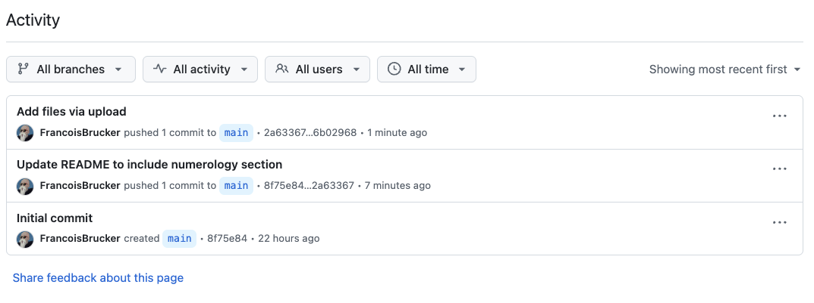

## Tag

En cliquant sur le lien tag sur la fenêtre :

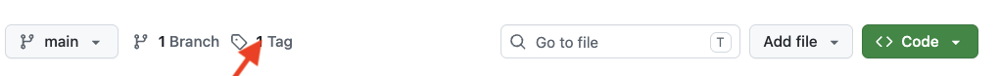

On vous proposera de créer une nouvelle release. 


1. commencez par créer un nouveau tag que vous nommerez `release-1`
2. donnez un titre à notre release, par exemple `1.0`
3. commitez votre release !



Ceci a créé une release, notre 1.0. Pour la voir, cliquez sur le lien release :

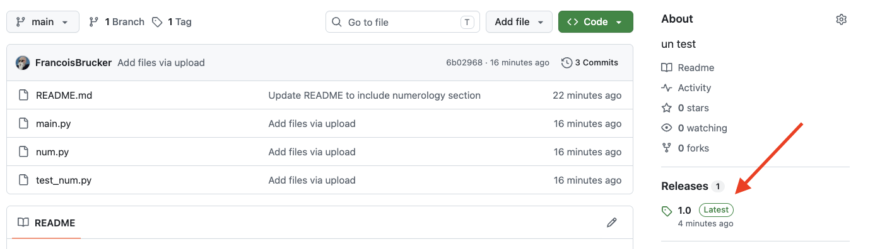

## V2

Après quelque temps de travail, on est arrivé à une nouvelle version publiable :


1. Téléchargez le dossier suivant contenant un projet python de 3 fichiers : [le projet Numérologie](https://download-directory.github.io?url=https://github.com/FrancoisBrucker/cours_informatique/tree/main/docs/src/cours/gestion-des-sources/besoins-d%C3%A9p%C3%B4t/projet-d%C3%A9pot/num%C3%A9rologie/num%C3%A9rologie-v2?filename=projet-numérologie-v2)
2. Créez un projet vscode avec ces différents fichiers et exécutez le fichier `main.py`{.fichier}


Il nous faut mettre à jour le projet sur github :


Ulpoadez les fichiers de la v2.


La fenêtre principale de votre projet doit ressembler à quelque chose du type :

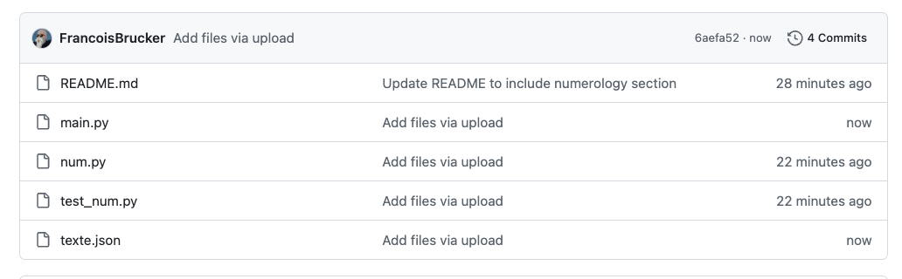

Vous remarquerez que :

- on a maintenant 4 commit
- que le fichier `teste.json`{.fichier} a été ajouté
- que le fichier `main.py`{.fichier} a été modifié
- que les deux autres fichiers (`num.py`{.fichier} et `test_num.py`{.fichier}) n'ont pas changé entre les deux versions.

Voyons ce qui a changé dans le fichier `main.py`{.fichier} :



Cliquez sur le lien `main.py`{.fichier} depuis la fenêtre principale du projet :

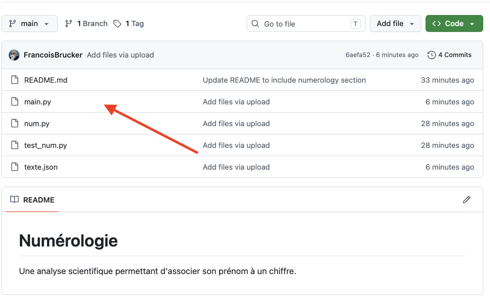


Vous devriez voir le fichier `main.py`{.fichier} que vous avez uploadé.
   

Cliquez sur le lien history :

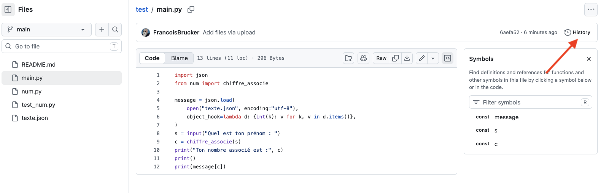


Vous devriez voir les différents commits où ce fichier a été modifié.


Cliquez sur le numéro du dernier commit :

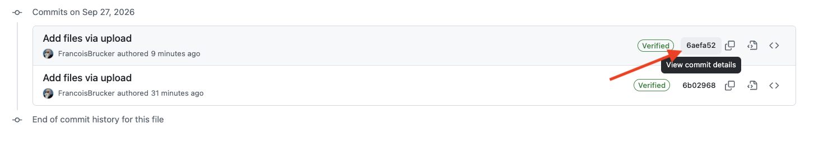


Voir [ce doc](https://www.designveloper.com/blog/hash-values-sha-1-in-git/) pour voir comment git associe chaque commit à un sha pour le retrouver.


Vous devriez voir un "_diff_" entre la v1 et la v2 pour le commit :

- en rouge ce qui a disparu
- en vert ce qui a été ajouté

Et ce pour chaque fichier mis à jour pour ce commit.

On termine en faisant une seconde release :


Faite la release v2 du projet. Vous utiliserez **un autre** tag que pour la v1 ainsi qu'un nouveau titre.


