Maintenant que l'architecture du SCM est acté, regardons comment l'utiliser au mieux pour résoudre les problèmes de gestion au jour le jour. 99% de vos besoins seront couvert par ces cas d'usage. On verra plus tard comment les réaliser avec une application ou au terminal.

## Index

Lors d'un commit on a pas forcément envie de :

- tout sauvegarder (par exemple des fichiers de mots de passe ou des fichiers de configurations)
- sauvegarder tout en une fois (de faire plusieurs [commits atomiques](https://en.wikipedia.org/wiki/Atomic_commit) plutôt qu'un gros commit regroupant plusieurs modification)

Enfin, il peut être difficile de comparer ce qui est sauvé de ce qui est nouveau.

### Principe

Pour cela on ajoute un _tampon_ entre la structure de sauvegarde et le répertoire courant appelé l'**_index_**.

Après un commit, l'index contient l'ensemble des fichiers sauvé dans le commit. Si ce fichier est également dans le répertoire de travail, ils seront tous les 3 identiques. Tous les fichiers du répertoire de travail ne sont cependant pas forcément suivis :

L'utilisateur continue de travailler sur son dossier de travail, les fichiers de l'index et du dossier de travail divergent (l'utilisateur travaille sur les fichiers `fichier1.txt` et `fichier2.txt`) :

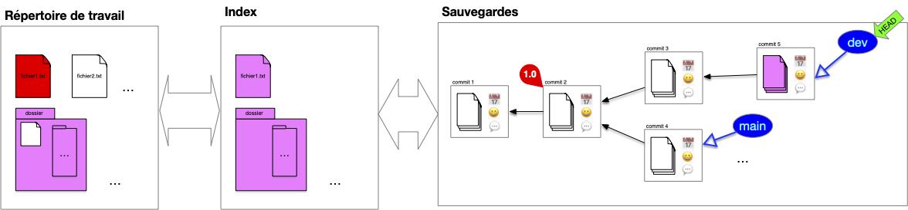

Pour préparer le nouveau commit, l'utilisateur place dans l'index les fichiers modifiés qu'il veut sauvegarder (les autres sont déjà dans l'index), ici :

- il ajoute  `fichier1.txt`
- il décide également d'ajouter  `fichier2.txt`

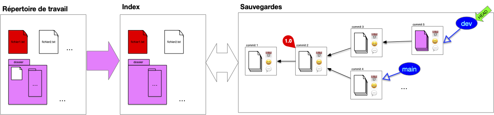

Remarquez qu'un fichier du dossier n'est toujours pas suivi.

On peut maintenant faire le commit, l'intégralité de l'index est commit :

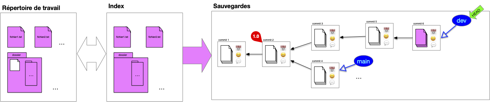

Et on se retrouve à nouveau dans la situation post-commit.

Enfin, si l'on change HEAD, les fichiers du commit sont placés dans l'index qui eux-même sont synchronisés avec l'index :

Notez que comme `fichier2.txt` n'est pas dans l'index il n'est pas suivi par notre structure et n'est donc pas modifié dans le répertoire de travail.


Nous somme dans un cas où HEAD n'est pas associé à une branche, on dit qu'il est _branchless_.


### Usage

L'index présente ce que vous allez sauver dans votre sauvegarde. À tout moment, il vous indique donc :

- les différences entre le head de la sauvegarde et ce que vous aller ajouter
- les différences et ce que vous aller sauver et votre travail actuel


On appelle **_`diff`_** les différences entre deux commits, entre le répertoire de travail et l'index ou encore entre deux fichiers.

A savoir :

- les fichiers présent dans un commit et pas dans un autre
- les lignes différentes dans un fichier présent dans les deux commits



#### différence entre l'index et votre travail

Par défaut l'index contient l'ensemble des fichiers sauvegardés du head de la sauvegarde. Après travail ajout et modifications de fichiers le répertoire de travail va diverger de l'index :

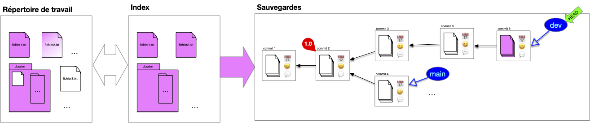

Connaître les différences entre l'index et le répertoire de travail permet de voir le travail effectué.

#### différence entre la sauvegarde et l'index

Pour mettre à jour la sauvegarde, on ajoute à l'index les nouveaux fichiers ou les fichiers modifiés :

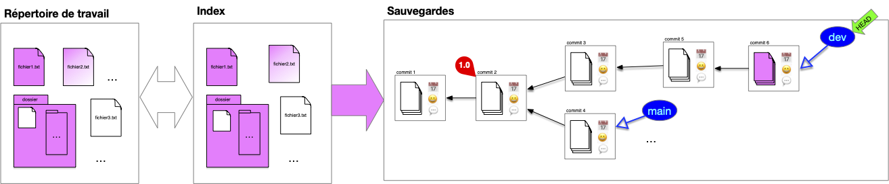

Dans la figure ci-dessus, l'index est maintenant égal au répertoire de travail et différent de la sauvegarde.

Les différences entre l'index et le head de la sauvegarde donnera les modifications au projet que l'on va sauvegarder.

L'index permet de ne pas avoir à tout sauvegarde en une fois. Par exemple dans le cas ci-dessous, il y a des différences :

- entre l'index et la sauvegarde (`fichier2.txt`{.fichier} a été modifié et un fichier ajouté au dossier)
- entre l'index et le répertoire de travail (`fichier3.txt`{.fichier} a été créé)

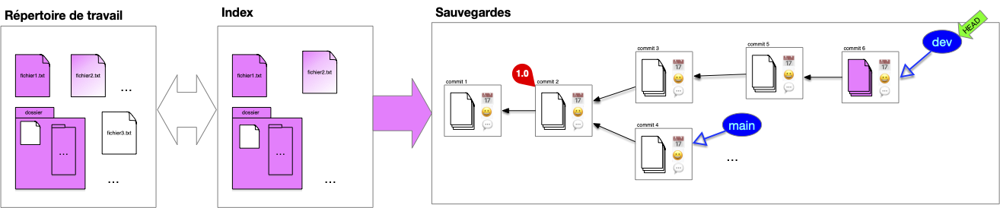

## Faire évoluer le projet : commits et diff

L'utilisation courante d'un système de gestion des sources est de faire progresser une branche donnée par des commits successifs sur celle-ci.

### add/reset

On a besoin de deux commandes pour préparer un index en vue d'un commit :

- une commande pour ajouter un fichier du répertoire de travail à l'index
- une commande pour supprimer un fichier de l'index (car ajouté ou par erreur)

On peut même n'ajouter (ou supprimer)  de l'index que des parties de fichiers. Ceci est pratique lorsque l'on a fait de multiples modifications à un fichier correspondant à plusieurs fonctionnalités et que l'on veut avoir un commit par fonctionnalité.

### diff

L'évolution est caractérisé par les différences entre le parent et l'enfant. Suivre le diff d'une évolution allant de la branche actuelle au premier commit montre itérativement les modifications apportée au court du temps. Cette notion de `diff` est cruciale pour comprendre comment on peut manipuler et fusionner plusieurs commit entre eux.

## Travailler avec des Branches

Les branches et leurs historiques représentent les lignes de développement du projet et sont par là les uniques moyens d'accéder à la structure de sauvegarde (hors maraboutage expert pour réparer une bêtise).

Chaque branche a ainsi une raison d'être : branche principale, de développement d'une _feature_ particulière, d'un participant, ... Il n'y a pas de règle particulière sur ce que représente une branche **mais** elle doit avoir une signification pour l'équipe. Enfin une branche devenue inutile doit disparaître (il suffit de supprimer la référence).


L'historique d'un projet doit contenir uniquement ce qui est nécessaire pour comprendre son état actuel, c'est à dire ses branches (l'état actuel) et leurs historiques, le reste est inutile.


Parmi toutes les branches, la branche `main` est celle qui va contenir la branche de développement principale.

### Switch

Changer de branche est simple, il suffit de déplacer le pointeur HEAD d'une branche à l'autre. N'hésitez pas à créer de nouvelles branches pour tester des fonctionnalités et :

- les faire disparaître si l'idée n'aboutie pas
- la fusionner avec une branche principale si l'idée s'avère bonne

### Fusion de branches

La **_fusion de branche_** (_merge_), consiste à rassembler le contenu de plusieurs branches en une seule. Cette opération se fait en plusieurs étapes, illustrons la en prenant l'exemple classique de la fusion de la branche de développement sur la branche principale.

#### 1. Position de départ

On vient de terminer le développement de la branche de développement actuelle et on veut la combiner à la branche principale :

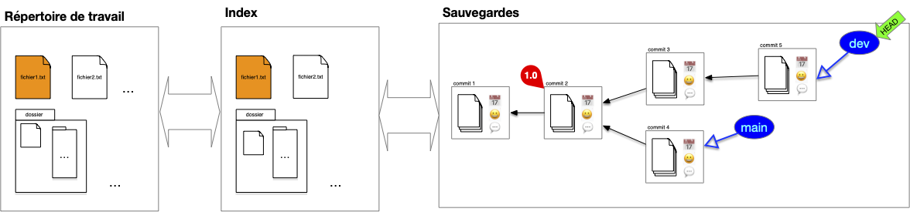

#### 2. branche accueil

Pour effectuer la fusion, on commence par se placer sur la branche qui va accueillir la fusion, ici la branche principale :

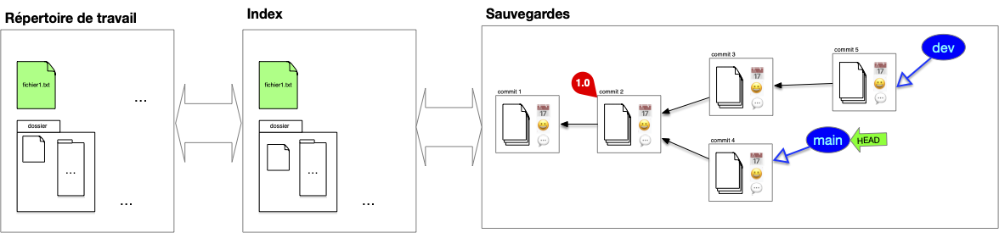

On remarque qu'il y a deux différences :

- le fichier `fichier2.txt` n'existe pas dans la branche principale
- le fichier `fichier1.txt` est différent pour les 2 branches

#### 3. fusion des deux branches

La fusion peut maintenant être effectuée. On procède comme suit :

1. on détermine l'ancêtre commun le plus récent entre les 2 branches à fusionner : ici le commit ayant pour tag `1.0` (dans certains cas pathologique il peut y avoir plusieurs possibilité et dans ce cas on en prend un au hasard)
2. on effectue le `diff` entre l'ancêtre commun et chacune des branches à fusionner : ceci donne les différences entre les 2 évolutions
3. on combine ces différences en une nouvelle évolution
4. on effectue le commit de la fusion

À la fin de ces 4 étapes, on se trouve dans la position suivante :

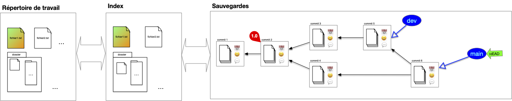


Ce type de fusion est appelée **_3-way merge_** car il prend en compte 3 commits différents : les 2 branches à fusionner et l'ancêtre commun.


Lorsque l'ancêtre commun est un des 2 commit, par exemple si l'on veut maintenant fusionner la branche `dev` et et la branche `main`, tout devient plus simple : il suffit de déplacer la branche ancêtre sur la branche descendante sans nécessité de créer un nouveau commit :

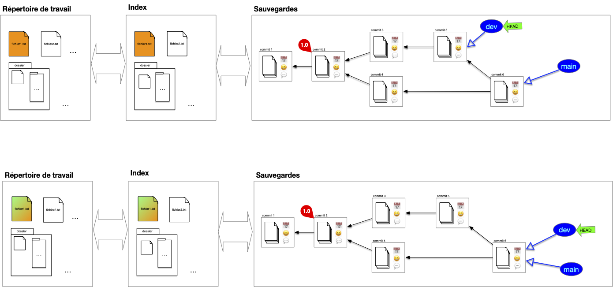


Ce type de fusion est appelée **_fast-forward merge_** (ou rarement **_2-way merge_**) : une branche à fusionner est l'ancêtre commun.


### Rebase

Le principal soucis avec la fusion de branche est qu'elle va induire des commits ayant 2 parents. L'historique des commits ne sera alors plus linéaire et sera plus difficile à visualiser. On peut palier ce problème en utilisant une opération de **_rebase_**. Cette opération se fait en plusieurs étapes, illustrons la en prenant l'exemple classique du rebase de la branche de développement sur la branche principale.

#### 1. Position de départ

Tout commence comme un merge. On vient de terminer le développement de la branche de développement actuelle et on veut la combiner à la branche principale :

Cependant, contrairement à un merge on peut placer les modifications de la branche `dev` **après** la branche main. Pour cela, on commence par déplacer le pointeur HEAD **sur le commit** de la branche d'accueil, ici la branche principale :

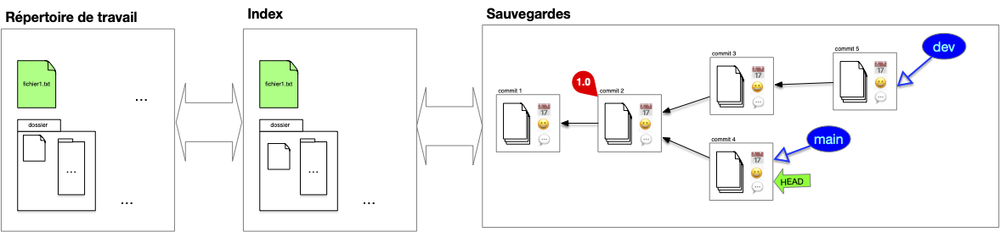

On remarque qu'il y a deux différences :

- le fichier `fichier2.txt` n'existe pas dans la branche principale
- le fichier `fichier1.txt` est différent pour les 2 branches

#### 2. Rebase

Puis, à partir de l'ancêtre commun, les `diff` des commits (avec leurs ancêtres) de la branche `dev` sont rejoués sur la branche `main`. Notez que l'on ne peut pas juste déplacer les commits puisque l'on veut combiner la branche main aux modifications (diff) effectués par la branche dev :

Enfin :

1. la branche `dev` est placé sur le commit du pointeur courant
2. le pointeur courant est replacé sur la branche `dev`

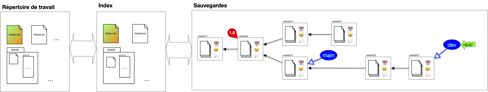

Les précédent commits de la branche dev avant rebase ne sont plus accessibles via une branche mais sont par défaut toujours présent dans la structure de sauvegarde (qui garde tout).


On appelle **_rebase_** d'une branche $A$ sur une autre $B$ le fait de rejouer les diff des commits de la branche $A$ sur la branche $B$ depuis leur ancêtre commun.



A priori les commit résultant d'un merge (ceux ayant plus d'un parent) ne sont pas concernés par le rebase puisqu'il sont déjà eux même des combinaisons de commits existants.


## Nettoyage de base

Les commit que l'on ne peut plus atteindre via une branche ou son historiques sont inutiles. On peut donc : soit les ignorer soit les effacer de la base.
7
Dans le cas général on ne fait que les ignorer et de représenter uniquement la DAG "utile". Par exemple après un rebase, on représentera plutôt l'arbre suivant que le précédent :

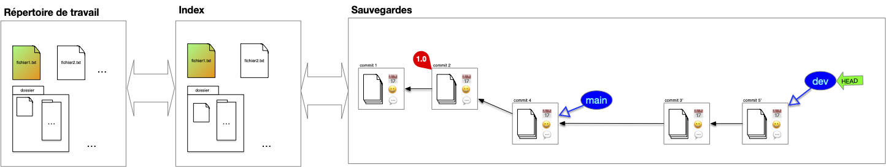