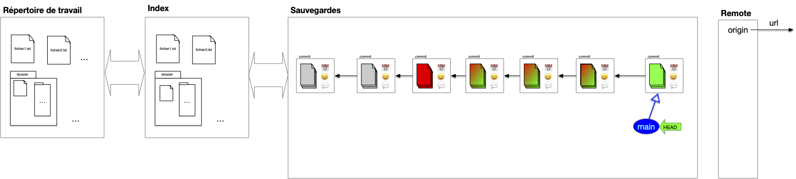
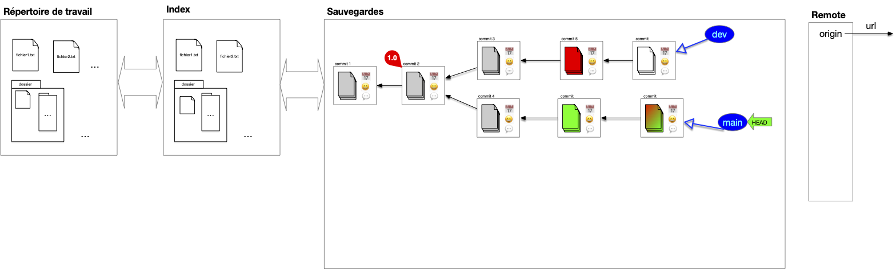
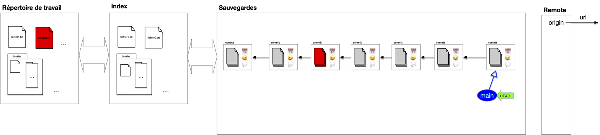
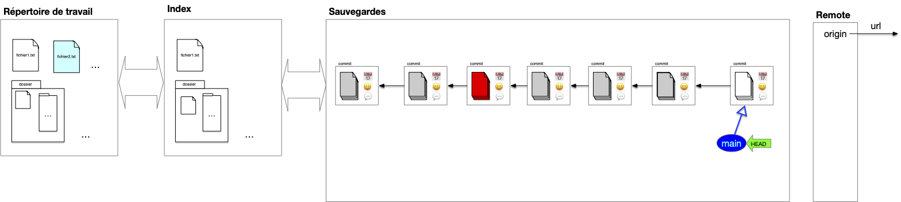
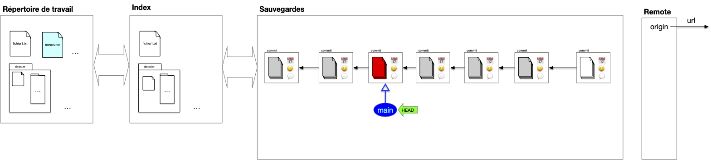
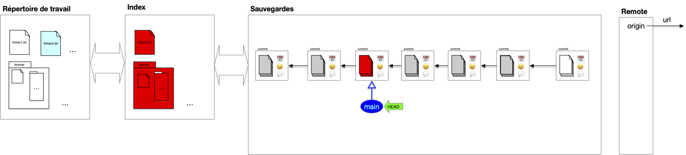
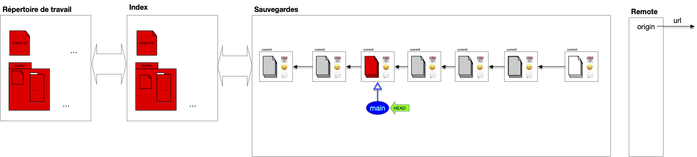
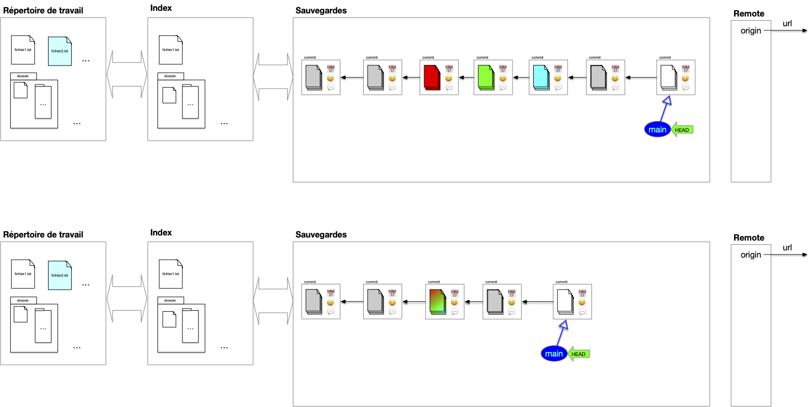

## Utiliser l'historique

Avoir un historique permet de tester des choses puis de revenir en arrière si nécessaire. Il existe plusieurs possibilités. Nous allons en examiner quatre dont nous donnerons les nom anglais, couramment utilisés.

### revert

Permet d'enlever les modifications d'un commit en ajoutant un nouveau commit au HEAD.

revenir à une position antérieure du projet en recréant un nouveau commit. C'est idéal pour revenir à une position antérieure du projet alors que les commits ont été mis sur l'origine (0n ne peut donc pas les supprimer).

Le dernier commit de l'exemple précédent correspond à la suppression des effets du commit rouge dans l'avant dernier commit.


Supprimer les effet d'un merge est compliqué puisqu'il a des effets sur plusieurs branches : il faut spécifier quelle branche participant au merge prépondérante.



### Cherry pick

Fait un peu le contraire de revert. Il re-applique des commit au HEAD. Pratique pour appliquer des modification d'une autre branche, comme appliquer à la branche main un des développement du dev !

Le dernier commit de l'exemple précédent correspond à la ré-application des effets du commit rouge dans l'avant dernier commit.

### restore

Replace un fichier tel que sauvé dans un commit dans le working tree ou l'index. Aucun commit n'est effectué.

Dans l'exemple précédent, on a remis dans l'espace de travail un fichier tel qu'il était dans le commit rouge.

## Modification d'historique


Ne pas faire de modifications d'historique qui impacterait l'origine ! faite un revert/cherry pick/restore à la place.


### reset

Un reset modifie l'état de la tête HEAD et de sa branche associée. Il y a plusieurs modifications possibles selon que l'on ne veut que modifier la position du HEAD ou également affecter le répertoire de travail ou l'index.

Pour illustrer le propos, supposons que l'on soit dans le cas de l'exemple ci-dessous (le fichier bleu n'est pas suivi dans nos sauvegardes):

Et on veut revenir à l'état du commit rouge.

#### soft

- Déplace la HEAD de la branche courante à un commit spécifique.
- Ne change ni l'index ni le répertoire de travail.

Ceci permet de préparer une nouvelle branche à partir du commit rouge par exemple tout en ne perdant pas le travail effectué jusque là.

#### mixed

- Déplace la HEAD de la branche courante à un commit spécifique.
- reset l'index (pour correspondre à la nouvelle HEAD)
- laisse le répertoire de travail inchangé

Ceci permet de faire un commit spécifique en ajoutant juste ce qui est nécessaire au nouveau commit à l'index.

#### hard

- Déplace la HEAD de la branche courante à un commit spécifique.
- reset l'index (pour correspondre à la nouvelle HEAD)
- modifie le répertoire de travail pour correspondre à la nouvelle HEAD

On oublie tout le développement fait après le commit rouge (y compris le fichier non suivi). Après avoir suivi une mauvaise piste par exemple.

### squash

Pour avoir un histoire plus concis et avoir des commits thématiques (avoir une fonctionnalité implémentée en un seul commit alors qu'initialement on a eu besoin de plusieurs) pour le rendre plus lisible, on peut regrouper plusieurs commits successifs en un seul. Cela permet de supprimer des branches fusionnées pour linéariser l'historique. On appelle ceci faire un **_squash_** de commits.

Par exemples si on veut regrouper les commits rouge, vert et bleu en un seul :

