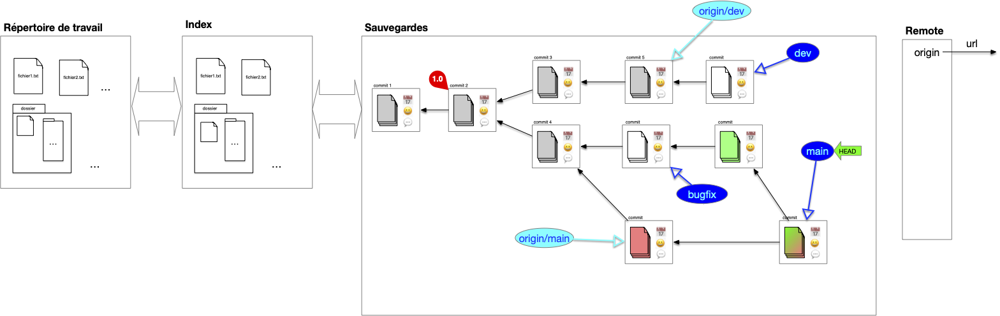

Que l'on travaille à plusieurs ou seul, posséder une version "_partageable_" de la structure de sauvegarde est appréciable. Parmi tous les avantages, on peut citer :

- de synchroniser les changements lorsque l'on travaille en équipe,
- de permettre à des personnes tierces d'utiliser le projet en le _clonant_ et de proposer des amélioration via des _pull request_
- de _cloner_ un projet qui nous intéresse
- ...

Un projet peut-être en lien avec de nombreuses copies distantes de celui-ci, que l'on appelle **_remote_**. Le projet y accède via son [url](/cours/web/anatomie-url/){.interne} (adresse internet ou dossier sur le même disque dur).

### Clone

Lorsque l'on travaille à plusieurs sur un projet on a coutume de partager, **_en plus_** de sa structure de sauvegarde personnelle, une structure commune nommée _origin_ par convention qui regroupe les branches utiles à tous. Pour cela, on commence par désigner la structure de sauvegarde partagée que l'on appelle `origin`. Ensuite, chaque participant au projet le **_clone_** :

L'opération de clonage effectue les opérations suivantes :


L'opération de **_cloner_** un projet consiste à :

1. copier sa structure de donnée
2. associer `origin` à l'url de l'origine dans la copie
3. si le pointeur HEAD de l'origin est sur une branche, la créer dans la structure copiée
4. placer le pointeur HEAD de la copie au même endroit (commit ou branche) que l'origine
5. garder une références de toutes les branches de l'origine



On remarque que l'on a besoin que de la structure de sauvegarde pour l'origine, l'index et le répertoire de travail sont inutiles.


L'opération de `fork` _ressemble_ au clonage mais [le but est différent](https://github.com/orgs/community/discussions/35849). Dans un clonage tous les participants interagissent directement avec l'origine, alors qu'un projet résultant d'un fork peut être vu comme un nouveau projet (il n'est pas en relation directe avec le projet initial).


### Branches locales et distantes

Après un clonage, la structure de sauvegarde locale contient, en plus du DAG des commits de l'`origin`, des références à la structure `origin` et à ses branches. Les branches de l'`origin` sont dites **_distantes_** (_remote_). Notez que si la copie contient un lien vers l'original le serveur origin n'a lui aucune information de la copie locale, il ne _sait_ même pas qu'elle existe.

Au cours du temps de l'évolution des branches sur la sauvegarde locale et distantes ces informations peuvent diverger :

- des commits peuvent insérées sur la copie et sur l'origine
- des branches peuvent être crées sur la copie et sur l'origine

On se retrouve alors dans la configuration suivante :

Comme l'origine et la sauvegarde locales ont évoluées chacune de son côté des commits ont été ajouté depuis leur dernière synchronisation **mais** comme on a fait **qu'ajouter** des commits et des références il est possible de synchroniser les deux structures.

Pour cela, on commence par synchroniser la sauvegarde distante avec la sauvegarde locale, puis on envoie les évolutions locales vers l'origine.

#### Synchronisation de branches distances vers locales

La synchronisation se fait branche à branche. Dans l'exemple la sauvegarde locale suit deux branches distantes, `origin/main` et `origin/dev`. La branche feature n'est pas suivi, on ne s'en occupe donc pas : la sauvegarde locale n'est pas au courant qu'elle existe.

Seule la branche `origin/main` à divergé. Pour la synchroniser on commence par récupérer les divergences (on ne montre plus que la sauvegarde locale) :

On a maintenant deux possibilités pour effectuer la synchronisation.

##### Merge `origin/main` et `main`

##### Rebase `main` sur `origin/main`

**C'est cette solution qui est à privilégier** car elle garde un historique linéaire, plus facile à lire.


Les commits locaux sont **réécrit**. Il ne faut pas faire de rebase si les commits initiaux étaient déjà sur le serveur origin. Cela causerait d'énorme problèmes aux autres utilisateurs qui référenceraient des commits qui ne sont plus accessibles (voir ci-après).


#### Synchronisation de branches locales vers distantes

Une fois les synchronisations de l'origine vers le serveur locales terminées, la synchronisation vers l'origine est aisée c'est un _fast-forward_ :

### Interagir avec l'_origin_

La principale règle à suivre lorsque l'on participe à un projet avec l'origin est :


On ne modifie pas l'historique de l'origine.


Dans l'exemple ci-dessous, l'utilisateur du haut a modifié son historique **et** celui de l'origine. Les commits rouges de l'utilisateur du bas ne sont plus accessibles depuis l'origine (ils sont toujours présent mais sans pointeur de branche. Les retrouver est très compliqué) :

Le corollaire de la règle principale est :


On ne modifie pas son historique commun avec l'origine.


Quand on voudra synchroniser notre travaille avec l'origine, il est indispensable que l'origine que l'on connaisse soit une sous-partie de l'origine actuelle : elle a pu évoluer indépendamment de nous mais il faut pouvoir **ajouter** nos commit à l'historique à partir du point d'ancrage connu.

Comme la branche de dév et le main sont sur l'origine, le seul moyen de les fusionner est d'utiliser un merge. Ainsi, l'utilisateur du bas pourra toujours se synchroniser avec l'origine :


L'historique de toute branche sur l'origin est publique et ne doit pas être altérée.


Mais cela n’empêche pas la réécriture d'historique en locale. Tant que vous n'avez pas publié vos commits vous êtes libre de faire ce que vous voulez.

Si vous travaillez à plusieurs, l'origin va changer rapidement, pour éviter des opérations de synchronisation lourdes :


Commiter souvent pour éviter les conflits et les opérations lourdes de synchronisation et montrer aux autres ou vous en êtes.


Enfin, il faut garder l'origine lisible **pour tous** :


L'origine ne doit contenir que des branches utiles. Les branches temporaires ou spécifiques à un utilisateur doivent être limitées.


Mais cela ne doit pas vous empêcher d'avoir de nombreuses branches locales que vous n'allez pas synchroniser avec l'origin.

Réciproquement :


Ne conservez en local que des références à des branches de l'origine utiles pour vous.
 

Cela vous évitera des synchronisation inutiles avec l'origin. Vous pourrez toujours plus tard, lorsque vous en aurez besoin, récupérer une référence de branches spécifique.
