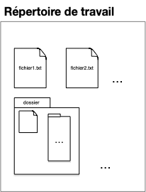
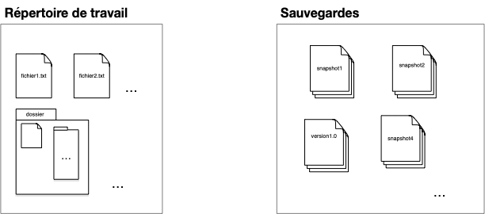
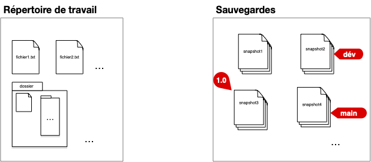
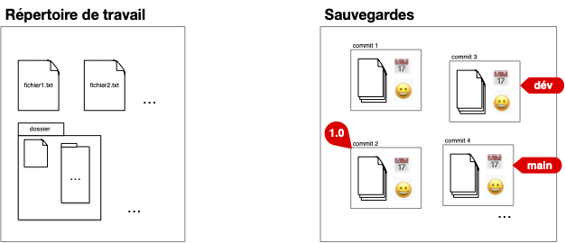

Examinons les besoins et les cas d'usage que devrait couvrir un SCM. De ces usages et besoins vont découler une architecture et des protocoles à mettre en place.

## Working directory

Supposons que notre projet soit de travailler sur un ensemble de documents (_e.g._ du code) regroupés au sein d'un répertoire de travail (_working directory_) dont le contenu évolue au cours du temps :

## Snapshots

Pour pouvoir modifier ses documents sans avoir peur de faire des erreurs, on peut épisodiquement sauvegarder tout le contenu du répertoire de travail (faire un _snapshot_) :

## Tags

Cette première organisation permet de faire une sauvegarde avant une modification, ou de garder des versions précédentes du projet. Le nom de la sauvegarde permet de tracer les étapes importantes du projet (`version1` par exemple dans la figure ci-dessus).

Le nom du fichier de sauvegarde étant unique, il ne permet pas de stocker plus d'une information (la version `1.0` pouvant être la version courante du projet par exemple). Une première amélioration de notre structure est d'ajouter des **labels** (_tags_) qui permettent de caractériser, si besoin, des sauvegardes :

La version `1.0` à son propre tag. Le tag `main` correspond à la version courante (par exemple une correction de bug de la `1.0`) et le tag `dev` àla version de développement avec des ajouts de fonctionnalités par rapport à la version courante.


Numérotation standard des versions appelée [Gestion sémantique de version (_semver_)](https://semver.org/lang/fr/).


## Commits

En utilisant un dossier partagé (un drive par exemple) si le projet est effectué par plusieurs personnes, chaque snapshot du dossier est associé :

- au moment où cette sauvegarde à été effectuée : QUAND
- à l'utilisateur qui a sauvegardé le dossier : QUI

Formalisons ceci avec la notion de **_commit_**, qui est constitué :

- d'une sauvegarde du répertoire de travail (un snapshot du working directory)
- de QUI a effectué cette sauvegarde
- de QUAND a été effectué cette sauvegarde

