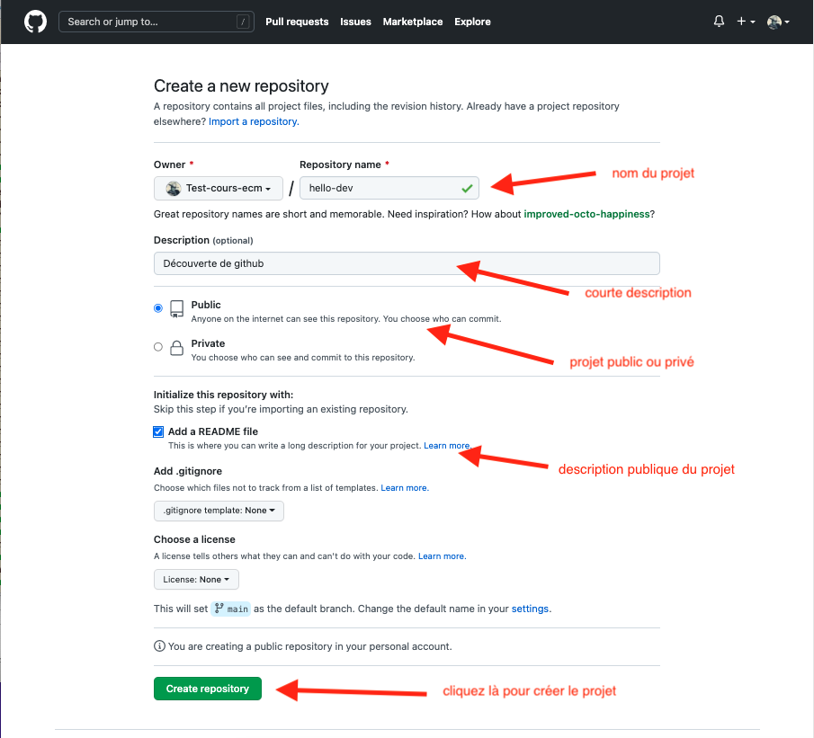

Nous allons créer un projet sous github pour que le monde entier puisse l'utiliser s'il le désire.


L'[aide de github](https://docs.github.com/en/get-started) est très bien faite (la traduction en français est cependant automatique, donc souvent approximative), n'hésitez pas à y jeter un coup d'œil.


## Le code

Pour se fixer les idées utilisons ce projet :


1. Téléchargez le dossier suivant contenant un projet python de 3 fichiers : [le projet Numérologie](https://download-directory.github.io?url=https://github.com/FrancoisBrucker/cours_informatique/tree/main/docs/src/cours/gestion-des-sources/d%C3%A9p%C3%B4t/besoins-d%C3%A9p%C3%B4t/num%C3%A9rologie/num%C3%A9rologie-v1?filename=projet-numérologie-v1)
2. Créez un projet vscode avec ces différents fichiers et exécutez le fichier `main.py`{.fichier}


Une fois le fichier `main.py`{.fichier} exécuté, **remarquez** qu'un dossier `__pycache__`{.fichier} a été créé. Il correspond à l'import du module `num`{.language-} par le programme principal.


## Créer un projet

1. 
2. 

> TBD un projet

1. nouveau projet
2. upload
3. download zip
4. versions :
   1. mettre un tag : une release
   2. mettre une nouvelle version avec upload (est-ce que ça marche ?)
   3. faire une branche
   4. voir les évolutions

Ayez un `readme.md`{.fichier} comme page d'accueil

> TBD attention à ne pas mettre dans le projet :
>
> - les fichiers de vscode
> - l'environnement virtuel
> - les fichiers qui ne sont pas des sources (test, pyc, etc)

## Créer un projet

## Snapshots

Pour pouvoir modifier ses documents sans avoir peur de faire des erreurs, on peut épisodiquement sauvegarder tout le contenu du répertoire de travail (faire un _snapshot_) :





## Tags

Cette première organisation permet de faire une sauvegarde avant une modification, ou de garder des versions précédentes du projet. Le nom de la sauvegarde permet de tracer les étapes importantes du projet (`version1` par exemple dans la figure ci-dessus).

Le nom du fichier de sauvegarde étant unique, il ne permet pas de stocker plus d'une information (la version `1.0` pouvant être la version courante du projet par exemple). Une première amélioration de notre structure est d'ajouter des **labels** (_tags_) qui permettent de caractériser, si besoin, des sauvegardes :

La version `1.0` à son propre tag. Le tag `main` correspond à la version courante (par exemple une correction de bug de la `1.0`) et le tag `dev` àla version de développement avec des ajouts de fonctionnalités par rapport à la version courante.


Numérotation standard des versions appelée [Gestion sémantique de version (_semver_)](https://semver.org/lang/fr/).


## Commits

En utilisant un dossier partagé (un drive par exemple) si le projet est effectué par plusieurs personnes, chaque snapshot du dossier est associé :

- au moment où cette sauvegarde à été effectuée : QUAND
- à l'utilisateur qui a sauvegardé le dossier : QUI

Formalisons ceci avec la notion de **_commit_**, qui est constitué :

- d'une sauvegarde du répertoire de travail (un snapshot du working directory)
- de QUI a effectué cette sauvegarde
- de QUAND a été effectué cette sauvegarde

