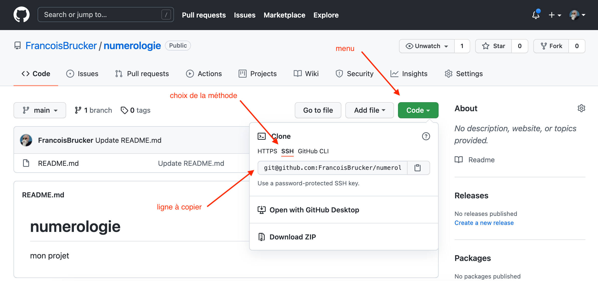

> TBD vérifier que switch est bien utilisé et mettre restore <https://www.infoq.com/news/2019/08/git-2-23-switch-restore/>

Les commandes git indispensables à connaître

Ce tutoriel comporte deux sections :

1. La section [Comment faire](./#comment-faire){.interne} qui donne la marche à suivre pour les opérations courantes,
2. La section [Cheatsheet](./#cheatsheet){.interne}, un tableau récapitulant les commandes les plus utiles et leurs variations (notamment les options qu'il est important de connaître).

L'idée est donc de pouvoir utiliser ce tuto de deux façons : soit avec une idée de ce qu'on veut faire, obtenir les différentes commandes à utiliser ; soit pour se rafraîchir la mémoire sur une commande bien précise.

## <span id="comment-faire"></span> Comment faire ?

### <span id="clone-projet"></span> Récupérer (cloner) en local un projet existant


 on souhaite travailler sur un projet donc le code est disponible sur Github (ou équivalent). Pour ce faire, on va cloner le répertoire en local sur sa machine.


C'est aussi la façon la plus simple d'initialiser un projet github. Une fois le [projet crée sur github](https://docs.github.com/en/get-started/quickstart/create-a-repo)



```shell
git clone <url>
```



`<url>` sera ce qui est copié depuis la page du projet :



Et aura deux formes :

* `git@github.com:<USER>/<mon projet>.git`. Si vous utilisez cette méthode,vous vous authentifierez avec vos clés ssh.
* par http : `git remote add origin https://github.com/<USER>/<monprojet>.git`. Si vous utilisez cette méthode vous vous authentifierez avec un [token](https://docs.github.com/en/github/authenticating-to-github/keeping-your-account-and-data-secure/creating-a-personal-access-token).

### Initialiser un nouveau projet


On va créer en local notre nouveau projet, créer un répertoire sur GitHub et lier les deux.


En quatre étapes :

1. Création du répertoire sur Github
2. Création du répertoire en local
3. Initialisation de git
4. Les liaisons (pas dangereuse)

#### Création du répertoire sur Github

Pour cette première étape, opérez depuis un [navigateur](https://github.com/new) ([tuto sur github](https://docs.github.com/en/get-started/quickstart/create-a-repo)) :

* donnez un nom à votre répertoire
* choisissez un répertoire public
* vous pouvez ensuite créer le répertoire en cliquant sur le bouton *create repository*

Une fois le dossier crée, github vous aide pour lier ce répertoire à un projet de votre ordinateur.

#### Création du répertoire en local



```shell
cd <là où on veut mettre le dossier>
mkdir <mon projet>
```



#### Initialisation de git



```shell
cd <mon projet>
git init
```



#### Liaisons

Si vous voulez vous connecter, il y a deux possibilités :

* par SSH : `git remote add origin git@github.com:<USER>/<mon projet>.git`. Si vous utilisez cette méthode,vous vous authentifierez avec vos clés ssh.
* par http : `git remote add origin https://github.com/<USER>/<monprojet>.git`. Si vous utilisez cette méthode vous vous authentifierez avec un [token](https://docs.github.com/en/github/authenticating-to-github/keeping-your-account-and-data-secure/creating-a-personal-access-token).

Votre premier push devra aussi définir la branche de l'origin : `git push --set-upstream.origin main`. Vous pourrez ensuite utiliser simplement `git push`

### Travailler à plusieurs sur un projet

1. on sépare le travail à faire en tâche, et on s'arrange pour les taches à effectuer en même temps soient sur des parties différentes du code. Ceci pour éviter de se marcher sur les pieds et multiplier les conflits de fusion.
2. pour coder sa propre tâche, on crée une branche de développement qui lui nous est propre et sur laquelle vous pourrez travailler en local, voir la sauver sur le serveur. Comme vous êtes seul à travailler dessus, vous n'aurez pas de problème de fusion.
3. Une fois votre travail fini, vous fusionnerez votre branche local avec la branche principale du serveur distant, qui est souvent la branche main.
4. vous pouvez ensuite supprimer la branche qui vous a servi à coder la tâche et recommencer.

### Récupérer en local les modifications effectuées sur le répertoire distant


Sur un projet informatique, il arrive souvent que plusieurs développeurs travaillent de concert (c'est d'ailleurs toute l'utilité d'un logiciel tel que git). Afin de rester synchronisé avec le travail des collègues, on est régulièrement amené à télécharger depuis le serveur commun les apports qu'ils y ont déposé.




Depuis la racine du projet (là où se trouve le dossier .git) :

```shell
git pull --rebase=merges
```



En général, l'url peut être trouvée sous le menu "Code" ou "Clone" sur la page principale d'un projet.


Vous pouvez utiliser juste `git pull` si votre stratégie de fusion est placée par défaut à `rebase=merges`. dans le doute, utilisez la commande ci-dessus.


### Créer une nouvelle branche


Pour travailler sur un aspect particulier, qu'il s'agisse d'une résolution de bug ou de l'élaboration d'une nouvelle fonctionnalité, on veut créer une nouvelle branche. Cette nouvelle branche va dériver d'une branche-mère (en général, il s'agit de la branche `main`, anciennement appelée `master`, et ce sera aussi le cas dans notre exemple).




```shell
git switch main
git branch ma_nouvelle_branche
git switch ma_nouvelle_branche
```



### Pousser une branche (nouvelle) locale sur le serveur distant


On a créé en local une nouvelle branche, qui n'existe pas encore sur le serveur distant. On souhaite créer la branche du même nom sur le serveur distant et pousser nos modifications dessus.




```shell
git switch <branche>
git push --set-upstream origin <branche>
```

Version condensée :

```shell
git switch <branche>
git push -u origin <branche>
```



### Pousser ses modifications sur le serveur


On veut "enregistrer" les modifications apportées au code et les partager avec ses collaborateurs en les poussant sur le serveur. On peut décomposer la marche à suivre en deux grandes étapes :

1. On ajoute localement ses modifications à l'historique git, suivant la fréquence qui nous convient le mieux
2. On pousse tout ça sur le serveur.


La fréquence d'ajout des modifications au git est variable suivant les développeurs. Certains aiment faire un gros ajout (*commit*) une fois de temps en temps, quand d'autres sont partisans de *commits* dits atomiques (pour chaque modification), quitte à retravailler ensuite l'historique ensuite pour le rendre plus concis si besoin.

Concernant la fréquence d'envoi sur le serveur (*push*), la seule règle vraiment importante est de bien avoir en tête que, tant que du code n'est pas poussé, il n'existe que sur votre ordinateur. Et si celui-ci est endommagé ou perdu ... Un *push* régulier est donc gage d'esprit léger !

#### Ajout des modifications

L'ajout des modifications au git se fait en plusieurs étapes : on ajoute d'abord les modifications qui nous intéressent au *stage*, puis on les *commit*. On peut voir le *stage* comme une sorte de bassine où l'on dépose tous les fichiers que l'on veut sauver.

En général, on a pris soin de placer les fichiers qu'on ne veut de toute façon pas voir dans git dans le fichier .gitignore. Donc, souvent, on va vouloir tout ajouter dans le stage pour tout commit :



```shell
git add .
git commit -am "<mon message décrivant le commit>"
```

Si l'on souhaite *commit* seulement un fichier (ou un groupe de fichiers) :

```shell
git add fichier1.md fichier2.html
git commit -am "<mon message décrivant le commit>"
```




`git status` est très utile pour voir ce qui est dans le *stage* et ce qui n'y est pas encore. Abusez-en !


#### Pousser sur le serveur

Une fois qu'on a *commit* nos changements, que tout est testé (mais c'est un autre sujet), etc., on va pouvoir pousser notre code sur le serveur. Rien de plus simple :



```shell
git push
```



Si la branche sur laquelle on travaille existe aussi sur le serveur et que les deux branches sont liées, tout devrait bien se passer. Sinon, c'est qu'on a mal fait [ça](#pousser-une-branche-nouvelle-locale-sur-le-serveur-distant).

### Fusionner une branche


On souhaite fusionner une branche dans sa branche d'origine (par exemple `main`), c'est-à-dire appliquer toutes les modifications portées par une branche dans sa branche d'origine.


Nous proposons ici une méthode consistant à utiliser `git rebase` conjointement à `git merge` pour obtenir un historique plus "propre" (i.e. plus linéaire). Pour plus détails, voir le tuto sur git rebase.

#### Ne garder aucune trace de la branche

Pour ne garder aucune trace de la branche (et obtenir ainsi un historique complètement linéaire, plat) :



```shell
git rebase main branche
git switch main
git merge branche
git branch -d branche
```



#### Conserver une trace de la branche

Pour conserver une trace de la branche (par exemple parce qu'elle est signifiante) mais conserver une certaines linéarité (dans l'enchaînement des branches notamment) :



```shell
git rebase main branche
git switch main
git merge branche --no-ff
git branch -d branche
```



## <span id="cheatsheet"></span>Cheatsheet

Par ordre alphabétique ;)

Commande | Effet | Option(s) |
--- | --- | --- | --- |
`git add <fichier>` | ajoute des fichiers au stage en vue de les commit | `git add .` pour ajouter tous les fichiers modifiés
`git branch` | affiche les branches existantes (en local, par défaut). La branche actuelle est mise en évidence par un astérisque | `-d <branche>` supprime la branche *branche* |
`git clone <url>` | clone en local un répertoire distant |  |
`git commit` | publie les changements dans l'arbre git local | `-a` commit tous les changements présents dans le stage <br> `-m "mon_message"` permet d'écrire le message de commit sans passer par l'éditeur |
`git diff` | indique les différences entre le dernier commit et ce qui n'est pas encore mis dans le *stage* |  |
`git init` | initialise git pour le dossier où la commande est lancée |  |
`git log` | affiche l'historique git complet du projet | `--oneline` affiche les commits sous forme condensée pour plus de lisibilité <br> `--graph` représentation visuelle de l'arbre (avec les branches éventuelles) |
`git merge <branche>` | applique les modifications portées par "<branche>" à la branche mère dont elle est issue | `--no-ff` (*no fast forward*) permet de créer un commit de fusion dans tous les cas, même cas quand la fusion pourrait être résolue trivialement (*fast-forward*). Utile pour conserver l'historique des branches lors d'un *merge* suivant un *rebase* |
`git pull` | télécharge en local les modifications présentes sur le serveur (*a priori* ajoutées par d'autres développeurs) | `--rebase=preverse` permet de conserver les commits de fusion, utile pour garder une trace de l'existence de certaines branches |
`git push` | pousse sur le serveur les modifications locales |  |
`git rebase <ici> <branche>` | découpe la branche `branche` à sa base et la recolle `ici`. `ici` peut-être le nom d'une branche, auquel cas la branche `branche` est recollée à la fin de la branche `ici`, ou un numéro de commit. Voir le tuto complet sur rebase. | X |
`git stash` | permet de mettre temporairement de côté les modifications en attente de *commit* afin de revenir au dernier *commit*. Les modifications ainsi mises de côté peuvent ensuite être réappliqués (éventuellement après que d'autres commits ont été effectués) ou supprimées. | `git stash list` pour lister les éléments mis de côté <br> `git stash apply` pour faire revenir les modifications dans l'espace de travail <br> `git stash clear` pour abandonner complètement les modifications mises de côté |
`git status` | affiche les fichiers prêts à être *commit* et ceux qui ne sont pas encore dans le *stage* |  |
`git switch <branche>` | change de branche pour aller sur "branche" | |
