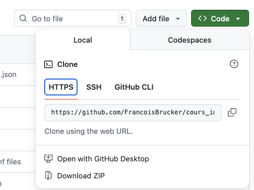
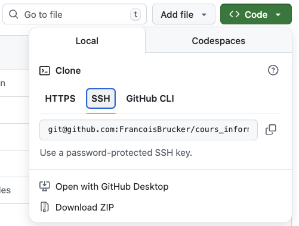

Pour pouvoir effectuer des modifications sur l'origine (ici github) il faut pouvoir être identifié. Il existe deux façon de faire :

- via un web token
- via une clé ssh

L'accès à l'origin doit être authentifié. POur github cela peut prendre essentiellement deux formes :

- une authentification via un navigateur (web token)
- une authentification via une clé ssh

Vous pouvez le voir dans le fichier de configuration (qui est par défaut `.git/config`{.fichier} dans la racine de votre projet) quelle méthode est utilisée.

## Web token

Correspond à un clone en utilisant la méthode https :



La partie du fichier de configuration `.git/config`{.fichier} dédié à l'origine est :

```
[remote "origin"]
        url = https://github.com/FrancoisBrucker/cours_informatique.git
        fetch = +refs/heads/*:refs/remotes/origin/*
```

A priori se fait tout seul si vous utilisez l'application.

> TBD à étoffer voir sur préférence du projet.

## Clés ssh

Correspond à un clone en utilisant la méthode ssh :



La partie du fichier de configuration `.git/config`{.fichier} dédié à l'origine est :

```
[remote "origin"]
        url = git@github.com:FrancoisBrucker/cours_informatique.git
        fetch = +refs/heads/*:refs/remotes/origin/*

```

Cette méthode est à utiliser de préférence. Elle nécessite plus de connaissance que le web token mais est largement utilisée et son utilisation dépasse de loin le seul cadre de la gestion des sources.
