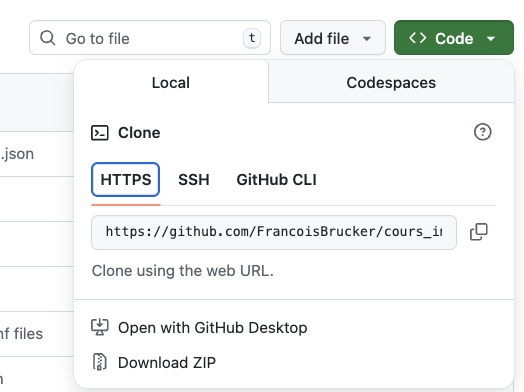
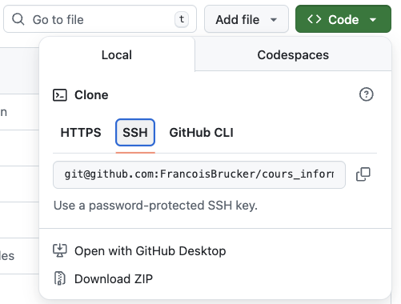

Pour pouvoir effectuer des modifications sur l'origine (ici github) il faut pouvoir être identifié. Il existe deux façon de faire :

- via un web token
- via une clé ssh

L'accès à l'origin doit être authentifié. Pour github cela peut prendre essentiellement deux formes :

- une authentification via un navigateur (web token)
- une authentification via une clé ssh

Vous pouvez le voir dans le fichier de configuration (qui est par défaut `.git/config`{.fichier} dans la racine de votre projet) quelle méthode est utilisée.

## Web token

Correspond à un clone en utilisant la méthode https :



La partie du fichier de configuration `.git/config`{.fichier} dédié à l'origine est :

```
[remote "origin"]
        url = https://github.com/FrancoisBrucker/cours_informatique.git
        fetch = +refs/heads/*:refs/remotes/origin/*
```

A priori se fait tout seul si vous utilisez l'application.

> TBD à étoffer voir sur préférence du projet.

## Clés ssh

Cette méthode est à utiliser de préférence. Elle nécessite plus de connaissance que le web token mais est largement utilisée et son utilisation dépasse de loin le seul cadre de la gestion des sources.

Correspond à un clone en utilisant la méthode ssh :



La partie du fichier de configuration `.git/config`{.fichier} dédié à l'origine est :

```
[remote "origin"]
        url = git@github.com:FrancoisBrucker/cours_informatique.git
        fetch = +refs/heads/*:refs/remotes/origin/*

```

Nous allons utiliser des clés ssh pour se connecter à github, donc si vous ne l'avez pas encore fait :


1. [Générer une clé ssh](https://docs.github.com/fr/authentication/connecting-to-github-with-ssh/generating-a-new-ssh-key-and-adding-it-to-the-ssh-agent#generating-a-new-ssh-key)
2. sous windows créez un agent au démarrage en copiant [les commandes de ce tutoriel](https://learn.microsoft.com/fr-fr/windows-server/administration/openssh/openssh_keymanagement#host-key-generation) dans un powershell **en mode administrateur**
3. Puis renseignez **votre clé publique** dans [votre profil github](https://github.com/settings/keys).


Pour une utilisation complète de ssh : [allez au cours dédié](/cours/réseau/ssh/){.interne}


