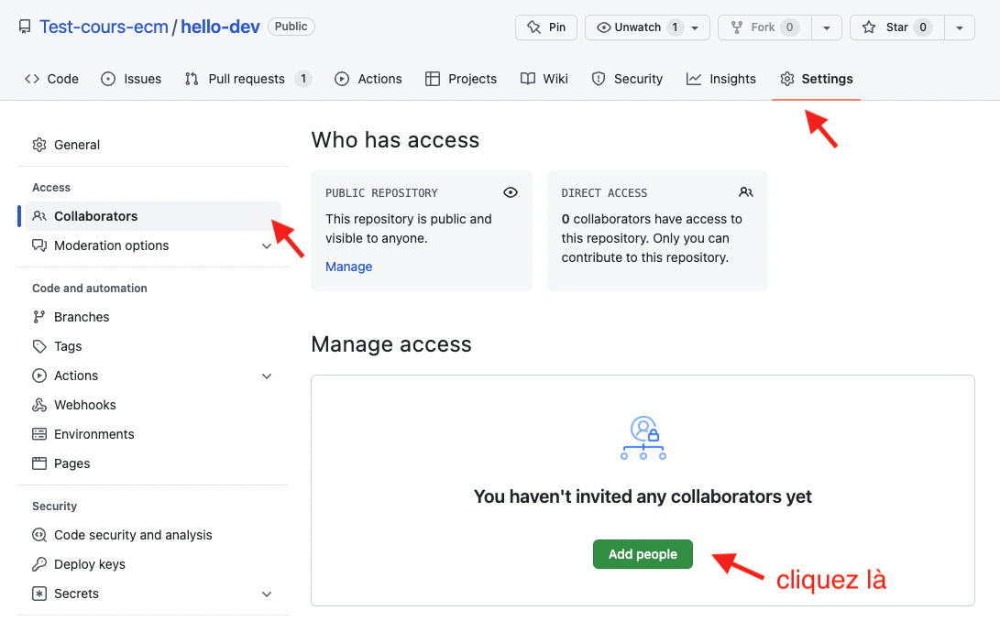
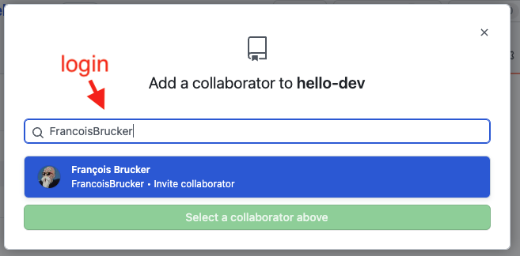
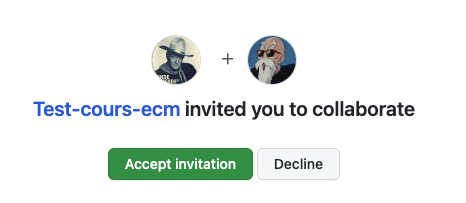
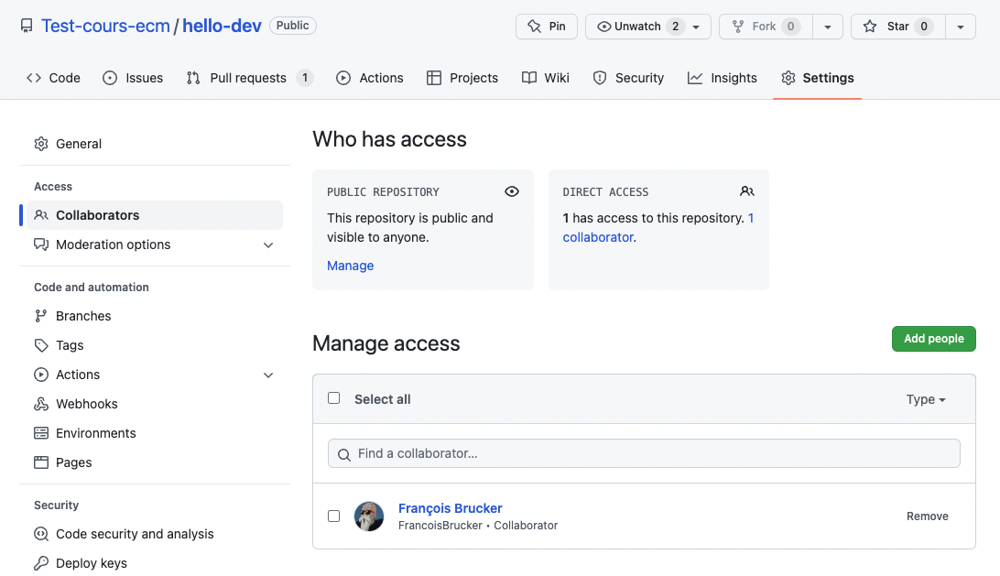
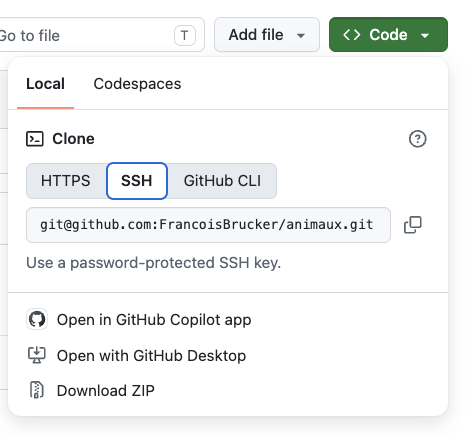

Nous allons créer un projet sur github puis le clone en local pour pouvoir y travailler. Comme nous allons utiliser une authentification ssh le plus simple est commencer par créer un projet sur github

## Init du projet coté github

### Création sur github


En utilisant si nécessaire [un des projets précédent](../évolution-code/github-projet-création/){.interne}, créez un nouveau projet github que vous nommerez `animaux`. Faites en sorte que ce projet :

-  soit public
-  contienne  un fichier readme
-  ne contienne pas  de fichier `.gitignore`{.fichier}.



### Ajout de collaborateurs

Vous pouvez ajouter d'autres personnes à votre projet :

1. 
2. 
3. sur le compte invité, on peut accepter l'invitation : 
4. de retour dans l'interface du projet, on voit les collaborateurs : 

Toutes les personnes peuvent maintenant ajouter et modifier des fichiers.

## Init du projet coté local

### Clone


Clonez le projet en ssh. Pour cela :

1. copiez la chaîne de caractère du clone ssh depuis la page du projet
   
2. dans un terminal placez vous dans un dossier pouvant contenir votre projet et tapez la commande : `git clone <votre chaîne copiée>`


On suppose que :

1. vous avez lié votre clé publique ssh à votre compte github
2. vous avez un agent en local qui tourne avec votre clé


Vous pouvez maintenant ouvrir ce dossier comme projet vscode.

### Config


Vérifiez la configuration de votre projet (c'est le fichier `.git/config`{.fichier}).


Vous devriez voir un champ réservé au serveur distant origin.

## Ajout de fichiers

### Le fichier `.gitignore`{.fichier}

On commence toujours par ajouter un fichier `.gitignore`{.fichier} au projet. 


1. Créez un fichier `.gitignore`{.fichier} et mettez-y le contenu du lien ci-après.
2. Ajoutez le au projet et commitez le tout


[une liste de fichiers courant à ignorer](https://gist.github.com/octocat/9257657)


En faisant un `git status` vous devriez voir que vous êtes en avance de 1 commit sur l'origine :

```text
On branch main
Your branch is ahead of 'origin/main' by 1 commit.
  (use "git push" to publish your local commits)

nothing to commit, working tree clean
```

Suivons les conseilles de git :


Utilisez la commande `git push` pour envoyer votre fichier `.gitignore`{.fichier} sur github


Vérifiez que c'est ok !

### Ajoutons d'autres fichiers




Ajoutons y 3 fichiers :

- `poissons.txt`{.fichier}

  ```text
  Anchois
  Sardine
  Requin

  ```

- `mammifères.txt`{.fichier}

  ```text
  Chat
  Homme
  Girafe

  ```

- `oiseaux.txt`{.fichier}

  ```text
  Pinson
  Mouette
  Goéland

  ```


Vérifiez (avec un `git status` qu'il y a bien 3 fichiers non suivi) puis :

1. ajoutez les tous avec la commande `git add --all`
2. refaite un git status pour voir que nos 3 fichiers ont été rajoutés à l'index
3. commit le tout avec la commande `git commit -m"add 3 files"`
4. push le tout sur l'origin


## Résolution de conflit

On va :

1. modifier sur le site de github un fichier
2. modifier le même fichier chez nous
3. tenter de pousser nos modifications sur le serveur.

### situation sur github

On modifie le fichier `oiseaux.txt`{.fichier} sur **github** en remplaçant son contenu par :

```text
Pinson du nord
Mouette
Gabian
Hibou petit duc
```

Et on commit les changements :

```text
origin : A -> B
```

### situation à la maison

On modifie le fichier `oiseaux.txt`{.fichier} en **local** en remplaçant son contenu par la liste des oiseaux par ordre alphabétique :

```text
Goéland
Mouette
Pinson

```

Et on commit les changements via la commande qui fait tout en une fois :

```shell
git commit -am"modif oiseaux par ordre alphabetique"
```

On est dans la situation :

```text
local : A -> C
```

### Situation globale

On se retrouve dans la situation suivante, sur la même branche `main` :

```text
origin : A -> B
          \
local  :    -> C
```

Pour connaître l'état de l'origine par rapport à celui en local on utilise la commande : `git fetch`. On peut ensuite faire un `git status` pour voir ce qu'il en est :

```text
On branch main
Your branch and 'origin/main' have diverged,
and have 1 and 1 different commits each, respectively.
  (use "git pull" if you want to integrate the remote branch with yours)

nothing to commit, working tree clean

```

Nos développements ont divergé : github et le local différent tous deux d'un commit.


### Merge ou rebase Résolution du problème


Nous pourrions faire comme précédemment et faire un _merge_ des deux histoires. On aurait du coup un historique comme ça :

```text
origin : A -> B --> D
          \     /
nous   :    -> C
```

Mais notre nouvelle branche n'est pas informative. Elle ne correspond à rien d'un point de vue sémantique. C'est juste une façon de rabouter les deux main ensemble. Pour ce genre de cas (c'est à dire 90% du temps) on préfère une autre solution : le **rebase**.


A moins que les branches soient liées au [workflow](https://delicious-insights.com/fr/articles/bien-utiliser-git-merge-et-rebase/), on privilégiera toujours le rebase au merge


On va re-écrire notre histoire en fonction de l'origine, c'est à dire transformer ça :

```text
origin : A -> B
          \
nous   :    -> C
```

en ça :

```text
origin : A -> B
               \
nous   :         -> C'
```

Il faut transformer notre commit C en le commit C' qui pourra s'intégrer tout seul dans l'histoire de l'origine : cette opération s'appelle un rebase.

Si vous avez suivi les instructions de configuration, c'est exactement ce que va faire un `git pull`.

### Git rebase

Tentons de récupérer les infos de l'origin avec un `git pull` :

```text
Auto-merging oiseaux.txt
CONFLICT (content): Merge conflict in oiseaux.txt
error: could not apply 6ae11b1... modif oiseaux par ordre alphabetique
hint: Resolve all conflicts manually, mark them as resolved with
hint: "git add/rm <conflicted_files>", then run "git rebase --continue".
hint: You can instead skip this commit: run "git rebase --skip".
hint: To abort and get back to the state before "git rebase", run "git rebase --abort".
hint: Disable this message with "git config set advice.mergeConflict false"
Could not apply 6ae11b1... # modif oiseaux par ordre alphabetique

```

La fusion de branches automatique n'a pas fonctionné. Le fichier `oiseaux.txt` est devenu méconnaissable :

```text
<<<<<<< HEAD
Pinson du nord
Mouette
Gabian
Hibou petit duc
=======
Goéland
Mouette
Pinson

>>>>>>> 6ae11b1 (modif oiseaux par ordre alphabetique)
```

Mais on sait faire. Il suffit d'éditer le ficher dans vscode et de faire comme pour le merge dans le projet précédent. Le nouveau fichier `oiseaux.txt` devient :

```text
Goéland
Hibou petit duc
Mouette
Pinson du nord
```

On a réglé un problème dans le rebase. On peut maintenant finaliser notre mise à jour :


1. on commit nos changements : `git commit -am"oiseaux merge"`
2. on poursuit le rebase : `git rebase --continue`
3. on git push pour envoyer notre mise à jour au serveur.



## log

Au final un git log nous donne tout ce qu'on a fait :

```text
commit 4ec6f84ece0572b7baf01ce3468db94c5ee79692 (HEAD -> main, origin/main, origin/HEAD)
Author: François Brucker <francois.brucker@gmail.com>
Date:   Tue Sep 29 15:44:56 2026 +0200

    oiseaux merge

commit 6a1378738a6b8e02767ddbfd36151a779333932c
Author: François Brucker <francois.brucker@gmail.com>
Date:   Tue Sep 29 15:34:11 2026 +0200

    Update oiseaux.txt

commit e176710577ec2fa64cbd4a5461cdfdb7c37c62c1
Author: François Brucker <francois.brucker@gmail.com>
Date:   Tue Sep 29 15:30:12 2026 +0200

    add 3 files

commit ce8401090639b72f3d78c5bca9f87982480fbd8e
Author: François Brucker <francois.brucker@gmail.com>
Date:   Tue Sep 29 15:20:07 2026 +0200

    first commit

commit 37357b1a27be5671fd2c0aa5be22b78e9e770c09
Author: François Brucker <francois.brucker@gmail.com>
Date:   Tue Sep 29 14:54:59 2026 +0200

    Initial commit

```
