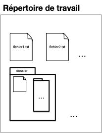
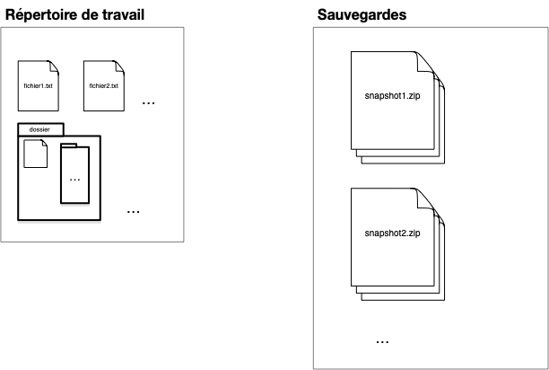

> TBD plan. Le principal avantage est de ne pas avoir peur des modifications.

## Besoins

Supposons que notre projet soit de travailler sur un ensemble de documents (_eg_ du code) regroupés au sein d'un répertoire de travail (_working directory_) dont le contenu évolue au cours du temps :

Pour pouvoir modifier ses documents sans avoir peur de faire des erreurs, on peut épisodiquement sauvegarder tout le contenu du répertoire de travail (faire un _snapshot_) :

Cette première organisation permet de faire une sauvegarde avant une modification, ou de garder des versions précédentes du projet. En utilisant un dossier partagé (un drive par exemple) si le projet est effectué par plusieurs personnes, chaque snapshot du dossier est associé :

- au moment où cette sauvegarde à été effectuée : QUAND
- à l'utilisateur qui a sauvegardé le dossier : QUI

Formalisons ceci avec la notion de **_commit_**, qui est constitué :

- d'une sauvegarde du répertoire de travail (un snapshot du working directory)
- de QUI a effectué cette sauvegarde
- de QUAND a été effectué cette sauvegarde

Il nous manque cependant une information capitale, les versions antérieures qui ont permit de créer le document sauvé (les parents). Ceci permet de conserver un historique des modifications et de connaître ce qui différencie la version actuelle de son ou ses prédécesseurs.

On a alors la définition finale d'un commit :


Un **_commit_** d'un projet est constitué :

- d'une sauvegarde du répertoire de travail (un snapshot du working directory)
- de QUI a effectué cette sauvegarde
- de QUAND a été effectué cette sauvegarde
- du (ou des) commits PARENT
- d'un descriptif des modifications effectuées (QUOI)



On obtient alors une structure de sauvegarde sous la forme d'[un DAG](https://fr.wikipedia.org/wiki/Graphe_orient%C3%A9_acyclique)

> TBD expliciter pourquoi on a pas juste un arbre. combinaison de versions issues de 2 utilisateurs différents par exemple (merge)

1. working dir
2. sauvegardes : snapshot; Commit: qui
3. sauvegardes ordonnées : Commit: quand [structure de liste]
4. sauvegardes diff pour connaître le doc modifié : parent et Commit: quoi [structure d'arbre]
5. s'y retrouver : Commit: qui, branches et head
6. choisir ce qu'on stocke : index

> TBD DAG avec les merge

> 2. que faut-il pourvoir faire et comment le faire
>    1. diagrammes [Tout avec des schémas et des arbres/graphes]: commit / branches
>    2. merge (rebase) / clone (que la branche main en local / tags (et semver) / worktrees ?. Toutes les branches du remote).
>    3. ...

> - <https://semver.org/> pour les tags
> - faire des schémas
