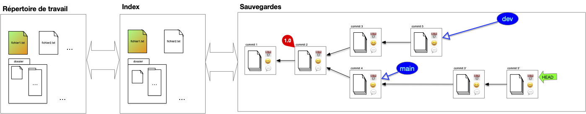
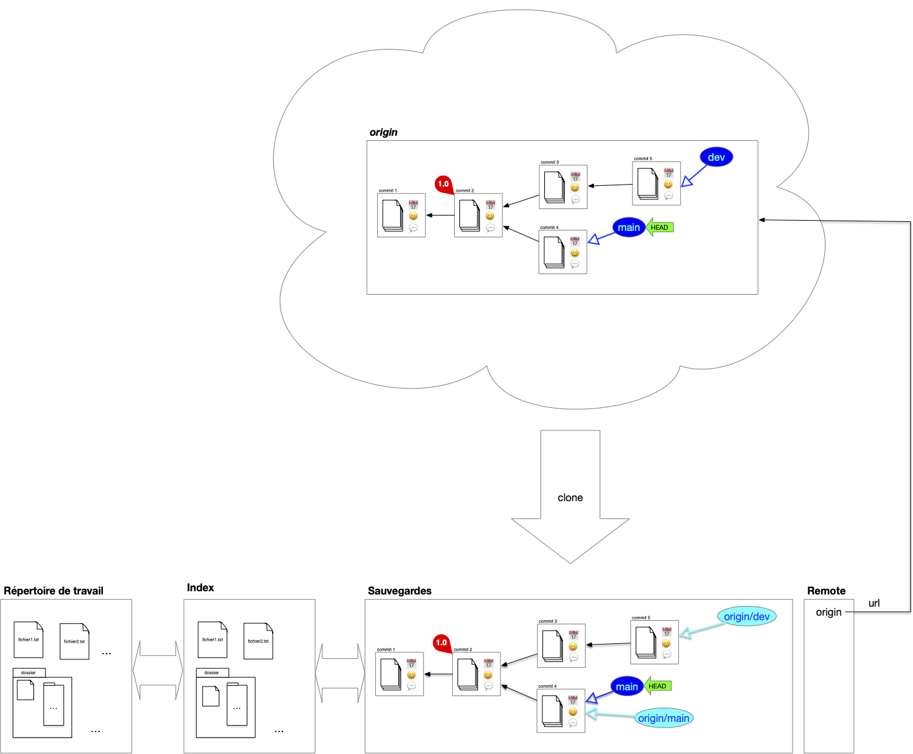

> TBD plan

## Faire évoluer le projet : commits et diff

L'utilisation courante d'un système de gestion des sources est de faire progresser une branche donnée par des commits successifs sur celle-ci.

L'évolution est caractérisé par les différences entre le parent et l'enfant :


On appelle **_`diff`_** entre deux commits les différences entre eux :

- les fichiers présent dans un commit et pas dans un autre
- les lignes différentes dans un fichier présent dans les deux commits


Suivre le diff d'une évolution allant de la branche actuelle au premier commit montre itérativement les modifications apportée au court du temps. Cette notion de `diff` est cruciale pour comprendre comment on peut manipuler et fusionner plusieurs commit entre eux.

## Travailler avec des Branches

Les branches et leurs historiques représentent les lignes de développement du projet et sont par là les uniques moyens d'accéder à la structure de sauvegarde (hors maraboutage expert pour réparer une bêtise).

Chaque branche a ainsi une raison d'être : branche principale, de développement d'une _feature_ particulière, d'un participant, ... Il n'y a pas de règle particulière sur ce que représente une branche **mais** elle doit avoir une signification pour l'équipe. Enfin une branche devenue inutile doit disparaître (il suffit de supprimer la référence).


L'historique d'un projet doit contenir uniquement ce qui est nécessaire pour comprendre son état actuel, c'est à dire ses branches (l'état actuel) et leurs historiques, le reste est inutile.


Parmi toutes les branches, la branche `main` est celle qui va contenir la branche de développement principale.

### Switch

Changer de branche est simple, il suffit de déplacer le pointeur HEAD d'une branche à l'autre. N'hésitez pas à créer de nouvelles branches pour tester des fonctionnalités et :

- les faire disparaître si l'idée n'aboutie pas
- la fusionner avec une branche principale si l'idée s'avère bonne

### Fusion de branches

La **_fusion de branche_** (_merge_), consiste à rassembler le contenu de plusieurs branches en une seule. Cette opération se fait en plusieurs étapes, illustrons la en prenant l'exemple classique de la fusion de la branche de développement sur la branche principale.

#### 1. Position de départ

On vient de terminer le développement de la branche de développement actuelle et on veut la combiner à la branche principale :

#### 2. branche accueil

Pour effectuer la fusion, on commence par se placer sur la branche qui va accueillir la fusion, ici la branche principale :

On remarque qu'il y a deux différences :

- le fichier `fichier2.txt` n'existe pas dans la branche principale
- le fichier `fichier1.txt` est différent pour les 2 branches

#### 3. fusion des deux branches

La fusion peut maintenant être effectuée. On procède comme suit :

1. on détermine l'ancêtre commun le plus récent entre les 2 branches à fusionner : ici le commit ayant pour tag `1.0` (dans certains cas pathologique il peut y avoir plusieurs possibilité et dans ce cas on en prend un au hasard)
2. on effectue le `diff` entre l'ancêtre commun et chacune des branches à fusionner : ceci donne les différences entre les 2 évolutions
3. on combine ces différences en une nouvelle évolution
4. on effectue le commit de la fusion

À la fin de ces 4 étapes, on se trouve dans la position suivante :


Ce type de fusion est appelée **_3-way merge_** car il prend en compte 3 commits différents : les 2 branches à fusionner et l'ancêtre commun.


Lorsque l'ancêtre commun est un des 2 commit, par exemple si l'on veut maintenant fusionner la branche `dev` et et la branche `main`, tout devient plus simple : il suffit de déplacer la branche ancêtre sur la branche descendante sans nécessité de créer un nouveau commit :


Ce type de fusion est appelée **_fast-forward merge_** (ou rarement **_2-way merge_**) : une branche à fusionner est l'ancêtre commun.


### Rebase

Le principal soucis avec la fusion de branche est qu'elle va induire des commits ayant 2 parents. L'historique des commits ne sera alors plus linéaire et sera plus difficile à visualiser. On peut palier ce problème en utilisant une opération de **_rebase_**. Cette opération se fait en plusieurs étapes, illustrons la en prenant l'exemple classique du rebase de la branche de développement sur la branche principale.

#### 1. Position de départ

Tout commence comme un merge. On vient de terminer le développement de la branche de développement actuelle et on veut la combiner à la branche principale :

Cependant, contrairement à un merge on peut placer les modifications de la branche `dev` **après** la branche main. Pour cela, on commence par déplacer le pointeur HEAD **sur le commit** de la branche d'accueil, ici la branche principale :

On remarque qu'il y a deux différences :

- le fichier `fichier2.txt` n'existe pas dans la branche principale
- le fichier `fichier1.txt` est différent pour les 2 branches

#### 2. Rebase

Puis, à partir de l'ancêtre commun, les `diff` des commits (avec leurs ancêtres) de la branche `dev` sont rejoués sur la branche `main`. Notez que  l'on ne peut pas juste déplacer les commits puisque l'on veut combiner la branche main aux modifications (diff) effectués par la branche dev :

Enfin :

1. la branche `dev` est placé sur le commit du pointeur courant
2. le pointeur courant est replacé sur la branche `dev`

Les précédent commits de la branche dev avant rebase ne sont plus accessibles via une branche mais sont par défaut toujours présent dans la structure de sauvegarde (qui garde tout).


On appelle **_rebase_** d'une branche $A$ sur une autre $B$ le fait de rejouer les diff des commit de la branche $A$ sur la branche $B$ depuis leur ancêtre commun.



## Nettoyage de base

Les commit que l'on ne peut plus atteindre via une branche ou son historiques sont inutiles. On peut donc : soit les ignorer soit les effacer de la base.
7
Dans le cas général on ne fait que les ignorer et de représenter uniquement la DAG "utile". Par exemple après un rebase, on représentera plutôt l'arbre suivant que le précédent :

## Origin

Que l'on travaille à plusieurs ou seul, posséder une version "_partageable_" de la structure de sauvegarde est appréciable. Parmi tous les avantages, on peut citer :

- de synchroniser les changements lorsque l'on travaille en équipe,
- de permettre à des personnes tierces d'utiliser le projet en le _clonant_ et de proposer des amélioration via des _pull request_
- de _cloner_ un projet qui nous intéresse
- ...

Un projet peut-être en lien avec de nombreuses copies distantes de celui-ci, que l'on  appelle **_remote_**. Le projet y accède via son [url](/cours/web/anatomie-url/){.interne} (adresse internet ou dossier sur le même disque dur).

### Clone

Lorsque l'on travaille à plusieurs sur un projet on a coutume de partager, **_en plus_** de sa structure de sauvegarde personnelle, une structure commune nommée _origin_ par convention qui regroupe les branches utiles à tous. Pour cela, on commence par désigner la structure de  sauvegarde partagée que l'on appelle `origin`. Ensuite, chaque participant au projet le **_clone_** :

L'opération de clonage effectue les opérations suivantes :


L'opération de **_cloner_** un projet consiste à :

1. copier sa structure de donnée
2. associer `origin` à l'url de l'origine dans la copie
3. si le pointeur HEAD de l'origin est sur une branche, la créer dans la structure copiée
4. placer le pointeur HEAD de la copie au même endroit (commit ou branche) que l'origine
5. garder une références de toutes les branches de l'origine



On remarque que l'on a besoin que de la structure de sauvegarde pour l'origine, l'index et le répertoire de travail sont inutiles.


L'opération de `fork` _ressemble_ au clonage mais [le but est différent](https://github.com/orgs/community/discussions/35849). Dans un clonage tous les participants interagissent directement avec l'origine, alors  qu'un projet résultant d'un fork peut être vu comme un nouveau projet (il n'est pas en relation directe avec le projet initial).


### Branches locales et distantes

Après un clonage, la structure de sauvegarde locale contient, en plus du DAG des commits de l'`origin`, des références à la structure `origin` et à ses branches. Les branches de l'`origin` sont dites **_distantes_** (_remote_). Notez que si la copie contient un lien vers l'original le serveur origin n'a lui aucune information de la copie locale, il ne _sait_ même pas qu'elle existe.

Au cours du temps de l'évolution des branches sur la sauvegarde locale et distantes ces informations peuvent diverger :

- des commits peuvent insérées sur la copie et sur l'origine
- des branches peuvent être crées sur la copie et sur l'origine

On se retrouve alors dans la configuration suivante :

> TBD montrer des divergences et des branches locales non poussées sur l'origin.

Comme on a fait **qu'ajouter** des commits et des références il est possible de synchroniser les deux structures :

- par des ajouts de commits/branches
- des merges si nécessaire sur des branches divergentes

#### Ajout de commits branches

#### merge de branches locales et distantes

### Interagir avec l'_origin_

> TBD Dire que c'est uniquement les branches utiles à tous qu'il faut pousser.

> / pull / push
> attention réécriture d'historique : uniquement en local. Faire dessin. Interactive et squash.
> (le rebase ne va pas pousser les commit non accessibles en remote)

## Modifier l'historique

> TBD pas vraiment utile tout le temps, mais quand on en a besoin c'est vraiment utile.
> - squash
> - revert
> - reset
> - cherry pick
