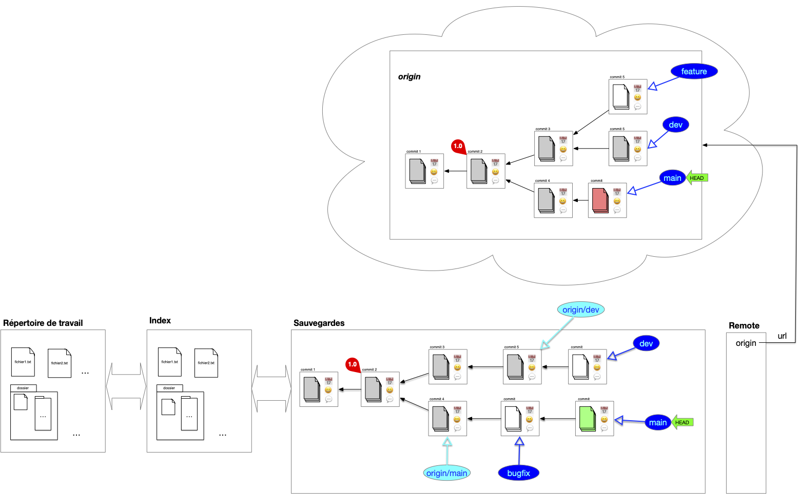
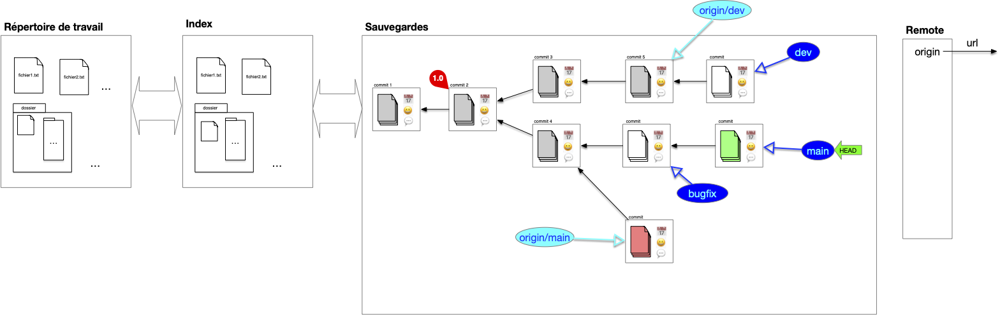
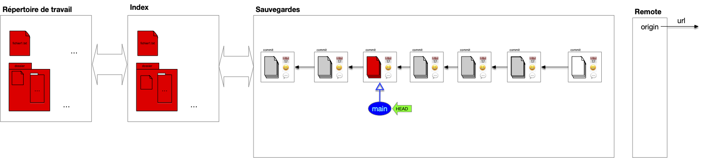

Maintenant que l'architecture du SCM est acté, regardons comment l'utiliser au mieux pour résoudre les problèmes de gestion au jour le jour. 99% de vos besoins seront couvert par ces cas d'usage. On verra plus tard comment les réaliser avec une application ou au terminal.

## Faire évoluer le projet : commits et diff

L'utilisation courante d'un système de gestion des sources est de faire progresser une branche donnée par des commits successifs sur celle-ci.

### add/reset

On a besoin de deux commandes pour préparer un index en vue d'un commit :

- une commande pour ajouter un fichier du répertoire de travail à l'index
- une commande pour supprimer un fichier de l'index (car ajouté ou par erreur)

On peut même n'ajouter (ou supprimer)  de l'index que des parties de fichiers. Ceci est pratique lorsque l'on a fait de multiples modifications à un fichier correspondant à plusieurs fonctionnalités et que l'on veut avoir un commit par fonctionnalité.

### diff

L'évolution est caractérisé par les différences entre le parent et l'enfant :


On appelle **_`diff`_** les différences entre deux commits, entre le répertoire de travail et l'index ou encore entre deux fichiers.

A savoir :

- les fichiers présent dans un commit et pas dans un autre
- les lignes différentes dans un fichier présent dans les deux commits



Suivre le diff d'une évolution allant de la branche actuelle au premier commit montre itérativement les modifications apportée au court du temps. Cette notion de `diff` est cruciale pour comprendre comment on peut manipuler et fusionner plusieurs commit entre eux.

## Travailler avec des Branches

Les branches et leurs historiques représentent les lignes de développement du projet et sont par là les uniques moyens d'accéder à la structure de sauvegarde (hors maraboutage expert pour réparer une bêtise).

Chaque branche a ainsi une raison d'être : branche principale, de développement d'une _feature_ particulière, d'un participant, ... Il n'y a pas de règle particulière sur ce que représente une branche **mais** elle doit avoir une signification pour l'équipe. Enfin une branche devenue inutile doit disparaître (il suffit de supprimer la référence).


L'historique d'un projet doit contenir uniquement ce qui est nécessaire pour comprendre son état actuel, c'est à dire ses branches (l'état actuel) et leurs historiques, le reste est inutile.


Parmi toutes les branches, la branche `main` est celle qui va contenir la branche de développement principale.

### Switch

Changer de branche est simple, il suffit de déplacer le pointeur HEAD d'une branche à l'autre. N'hésitez pas à créer de nouvelles branches pour tester des fonctionnalités et :

- les faire disparaître si l'idée n'aboutie pas
- la fusionner avec une branche principale si l'idée s'avère bonne

### Fusion de branches

La **_fusion de branche_** (_merge_), consiste à rassembler le contenu de plusieurs branches en une seule. Cette opération se fait en plusieurs étapes, illustrons la en prenant l'exemple classique de la fusion de la branche de développement sur la branche principale.

#### 1. Position de départ

On vient de terminer le développement de la branche de développement actuelle et on veut la combiner à la branche principale :

#### 2. branche accueil

Pour effectuer la fusion, on commence par se placer sur la branche qui va accueillir la fusion, ici la branche principale :

On remarque qu'il y a deux différences :

- le fichier `fichier2.txt` n'existe pas dans la branche principale
- le fichier `fichier1.txt` est différent pour les 2 branches

#### 3. fusion des deux branches

La fusion peut maintenant être effectuée. On procède comme suit :

1. on détermine l'ancêtre commun le plus récent entre les 2 branches à fusionner : ici le commit ayant pour tag `1.0` (dans certains cas pathologique il peut y avoir plusieurs possibilité et dans ce cas on en prend un au hasard)
2. on effectue le `diff` entre l'ancêtre commun et chacune des branches à fusionner : ceci donne les différences entre les 2 évolutions
3. on combine ces différences en une nouvelle évolution
4. on effectue le commit de la fusion

À la fin de ces 4 étapes, on se trouve dans la position suivante :


Ce type de fusion est appelée **_3-way merge_** car il prend en compte 3 commits différents : les 2 branches à fusionner et l'ancêtre commun.


Lorsque l'ancêtre commun est un des 2 commit, par exemple si l'on veut maintenant fusionner la branche `dev` et et la branche `main`, tout devient plus simple : il suffit de déplacer la branche ancêtre sur la branche descendante sans nécessité de créer un nouveau commit :


Ce type de fusion est appelée **_fast-forward merge_** (ou rarement **_2-way merge_**) : une branche à fusionner est l'ancêtre commun.


### Rebase

Le principal soucis avec la fusion de branche est qu'elle va induire des commits ayant 2 parents. L'historique des commits ne sera alors plus linéaire et sera plus difficile à visualiser. On peut palier ce problème en utilisant une opération de **_rebase_**. Cette opération se fait en plusieurs étapes, illustrons la en prenant l'exemple classique du rebase de la branche de développement sur la branche principale.

#### 1. Position de départ

Tout commence comme un merge. On vient de terminer le développement de la branche de développement actuelle et on veut la combiner à la branche principale :

Cependant, contrairement à un merge on peut placer les modifications de la branche `dev` **après** la branche main. Pour cela, on commence par déplacer le pointeur HEAD **sur le commit** de la branche d'accueil, ici la branche principale :

On remarque qu'il y a deux différences :

- le fichier `fichier2.txt` n'existe pas dans la branche principale
- le fichier `fichier1.txt` est différent pour les 2 branches

#### 2. Rebase

Puis, à partir de l'ancêtre commun, les `diff` des commits (avec leurs ancêtres) de la branche `dev` sont rejoués sur la branche `main`. Notez que l'on ne peut pas juste déplacer les commits puisque l'on veut combiner la branche main aux modifications (diff) effectués par la branche dev :

Enfin :

1. la branche `dev` est placé sur le commit du pointeur courant
2. le pointeur courant est replacé sur la branche `dev`

Les précédent commits de la branche dev avant rebase ne sont plus accessibles via une branche mais sont par défaut toujours présent dans la structure de sauvegarde (qui garde tout).


On appelle **_rebase_** d'une branche $A$ sur une autre $B$ le fait de rejouer les diff des commits de la branche $A$ sur la branche $B$ depuis leur ancêtre commun.



A priori les commit résultant d'un merge (ceux ayant plus d'un parent) ne sont pas concernés par le rebase puisqu'il sont déjà eux même des combinaisons de commits existants.


## Nettoyage de base

Les commit que l'on ne peut plus atteindre via une branche ou son historiques sont inutiles. On peut donc : soit les ignorer soit les effacer de la base.
7
Dans le cas général on ne fait que les ignorer et de représenter uniquement la DAG "utile". Par exemple après un rebase, on représentera plutôt l'arbre suivant que le précédent :

## Origin

Que l'on travaille à plusieurs ou seul, posséder une version "_partageable_" de la structure de sauvegarde est appréciable. Parmi tous les avantages, on peut citer :

- de synchroniser les changements lorsque l'on travaille en équipe,
- de permettre à des personnes tierces d'utiliser le projet en le _clonant_ et de proposer des amélioration via des _pull request_
- de _cloner_ un projet qui nous intéresse
- ...

Un projet peut-être en lien avec de nombreuses copies distantes de celui-ci, que l'on appelle **_remote_**. Le projet y accède via son [url](/cours/web/anatomie-url/){.interne} (adresse internet ou dossier sur le même disque dur).

### Clone

Lorsque l'on travaille à plusieurs sur un projet on a coutume de partager, **_en plus_** de sa structure de sauvegarde personnelle, une structure commune nommée _origin_ par convention qui regroupe les branches utiles à tous. Pour cela, on commence par désigner la structure de sauvegarde partagée que l'on appelle `origin`. Ensuite, chaque participant au projet le **_clone_** :

L'opération de clonage effectue les opérations suivantes :


L'opération de **_cloner_** un projet consiste à :

1. copier sa structure de donnée
2. associer `origin` à l'url de l'origine dans la copie
3. si le pointeur HEAD de l'origin est sur une branche, la créer dans la structure copiée
4. placer le pointeur HEAD de la copie au même endroit (commit ou branche) que l'origine
5. garder une références de toutes les branches de l'origine



On remarque que l'on a besoin que de la structure de sauvegarde pour l'origine, l'index et le répertoire de travail sont inutiles.


L'opération de `fork` _ressemble_ au clonage mais [le but est différent](https://github.com/orgs/community/discussions/35849). Dans un clonage tous les participants interagissent directement avec l'origine, alors qu'un projet résultant d'un fork peut être vu comme un nouveau projet (il n'est pas en relation directe avec le projet initial).


### Branches locales et distantes

Après un clonage, la structure de sauvegarde locale contient, en plus du DAG des commits de l'`origin`, des références à la structure `origin` et à ses branches. Les branches de l'`origin` sont dites **_distantes_** (_remote_). Notez que si la copie contient un lien vers l'original le serveur origin n'a lui aucune information de la copie locale, il ne _sait_ même pas qu'elle existe.

Au cours du temps de l'évolution des branches sur la sauvegarde locale et distantes ces informations peuvent diverger :

- des commits peuvent insérées sur la copie et sur l'origine
- des branches peuvent être crées sur la copie et sur l'origine

On se retrouve alors dans la configuration suivante :

Comme l'origine et la sauvegarde locales ont évoluées chacune de son côté des commits ont été ajouté depuis leur dernière synchronisation **mais** comme on a fait **qu'ajouter** des commits et des références il est possible de synchroniser les deux structures.

Pour cela, on commence par synchroniser la sauvegarde distante avec la sauvegarde locale, puis on envoie les évolutions locales vers l'origine.

#### Synchronisation de branches distances vers locales

La synchronisation se fait branche à branche. Dans l'exemple la sauvegarde locale suit deux branches distantes, `origin/main` et `origin/dev`. La branche feature n'est pas suivi, on ne s'en occupe donc pas : la sauvegarde locale n'est pas au courant qu'elle existe.

Seule la branche `origin/main` à divergé. Pour la synchroniser on commence par récupérer les divergences (on ne montre plus que la sauvegarde locale) :

On a maintenant deux possibilités pour effectuer la synchronisation.

##### Merge `origin/main` et `main`

##### Rebase `main` sur `origin/main`

**C'est cette solution qui est à privilégier** car elle garde un historique linéaire, plus facile à lire.


Les commits locaux sont **réécrit**. Il ne faut pas faire de rebase si les commits initiaux étaient déjà sur le serveur origin. Cela causerait d'énorme problèmes aux autres utilisateurs qui référenceraient des commits qui ne sont plus accessibles (voir ci-après).


#### Synchronisation de branches locales vers distantes

Une fois les synchronisations de l'origine vers le serveur locales terminées, la synchronisation vers l'origine est aisée c'est un _fast-forward_ :

### Interagir avec l'_origin_

La principale règle à suivre lorsque l'on participe à un projet avec l'origin est :


On ne modifie pas l'historique de l'origine.


Dans l'exemple ci-dessous, l'utilisateur du haut a modifié son historique **et** celui de l'origine. Les commits rouges de l'utilisateur du bas ne sont plus accessibles depuis l'origine (ils sont toujours présent mais sans pointeur de branche. Les retrouver est très compliqué) :

Le corollaire de la règle principale est :


On ne modifie pas son historique commun avec l'origine.


Quand on voudra synchroniser notre travaille avec l'origine, il est indispensable que l'origine que l'on connaisse soit une sous-partie de l'origine actuelle : elle a pu évoluer indépendamment de nous mais il faut pouvoir **ajouter** nos commit à l'historique à partir du point d'ancrage connu.

Comme la branche de dév et le main sont sur l'origine, le seul moyen de les fusionner est d'utiliser un merge. Ainsi, l'utilisateur du bas pourra toujours se synchroniser avec l'origine :


L'historique de toute branche sur l'origin est publique et ne doit pas être altérée.


Mais cela n’empêche pas la réécriture d'historique en locale. Tant que vous n'avez pas publié vos commits vous êtes libre de faire ce que vous voulez.

Si vous travaillez à plusieurs, l'origin va changer rapidement, pour éviter des opérations de synchronisation lourdes :


Commiter souvent pour éviter les conflits et les opérations lourdes de synchronisation et montrer aux autres ou vous en êtes.


Enfin, il faut garder l'origine lisible **pour tous** :


L'origine ne doit contenir que des branches utiles. Les branches temporaires ou spécifiques à un utilisateur doivent être limitées.


Mais cela ne doit pas vous empêcher d'avoir de nombreuses branches locales que vous n'allez pas synchroniser avec l'origin.

Réciproquement :


Ne conservez en local que des références à des branches de l'origine utiles pour vous.
 

Cela vous évitera des synchronisation inutiles avec l'origin. Vous pourrez toujours plus tard, lorsque vous en aurez besoin, récupérer une référence de branches spécifique.

## Utiliser l'historique

Avoir un historique permet de tester des choses puis de revenir en arrière si nécessaire. Il existe plusieurs possibilités. Nous allons en examiner quatre dont nous donnerons les nom anglais, couramment utilisés.

### revert

Permet d'enlever les modifications d'un commit en ajoutant un nouveau commit au HEAD.

revenir à une position antérieure du projet en recréant un nouveau commit. C'est idéal pour revenir à une position antérieure du projet alors que les commits ont été mis sur l'origine (0n ne peut donc pas les supprimer).

Le dernier commit de l'exemple précédent correspond à la suppression des effets du commit rouge dans l'avant dernier commit.


Supprimer les effet d'un merge est compliqué puisqu'il a des effets sur plusieurs branches : il faut spécifier quelle branche participant au merge prépondérante.



### Cherry pick

Fait un peu le contraire de revert. Il re-applique des commit au HEAD. Pratique pour appliquer des modification d'une autre branche, comme appliquer à la branche main un des développement du dev !

Le dernier commit de l'exemple précédent correspond à la ré-application des effets du commit rouge dans l'avant dernier commit.

### restore

Replace un fichier tel que sauvé dans un commit dans le working tree ou l'index. Aucun commit n'est effectué.

Dans l'exemple précédent, on a remis dans l'espace de travail un fichier tel qu'il était dans le commit rouge.

## Modification d'historique


Ne pas faire de modifications d'historique qui impacterait l'origine ! faite un revert/cherry pick/restore à la place.


### reset

Un reset modifie l'état de la tête HEAD et de sa branche associée. Il y a plusieurs modifications possibles selon que l'on ne veut que modifier la position du HEAD ou également affecter le répertoire de travail ou l'index.

Pour illustrer le propos, supposons que l'on soit dans le cas de l'exemple ci-dessous (le fichier bleu n'est pas suivi dans nos sauvegardes):

Et on veut revenir à l'état du commit rouge.

#### soft

- Déplace la HEAD de la branche courante à un commit spécifique.
- Ne change ni l'index ni le répertoire de travail.

Ceci permet de préparer une nouvelle branche à partir du commit rouge par exemple tout en ne perdant pas le travail effectué jusque là.

#### mixed

- Déplace la HEAD de la branche courante à un commit spécifique.
- reset l'index (pour correspondre à la nouvelle HEAD)
- laisse le répertoire de travail inchangé

Ceci permet de faire un commit spécifique en ajoutant juste ce qui est nécessaire au nouveau commit à l'index.

#### hard

- Déplace la HEAD de la branche courante à un commit spécifique.
- reset l'index (pour correspondre à la nouvelle HEAD)
- modifie le répertoire de travail pour correspondre à la nouvelle HEAD

On oublie tout le développement fait après le commit rouge (y compris le fichier non suivi). Après avoir suivi une mauvaise piste par exemple.

### squash

Pour avoir un histoire plus concis et avoir des commits thématiques (avoir une fonctionnalité implémentée en un seul commit alors qu'initialement on a eu besoin de plusieurs) pour le rendre plus lisible, on peut regrouper plusieurs commits successifs en un seul. Cela permet de supprimer des branches fusionnées pour linéariser l'historique. On appelle ceci faire un **_squash_** de commits.

Par exemples si on veut regrouper les commits rouge, vert et bleu en un seul :

