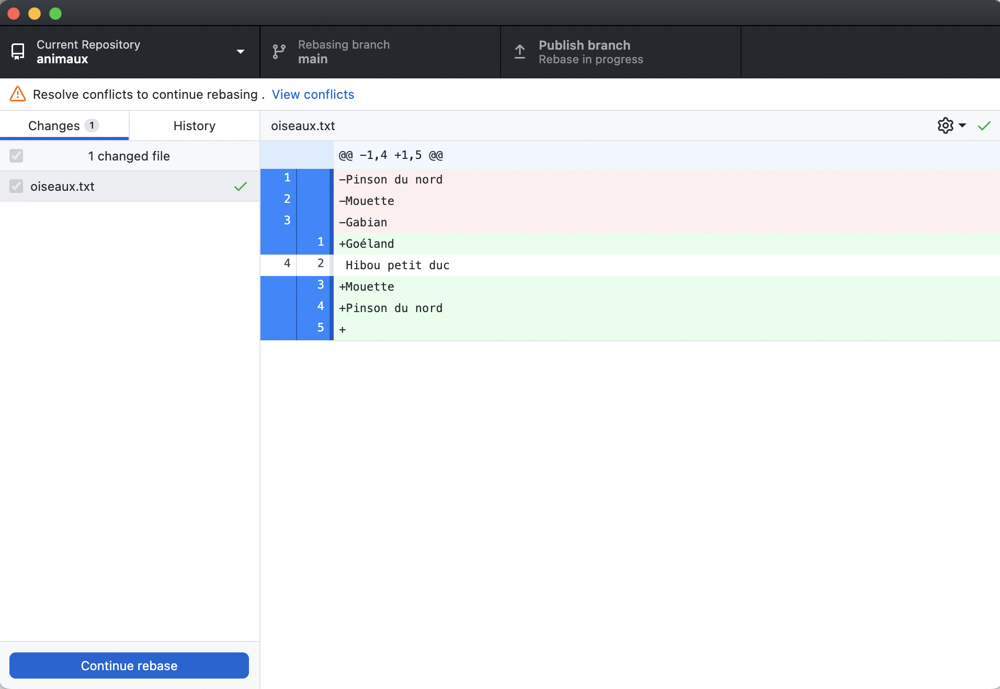
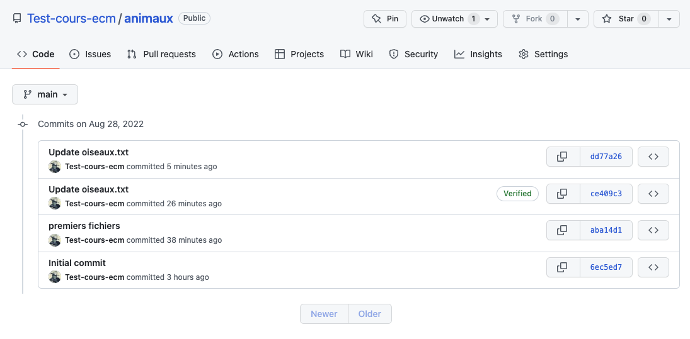



* [Naviguer dans un système de fichiers]({{ "/tutoriels/fichiers-navigation" | url }})


<!-- début résumé -->

Utilisation de l'application [desktop](https://desktop.github.com/) de github.

<!-- fin résumé -->

## Configuration

### Lier le compte github

Lors du premier lancement de l'application vous devriez avoir un fenêtre de ce genre :


Connectez vous à github pour associer votre login à l'application :


Ignorez les fenêtres si vous en avez et arrivez là :


### Préférences

Allez dans les préférences et vérifiez que :

* *"Accounts"* : pointe bien vers votre compte github
* *"Integration"* : soit lié à vscode et au terminal
* *"Git"* : connaisse bien votre vrai nom (pas de pseudo) et une adresse mail où vous joindre.


On le rappelle, dans la gestion des sources il faut pouvoir contacter rapidement toute personne ayant fait un commit pour lui demander des explications ou de faire des corrections. Il faut donc pouvoir **toujours** identifier l'auteur par un nom et une adresse mail valide.



## Projets

Puisque vous travailler sur votre ordinateur, il vous faudra également une application vous permettant de créer et modifier des fichiers texte. Je vous conseille d'utiliser [vscode]({{ "/tutoriels/vsc-installation-et-prise-en-main" | url }}).

### Récupérer un projet

Commençons par récupérer le projet précédent et voir comment tout ça se passe dans l'application.

1. choisissez "*clone a project from the internet
2. vous devriez voir vos le projet dans l'onglet *"Github.com"*
3. en cliquant sur le bouton *"clone"*, votre projet va aller dans un dossier de votre ordinateur

Une fois cliqué sur *"clone"* on se retrouve devant la fenêtre suivante :


Remarquez qu'en cliquant sur *"history"*, on retrouve **tout** l'historique du projet :




Un clone d'un projet contient toute l'histoire du projet, depuis le 1er commit.




Chaque membre d'un projet aura chez lui une copie complète du projet, avec tous les commit et toutes les branches.

Pour communiquer les changement effectué chez soit aux autre membre de l'équipe, une technique courante est de désigner un clone particulier qu'on nomme `origin` — c'est celui sur github — et qui sera le lieu où l'ou enverra nos modifications (`push`) et où l'on récupérera les dernières avancées des collaborateurs (`pull`)



Avoir un clone *"origin"* n'est pas indispensable. On pourrait tout aussi bien directement récupérer des modification depuis le clone d'un collaborateur : le système est **distribué**.

Mais c'est tout de même vachement plus simple d'avoir un lieu où se concentre l’information avant d'être distribuée aux autres membres du projet.



### Nouveau projet { #animaux }

Créons un nouveau projet jouet :

1. choisissez de créer un nouveau projet dans la fenêtre principale :  Je l'ai appelé `animaux`{.fichier}
2. l'application a cré un dossier `animaux`{.fichier} sur mon ordinateur : 

Tout a été fait sur votre ordinateur. Rien n'a été mis sur github pour l'instant. Faisons le :

Dans la fenêtre cliquez sur publish your repository to github :



Si le projet n'est pas confidentiel, autant le laisser public. C'est bien pour les autres qui pourront s'en inspirer et cela fait votre "book" pour plus tard.


Allez sur github pour voir que le projet est présent.

Vous voyez que l'application a mis un fichier (caché) `.gitattributes`{.fichier}, on ne s'en en occupe pas, c'est une optimisation que desktop fait pour nous.


Le fichier `.gitattributes`{.fichier} donne à git des règles pour [modifier automatiquement](https://buzut.net/cours/versioning-avec-git/normalisation-des-fichiers) des fichiers lorsqu'ils passent entre ses mains.

Par exemple, pour les fichiers texte, de gérer automatiquement les caractères *à la ligne* qui sont [différents sous unix, max et windows](https://fr.wikipedia.org/wiki/Fin_de_ligne).


#### Ajoutons des fichiers

Utilisons vscode pour *"ouvrir un dossier"* puis choisir le dossier contenant notre projet.

Ajoutons y 3 fichiers :

* `poissons.txt`{.fichier}

  ```text
  Anchois
  Sardine
  Requin

  ```

* `mammifères.txt`{.fichier}

  ```text
  Chat
  Homme
  Girafe

  ```

* `oiseaux.txt`{.fichier}

  ```text
  Pinson
  Mouette
  Goéland

  ```

Dans l'application desktop on voit qu'il y a 3 changements par rapport à la position précédente :


Les 3 nouveaux fichiers sont sélectionnés. Le prochain commit prendra en compte ces 3 fichiers.

Faisons un commit. On voit que les 3 fichiers ont été pris en compte dans le commit. Il n'est plus nécessaire de commiter chaque fichier comme on l'avait fait en travaillant directement sur le site de github !



Choisir quels fichiers seront pris en compte pour le commit est ce que l'on appelle le *staging*


### Pousser l'historique sur github

Pour l'instant, nous n'avons travailler que chez nous. Rien n'a été mis sur github. POur le faire, il suffit de cliquer sur le bouton *"push origin"* pour le faire.

Faisons le.

Tout s'est bien passé, il n'y a pas eu de conflit. Créons un conflit pour voir comment le résoudre.

### Résolution de conflit

On va :

1. modifier sur le site de github un fichier
2. modifier le même fichier chez nous
3. tenter de pousser nos modifications sur le serveur.

#### situation sur github

On modifie le fichier `oiseaux.txt`{.fichier} :

```text
Pinson du nord
Mouette
Gabian
Hibou petit duc
```

Et on commit les changements :

```text
origin : A -> B
```

#### situation à la maison

On modifie le fichier `oiseaux.txt`{.fichier} pour mettre les oiseaux dans l'ordre alphabétique :

```text
Goéland
Mouette
Pinson

```

Et on commit les changements :

```text
nous : A -> C
```

#### Situation globale

On se retrouve dans la situation suivante, sur la même branche `main` :

```text
origin : A -> B
          \
nous   :    -> C
```

Sur l'application desktop, notre bouton de communication avec le serveur dit*"fetch origin"* :



***fetch origin*** signifie que l'application va chercher des infos sur l'état de l'origin c'est à dire sur github.


Cliquons sur ce bouton pour nous retrouver dans la situation suivante :


On voit que github et nous différons tous deux d'un commit.

#### Résolution du problème

Nous pourrions faire comme précédemment et faire un *merge* des deux histoires. On aurait du coup un historique comme ça :

```text
origin : A -> B --> D
          \     /
nous   :    -> C
```

Mais notre nouvelle branche n'est pas informative. Elle ne correspond à rien d'un point de vue sémantique. C'est juste une façon de rabouter les deux main ensemble. Pour ce genre de cas (c'est à dire 90% du temps) on préfère une autre solution : le **rebase**


A moins que les branches soient liées au [workflow](https://delicious-insights.com/fr/articles/bien-utiliser-git-merge-et-rebase/), on privilégiera toujours le rebase au merge


On va re-écrire notre histoire en fonction de l'origine, c'est à dire transformer ça :

```text
origin : A -> B
          \    
nous   :    -> C
```

en ça :

```text
origin : A -> B
               \    
nous   :         -> C'
```

Il faut transformer notre commit C en le commit C' qui pourra s'intégrer tout seul dans l'histoire de l'origine : cette opération s'appelle un rebase.

C'est exactement ce que va faire desktop lorsque l'on clique sur le bouton pull.

Une fenêtre apparaît pour dire qu'il y a un soucis. Ne prenez pas peur et fermez cette fenêtre. On arrive à cette fenêtre là :


On sait faire. Il suffit d'éditer le ficher dans vscode et de faire comme pour le merge dans le projet précédent. Le nouveau fichier `oiseaux.txt` devient :

```text
Goéland
Hibou petit duc
Mouette
Pinson du nord
```

On a régler un problème dans le rebase. COmme c'était le seul, desktop nous permet de continuer :



On clique sur le bouton *"continue rebase"*. Pour arriver à cette situation :


Il n'y a plus de conflit avec l'origin, puisque son commit d'avance a été intégré dans notre historique. Allez dans l'historique pour le voir :


Notre commit a été re-écrit pour tenir compte du commit de l'origin (qui est passé *avant* le notre) :


On peut maintenant pousser nos changements sur github sans soucis en cliquant sur le bouton *"push origin"*

Il y a au final tous les commit sur github (victoire !)


