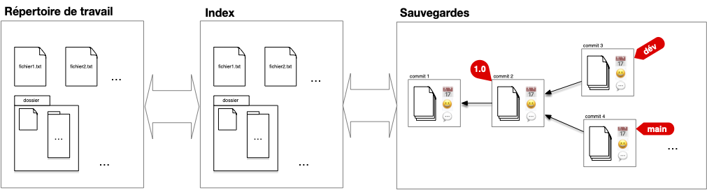
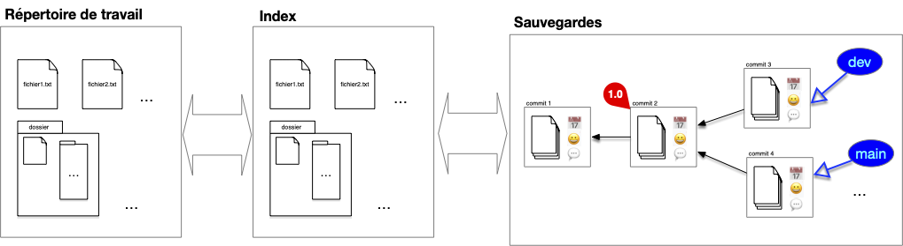
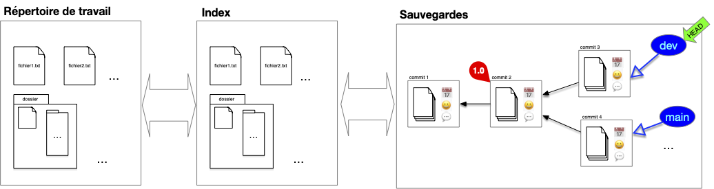
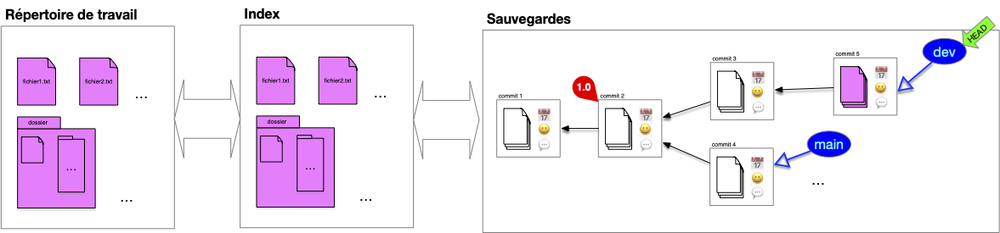
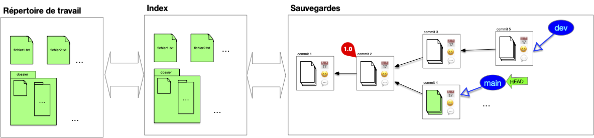
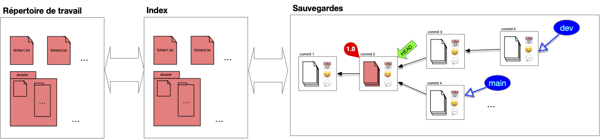

> TBD 
> 1. DAG et head
> 2. branches

Si l'on ne pouvait réaliser que des ajout linéaires à un projet on ne pourrait pas faire grand chose. La puissance de git réside en partie dans sa gestion des évolutions possible du code. Il permet :

- de travailler à plusieurs sur une partie identique du code
- d'avoir des version de tests de features en parallèle du code de production
- d'avoir plusieurs version du code à plusieurs endroit en même temps
- ...

Et tout ça grace à un outil très puissant : les branches.

## Branches

On a vu que la structure de sauvegarde est organisée autour [des commits](../besoins-index/#déf-commit), chaque commit possédant un parent qui le rattache à la structure le tout commençant par le commit initial qui crée le projet (le seul commit sans parent). 

La structure de sauvegarde s'organise sous la forme d'[un DAG](https://fr.wikipedia.org/wiki/Graphe_orient%C3%A9_acyclique), le premier commit faisant office de **racine** (le seul élément du graphe des commit à ne pas avoir de parents). UN DAG permet d'avoir ce genre de structure :


Si habituellement un commit n'a qu'un seul parent (la version précédente du document), il peut arriver qu'un commit ait plusieurs, dans le cas d'un synthèse de plusieurs documents par exemple.


La structure de branches permet de gérer les évolutions possiblement divergentes du code :


Une **_branche_** est une référence vers un commit donné. L'historique d'une branche est constitué du commit qu'elle référence et de tous ses ancêtres.

Un utilisateur accède à la structure de sauvegarde via les branches qui constituent les différentes évolutions du projet.


À la différence d'[un tag](../../dépôt/besoins-dépôt/#tag) qui référence un commit particulier, une branche représente une histoire :

- le présent : la référence pointée par la branche,
- le passé : ses ancêtres
- le futur : la référence de la branche change à chaque ajout de commit : le prochain commit dont le parent sera cette branche sera la future référence de celle-ci

Dans le graphique ci-dessous on a remplacé les deux tag `main` et `dev` par des branches :

Les branches constituent le lien privilégié entre l'utilisateur et la structure. Les commits constituent la structure interne de sauvegarde et un utilisateur n'y accède jamais directement. Il est donc indispensable que toute feuille de notre structure soit associé à une branche pour que l'on puisse accéder à tout commit de la structure en remontant par ses descendants.

## HEAD

Notre structure de stockage est complète. Il nous reste à faire en sorte que les échanges entre cette structure de commits et le répertoire de travail soit aisé.

On dispose pour cela d'une référence sur la branche courante (ou un commit, mais c'est plus rare), appelé **_HEAD_**.


Le pointeur courant **_HEAD_** est une référence vers une branche ou un commit donné. Il permet de faire le lien entre commit et working directory.


Dans la figure précédente, le pointeur courant est placé sur la branche `dev`. Si l'on décide de faire un commit, celui ci se fera avec `HEAD` comme parent. Puis `HEAD` (et la branche sur laquelle il pointe) se déplace sur le nouveau commit qui devient le commit courant :

Les fichiers du working directory sont égaux aux fichiers du commit.

Si l'on décide de changer de branche, le pointeur HEAD se déplace puis le working directory est mis à jour avec les fichiers stockés dans le commit. On peut ensuite continuer le développement depuis cette branche :

Enfin, on peut déplacer le pointeur courant sur un commit particulier, par exemple la version `1.0` :

## Travailler avec des Branches

Les branches et leurs historiques représentent les lignes de développement du projet et sont par là les uniques moyens d'accéder à la structure de sauvegarde (hors maraboutage expert pour réparer une bêtise).

Chaque branche a ainsi une raison d'être : branche principale, de développement d'une _feature_ particulière, d'un participant, ... Il n'y a pas de règle particulière sur ce que représente une branche **mais** elle doit avoir une signification pour l'équipe. Enfin une branche devenue inutile doit disparaître (il suffit de supprimer la référence).


L'historique d'un projet doit contenir uniquement ce qui est nécessaire pour comprendre son état actuel, c'est à dire ses branches (l'état actuel) et leurs historiques, le reste est inutile.


Parmi toutes les branches, la branche `main` est celle qui va contenir la branche de développement principale.

Changer de branche est simple, il suffit de déplacer le pointeur HEAD d'une branche à l'autre. N'hésitez pas à créer de nouvelles branches pour tester des fonctionnalités et :

- les faire disparaître si l'idée n'aboutie pas
- la fusionner avec une branche principale si l'idée s'avère bonne

