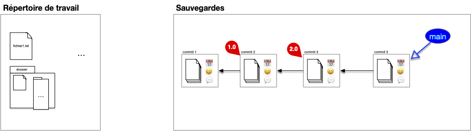
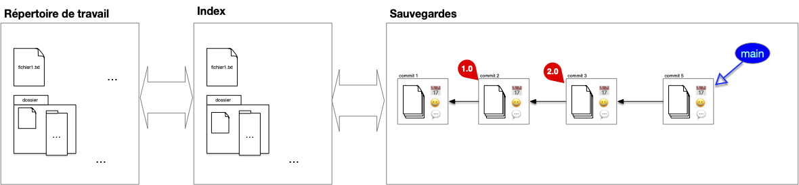
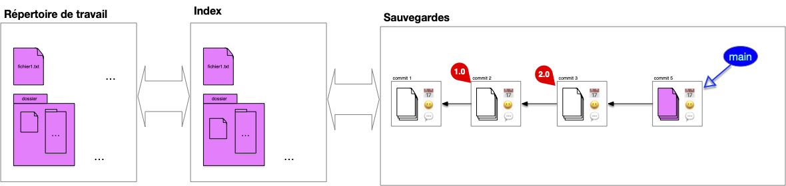
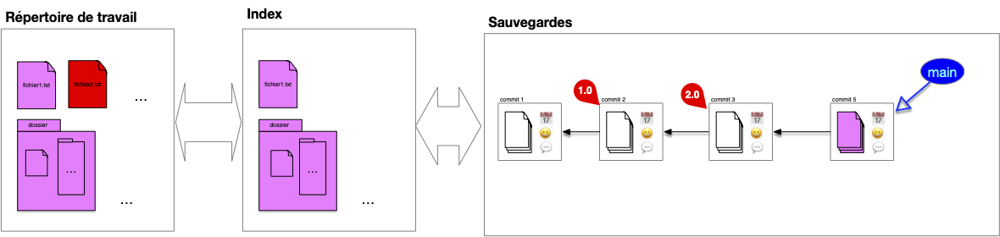
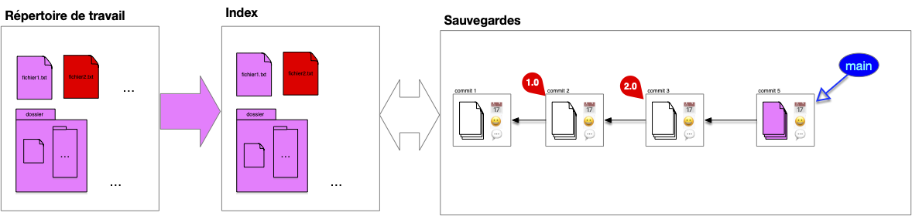
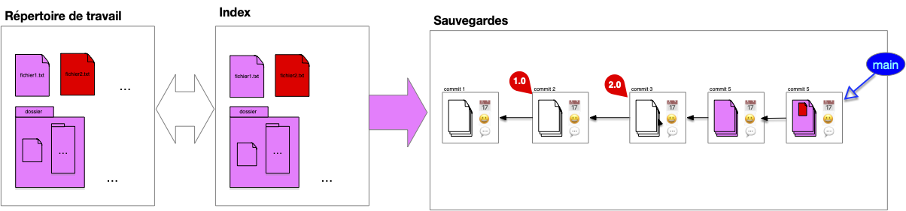
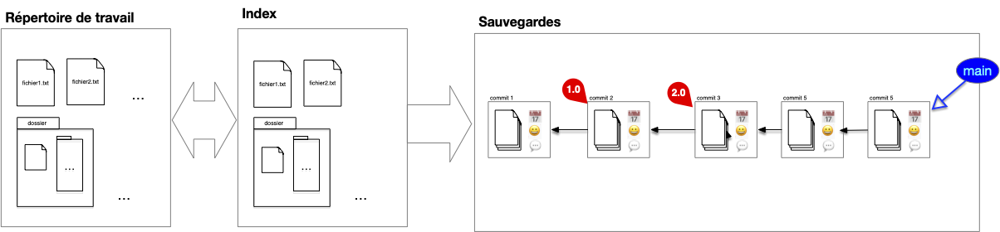
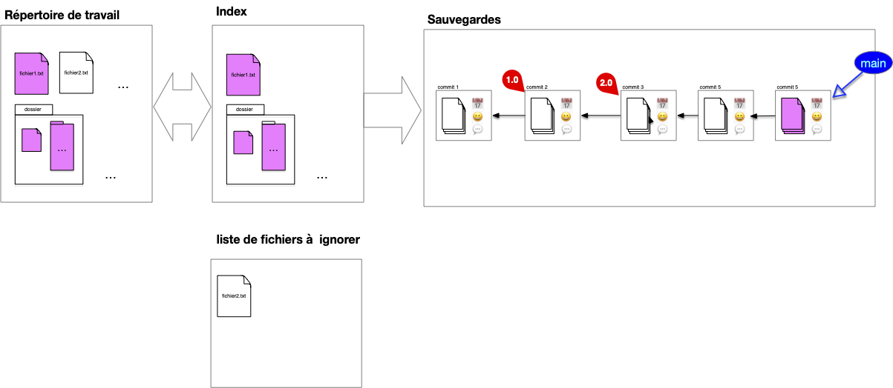

Les commits d'un projet ajoutent, modifient voir suppriment des fichiers à un projet. Ils montrent l'évolution temporelle du projet et son liées à l'état précédent du projet, appelé état parent, qu'ils modifient.


Un **_commit_** d'un projet est constitué :

- d'une sauvegarde du répertoire de travail (un **snapshot** du working directory)
- de **QUI** a effectué cette sauvegarde
- de **QUAND** a été effectué cette sauvegarde
- du (ou des) commits **PARENT(S)**
- d'un descriptif des modifications effectuées (**QUOI**)



Lors d'un commit on a pas forcément envie de :

- tout sauvegarder (par exemple des fichiers de mots de passe ou des fichiers de configurations)
- sauvegarder tout en une fois (de faire plusieurs [commits atomiques](https://en.wikipedia.org/wiki/Atomic_commit) plutôt qu'un gros commit regroupant plusieurs modification)

Enfin, il peut être difficile de comparer ce qui est sauvé de ce qui est nouveau.

## Principe

Pour cela on ajoute un _tampon_ entre la structure de sauvegarde et le répertoire courant appelé l'**_index_**.


Pour un projet github l'index correspond aux fichiers présent sur la page du projet


Après un commit, l'index **contient l'ensemble des fichiers sauvé dans le commit**. Si ces fichiers sont également dans le répertoire de travail, ils seront tous les 3 identiques :

Lorsque l'on ajoute un fichier au projet, l'index et le dossier de travail divergent (l'utilisateur vient de créer `fichier2.txt`) :

Pour préparer le nouveau commit, l'utilisateur place dans l'index les fichiers modifiés qu'il veut sauvegarder (les autres sont déjà dans l'index), ici il ajoute  `fichier2.txt` :

Remarquez qu'un fichier du dossier n'est toujours pas suivi.

On peut maintenant faire le commit, l'intégralité de l'index est commit (on a un commit de plus dans la chaîne) :

Et on se retrouve à nouveau dans la situation post-commit :

## Diff

L'index présente ce que vous allez sauver dans votre sauvegarde. À tout moment, il vous indique donc :

- les différences entre votre sauvegarde actuelle et ce que vous aller ajouter
- les différences et ce que vous aller sauver et votre travail actuel


On appelle **_`diff`_** les différences entre deux commits, entre le répertoire de travail et l'index ou encore entre deux fichiers.

A savoir :

- les fichiers présent dans un commit et pas dans un autre
- les lignes différentes dans un fichier présent dans les deux commits



Attention cependant, ces diff ne sont que des constructions, ils ne sont pas stocké dans le système.

## Fichiers ignorés

Certains fichiers ne doivent pas être suivis. Par exemple :

- les fichiers que produisent votre code comme les fichiers compilés
- les bibliothèques externe que vous ne faite qu'utiliser
- ...

Mais aussi vos propres fichiers qui risquent d'entrer en collision avec ceux des autres utilisateurs comme

- la configuration de votre IDE pour le projet,
- vos fichiers temporaires
- ...

Et surtout les fichiers confidentiels que vous ne voulez surtout pas voir apparaître sur github :

- les mots de passe de votre base de donnée,
- le dossier mac `.DS_Store`{.fichier} contenant tous les fichiers supprimés
- ...

Ces fichiers doivent être ajoutés à une liste de fichier à ignorer, sans ça vous devrez toujours faire attention lorsque vous regarderez les différences entre l'index et le répertoire de travail.

Par exemple, si le `fichier3.txt`{.fichier} n'est jamais à sauver, une fois ajoutée à la liste des fichiers à ignorer il n'apparaîtra pas comme une différence (mais on pourra toujours à tout moment l'ajouter) :


La liste des fichier à ignorer est très pratique en code pour ignorer les environnements virtuels, les fichiers de configurations de l'IDE, les fichiers compilés, les bibliothèques partagées. Bref tout ce qui n'est pas _stricto sensu_ utile au code du projet.


