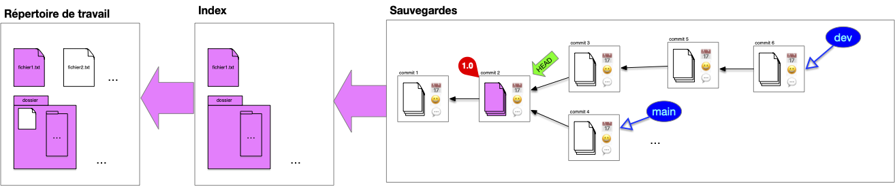
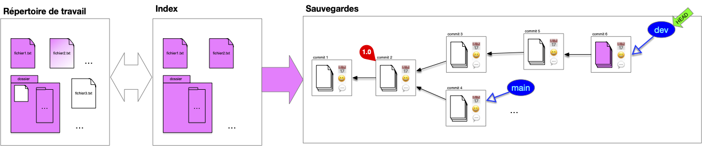
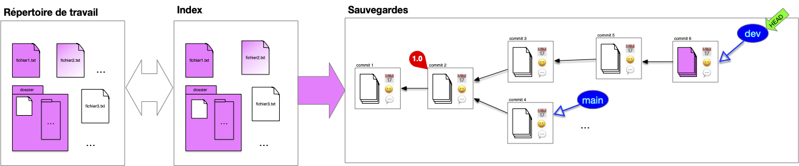
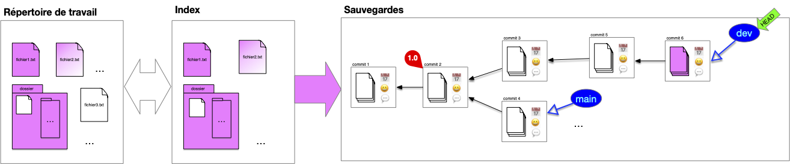

Les commits d'un projet ajoutent, modifient voir suppriment des fichiers à un projet. Ils montrent l'évolution temporelle du projet et son liées à l'état précédent du projet, appelé état parent, qu'ils modifient.


Un **_commit_** d'un projet est constitué :

- d'une sauvegarde du répertoire de travail (un **snapshot** du working directory)
- de **QUI** a effectué cette sauvegarde
- de **QUAND** a été effectué cette sauvegarde
- du (ou des) commits **PARENT(S)**
- d'un descriptif des modifications effectuées (**QUOI**)



Lors d'un commit on a pas forcément envie de :

- tout sauvegarder (par exemple des fichiers de mots de passe ou des fichiers de configurations)
- sauvegarder tout en une fois (de faire plusieurs [commits atomiques](https://en.wikipedia.org/wiki/Atomic_commit) plutôt qu'un gros commit regroupant plusieurs modification)

Enfin, il peut être difficile de comparer ce qui est sauvé de ce qui est nouveau.

## Principe

Pour cela on ajoute un _tampon_ entre la structure de sauvegarde et le répertoire courant appelé l'**_index_**.

Après un commit, l'index contient l'ensemble des fichiers sauvé dans le commit. Si ce fichier est également dans le répertoire de travail, ils seront tous les 3 identiques. Tous les fichiers du répertoire de travail ne sont cependant pas forcément suivis :

L'utilisateur continue de travailler sur son dossier de travail, les fichiers de l'index et du dossier de travail divergent (l'utilisateur travaille sur les fichiers `fichier1.txt` et `fichier2.txt`) :

Pour préparer le nouveau commit, l'utilisateur place dans l'index les fichiers modifiés qu'il veut sauvegarder (les autres sont déjà dans l'index), ici :

- il ajoute  `fichier1.txt`
- il décide également d'ajouter  `fichier2.txt`

Remarquez qu'un fichier du dossier n'est toujours pas suivi.

On peut maintenant faire le commit, l'intégralité de l'index est commit :

Et on se retrouve à nouveau dans la situation post-commit.

Enfin, si l'on change HEAD, les fichiers du commit sont placés dans l'index qui eux-même sont synchronisés avec l'index :

Notez que comme `fichier2.txt` n'est pas dans l'index il n'est pas suivi par notre structure et n'est donc pas modifié dans le répertoire de travail.


Nous somme dans un cas où HEAD n'est pas associé à une branche, on dit qu'il est _branchless_.


## Usage

L'index présente ce que vous allez sauver dans votre sauvegarde. À tout moment, il vous indique donc :

- les différences entre le head de la sauvegarde et ce que vous aller ajouter
- les différences et ce que vous aller sauver et votre travail actuel


On appelle **_`diff`_** les différences entre deux commits, entre le répertoire de travail et l'index ou encore entre deux fichiers.

A savoir :

- les fichiers présent dans un commit et pas dans un autre
- les lignes différentes dans un fichier présent dans les deux commits



### différence entre l'index et votre travail

Par défaut l'index contient l'ensemble des fichiers sauvegardés du head de la sauvegarde. Après travail ajout et modifications de fichiers le répertoire de travail va diverger de l'index :

Connaître les différences entre l'index et le répertoire de travail permet de voir le travail effectué.

### différence entre la sauvegarde et l'index

Pour mettre à jour la sauvegarde, on ajoute à l'index les nouveaux fichiers ou les fichiers modifiés :

Dans la figure ci-dessus, l'index est maintenant égal au répertoire de travail et différent de la sauvegarde.

Les différences entre l'index et le head de la sauvegarde donnera les modifications au projet que l'on va sauvegarder.

L'index permet de ne pas avoir à tout sauvegarde en une fois. Par exemple dans le cas ci-dessous, il y a des différences :

- entre l'index et la sauvegarde (`fichier2.txt`{.fichier} a été modifié et un fichier ajouté au dossier)
- entre l'index et le répertoire de travail (`fichier3.txt`{.fichier} a été créé)

> TBD voir les modif.
>
