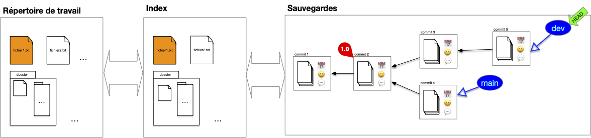
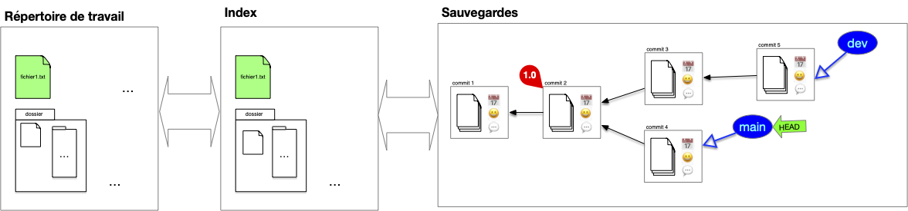
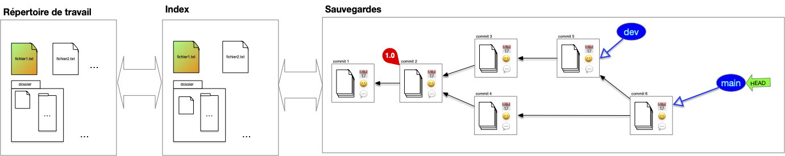
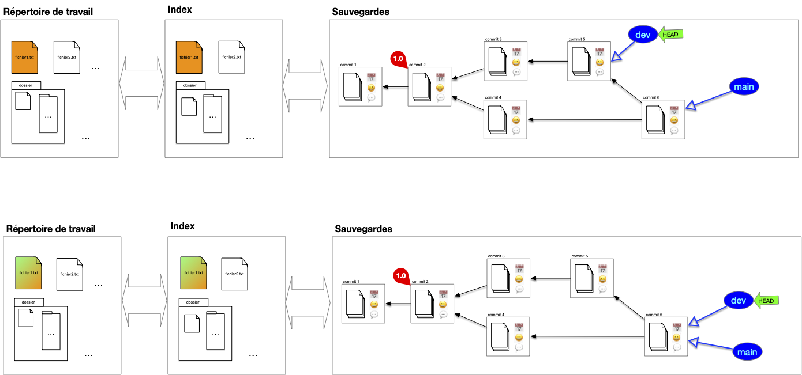
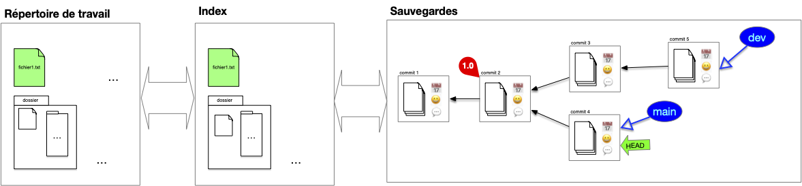
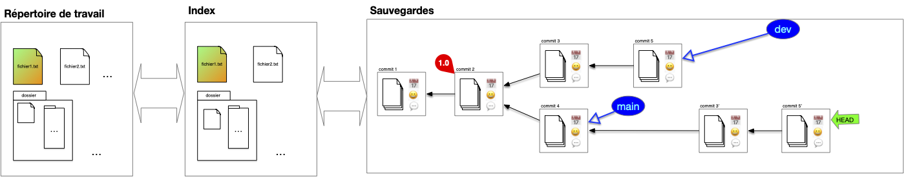
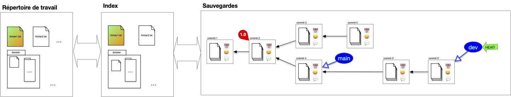
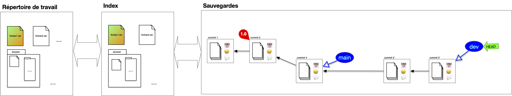

La **_fusion de branche_** (_merge_), consiste à rassembler le contenu de plusieurs branches en une seule. Ceci permet de réconcilier les développement divergents. Elle peut être très simple si les différences affectent des éléments différents du code onu plus complexe avec des choix à faire si le même code admet plusieurs évolutions irréconciliables possibles.

Cette opération se fait en plusieurs étapes, illustrons la en prenant l'exemple classique de la fusion de la branche de développement sur la branche principale.

## Fusion de branches

### 1. Position de départ

On vient de terminer le développement de la branche de développement actuelle et on veut la combiner à la branche principale :

### 2. branche accueil

Pour effectuer la fusion, on commence par se placer sur la branche qui va accueillir la fusion, ici la branche principale :

On remarque qu'il y a deux différences :

- le fichier `fichier2.txt` n'existe pas dans la branche principale
- le fichier `fichier1.txt` est différent pour les 2 branches

### 3. fusion des deux branches

La fusion peut maintenant être effectuée. On procède comme suit :

1. on détermine l'ancêtre commun le plus récent entre les 2 branches à fusionner : ici le commit ayant pour tag `1.0` (dans certains cas pathologique il peut y avoir plusieurs possibilité et dans ce cas on en prend un au hasard)
2. on effectue le `diff` entre l'ancêtre commun et chacune des branches à fusionner : ceci donne les différences entre les 2 évolutions
3. on combine ces différences en une nouvelle évolution
4. on effectue le commit de la fusion

À la fin de ces 4 étapes, on se trouve dans la position suivante :


Ce type de fusion est appelée **_3-way merge_** car il prend en compte 3 commits différents : les 2 branches à fusionner et l'ancêtre commun.


Lorsque l'ancêtre commun est un des 2 commit, par exemple si l'on veut maintenant fusionner la branche `dev` et et la branche `main`, tout devient plus simple : il suffit de déplacer la branche ancêtre sur la branche descendante sans nécessité de créer un nouveau commit :


Ce type de fusion est appelée **_fast-forward merge_** (ou rarement **_2-way merge_**) : une branche à fusionner est l'ancêtre commun.


## Rebase

Le principal soucis avec la fusion de branche est qu'elle va induire des commits ayant 2 parents. L'historique des commits ne sera alors plus linéaire et sera plus difficile à visualiser. On peut palier ce problème en utilisant une opération de **_rebase_**. Cette opération se fait en plusieurs étapes, illustrons la en prenant l'exemple classique du rebase de la branche de développement sur la branche principale.

### 1. Position de départ

Tout commence comme un merge. On vient de terminer le développement de la branche de développement actuelle et on veut la combiner à la branche principale :

Cependant, contrairement à un merge on peut placer les modifications de la branche `dev` **après** la branche main. Pour cela, on commence par déplacer le pointeur HEAD **sur le commit** de la branche d'accueil, ici la branche principale :

On remarque qu'il y a deux différences :

- le fichier `fichier2.txt` n'existe pas dans la branche principale
- le fichier `fichier1.txt` est différent pour les 2 branches

### 2. Rebase

Puis, à partir de l'ancêtre commun, les `diff` des commits (avec leurs ancêtres) de la branche `dev` sont rejoués sur la branche `main`. Notez que l'on ne peut pas juste déplacer les commits puisque l'on veut combiner la branche main aux modifications (diff) effectués par la branche dev :

Enfin :

1. la branche `dev` est placé sur le commit du pointeur courant
2. le pointeur courant est replacé sur la branche `dev`

Les précédent commits de la branche dev avant rebase ne sont plus accessibles via une branche mais sont par défaut toujours présent dans la structure de sauvegarde (qui garde tout).


On appelle **_rebase_** d'une branche $A$ sur une autre $B$ le fait de rejouer les diff des commits de la branche $A$ sur la branche $B$ depuis leur ancêtre commun.



A priori les commit résultant d'un merge (ceux ayant plus d'un parent) ne sont pas concernés par le rebase puisqu'il sont déjà eux même des combinaisons de commits existants.


Préférer toujours faire un rebase lorsque c'est possible, un historique linéaire est toujours mieux qu'une succession de fusions pour pouvoir plus tard s'y retrouver lorsqu'il faudra corriger un bug.


## Nettoyage de base

Les commit que l'on ne peut plus atteindre via une branche ou son historiques sont inutiles. On peut donc : soit les ignorer soit les effacer de la base.

Dans le cas général on ne fait que les ignorer et de représenter uniquement la DAG "utile". Par exemple après un rebase, on représentera plutôt l'arbre suivant que le précédent :

