Je suis content de mon projet, mais soit :

- j'aimerai tester des modifications sans être sûr de les conserver
- j'aimerai corriger un bug mais sa correction risque de prendre un peu de temps

De plus, je ne voudrai pas juste travailler dans mon coin et tout commiter une fois que ce sera fini car :

- le travail risque de prendre du temps et plusieurs commits
- si je travaille dans mon coin, lorsque j'aurai fini, les autres membres du projets auront certainement modifié le code.

La solution à ce problème consiste à ajouter **une branche** au projet.

## Création d'une nouvelle branche

1. 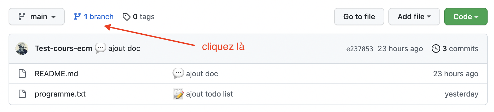
2. On clique :
   - pour ajouter une nouvelle branche : 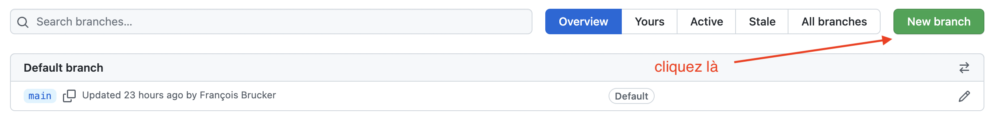
   - on indique son nom et la branche à copier : 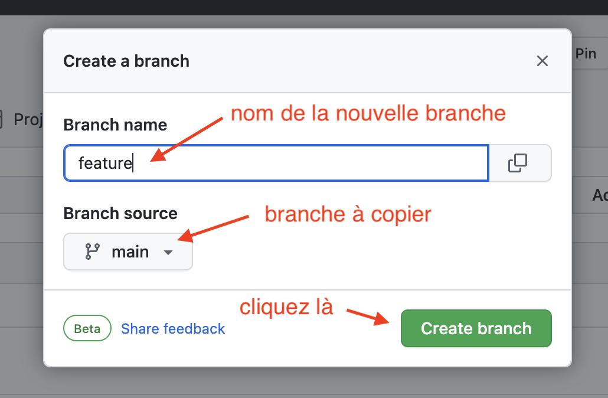
3. On peut maintenant changer de branche :
   - on retourne à la page de gestion de projet et on voit qu'on a 2 branches : 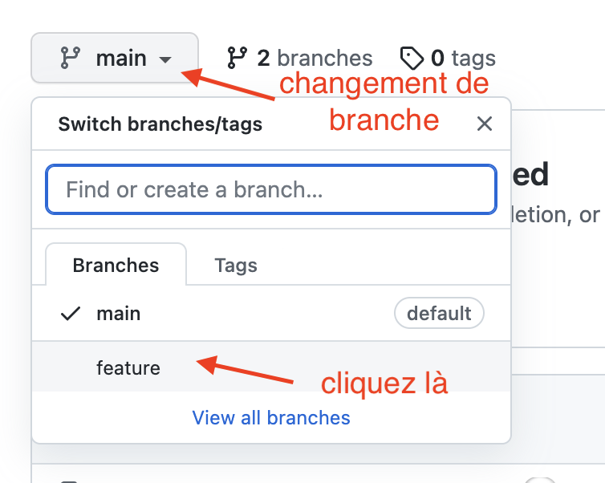
   - passage sur une autre branche : 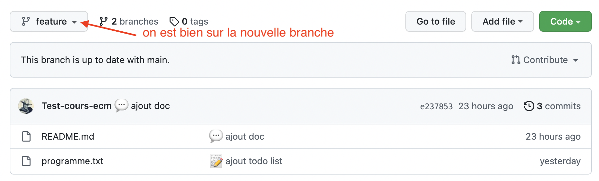

## Travail sur la nouvelle branche

1. ajout d'un fichier : 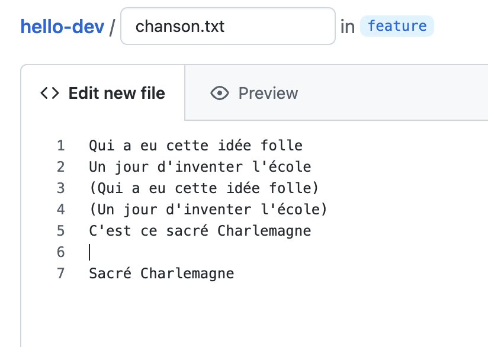
2. modification d'un fichier : 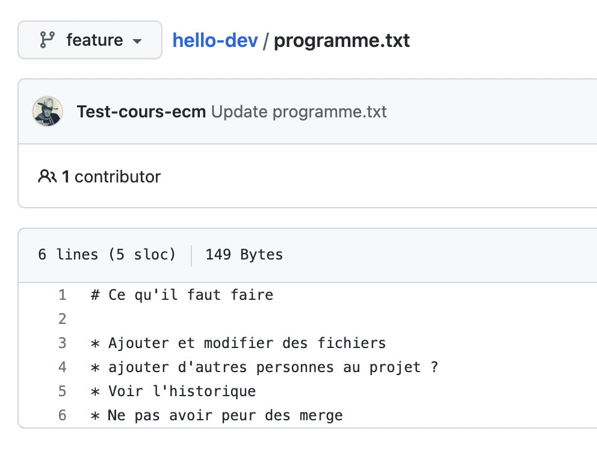

On obtient alors les commits sur la branches feature :

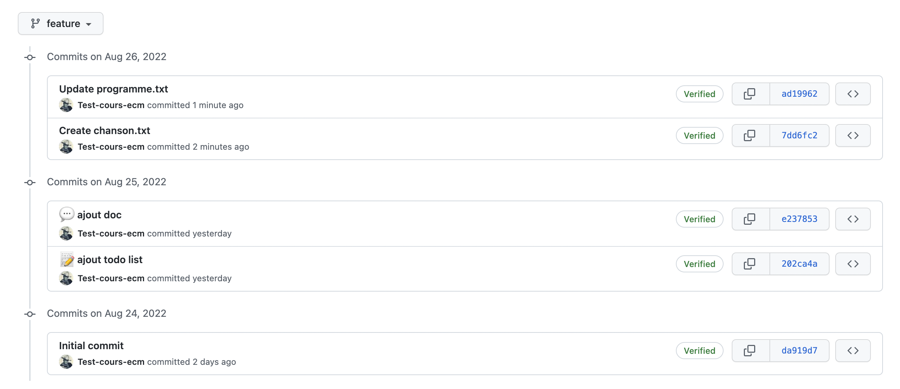

Les 3 premiers commits sont communs à la branche main (allez dans _"insights/network"_ pour voir le graphe de dépendances) :

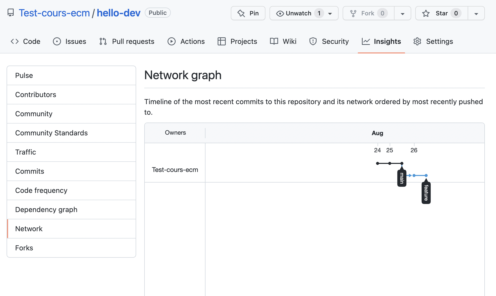

Pour bien voir que les branches sont indépendantes, ajoutons un commit sur la branche main, en modifiant le fichier `programme.txt`{.fichier} :

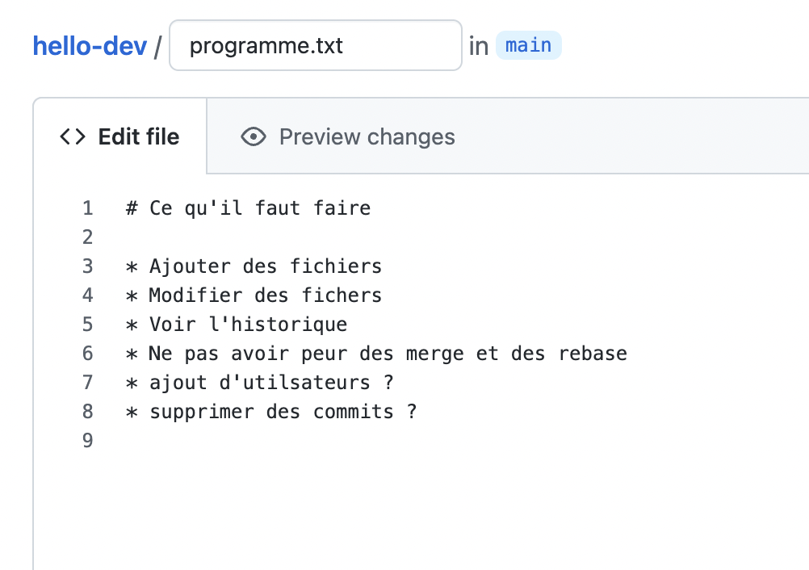

Le graphe de dépendance à maintenant deux histoires qui divergent :

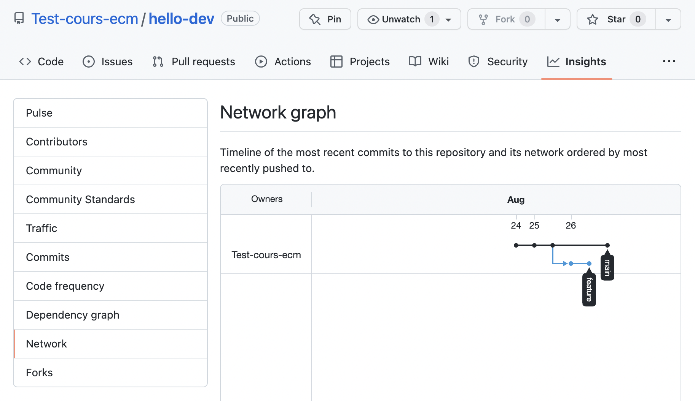

