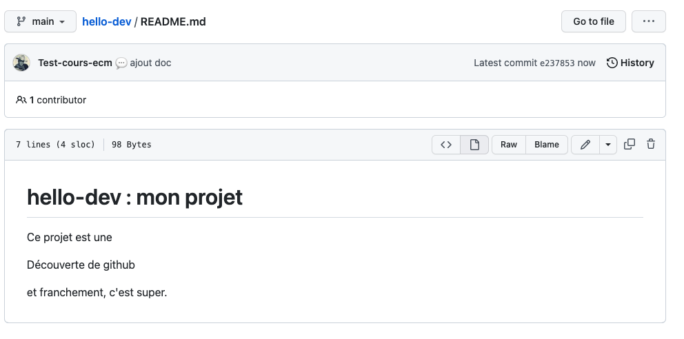
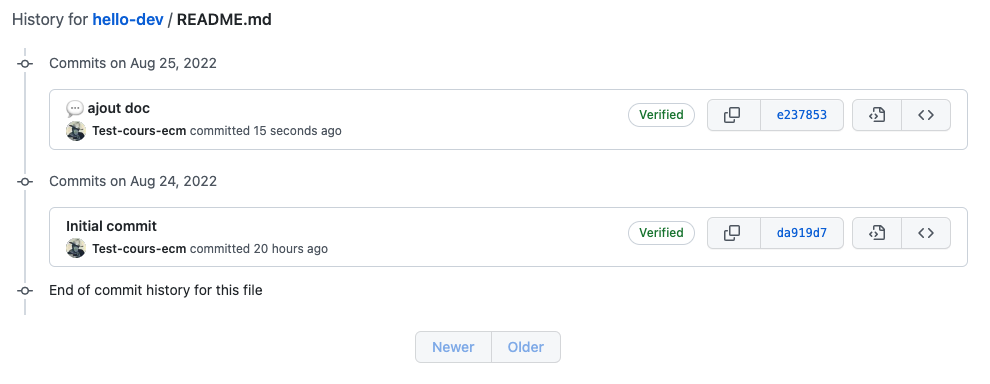
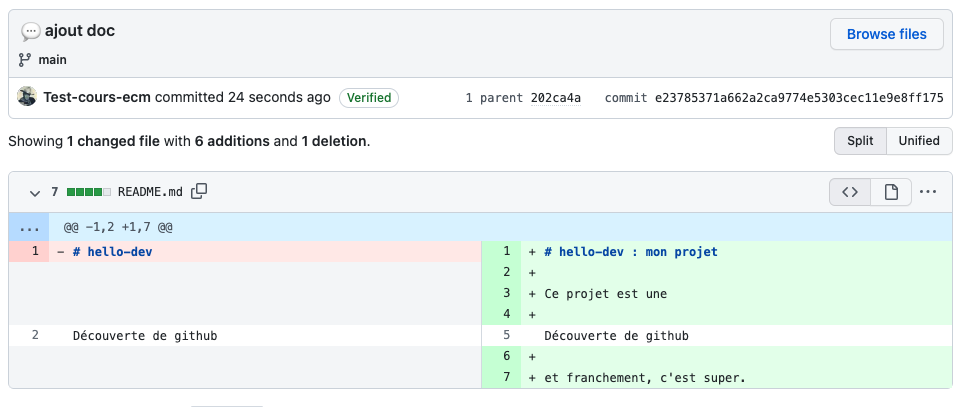

Nous allons maintenant modifier le fichier `readme.md`{.fichier} qui est aussi un fichier texte écrit [au format Markdown](https://docs.github.com/fr/get-started/writing-on-github/getting-started-with-writing-and-formatting-on-github/basic-writing-and-formatting-syntax). Pour que ce fichier soit agréable à la lecture, github le compile en html, mais — en vrai — c'est juste du texte.

## Modification du fichier readme

1. 
2. 
3. 
4. 

On peut maintenant le commit :

1. Notre fichier modifié est maintenant 
2. Son historique montre qu'il a été modifié par 2 commit 
3. Le dernier commit a modifié son contenu 

L'index qui permet de voir les différences entre ce qu'on a sauvegarder et ce qu'on va ajouter. L'index est transparent pour l'instant mais plus on progressera plus il sera visible.

