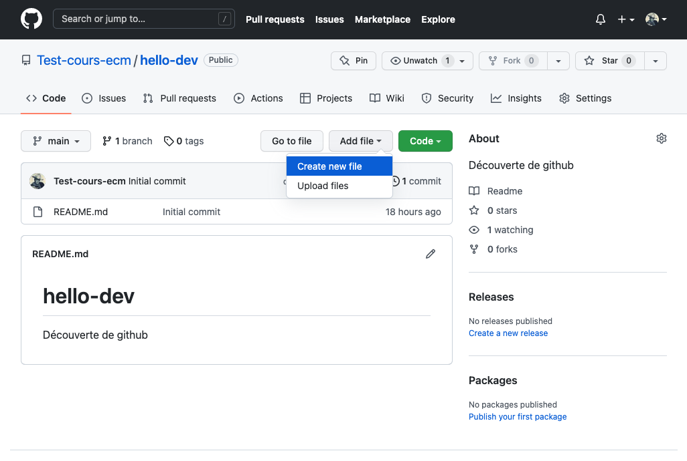
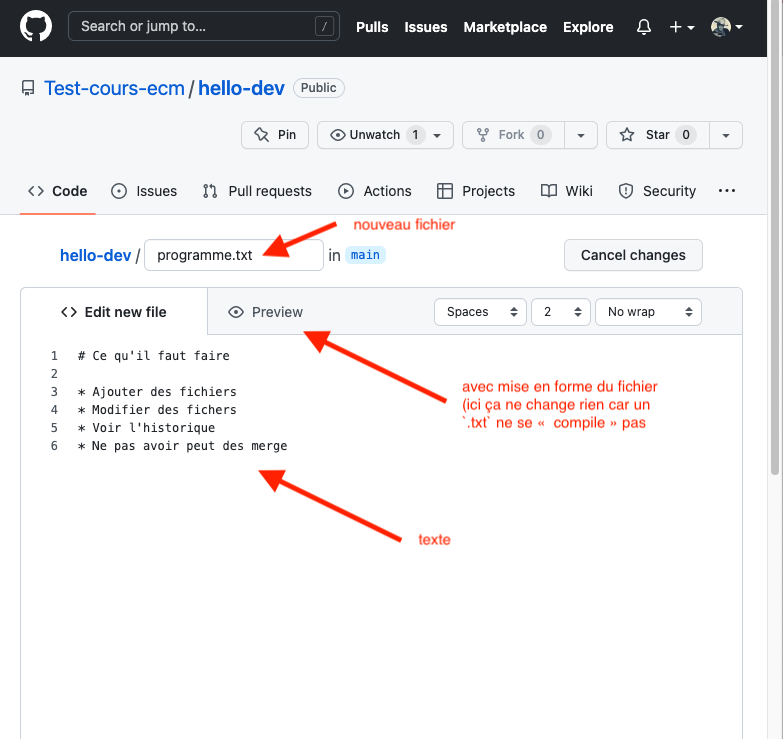
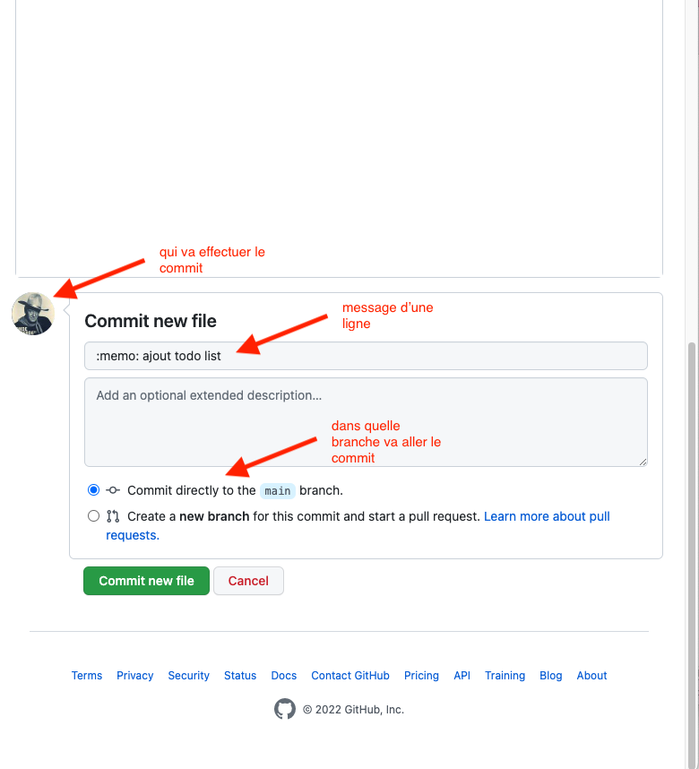
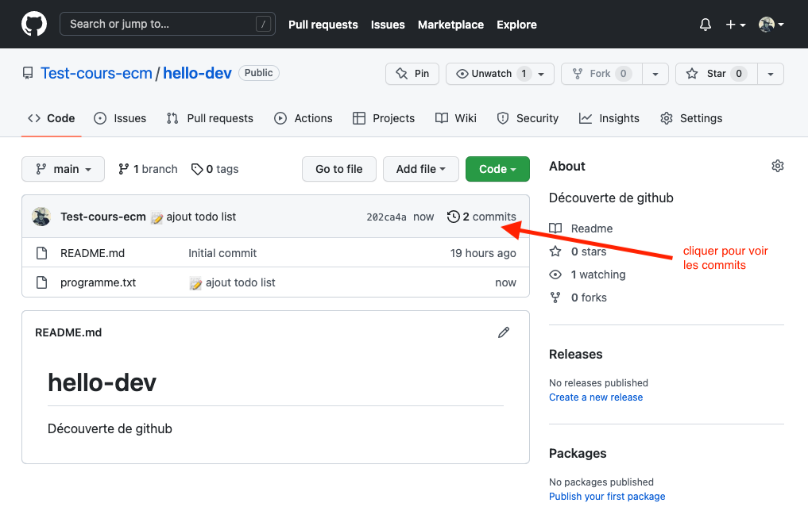
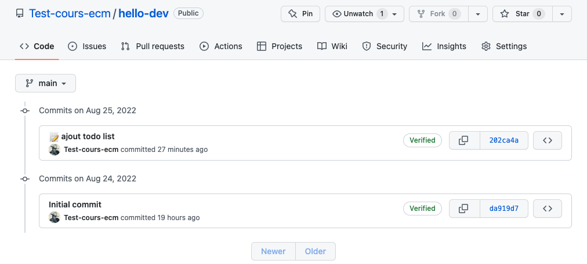
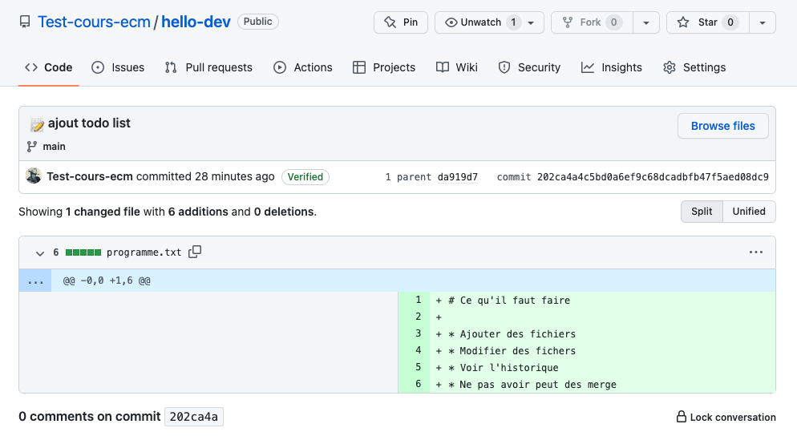

Commencer par créer un nouveau projet en suivant si nécessaire [les instructions du précédent projet](../../dépôt/projet-dépot/#création) :


Créez un nouveau projet sur le site de github que vous appellerez `hello-dev`.


## Ajout de fichiers

1. 
2. 
3. 
4. 


On a utilisé <https://gitmoji.dev/> pour le commit. Mettre un émoji en premier caractère du message permet de facilement identifier le but du commit.


## Commits

On l'a déjà vu lors du précédent projet, ajouter des fichier et modifier du texte crée des commits, notre projet en a donc 2. En cliquant sur le texte _"2 commits"_, on voit l'historique de notre projet sur la branche principale (`main`) :

En cliquant sur le numéro de commit, on voit le détail de celui-ci :

Nous rentrerons plus en détails dans ce que tout cela signifie un peut plus tard. Mais La façon dont est représenté le commit suit la syntaxe des [GNU `diffutils`](https://www.gnu.org/software/diffutils/manual/diffutils.html). Pour nous :

1. on a modifié le fichier `programme.txt`{.fichier}
2. `@@ -0,0 +1, 6 @@` : on a supprimé aucune ligne et on a ajouté les lignes 1 à 6.
3. à droite on voit les lignes ajoutées en vert avec un `+` devant elles

