Dans la partie précédentes nous venions de terminer notre feature. Nous voulons donc maintenant ajouter ses modifications dans la banche main. Ceci n'est pas possible directement car il y a également eu des modifications dans la branche main.

Il faut amener les modifications de la branche `feature` dans la branche `main` sans tout casser. On va voir comment réaliser une fusion de branche et un rebase. Commençons par la fusion de branches.

## Fusion de branche

La situation actuelle est celle-ci :

```text
main : A -> B -> C -> F
                  \
feature :          -> D -> E

```

Et nous voulons arriver à ceci :

```text
main : A -> B -> C -> F ----> G
                  \          /
feature :           -> D -> E

```

Il faut fusionner (`merge`) la branche `feature` dans la branche `main` puis supprimer `feature` car elle n'est plus utile.

Pour cela :

1. on va créer une `pull request` : 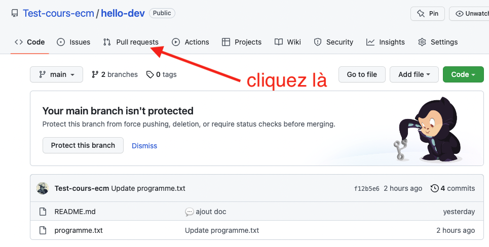
2. ce qu'on veut : 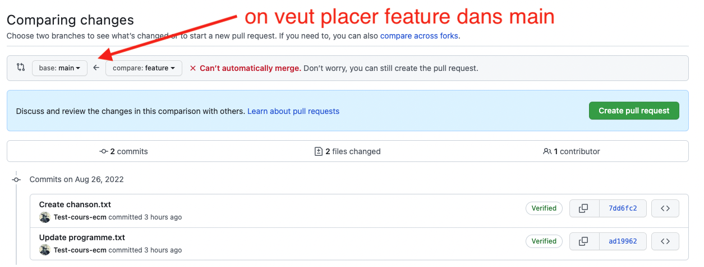
3. ce n'est pas possible de faire ça automatiquement car il y a des mélanges de lignes : 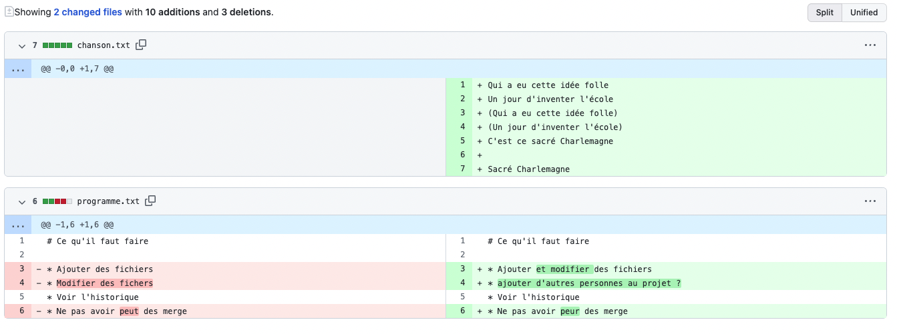 L'ajout de fichier s'est passé sans problème en revanche, git le fait tout seul.
4. On clique sur `create pull request` pour créer la requête : 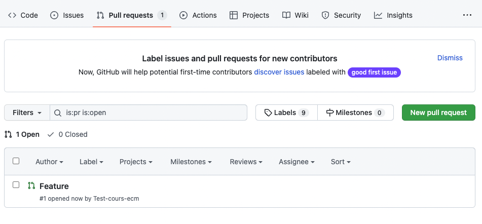
5. En cliquant sur la requête, on voit qu'elle ne peut être résolue automatiquement : 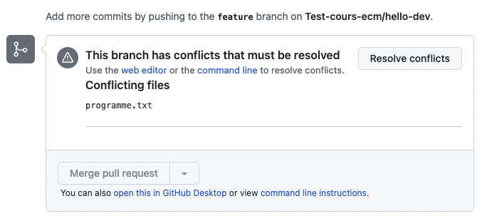
6. Qui sont dans le fichier `programme.txt`: 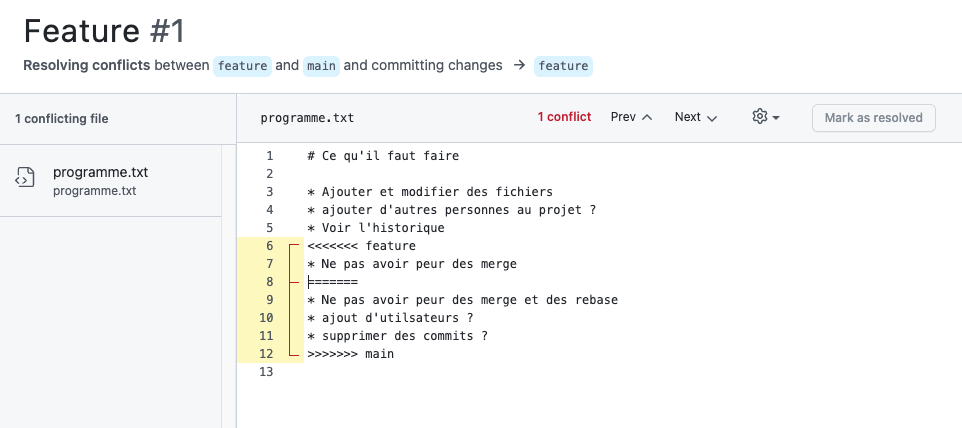
7. Chaque conflit (il peut y en avoir plusieurs par fichier) est toujours représenté comme ça :

```text
<<<<<< [nom d'une branche ou d'un commit]
[contenu de la branche]
====== autre branche
[contenu de l'autre branche]
>>>>>> [nom de l'autre branche ou de l'autre commit]
```

Résoudre un confit consiste à choisir une branche ou à faire un mélange des branches pour arriver à un texte sans les `<<<<<<`, `>>>>>>` et `=====`. Puis cliquez sur `mark as resolved`. Pour notre problème : 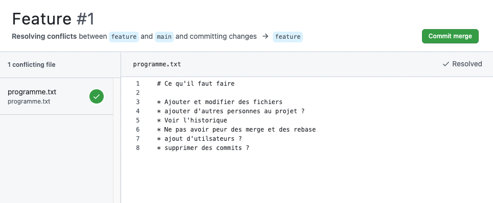

Une fois la fusion exécutée, notre graphe de dépendance est :

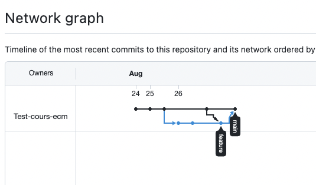

On peut alors supprimer la branche `feature` qui ne nous est plus d'aucune utilisée. On ne peut donc plus faire de commits sur cette branche, mais son existence est conservée dans l'historique :

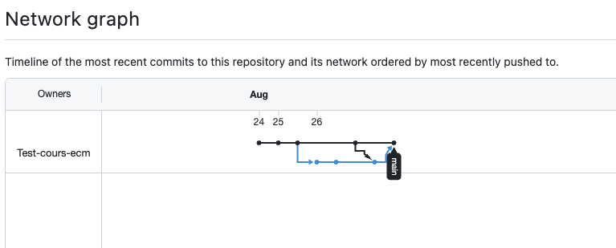

## Rebase

Pour éviter des fusions de branches inutiles et conserver un historique aussi linéaire que possible, à la place de fusionner un pull request, vous pouvez effectuer un rebase.

Pour que cela soit possible, il faut que vous modifiez les préférences de votre projet :


Puis scrollez jusqu'à la partie sur les pull request pour cocher les diverses options disponibles :



[documentation github](https://docs.github.com/en/repositories/configuring-branches-and-merges-in-your-repository/configuring-pull-request-merges/configuring-commit-rebasing-for-pull-requests)


> TBD faire un modification (demander à un élève de le faire et de prendre n screen de la modif effectuée)

Si vous cliquez sur le triangle à droite du bouton vous verrez le pop-up :

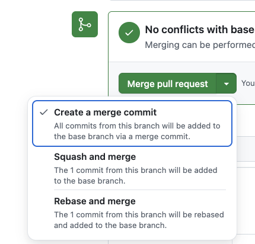

Choisissez rebase :

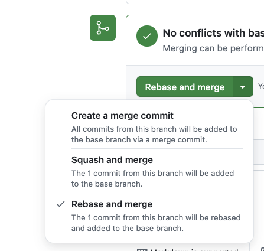

Puis appliquez la pull request. Si vous retournez dans la vision des commits et des branches, vous verrez que votre pull request a été ajouté linéairement.
