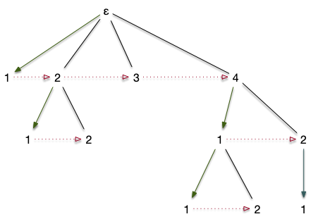
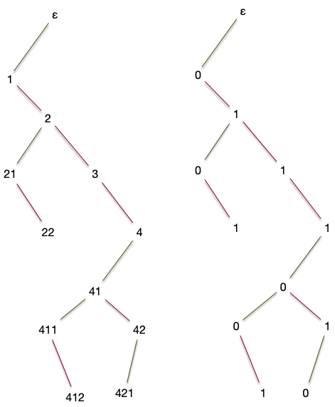
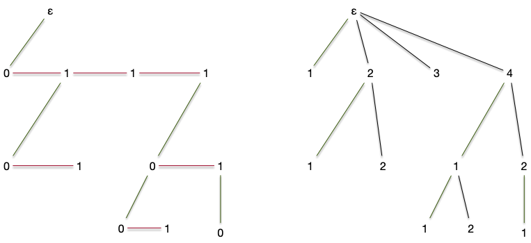
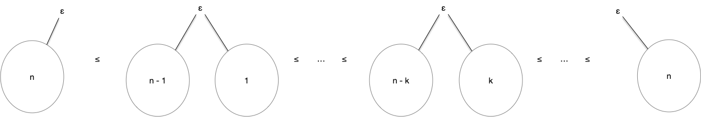

> Dit binaires. Arbre les plus utilisés en algorithmie.

> TBD définition
> Monter que c'est pas pareil que des arbres planaires binaires car si un enfant, il peut être à droite.

> TBD dessin.
> TBD definition avec les suite d'entiers. ici 0/1 Ils donnent des instructions différentes à gauche ou à droite. Utilisé souvent en algo (ex AVL)

> On connaît l'ordre gauche ou droite des enfants.
> TBD génération ensembliste recursive.
> TBD déduire de la forme sous arbre g et D la récurrence avec la somme qui permet de faire le compte normal
> TBD dire que plutôt que de résoudre cette équation, on va les calculer de 2 façons différentes qui vont nous permettre de montrer :
> 
> 1. une bijection importante 
> 2. une façon de décrire les ensemble combinatoires

## Bijection Planaire et Catalan

> fils ainé, sœur cadette.







On en déduit : qu'il y a autant d'arbres de catalan à $n$ sommets que de  :


Le nombre d'arbres de Catalan à $n$ sommets est égal au nombre de chemins de Dyck de taille $2n$ : 

<div>
$$
\frac{1}{n + 1}\binom{2n}{n}
$$
</div>


> TBD les dessiner jusqu'à 4

## Analyse combinatoire


[Analytic Combinatorics](https://algo.inria.fr/flajolet/Publications/book.pdf)


> TBD def classe combinatoire.
> TBD écrire l'equation combinatoire.


> TBD série generatrice (formelle)
> 
> ce n'est pas grave si ça n'a pas de rayon de convergence. Le but est juste de trouver les coefficients.
> si la série converge, alors les coefficients sont les même cependant (ce qu'on va faire ici)

> Trouver les coefficients.

> 

> si on veut faire "normal" : trouver un rayon de convergence. Soit par Dyck, soit directement <https://les-mathematiques.net/vanilla/discussion/795096/majorant-catalan> et pour les formules, voir : <https://www.math.univ-toulouse.fr/~schechtman/saint-criq-catalan.pdf>
> TBD attention, ça tombe aux concours.
>
> fonction génératrice pour les compter
>

## Choix aléatoire

> Ordre et on prend un nombre au hasard.
> On associe un ordre qui depend du nombre d'éléments



## Arbres binaires complet

> Def ensembliste et dessin.
> idem que catalan.
> p10 livre arbre pour l'algorithmique.
>
## arbre binaire planté

En informatique, c'est souvent les arbres binaires planté que l'on utilise :

Un arbre planté est binaire si tout nœud intérieur a **au plus 2 enfants**. On aura parfois aussi besoin qu'il soit **complet**, c'est-à-dire que les nœuds intérieurs qui n'ont pas 2 enfants sont en bas de l'arbre (à la hauteur de l'arbre -1).

### propriété fondamentale des arbres binaires



Montrer que pour un arbre binaire, si tout nœud intérieur a exactement 2 enfants, alors en notant $f$ le nombre de feuilles de l'arbre, on a : $f$ est égal au nombre de nœuds intérieurs plus 1.



Si chaque nœud intérieur a 2 enfants $ \sum \delta(x) = 2 + f + (n-f - 1) \cdot 3$. Comme $\vert E \vert = \vert V \vert -1 = n -1$, on assemble ces deux équations pour obtenir $n + 1 = 2f$.


> TBD la hauteur de l'arbre est égale à $\log_2(f)$ si les feuilles sont à h ou h-1

Les propriétés ci-dessus montrent que si l'on veut organiser $n$ données, on n'a besoin que d'un arbre de hauteur $\log_2(n)$. Comme le chemin depuis la racine nous permet de retrouver les données, si on associe une question à chaque nœud intérieur, on peut retrouver $n$ éléments en ne posant que $\log_2(n)$ questions. C'est le principe des **arbres de décisions**, si utiles en apprentissage automatique.

> La différence en $\log_2(n)$ et $n$ est très importante ! On par exemple besoin d'uniquement 100 questions pour trier 1267650600228229401496703205376 éléments.
> Un informaticien est prêt à beaucoup, beaucoup de choses pour avoir une structure en $\log_2(n)$.
> {.note}

## parcours

Pour modifier la structure du tas on a dû évoluer dans la structure d'arbre planté. Un autre intérêt (encore un !) des arbres plantés est que tout sommet peut être considéré comme la racine de sous-arbre. On a donc uniquement besoin de créer l'algorithme qui fonctionnera pour la racine et le re-exécuter ensuite sur les descendants.

On utilise ce principe pour parcourir tous les sommets d'un arbre planté efficacement, c'est à dire en ne regardant chaque sommet qu'un nombre constant de fois.

### trois parcours classiques



Pour chaque parcours ci-après, donnez le résultat pour l'arbre de la partie [ordonnancement des sommets](#ordo-sommets) en supposant que `Examen de la Racine` signifie : affiche le numéro de la racine à l'écran.

Une fois ceci fait, trouvez un ordre qui lira les sommets dans l'ordre alphabétique à partir de la lettre b (en oubliant la racine).




- pré-ordre : a-b-h-l-m-n-i-j-k-c-d-e-g-f
- post-ordre : l-n-m-h-j-k-i-b-g-e-f-d-c-a
- en-ordre : l-h-n-m-b-j-i-k-a-c-g-e-d-f

```text
alphabétique(racine)
    examen enfant gauche
    examen enfant droit
    alphabétique(enfant droit)
    alphabétique(enfant gauche)

```



#### pré-ordre

```text
pré-ordre(racine)
Si la racine existe:
    Examen de la racine
    pré-ordre(enfant gauche)
    pré-ordre(enfant droit)
```

#### post-ordre

```text
post-ordre(racine)
Si la racine existe:
    post-ordre(enfant gauche)
    post-ordre(enfant droit)
    Examen de la racine
```

#### en-ordre

```text
en-ordre(racine)
Si la racine existe:
    en-ordre(enfant gauche)
    Examen de la racine
    en-ordre(enfant droit)
```


Les [parcours d'arbres](https://fr.wikipedia.org/wiki/Arbre_syntaxique) sont utilisés en linguistique pour analyser syntaxiquement une phrase. Un exercice classique est de créer un [arbre à partir d'une expression arithmétique](https://diu-uf-bordeaux.github.io/bloc4/td/arbres/expression/) pour la résoudre de façon optimale en nombre d'opérations.

