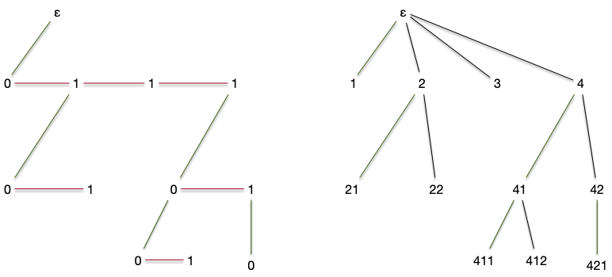

> Dit binaires.

> TBD définition
> Monter que c'est pas pareil que des arbres planaires binaires car si un enfant, il peut être à droite.

> TBD dessin

> On connaît l'ordre gauche ou droite des enfants.
> TBD génération ensembliste recursive.

## Bijection Planaire et Catalan

> fils ainé, sœur cadette.

## Compter


[Analytic Combinatorics](https://algo.inria.fr/flajolet/Publications/book.pdf)


> Nombre de Catalan
> TBD déduire de la forme sous arbre g et D la récurrence avec la somme qui permet de faire le compte normal

> Puis écrire l'equation combinatoire.
> TBD série generatrice (formelle)
> 
> ce n'est pas grave si ça n'a pas de rayon de convergence. Le but est juste de trouver les coefficients.
> si la série converge, alors les coefficients sont les même cependant (ce qu'on va faire ici)

> Trouver les coefficients.

> 

> si on veut faire "normal" : trouver un rayon de convergence. Soit par Dyck, soit directement <https://les-mathematiques.net/vanilla/discussion/795096/majorant-catalan> et pour les formules, voir : <https://www.math.univ-toulouse.fr/~schechtman/saint-criq-catalan.pdf>
> TBD attention, ça tombe aux concours.
>
> fonction génératrice pour les compter
>

## Choix aléatoire

> Ordre et on prend un nombre au hasard.
> On associe un ordre qui depend du nombre d'éléments

## Arbres binaires complet

> Def ensembliste et dessin.
> idem que catalan.
> p10 livre arbre pour l'algorithmique.
> 