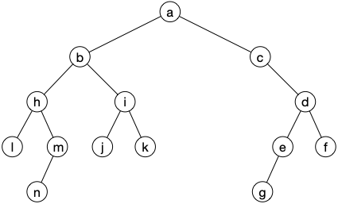

Les **_arbres de Catalan_**, aussi appelé **_arbres binaires_** sont certainement les arbres les plus utilisés en algorithmie car à la base de nombre de structure de données. Nous n'allons pas ici étudier ces structures de données (nous renvoyons le lecteur au cours d'algorithmie) mais nous intéresser à ces arbres pour eux-mêmes.

Commençons par les définir de façon visuelle : Un **_arbre de Catalan_** est un arbre où tout sommet a au plus 2 enfants, l'un à _gauche_, l'autre à _droite_ :


Notez bien que les arbres de catalan sont une **généralisation stricte** des arbres planaires où chaque nœud a au plus 2 enfants. L'exemple précédent n'est pas planaire (un nœud n'a qu'un enfant droit). Pour éviter toute confusion, considérez la définition suivante, utilisant les suites finies de `0` et de `1` (d'où l'utilisation d'arbre binaires) :


L'ensemble des suites finies de 0 et de 1 est notée $\\{0, 1\\}^\star$ :
<div>
$$
\{0, 1\}^\star \coloneqq \{ \epsilon \} \cup (\cup_{n\geq 1}\{0, 1\}^n)
$$
</div>

Avec $\epsilon$ la suite vide et $\\{0, 1\\}^n$ le produit cartésien de taille $n$ de $\\{0, 1\\}$.


Un **_arbre de Catalan_** (ou **_arbre binaire_**) $\tau$ est un sous ensemble de $\\{0, 1\\}^\star$ tel que :

- $\epsilon \in \tau$
- quelles que soient $u, v \in \\{0, 1\\}^\star$, si $uv \in \tau$ alors $u \in \tau$


Avec cette définition, les nœuds de l'arbre précédent deviennent :


Que l'on écrira souvent en abrégé, en ne gardant que le dernier élément comme pour les arbres planaires :


## Parcours


Les [parcours d'arbres de Catalan](https://fr.wikipedia.org/wiki/Arbre_syntaxique) sont utilisés en linguistique pour analyser syntaxiquement une phrase. Un exercice classique est de créer un [arbre à partir d'une expression arithmétique](https://diu-uf-bordeaux.github.io/bloc4/td/arbres/expression/) pour la résoudre de façon optimale en nombre d'opérations.


Les parcours en largeur et en profondeur des graphes peuvent s'utiliser tel quel pour les arbres de Catalan en partant de la racine (le nœud $\epsilon$) mais on a coutume d'en utiliser trois en algorithmie dont les deux premiers correspondent respectivement au parcours en largeur et en profondeur.

Ces algorithmes sont récursifs et utilisent le fait que nœud ou sous-arbre sont deux notions équivalente pour les arbres de Catalan.



Pour chaque parcours ci-après, donnez le résultat pour l'arbre ci-apres :



On suppose que `Examen de la Racine` signifie : affiche le numéro de la racine à l'écran.

Une fois ceci fait, trouvez un ordre qui lira les sommets dans l'ordre alphabétique à partir de la lettre b (en oubliant la racine).




- pré-ordre : a-b-h-l-m-n-i-j-k-c-d-e-g-f
- post-ordre : l-n-m-h-j-k-i-b-g-e-f-d-c-a
- en-ordre : l-h-n-m-b-j-i-k-a-c-g-e-d-f

```text
algorithme alphabétique(racine)
    examen enfant gauche
    examen enfant droit
    alphabétique(enfant droit)
    alphabétique(enfant gauche)

```



### pré-ordre

```text
algorithme pré-ordre(racine)
Si la racine existe:
    Examen de la racine
    pré-ordre(enfant gauche)
    pré-ordre(enfant droit)
```

### post-ordre

```text
algorithme post-ordre(racine)
Si la racine existe:
    post-ordre(enfant gauche)
    post-ordre(enfant droit)
    Examen de la racine
```

### en-ordre

```text
algorithme en-ordre(racine)
Si la racine existe:
    en-ordre(enfant gauche)
    Examen de la racine
    en-ordre(enfant droit)
```

## Bijection entre les arbres planaires et ceux de Catalan

Les arbres de Catalan sont en bijection avec de nombreuses structures combinatoires. Commençons par la plus célèbre [les arbres planaires](../arbres-planaires/){.interne}.

Montrons la bijection en action. La transformation d'un arbre planaire en arbre de Catalan :


- chaque nœud dans l'arbre planaire correspond à un nœuds dans l'arbre de Catalan
- l'enfant 0 d'un nœud dans l'arbre de Catalan correspond au premier enfant de son correspondant dans l'arbre planaire,
- l'enfant 1 d'un nœud dans l'arbre de Catalan correspond à l'enfant suivant de son père.

On appelle cette bijection : fille aînée (enfant 0), sœur cadette (enfant 1). et qui permet retrouver l'arbre planaire à partir de l'arbre de Catalan :


On en déduit qu'il y a autant d'arbres de catalan à $n$ sommets que d'arbres planaires à $n$ sommets :


Le nombre $C_n$ d'arbres de Catalan à $n$ sommets est égal au nombre [de chemins de Dyck](../arbres-planaires/#proposition-bijection-Dyck) de taille $2n$ :

<div>
$$
C_n = \frac{1}{n + 1}\binom{2n}{n}
$$
</div>


Les $C_n$ sont appelé [nombres de catalan](https://fr.wikipedia.org/wiki/Nombre_de_Catalan)


Le Catalan dont on parle est [Eugène Charles Catalan](https://fr.wikipedia.org/wiki/Eug%C3%A8ne_Charles_Catalan), mathématicien Franco-Belge, et ses nombres se retrouvent partout en combinatoire.


La figure ci-après montre les arbres de Catalan de taille 0 à 4 :


On a bien :

- $C_0 = \frac{1}{1}\binom{0}{0} = 1$ (l'arbre est vide il est dessiné mais est invisible)
- $C_1 = \frac{1}{2}\binom{2}{1} = 1$
- $C_2 = \frac{1}{3}\binom{4}{2} = 2$
- $C_3 = \frac{1}{4}\binom{6}{3} = 5$
- $C_4 = \frac{1}{5}\binom{8}{4} = 14$

## Analyse combinatoire : méthode symbolique

Nous allons maintenant montrer une méthode alternative pour calculer les valeurs de $C_n$. Cette méthode très générale permet de calculer nombre d'objets combinatoire et s'appelle méthode symbolique. Nous allons donner juste assez de matière pour pouvoir l'utiliser ici. Mais si le sujet vous intéresse, n'hésitez pas à aller jeter un coup d'œil au livre en lien ci-dessous :


[Analytic Combinatorics](https://algo.inria.fr/flajolet/Publications/book.pdf)


La méthode symbolique repose sur deux outils :

- une [série formelle](https://fr.wikipedia.org/wiki/S%C3%A9rie_formelle) représentant les éléments de l'ensemble à compter
- une équation récursive permettant de décrire l'ensemble à compter.

Pour cela, on va noter $\mathcal{C}$ des arbres de Catalan et $C_n$ le nombre d'arbres de Catalan à $n$ nœuds. La série formelle représentant ces nombres s'écrit :

<div>
$$
C(z) \coloneqq \sum_{n\geq 0}C_nz^n
$$
</div>

Une série formelle n'est **pas** [une série entière](https://fr.wikipedia.org/wiki/S%C3%A9rie_enti%C3%A8re), c'est juste un moyen de représenter la suite $(C_n)_{n\geq 0}$ : une série formelle associée à un ensemble compte les éléments par taille. En effet il est facile de voir que :

<div>
$$
C(z) = \sum_{A \in \mathcal{C}}z^{\vert A\vert}
$$
</div>

Où $\vert A\vert$ vaut la **_taille_** de l'élément $A$, le nombre de nœud pour un arbre par exemple.

L'intérêt de cette formulation pour le comptage effectif est que si on arrive à montrer l'égalité de $C(z)$ avec une série entière avec un rayon de convergence strictement positif, alors ses coefficients seront égaux aux $C_n$. Et c'est ce que l'on va faire maintenant en cherchant une équation récursive permettant de décrire $\mathcal{C}$ l'ensemble des arbres de catalan. Cette équation est facile à trouver puisque si $A \in \mathcal{C}$, alors :

- soit $A$ est l'arbre vide,
- soit $A$ est composé d'une racine, d'un arbre de Catalan (potentiellement vide) en enfant gauche et dun arbre de Catalan (potentiellement vide) en enfant droit.

On en déduit l'équation de récurrence :

<div>
$$
\mathcal{C} =  \{\epsilon\} + \mathcal{C} \times \{\bullet\} \times \mathcal{C}
$$
</div>

Où :

- $+$ est l'union disjointe d'ensembles
- $\times$ est le produit cartésien
- $\\{\epsilon\\}$ est l'ensemble contenant l'arbre vide,
- $\\{\bullet\\}$ est un ensemble contenant un unique élément, le nœud racine du (sous-) arbre.

La beauté de la méthode symbolique est que cette équation de récurrence est aussi vraie pour les séries formelles représentant ces ensembles (on admettra cette proposition).


Si $\mathcal{A}$ et $\mathcal{B}$ sont deux ensembles associées à leurs séries formelles $A(z)$ et $B(z)$, alors l'ensemble $\mathcal{A} + \mathcal{B}$ formé de l'union disjointe de $\mathcal{A}$ et $\mathcal{B}$ est associé à la série formelle $A(z) + B(z)$.



On utilise la définition $\sum_{n\geq 0}A_nz^n + \sum_{n\geq 0}B_nz^n \coloneqq \sum_{n\geq 0}(A_n + B_n)z^n$


La preuve est clair puisque la série formelle associée à l'ensemble $\mathcal{A} + \mathcal{B}$ vérifie :

<div>
$$
C(z) = \sum_{A \in \mathcal{A} + \mathcal{B}}z^{\vert A\vert} = \sum_{A \in \mathcal{A}}z^{\vert A\vert} + \sum_{B \in \mathcal{B}}z^{\vert B\vert}
$$
</div>



Si $\mathcal{A}$ et $\mathcal{B}$ sont deux ensembles associées à leurs séries formelles $A(z)$ et $B(z)$, alors l'ensemble $\mathcal{A} \times \mathcal{B}$ formé du produit cartésien de $\mathcal{A}$ et $\mathcal{B}$ est associé à la série formelle $A(z) \cdot B(z)$.



On utilise la définition $\sum_{n\geq 0}A_nz^n \times \sum_{n\geq 0}B_nz^n \coloneqq \sum_{n\geq 0}C_nz^n$ avec $C_n = \sum_{0\leq k \leq n}A_kB_{n-k}$.

Notez que cette formule est uniquement l'application aux séries formelles du [Produit de Cauchy](https://fr.wikipedia.org/wiki/Produit_de_Cauchy) pour les séries convergentes.



Soit $C(z) = \sum_{n\geq 0}C_nz^n$ la série formelle associée à l'ensemble $\mathcal{A} \times \mathcal{B}$. Comme la taille d'un élément du produit cartésien est la somme des tailles de ses parties, on a :

<div>
$$
C(z) = \sum_{A\times B \in \mathcal{A} \times \mathcal{B}}z^{\vert A\times B \vert} = \sum_{A\times B \in \mathcal{A} \times \mathcal{B}}z^{\vert A \vert + \vert B \vert} = \sum_{A\times B \in \mathcal{A} \times \mathcal{B}}z^{\vert A \vert}\cdot z^{\vert B \vert}
$$
</div>

En déduit que $C_n = \sum_{p + q = n}(A_p \cdot B_q) = \sum_{0\leq k \leq n}(A_k \cdot B_{n-k})$.



De là :

- comme il n'y a qu'un seul élément dans $\\{\epsilon\\}$ de taille 0, sa série formelle associée vaut $E(z) = 1$,
- comme il n'y a qu'un seul élément dans $\\{\bullet\\}$ de taille 1, sa série formelle associée vaut $N(z) = z$.

Et en injectant ces séries dans l'équation de récurrence (le $+$ additionne et le $\times$ multiplie les séries formelles) on obtient :

<div>
$$
C(z) = E(z) + C(z) \cdot N(z) \cdot C(z) = 1 + z \cdot C(z)^2
$$
</div>

On a déjà presque terminé. Il suffit de trouver la fonction $C(z)$ vérifiant notre égalité. Ce qui est facile puisque c'est une des deux racines du polynôme $zX^2 - X + 1$, c'est à dire :

<div>
$$
C(z) = \frac{1 \pm \sqrt{1-4z}}{2z}
$$
</div>

Comme $C(0) = C_0 = 1$ on a que (car $\frac{1 + \sqrt{1-4z}}{2z}$ tend vers $+\infty$ en $0^+$):

<div>
$$
C(z) = \frac{1 - \sqrt{1-4z}}{2z}
$$
</div>

Cette fonction se [développe en série entière](https://fr.wikipedia.org/wiki/Formulaire_de_d%C3%A9veloppements_en_s%C3%A9ries) avec de rayon de convergence de $\frac{1}{4}$ puisque $\sqrt{1+x} = \sum_{n\geq 0}\frac{(-1)^{n+1}}{2n-1}\frac{\binom{2n}{n}}{2^{2n}}x^n$ pour $x\in [-1, 1]$. Les coefficients de cette série sont égaux aux $C_n$.

On pourrait s'arrêter là puisqu'on connaît déjà la valeur des $C_n$ ($C_n = \frac{1}{n+1}\binom{2n}{n}$), mais pour la complétion, retrouvons le résultat attendu.

<div>
$$
\begin{array}{lcl}
C(z) &=& \frac{1 - \sqrt{1-4z}}{2z}\\
     &=&\frac{1}{2z}(1-\sum_{n\geq 0}\frac{(-1)^{n+1}}{2n-1}\frac{\binom{2n}{n}}{2^{2n}}(-4z)^n)\\
     &=&\frac{1}{2z}(1-\sum_{n\geq 0}\frac{(-1)^{n+1}}{2n-1}\frac{\binom{2n}{n}}{4^{n}}(-4z)^n)\\
     &=&\frac{1}{2z}(1+\sum_{n\geq 0}\frac{1}{2n-1}\binom{2n}{n}z^n)\\
     &=&\frac{1}{2z}(\sum_{n\geq 1}\frac{1}{2n-1}\binom{2n}{n}z^n)\\
     &=&\sum_{n\geq 0}\frac{1}{2(2n+1)}\binom{2n + 2}{n+1}z^{n}\\
     &=&\sum_{n\geq 0}\frac{1}{2(2n+1)}(\frac{(2n+2)(2n+1)}{(n+1)^2}\binom{2n}{n})z^{n}\\
     &=&\sum_{n\geq 0}\frac{1}{n+1}\binom{2n}{n}z^{n}\\
\end{array}
$$
</div>

Cette méthode est remarquable puisqu'on a eu besoin de rien d'autre que la définition d'un arbre de Catalan pour obtenir le résultat. Cela vaut le coût de la connaître car elle s'applique à beaucoup d'objets combinatoires.

## Choix aléatoire

Si l'on veut faire des expérimentations (par exemple mesurer des complexités en moyenne si notre structure de donnée est arborée) il faut pouvoir tirer des arbres de Catalan de manière uniforme. Une manière de faire est de les ordonner pour pouvoir tier uniformément l'index de l'élément dans l'ordre.

Pour des structures combinatoires l'usage courant est de :

1. les classer par taille
2. d'utiliser les éléments de taille strictement plus petite que $n$ pour ordonner ceux de taille $n$.

Ceci est facile avec des arbres de Catalan puisque les sous-arbres gauche et droite d'un arbre sont de tailles strictement inférieures. D'où le classement des arbres à $n + 1$ sommets :


Puis récursivement à l'intérieur de chaque classe et en utilisant l'ordre $(i, j) < (i', j')$ si $j < j'$ ou $(i < i') \land (j = j')$. On a classé les arbres selon cet ordre dans la figure représentant tous arbres de Catalan à moins de 4 sommets.

Enfin, si on connaît le nombre d'éléments dans chaque groupe on peut retrouver chaque élément grace à son indice. Par exemple, recherchons le 8ème arbre de Catalan à 4 sommets (il y en a 14)

1. il y a $C_3 = 5 < 8$ arbres de Catalan à 4 sommets ayant uniquement un enfant gauche, notre arbre n'est pas dans la première catégorie
2. il y a $C_2 \cdot C_1 = 2$ arbres de Catalan à 4 sommets ayant un enfant gauche de 2 nœuds et un enfant droit à 1 nœud. Comme $5 + 2 = 7 < 8$ notre arbre n'est pas dans cette catégorie
3. notre arbre est le 1er arbre de Catalan ayant un fils gauche à 1 nœud et un fils droit à 2 nœuds.

Le 8ème arbre de Catalan à 4 sommets est donc l'arbre suivant :


Enfin, l'ordonnancement utilisé nous donne encore une autre équation de récurrence permettant de compter les arbres de Catalan :


Le nombre $C_{n}$ d'arbres de Catalan à $n$ sommets satisfait l'équation de récursion suivante :

<div>
$$
\begin{cases}
C_0 = 1\\
C_{n+1} = \sum_{0\leq k \leq n}C_k \cdot C_{n-k}\\
\end{cases}
$$
</div>


## Arbres binaires complet


Un **_arbre de Catalan complet_** (ou **_arbre binaire complet_**) $\tau$ est :

- un arbre de catalan
- quel que soit $u \in \tau$ alors $u0 \in \tau \Leftrightarrow u1 \in \tau$


Les arbres de catalan complet forment à la fois n sous ensemble des arbres de Catalan et l'ensemble tout entier. Il est en effet possible d'associer injectivement un arbre de Catalan Complet à tout arbre de Catalan en ajoutant à chaque nœud de l'arbre de Catalan autant de feuille qu'il lui manque d'enfants :

- ajoutant une feuille à tout nœud n'ayant qu'u enfant
- ajoutant deux feuilles à tout nœud n'ayant aucun enfant


On retrouve l'arbre de Catalan initial en supprimant toutes les feuilles :


Comme un arbre de Catalan complet à $n$ nœud a $\lceil n/2 \rceil$ feuilles (cela vient du fait que tous les nœuds internes sont de degré 3 à par la racine et de [cet exercice](../définitions/#exercice-3-régulier)) on en déduit :


Le nombre d'arbre de Catalan complet à $n$ sommets est égal au nombre d'arbres de catalan à  $\lfloor n/2 \rfloor$ sommets.


Terminons cette partie en définissant la structure des arbres de Catalan complet en utilisant la méthode symbolique.

Pour cela nous avons besoin de 2 nœuds spéciaux :

- les feuilles formés par le nœud $\square$
- les nœuds internes formés par le nœud $\bullet$

L'ensemble $\mathcal{B}$ des arbres de Catalan complet peut alors s'écrire avec la formule de récurrence suivante :

<div>
$$
\mathcal{B} = \{\square \} + \mathcal{B} \times \{\bullet\}\times \mathcal{B}
$$
</div>

La série formelle $B(z) = \sum_{n\geq 0}B_nz^n$ associée à l'ensemble des arbres de Catalan complet satisfait l'équation :

<div>
$$
B(z) = z + zB(z)^2
$$
</div>

On en déduit avec le même raisonnement utilisé pour les arbres de catalan que :

<div>
$$
B(z) = \frac{1 - \sqrt{1-4z^2}}{2z}
$$
</div>

Ce qui après calcul donne :

<div>
$$
B(z) = \sum_{n\geq 0}\frac{1}{n+1}\binom{2n}{n}z^{2n + 1}
$$
</div>
