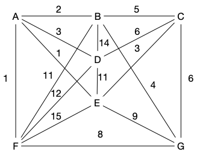

Un arbre couvrant est un sous graphe d'un graphe connexe :


Un **_arbre couvrant d'un graphe connexe_** $G=(V, E)$  est un arbre $T=(V, E')$ tel que $E' \subseteq E$.


Commencez par montrer que cette définition fait sens :


Montrer que pour tout graphe connexe $G = (V, E)$, il existe au moins un arbre $T=(V, E')$ tel que $E' \subseteq E$.



Si un graphe est connexe et n'est pas un arbre, alors il existe un cycle. En supprimant une arête de ce cycle le graphe reste connexe et a strictement moins d'arêtes. On peut alors itérativement supprimer des arêtes à un graphe connexe qui contient un cycle jusqu'à obtenir un graphe connexe à $\vert V \vert -1$ arêtes qui ne contient pas de cycles : ce sera un arbre.



Les arbres couvrant d'un graphe sont beaucoup utilisés en optimisation. Notez que si le graphe $G$ n'est pas connexe, on peut itérer l'opération pour chaque partie connexe et trouver une **_forêt couvrante d'un graphe_**.

Si [le graphe est valué](../../chemin-poids-min-problème/#graphe_valué){.interne}, on peut chercher **un** arbre couvrant de poids minimum :


Un **_arbre couvrant de poids minimum (_resp._ maximum) d'un graphe connexe valué_** $(G, f)$  est un arbre couvrant $T=(V, E')$ tel que la somme de la valuation de ses arêtes est minimum (_resp._ maximum) parti tous les arbres couvrants de $G$.


Cette définition aussi fait sens puisqu'il y a un nombre fini d'arbres couvrants différents d'un graphe connexe. Attention cependant :


Il n'y a pas unicité de l'arbre couvrant de poids minimum (_resp._ maximum) !

Si par exemple la valuation est constante, tout arbre couvrant est minimum (ils ont tous même valuation).


Le problème de la recherche d'un arbre couvrant de poids minimum est lié à bon nombre de problèmes d'optimisation. Par exemple : on suppose que vous êtes chef d'un état. Vous voulez que votre territoire soit connexe (que les gens puissent aller partout sur votre territoire), mais vous ne voulez pas payer trop cher (vous voulez être ré-élu et ça fait mauvais genre d'augmenter les impôts).

Vous demandez donc à vos conseillers de créer un graphe dont les sommets correspondant à vos villes et dont les arêtes sont valuées par le coût de construction d'une route entre ces 2 villes. Ce graphe n'a pas forcément toutes les arêtes si le coût de construction est prohibitif par exemple.

La solution la plus efficace consiste à trouver de ce graphe un arbre couvrant dont la somme des valuations est minimale parmi tous les arbres couvrant.



Pourquoi ?



Un arbre est la structure minimale en nombre d'arêtes qui garantie la connexité. Parmi tous les arbres couvrants du graphe, on peut prendre un de ceux qui ont une somme des valuations de ses arêtes minimale (il y en a un nombre fini, le min existe donc mais il peut y en avoir plusieurs). Si la valuation d'une arête représente le coût, un arbre couvrant de poids minimal représente une solution de coût minimal pour rendre connexe le territoire.


## Exemple

On considère le graphe ci-dessous :


Avec un peu d'imagination considérez que c'est le graphe de construction d'une petite île du pacifique dont vous êtes le nouveau chef d'état.



- Quel est l'arête qui sera forcément dans tous les arbres couvrants de poids minimum ?
- Quel est l'arête qui ne sera forcément jamais dans un arbre couvrant de poids minimum ?
- y a-t-il plusieurs arbres couvrants de poids minimum pour ce graphe ?




Toutes les preuves de cette partie et de la partie suivante vont fonctionner la même manière :

1. on va ajouter une arête à un arbre
2. ce nouveau graphe n'est plus un arbre mais il est connexe : il existe un cycle
3. en supprimant n'importe quelle arête de ce cycle, le graphe redevient un arbre.
4. si on supprime judicieusement l'arête du cycle, on arrivera à une contradiction. car le nouvel arbre sera mieux que l'arbre initial.

- Il n'y a qu'une seule arête avec une valuation minimale. S'il existait un arbre couvrant qui ne la possédait pas, on pourrait l'ajouter à cet arbre. Ce ne serait alors plus un arbre, il existerait donc un cycle. En supprimant une arête de ce cycle (on peut choisir une arête de valuation non minimale) on aurait à nouveau un arbre (connexe et nombre minimum d'arête), mais qui serait de valuation totale strictement plus petite que notre premier arbre. Ce qui est impossible puisqu'il était déjà de valuation minimale.
- Il n'y a qu'une seule arête avec une valuation maximale. De plus, il existe des cycles la contenant dans le graphe initial. Si on suppose qu'un arbre couvrant possède cette arête de valuation maximale et qu'on la supprime de l'arbre, on va se retrouver avec 2 parties connexes. Comme il existe un cycle contenant l'arête de valuation maximale dans le graphe initial, il va exister une arête du graphe initial qui relie les 2 parties connexes nouvellement créées. L'ajouter à notre graphe va à nouveau le rendre connexe : ce sera à nouveau un arbre. Comme il serait de valuation strictement plus petite que notre arbre initial, ce n'est pas possible.
- Oui, il existe plusieurs arbres couvrant car le cycle k-g-j-l est de valuation constante et valant 2. Un raisonnement identique aux 2 précédent montre que l'on peut échanger une arête de valuation 2 par une autre dans un arbre de valuation minimale.
  

## Propriétés

Un arbre couvrant de poids minimum d'un graphe possède de nombreuses propriétés. Démontrons en quelques unes :



Montrez que s'il existe deux arbres couvrants de poids minimum qui ne différent que d'une arête, alors elles ont même valuation.




Les 2 arbres ont même valuation de la somme des valuations de leurs arêtes :les 2 arêtes différentes ont donc forcément même valuation.



Montrez que si toutes les valuations sont différentes, il n'existe qu'un seul arbre couvrant de poids minimal.




On range les valuations des 2 arbres par ordre croissant. Les deux arbres étant différents, on s'arrête à la 1ère position dans cet ordre qui contient 2 arêtes différentes. L'une des arêtes va avoir une valuation inférieure à l'autre. On peut alors procéder comme précédemment et ajouter l'arête de valuation la plus petite dans l'autre arbre. Il faudra alors à nouveau supprimer une arête qui forme un cycle, mais on pourra enlever une arête de valuation plus grande, ce qui est impossible car l'arbre initial était de valuation minimale.



Montrez que la réciproque de l'exercice précédent n'est pas vraie.




Si le graphe de départ est un arbre, il n'y a qu'un seul arbre couvant et les valuations peuvent être égales.



Un petit exercice dont la résolution va nous aider à prouver les algorithmes de construction d'arbres de poids minimum :



Montrez que si $T_1$ et $T_2$ sont deux arbres couvrants de poids minium de $(G, f)$. Et soit $uv$ une arête de $T_1$ qui n'est pas présente dans $T_2$.

Montrez qu'il existe un arbres couvrant de poids minium $T'_2$ dont les arêtes en commun avec $T_1$ sont exactement celles de $T_2$ plus $uv$.



> TBD propriété d'échange à écrire propre.



Déduire de l'exercice précédent que si $(G, f)$ est un graphe connexe valué, le graphe $\mathcal{G}=(\mathcal{T}[G], E)$ est connexe. Avec :

- $\mathcal{T}[G]$ l'ensemble des arbres de longueur minimum de$(G, f)$,
- il existe une arête entre deux arbres s'ils ne diffèrent que d'une arête.




> TBD si $k$ différences, l'exercice précédent dit qu'il existe un alm avec $k-1$ différences
> puis on récurse.



## Algorithme de Kruskal


<https://fr.wikipedia.org/wiki/Algorithme_de_Kruskal>


> TBD Kruskal. On le fait :
> 
> 1. en ajoutant des arêtes en restant sans cycle : algo glouton. On prouve la minimalité par échange.
> 2. on optimise en montrant que c'est de la connexité. si 2 composantes connexes arbre on peut les lier et on reste arbre
> 3. on implémente çe avec des couleurs (attention à la mise à jour)
> 4. calcul de complexité $\mathcal{O}(n^2\log(n))$ s'il faut trier, et $\mathcal{O}(n^2)$ sinon. Le calcul est tricky : que n mise à jour des couleurs.

## Algorithme de Prim

> TBD algo et preuve sous la forme de propositions. Parler de glouton et faire les dessins. Glouton aussi et on grossi à chaque fois 1 unique arborescence.

Ce problème a l'air dur, mais il possède un algorithme (assez) simple pour le résoudre. L'algorithme suivant est l'algorithme de Prim (1957) :


```text
Entrée :
    - un graphe G = (V, E)
    - une valuation f qui associe un réel à toute arête de G
Algorithme :
    coût_entree(x) = +∞ pour tout sommet x
    prédécesseur(x) = x pour tout sommet x
    V' = {}, E' = {}

    on choisit un sommet r quelconque
    coût_entree(r) = 0
    ajoute r à V'
    tant que V' n'est pas V:
        pour tous les voisins x de r qui ne sont pas dans V':
            si cout_entree(x) >= f(rx):
                cout_entree(x) = f(rx)
                predecesseur(x) = r
        soit x le sommet de V qui n'est pas dans V' minimisant cout_entree(x)
        r = x
        cout_entree(r) = 0
        ajoute r à V' et {r, predecesseur(r)} à E'
    rendre T = (V', E')
```



1. Prouver que si G est connexe, alors T est connexe et est un arbre
2. Prouver que $T$ est **un arbre couvrant de poids minimal** pour $G$.
   
   
   Voir [wikipedia](https://fr.wikipedia.org/wiki/Algorithme_de_Prim). Tout y est très bien expliqué.
   

Maintenant qu'on est sur que ça marche :


Réalisez l'algorithme en entier sur le graphe précédent.




- Quelle est la différence entre Prim et Dijkstra ?
- Montrez que les problèmes qu'ils résolvent sont différents et en déduire que l'arborescence obtenue par l'algorithme de Dijkstra pour un graphe non orienté peut être différente de l'arbre de poids minimum obtenu par Prim
  
  
  Le graphe suivant montre que l'arborescence de Dijkstra sera différente de l'arbre de poids minimum donné par Prim.



Ne confondez pas les 2 problèmes !



## Exercice

Les arbres couvrant se retrouvent parfois dans des endroits inattendus et permettent de résoudre simplement des  problèmes plus complexes.

Dans un réseau de communication, on appelle **_débit_** la quantité d'information que le réseau garantit de pouvoir faire passer entre deux sommets. Dans cet exercice, le réseau est modélisé par un graphe $G = (X, E)$ connexe. Chaque arête est munie d'une bande passante (qui ici sera appelée poids), $v: E\to \mathbb{R}^+$, qui limite la quantité d'information qu'elle peut véhiculer. Le but de l'exercice est de mettre au point des algorithmes permettant de calculer le débit. Le graphe suivant va servir d'exemple. :





Montrer que si $\mathcal{C}_{xy}$ est l'ensemble des chemins entre $x$ et $y$ alors le débit entre $x$ et $y$ s'écrit :

<div>
$$
D(x, y) = \max(\{ \min(\{v(x_ix_{i+1}) \vert 0 \leq i < k\}) \vert x_0 \dots x_k \in  \mathcal{C}_{xy} \})
$$
</div>




> TBD





En déduire, à l'aide d'arguments simples, que la chaîne de débit maximum entre $A$ et $C$ pour le graphe exemple a un débit
égal à trois.




> TBD



Passons au cas général :


Soit $T$ un arbre couvrant de poids maximum d'un graphe connexe valué $(G, f)$. On appelle $T_1$ et $T_2$ les deux composantes connexes que
l'on obtient, à partir de $T$, en enlevant l'arête de poids minimum
sur la chaîne de $T$ entre $x$ et $y$. Prouver que la valuation minimale de la chaîne de $T$
joignant $x$ et $y$ vaut $D(x, y)$ pour le réseau $G$.




> TBD





Quelle méthode peut-on appliquer pour déterminer, dans
un graphe quelconque $G$, une chaîne de débit maximum entre deux
sommets quelconques de $G$ ?




> TBD arbre  unique chemin entre deux sommets
> TBD



Et retour à l'exemple pour conclure :



	Appliquer cette méthode pour déterminer une chaîne de
	débit maximum entre $B$ et $E$ dans le réseau exemple.




> TBD


