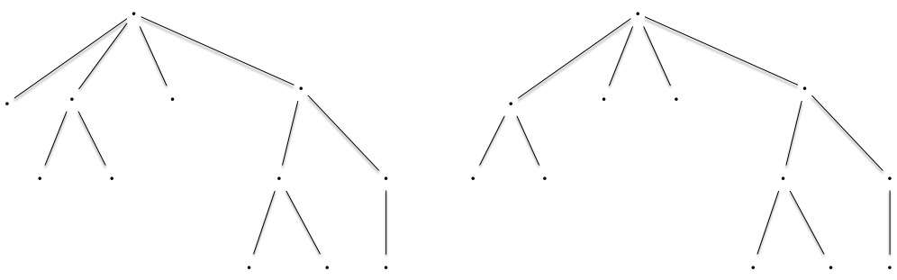
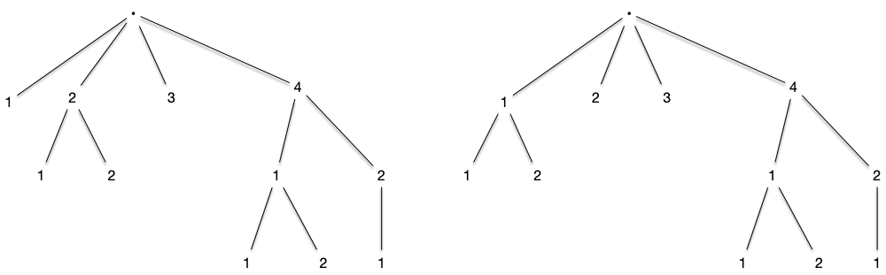
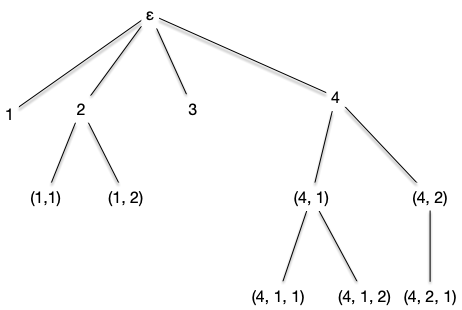
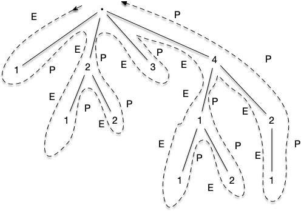
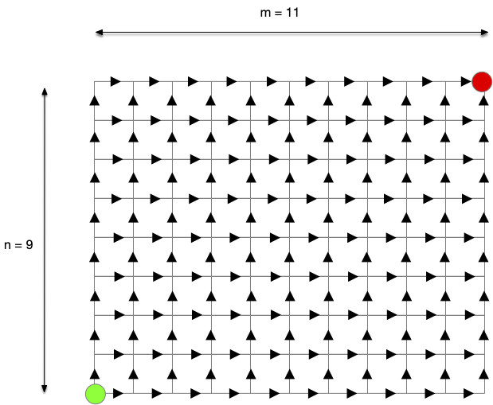
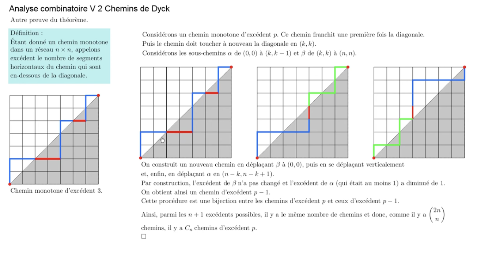
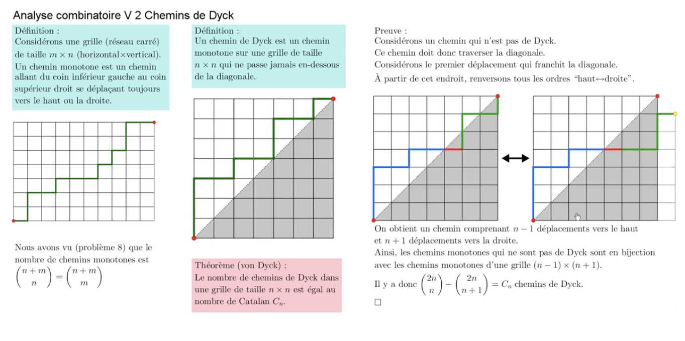

Les arbres planaires sont un cas particulier des arbres plantés où les enfants de chaque sommets sont numérotés de 1 au nombre d'enfants. On appelle ces arbres planaires car cela revient à numéroter les enfant selon leur représentation graphique. De là, les deux graphes suivant ne seront pas égaux :

Car les enfants de la racine ne sont pas placés de la même manière. En numérotant les enfants de gauche à droites, cela donnerait les deux arbres ci-après du coup vraiment différents :

Pour éviter d'avoir des nœuds avec une même numérotations et avoir une définition formelle, on encode tout le chemin :


L'ensemble des suites finies d'entiers strictement positifs ($\mathbb{N}^\star$) est noté $U$. On peut le définir tel que :

$$
U \coloneqq \{ \epsilon \} \cup \cup_{n\geq 1}(\mathbb{N}^\star)^n
$$

Avec $\epsilon$ la suite vide et $(\mathbb{N}^\star)^n = \mathbb{N}^\star \times \dots \times \mathbb{N}^\star$ le produit cartésien de taille $n$ de l'ensemble $\mathbb{N}^\star$ des entiers strictement positifs.


Un **_arbre planaire_** $\tau$ est un sous ensemble de $U$ tel que :

- $\epsilon \in \tau$
- quelles que soient $u, v \in U$, si $uv \in \tau$ alors $u \in \tau$
- quelle que soit $u \in U$, si $u \in \tau$ alors il existe $M_u(\tau) \in \mathbb{N}$ tel que si $\in  \mathbb{N}$, $ui \in \tau$ si et seulement si $1\leq i \leq M_u(\tau)$.


En clair, un arbre planaire encode un nœud avec son chemin depuis la racine, et $M_u(\tau)$ est le nombre d'enfant du nœud $u$. Sous cette forme, l'arbre de gauche précédent s'écrit :

Le nœud correspondant à la suite finie $(4, 1, 2)$ correspond au nœud qui est :

1. le quatrième enfant de la racine
2. le premier enfant du quatrième enfant de la racine
3. le deuxième enfant du premier enfant du quatrième enfant de la racine

Encoder un arbre planté de façon planaire se fait facilement avec un parcourt d'arbre.

## Planaire et mots de Dyck

Associons le parcours en profondeur parcourant les enfants dans l'ordre à un arbre planaire et notons :

- par $E$ les étapes où l'algorithme a effectué une récursion (il a examiné un nouveau sommet enfant du sommet courant)
- par $P$ les étapes où l'algorithme a terminé une récursion (il a examiné tous les enfant du sommet courant)

Pour l'arbre planaire précédent, le parcours donne :

Le mot associé est :

> un DFS. pour encoder les arbres planaires. <https://moodle1.u-bordeaux.fr/pluginfile.php/462061/mod_resource/content/0/Slides.pdf>
>
> 1. dessiner comme une montagne le graphe planaire exemple
> 2. +1, -1 ≥0 et au final 0 : chemin de dyck de longueur 2m = 2n-2 
> 3. cas particulier de mots de Dyck. Marche aussi (E(nfant suivant)/P(arent)) 
>
> aussi triangulation d'un polygone, arbres hiérarchiques, etc... <https://www.youtube.com/watch?v=fczN0BCx0xs>. Un peu le no,bre d'or des combinatoriste.

> Aussi des chemins.
> Des chemins de taxis :

aux chemins de Dyck :

<https://www.youtube.com/watch?v=Lcy5PLkHEoo>

> TBD. Ca tombe régulièrement aux concours (le mettre dans le cours S6) Trouver exam centrale PC 2011 <https://www.doc-solus.fr/prepa/sci/adc/bin/view.corrige.html?q=PC_MATHS_CENTRALE_1_2021https://www.doc-solus.fr/prepa/sci/adc/bin/view.corrige.html?q=PC_MATHS_CENTRALE_1_2021>
>
## Énumération des arbres planaires

> TBD énumération avec un Dijkstra sur arbre orienté sur demi-grille.

## Compter les chemins de Dyck

Compter dyck :

> 1/(n+1)(2n n)

> (2n n) - (2n n+1)

