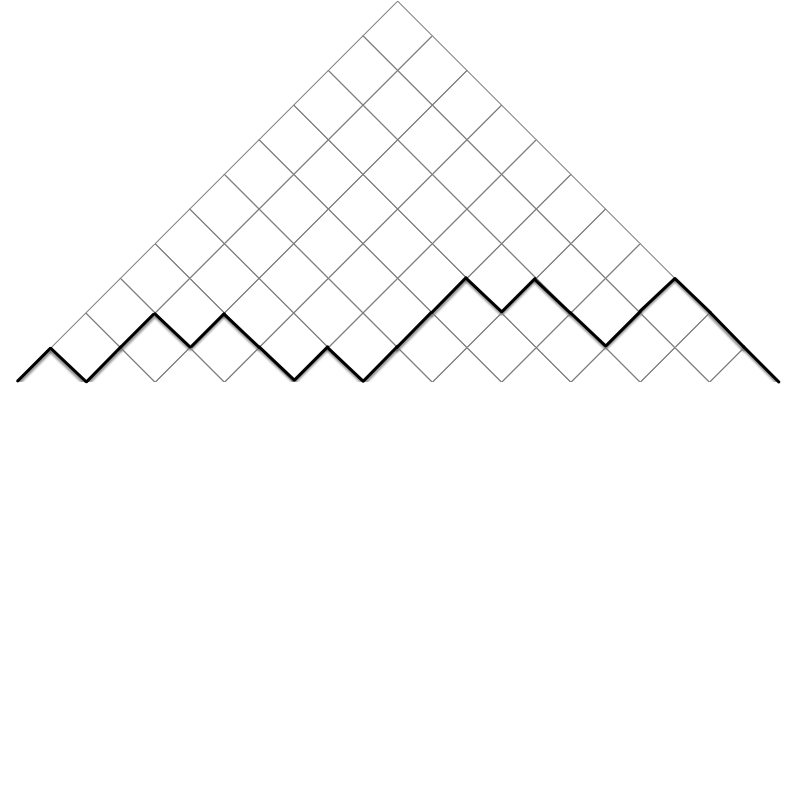
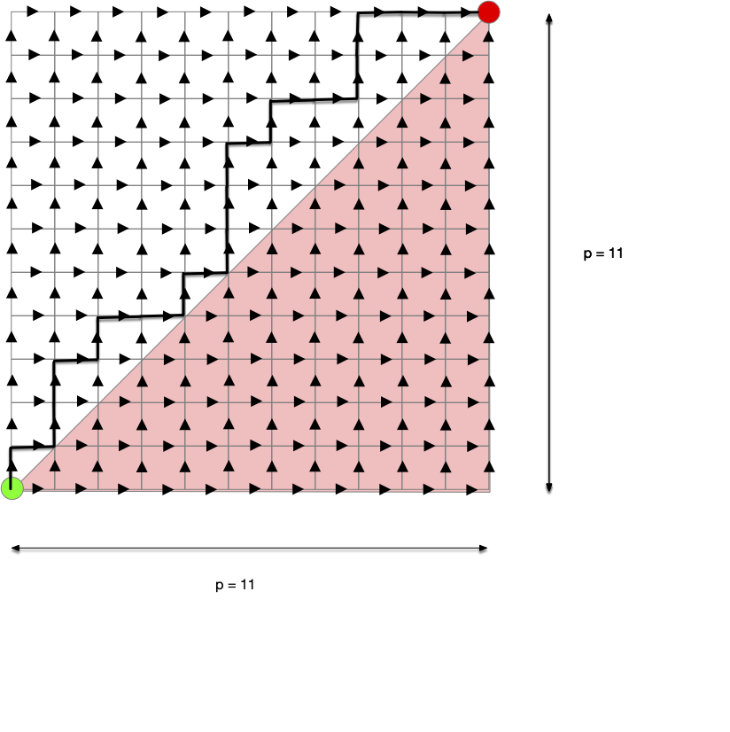
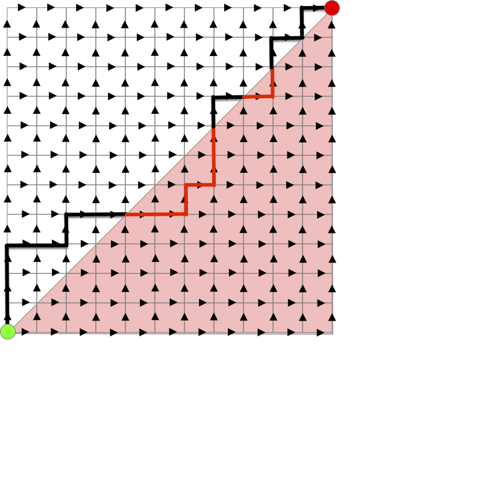
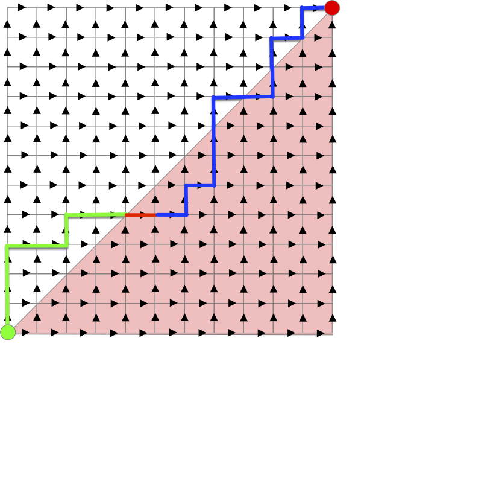
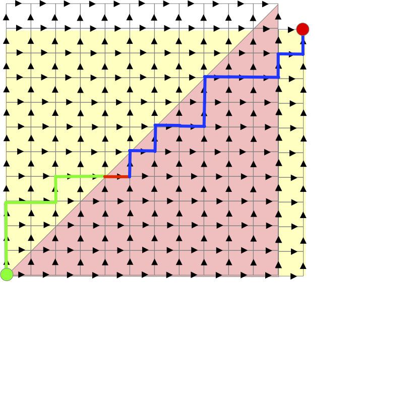
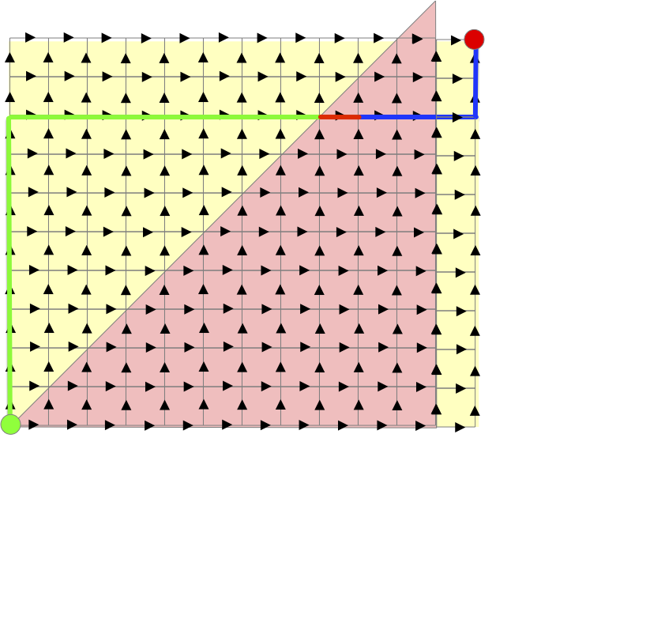
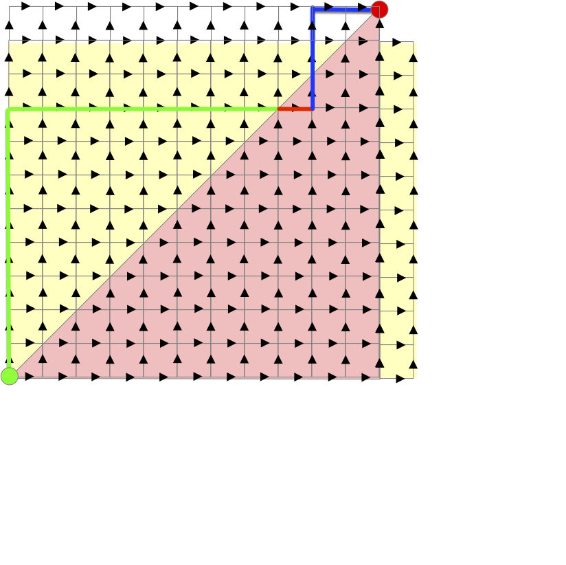
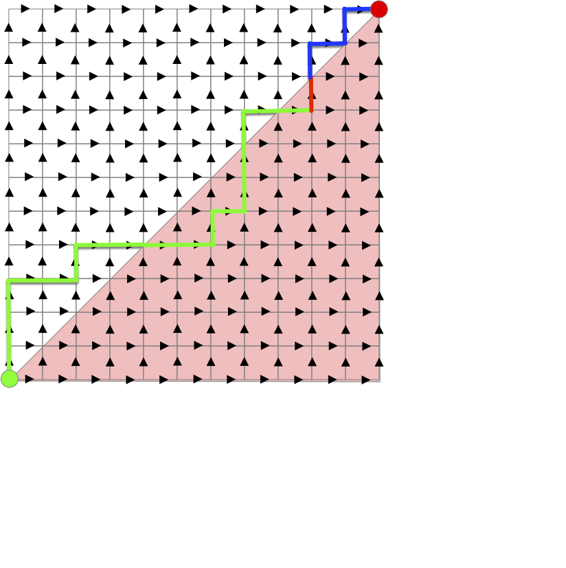
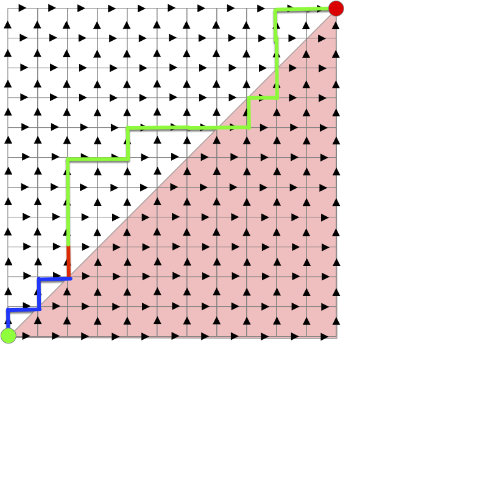

Les arbres planaires sont un cas particulier des arbres plantés où les enfants de chaque sommets sont numérotés de 1 au nombre d'enfants. On appelle ces arbres planaires car cela revient à numéroter les enfant selon leur représentation graphique. De là, les deux graphes suivant ne seront pas égaux :


Car les enfants de la racine ne sont pas placés de la même manière. En numérotant les enfants de gauche à droites, cela donnerait les deux arbres ci-après du coup vraiment différents :


Pour éviter d'avoir des nœuds avec une même numérotations et avoir une définition formelle, on encode tout le chemin :


L'ensemble des suites finies d'entiers strictement positifs ($\mathbb{N}^\star$) est noté $U$. On peut le définir tel que :

<div>
$$
U \coloneqq \{ \epsilon \} \cup \cup_{n\geq 1}(\mathbb{N}^\star)^n
$$
</div>

Avec $\epsilon$ la suite vide et $(\mathbb{N}^\star)^n = \mathbb{N}^\star \times \dots \times \mathbb{N}^\star$ le produit cartésien de taille $n$ de l'ensemble $\mathbb{N}^\star$ des entiers strictement positifs.


Un **_arbre planaire_** $\tau$ est un sous ensemble de $U$ tel que :

- $\epsilon \in \tau$
- quelles que soient $u, v \in U$, si $uv \in \tau$ alors $u \in \tau$
- quelle que soit $u \in U$, si $u \in \tau$ alors il existe $M_u(\tau) \in \mathbb{N}$ tel que si $\in  \mathbb{N}$, $ui \in \tau$ si et seulement si $1\leq i \leq M_u(\tau)$.


En clair, un arbre planaire encode un nœud avec son chemin depuis la racine, et $M_u(\tau)$ est le nombre d'enfant du nœud $u$. Sous cette forme, l'arbre de gauche précédent s'écrit :


Le nœud correspondant à la suite finie $(4, 1, 2)$ correspond au nœud qui est :

1. le quatrième enfant de la racine
2. le premier enfant du quatrième enfant de la racine
3. le deuxième enfant du premier enfant du quatrième enfant de la racine

Encoder un arbre planté de façon planaire se fait facilement avec un parcourt d'arbre.

## Planaire et mots de Dyck

Associons le parcours en profondeur parcourant les enfants dans l'ordre à un arbre planaire et notons :

- par $E$ les étapes où l'algorithme a effectué une récursion (il a examiné un nouveau sommet enfant du sommet courant)
- par $P$ les étapes où l'algorithme a terminé une récursion (il a examiné tous les enfant du sommet courant)

Pour l'arbre planaire précédent, le parcours donne :


Le mot associé est :

```
EPEEPEPPEPEEEPEPPEEPPP
```

Remarquez qu'il permet de retrouver notre arbre initial en suivant le parcours comme sur la figure.

De plus :

1. le mot commence par `E`
2. il y a autant de `E` que de `P` dans le mot
3. Il y a toujours plus de `E` que de `P` pour les $k$ premières lettres (quelque soit $k$) du mot

Les deux remarques sont fondamentales, puisque tout mot ayant les 2 propriétés précédente permet de décrire un arbre planté. En effet, par récurrence sur la taille paire (puisqu'il y a autant de `E` que de `P`) du mot. En prenant un mot $m$ de taille $2n$ satisfaisant les 2 conditions, il suffit de supprimer de celui-ci la première occurrence du mot `EP` (disons que cet occurrence était à la position $k$ du mot) pour obtenir un mot $m'$ de taille $2(n-1)$ satisfaisant les conditions. Ce mot encode un arbre planté er le `EP` que l'on a supprimé correspond au premier enfant du $k$ descendant le plus à gauche de la racine.

On en déduit que ces mots de tailles $2p$ forment une bijection avec les arbres plantés à $p+1$ sommets. On se convaincra aisément que l'on peut aussi les décrire comme suit :


On appelle **_mot de [Dyck](https://fr.wikipedia.org/wiki/Walther_von_Dyck)_** une suite finie $(u_i)_{1\leq i \leq 2p}$ de longueur $2p$ telle que :

- $u_i \in \\{-1, 1\\}$ pour tout $1\leq i \leq 2p$
- $\sum_{1\leq i \leq k} u_i \geq 0$ pour tout $1\leq k \leq 2p$
- $\sum_{1\leq i \leq 2p} u_i = 0$


On en déduit notre première caractérisation des arbres planaires :


L'ensemble des mots de Dyck est en bijection avec l'ensemble des arbres plantés


Clair en remplaçant $+1$ par `E` et $-1$ par `P`.


Un façon commode de représenter un mot de Dyck est le profil de montagne. On se place sur une grille triangulaire et on monte avec un $+1$ et on descent avec un $-1$. Le mot de l'arbre planté précédent correspond au profil :



Le profil s'inscrit dans une demi-grille $p \times p$ si le mot est de longueur $2p$.

De là, un chemin de Dyck de longueur $2p$ est [un chemin de taxi](../../projet-chemin-de-taxi/){.interne} sur une grille carrée de longueur $p \times p$ restant au-dessus de la diagonale :



## Énumération des arbres planaires

> TBD énumération des chemins sur une demi-grille. Comme on a fait dans les chemins de taxis

## Compter les chemins de Dyck


[Compter les chemins de Dyck](https://www.youtube.com/watch?v=Lcy5PLkHEoo&list=PLmoTCYjMFPpSK1Hmew6nR1PgPueYVEUyw&index=21)


On va compter les chemins de Dyck de deux façons différentes. Elles vont nous donner deux formules égales (mais dont l'égalité n'est pas triviales à démontrer) et deux jolies démonstrations.

### Calcul par soustraction

Prenons un chemin de taxi de taille $(p, p)$ qui n'est pas un chemin de Dyck :



Il contient forcément des chemins dans la demi-grille inférieure, ici en rouge. Prenons le premier tronçon du chemin qui passe sous la diagonale, il est forcément horizontal, et séparons le chemin en 3 :

- le début (en vert)
- le premier tronçon horizontal dans la demi-grille inférieure (en rouge)
- la fin du trajet (en bleu)



L'astuce consiste maintenant à construire le chemin :

- qui commence avec le chemin vert
- continue par le premier tronçon horizontal dans la demi-grille inférieure (en rouge)
- termine avec le complémentaire du chemin bleu (lorsque le chemin bleu monte le complémentaire va a droite et réciproquement)

Comme le chemin bleu commence juste en-dessous de la diagonale et termine en $(p, p)$, ce nouveau chemin est un chemin de taxi de taille $(p-1, p+1)$ :



Réciproquement, tout chemin de taxi de taille $(p-1, p+1)$ va forcément passer sous la diagonale :



Et on peut le transformer, en suivant la même procédure, en un chemin de taxi de $(p, p)$ qui n'est pas de Dyck :



On en conclut qu'il existe exactement $\binom{(p-1) + (p+1)}{p-1}$ chemin de taxi de $(p, p)$ qui ne sont pas de Dyck et comme il y a $\binom{(p) + (p)}{p}$ chemin de taxis de taille $(p, p)$ :


Il y a Exactement $\binom{2p}{p} - \binom{2p}{p-1}$ chemin de Dyck de taille $2p$


Et donc :


Il y a Exactement $\binom{2p}{p} - \binom{2p}{p-1}$ arbres planaires à $p + 1$ sommets


### Calcul par bijections

Cet autre calcul du nombre de chemins de Dyck va séparer tous les chemin de taxis de taille $(p, p)$ en classes de même taille.

On note $C_k$ le nombre de chemin de taxi de $(p, p)$ ayant $k$ chemin horizontaux sous la diagonale. Par exemple le chemin suivant est dans $C_3$ :


Comme le premier tronçon sous la diagonale d'un chemin de taxi de taille $(p, p)$ est forcément horizontal,  les chemins de Dyck sont exactement les chemins de $C_0$.

Prenons un chemin de $C_i$ avec $i>0$ et prenons le dernier tronçon sous la diagonale de celui-ci. Ce tronçon est forcément vertical :



On peut alors séparer ce chemin en 3 :

- le début (en vert)
- le dernier tronçon vertical dans la demi-grille inférieure (en rouge)
- la fin du trajet (en bleu)

Comme la fn de trajet commence et fini sur la diagonale, le chemin constitué :

- commençant par le chemin bleu
- puis ayant un tronçon vertical (rouge)
- et finissant par le chemin vert

Sera un chemin de taxi de $(p, p)$ :



Et il sera dans $C_{i-1}$ puisque le premier tronçon horizontal sous la diagonal du chemin initial est maintenant au-dessus de la diagonale.

Cette procédure permet d'associer tout chemin de $C_i$ à un unique chemin de $C_{i-1}$ (et réciproquement) : il y a autant de chemin de $C_i$ que de chemin de $C_{i-1}$. Comme $0\leq i \leq p$, que leur somme fait l'ensemble des $\binom{2p}{p}$ chemins de taxi de $(p, p)$ et que $C_0$ est exactement l'ensemble des chemins de Dyck, on en conclut :


Il y a Exactement $\frac{1}{p+1}\binom{2p}{p}$ chemin de Dyck de taille $2p$


Et donc :


Il y a Exactement $\frac{1}{p+1}\binom{2p}{p}$ arbres planaires à $p + 1$ sommets

