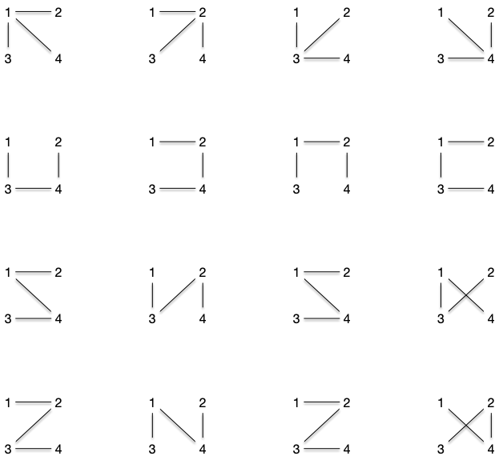
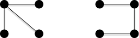
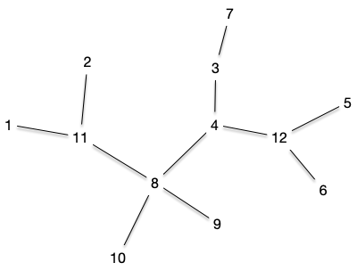
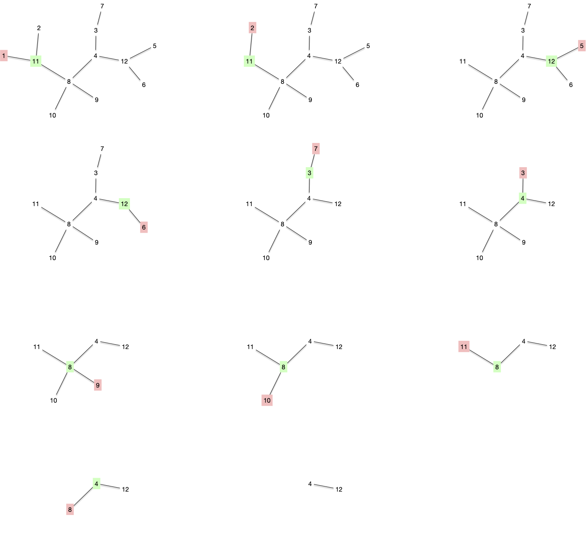
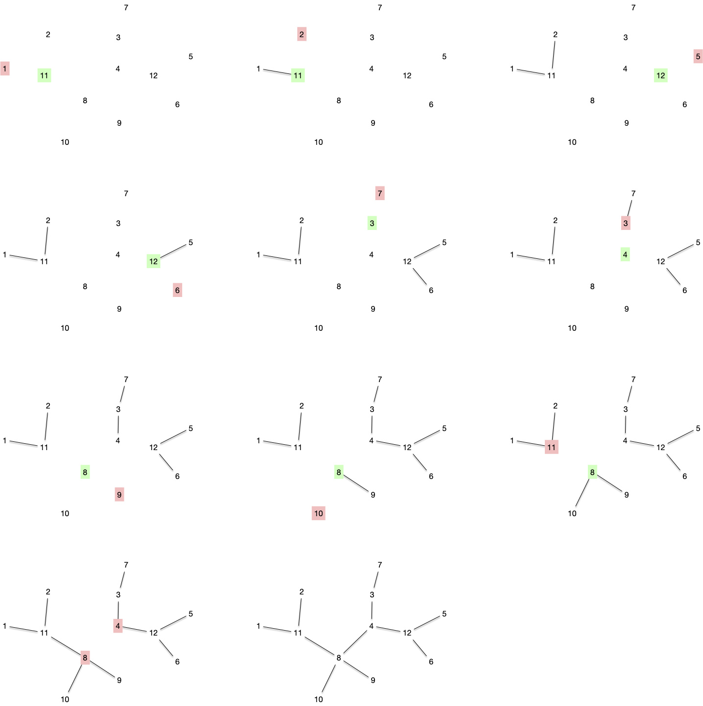

[La formule de Cayley](https://fr.wikipedia.org/wiki/Formule_de_Cayley) donne le nombre d'arbre différents que l'on peut faire à partir d'un ensemble $n$ de sommets donné :


Le nombre d'arbre que l'opn peut former avec un ensemble $V$ de $n$ sommets donné est $n^{n-2}$



Via le code de Prüfer que l'on verra juste après qui est une bijection.


Par exemple, pour les 4 sommets $\\{1, 2, 3, 4\\}$, il y a 16 arbres différents :



Attention, ceci n'est le nombre de formes d'arbres différents à 4 sommets, c'est à dire les différents classes d'équivalences des isomorphismes d'arbres à 4 sommets. Il n'y en a en effet que 2, [un chemin](https://fr.wikipedia.org/wiki/Graphe_chemin) et [une étoile](https://fr.wikipedia.org/wiki/Graphe_%C3%A9toile) :



## Code de Prüfer


[Codage de Prüfer](https://fr.wikipedia.org/wiki/Codage_de_Pr%C3%BCfer)


Le codage de Prüfer s'applique à un arbre dont les $n$ sommets peuvent s'ordonner totalement : lorsque les sommets sont des entiers par exemple.

### Codage


Soit $T = (V, E)$ un arbre dont les $n$ sommets peuvent être totalement ordonnés. Le code de Prüfer de $T$ est une liste $L$ de $n-2$ sommets construite selon l'algorithme suivant :

```python
L  = []
tant que |V| > 2:
    soit x la plus petite feuille de T et xy son arête
    ajoute y à la fin de L
    supprime x de T

rendre L
```



En utilisant l'arbre suivant :



Le code de Prüfer est : $[11, 11, 12, 12, 3, 4, 8, 8, 8, 4]$ et correspond à la décomposition suivante :



Notez que par construction on clairement a la propriété suivante :


Le code de Prüfer associé à un arbre donné est unique.


On supprime à chaque fois une feuille d'un arbre, ce qui fait que :

- il y a une unique arête à considérer : le sommet $y$ à ajouter à $L$ est unique,
- le graphe suivant est toujours un arbre.


De plus :


Soit $T = (V, E)$ un arbre dont les $n$ sommets peuvent être totalement ordonnés et $L$ son code de Prüfer associé. Si $x$ est la plus petite de ses feuilles, le code de Prüfer de $T\backslash \\{x \\}$ vaut $L$ privé de son premier élément.


Clair.


Enfin :


Chaque sommet d'un arbre apparaît un nombre de fois égal à son degré moins 1.


Comme après chaque itération le graphe considéré est un arbre, on peut facilement prouver la propriété par récurrence. La propriété est évidemment vraie pour un arbre à 2 sommets, supposons la vraie pour un arbre à $n$ sommets.
Soit $T = (V, E)$ un arbre à $n+1$ sommets et $x$ la plus petite de ses feuilles et $xy$ son unique arête :

- $x$ n'apparaît pas dans $L$
- dans $T\backslash \\{x \\}$, le degré de $y$ est diminué de 1
- les sommets de $T\backslash \\{x \\}$ différent de $y$ ont même degré que dans $T$

Comme le code de Prüfer de $T\backslash \\{x \\}$ vaut $L$ privé de son premier élément ($y$) et qu'il satisfait l'hypothèse de récurrence :

- $y$ apparaît un nombre de fois égal à son degré dans $T$ moins 2 dans le code de $T\backslash \\{x \\}$ et donc apparaît son degré dans $T$ moins 1 dans le code de $T$
- les autres sommets ont même degrés dans $T\backslash \\{x \\}$ et $T$ et donc apparaissent leurs degrés dans $T$ moins 1 dans le code de $T$.


### Décodage


$V$ un ensemble de $n$ éléments pouvant être totalement ordonnés. et $L$ une suite de $n-2$ éléments de $V$. On associe un arbre $T=(V, E)$ à $L$ en suivant l'algorithme suivant :

```python
E = ø
tant que L est non vide:
    soit x le plus petit élément de V qui n'est pas dans L
    soit y le premier élément de L
    ajoute l'arête xy à E
    supprime x de V
    supprime le premier élément de L

soient x et y les deux derniers éléments de V
ajoute l'arête xy à E

rendre E
```



Procédons au décodage de notre code précédent $L=[11, 11, 12, 12, 3, 4, 8, 8, 8, 4]$ pour l'ensemble $V = \\{1,\dots, 12\\}$

 On va obtenir les graphes suivants :



On retrouve bien l'arbre original ! Mais avant de montrer que ce code est bijectif, montrons déjà que l'on retrouve bien un arbre :


Le graphe associé au décodage de $L$ pour l'ensemble $V$ est un arbre



La propriété est clairement vraie si $V$ possède 2 éléments ($L$ est vide). On suppose la propriété vraie pour un ensemble à $V$ à $n$ éléments et on considère un code $L$ associé à un ensemble $V$ de $n+1$ éléments.

Après la première itération on est face à un un ensemble $V\backslash \\{x\\}$ et un code $L'$ ($L$ privé de son premier élément) sur lui. Par hypothèse de récurrence, ceci va produire un arbre sur $V\backslash \\{x\\}$ et comme ajouter une feuille à un arbre reste un arbre, la récurrence est terminée.



### Codage et décodage

On peut maintenant terminer cette partie en montrant que codage puis décodage est l'identité.


Soit $T = (V, E)$ un arbre dont les $n$ sommets peuvent être totalement ordonnés, $L$ son code de Prüfer associé et $T' = (V, E')$ l'arbre recodé.

On a $T = T'$.



Il est facile de voir que la première arête recodée est la première arête supprimée en codant. Une récurrence immédiate permet alors de conclure que les deux arbres sont identiques.



Le fait que le codage/recodage de Prüfer soit une bijection montre que le nombre d'arbres que l'on peut créer à partir d'un ensemble $V$ à $n$ éléments correspond au nombre de choix de $n-2$ éléments parmi $n$ avec remise, c'est à dire $n^{n-2}$.

## Tirage aléatoire d'un arbre

Trouver un arbre aléatoire d'un ensemble $V$ à $n$ éléments revient à tirer avec remise $n-2$ fois parmi son ensemble de sommets.


On tire aléatoire un arbre à $V$ fixé, **pas** une forme d'arbre.

