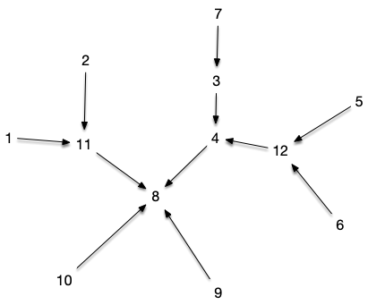

La proposition précédente est renforcée par le fait que trouver les chemins d'un sommet à tous les autres avec un arbre est très facile : il suffit de faire un parcourt (largeur ou profondeur) pour trouver en $\mathcal{O}(|E|) = \mathcal{O}(|V|)$ opérations l'ensemble des chemins en "remontant"

On appelle ceci le codage par parent. Formalisons le avec un BFS. On associe à chaque sommet son parent, c'est à dire celui qui l'a fait rentrer dans la structure. L'arbre suivant résulte d'un BFS en 8 :

Pour trouver le chemin entre 5 et 7 on remonte jusqu'au départ du BFS, ici 8 :

- `5 → 12 → 4 → 8`
- `7 → 3 → 4 → 8`

On marque les sommet parcouru avec le premier chemin et on s'arrête au premier sommet marqué en parcourant le second chemin. Dans notre cas le premier sommet de la chaîne `5 → 12 → 4 → 8`  présent dans la seconde chaîne est 4. Le chemin entre 5 et 7 est alors la combinaison des deux chemins : $[5, 12, 4, 3, 7]$.

La complexité est de $\mathcal{O}(n)$ puisqu'au pire on remonte à la racine 2 fois. Ceci peut être long si le chemin final est tout petit (comme le chemin $[5, 12, 6]$). La solution est de remonter les 2 chemin en même temps d'un sommet itérativement et de s'arrêter au premier sommet marqué par l'un ou l'autre. Par exemple le chemin entre 7 et 12 :

1. on remonte d'un cran pour les deux chemins :
   1. on commence par `7 → 3` et on marque 3
   2. puis `12 → 4` et on marque 4
2. on continue :
   1. `4 → 8` : on parque 8
   2. `3 → 4` : on retombe sur un sommet marqué

Au total on a parcouru au pire 2 fois la longueur du chemin. Notre algorithme est maintenant optimal.
