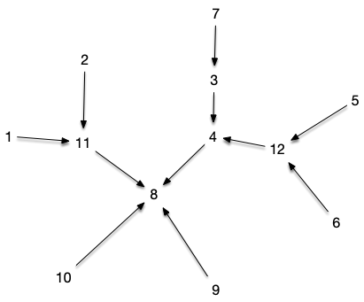

Explorer les propriétés et l'intérêt de l'arbre.


Un **_arbre_** est un _graphe_ $T = (V, E)$ qui est :

- [connexe](../../chemins-cycles-connexite/#définition-connexe){.interne}
- [sans cycle](../../chemins-cycles-connexite/#définition-cycle){.interne}



Par exemple, même si les deux graphes ci-dessous sont connexes, seul le graphe de droite est un arbre.

| :-: | :-: |
|||
|A|B|

Finissons cette partie par une définissions filant la métaphore botaniste :


Un _graphe_ dont chaque partie connexe est un arbre est appelée une **_forêt_**.



## Propriétés fondamentales

Nous allons montrer ici 5 propriétés équivalentes permettant de caractériser un arbre. Les propriétés sont intéressantes et la façon de les prouver également.

Commençons par une borne max sur les cycles :


Tout graphe sans cycle contient au maximum $\vert V \vert - 1$ arêtes.


On suppose qu'il existe un graphe $G= (V, E)$, tel que $\vert E \vert \geq \vert V \vert$ et qu'il n'y ait pas de cycles.

Commençons par remarquer que si $\vert E \vert \geq \vert V \vert$, alors forcément $\vert V \vert \geq 3$ et s'il n'a pas de cycle alors $\vert V \vert > 3$. De là, on peut choisir $G$ avec le plus petit nombre de sommets possible.

S'il existait dans ce graphe un sommet de degré plus petit ou égal à 1, on pourrait le supprimer du graphe et on aurait un graphe $G' = (V', E')$ avec strictement moins de sommets que $G$, tel que $\vert E' \vert \geq \vert V' \vert$ et qui ne contiendrait pas de cycle (on ne peut pas ajouter de cycle en supprimant une arête ou un sommet à un graphe). Ce qui est impossible par choix de $G$.

Donc tout sommet de $G$ a un degré d'au moins 2 et il existe un cycle ([c'est une propriété qu'on a vu](../../chemins-cycles-connexite#prop-cycles-graphe){.interne}) : notre hypothèse était fausse.


Continuons par une borne min sur la connexité :


Tout graphe connexe contient au minimum $\vert V \vert - 1$ arêtes.



Par récurrence. La propriété est clairement vraie pour un graphe à 1 ou 2 sommets. On la suppose alors vraie jusqu'à $n$ sommets et on considère un graphe connexe à $n+1$ sommets.

Pour ce graphe on choisi un sommet, $x$, que l'on supprime du graphe. Ce dernier possède $1 \leq p \leq \delta(x)$ composantes connexes qui respectent l'hypothèse de récurrence : $\vert E_i \vert \geq \vert V_i \vert -1$ pour chacune d'elles. En sommant le tout on a alors :

$$\sum \vert E_i \vert \geq \sum (\vert V_i \vert -1)$$

On conclut en remarquant que $\sum \vert E_i \vert = \vert E \vert - \delta(x) \leq \vert E \vert - p$ et $\sum \vert V_i \vert = V - 1$.





Montrez que la proposition précédente permet de créer un algorithme en $\mathcal{O}(\vert V \vert)$ pour savoir si un graphe $G=(V, E)$ est un arbre.




On commence par vérifier que le graphe a $\vert V \vert -1$ arêtes. Si c'est le cas, on utilise l'algorithme de recherche des composantes connexes qui est en $\mathcal{O}(\vert E \vert)$, donc en $\mathcal{O}(\vert V \vert)$ dans notre cas pour vérifier qu'il n'y a bien qu'une composante connexe.



Les deux propositions précédentes permettent de démontrer les cinq caractérisations des arbres :


Les cinq propositions suivantes sont équivalentes :

1. $G=(V, E)$ est un arbre
2. $G=(V, E)$ est connexe et $\vert E \vert = \vert V \vert - 1$
3. $G=(V, E)$ est sans cycle et $\vert E \vert = \vert V \vert - 1$
4. $G=(V, E)$ est sans cycle et l'ajout d'une arête quelconque crée un cycle
5. $G=(V, E)$ est connexe et la suppression d'une arête quelconque le déconnecte




Clair avec les deux propositions précédentes.


Le théorème précédent est important car il montre l'optimalité d'un arbre : c'est le graphe avec un nombre minimum d'arête qui est connexe. C'est pourquoi cette structure est très utilisé dans les problèmes de réseaux réels. Cette optimalité vient avec un coût puisque si une arête casse, on déconnecte le graphe.

De plus, cette optimalité minimale fait que nombre de problèmes compliqués (voir NP-complets) deviennent facile (polynomial et souvent linéaire) sur les arbres.

## Sommets et feuilles


Une **_feuille_** d'un arbre $T = (V, E)$ est un sommet de degré 1. Un **_sommet interne_** est un sommet de degré strictement supérieur à 1.


Commençons par une propriété sympathique des feuilles d'un arbre :


Tout arbre avec 3 sommets ou plus possède toujours :

- au moins 2 feuilles
- au moins un sommet interne.



Comme un arbre est connexe, tout sommet a un degré supérieur ou égal à 1.
S'il y avait 1 feuille ou moins, on aurait $\sum\delta(x) \geq 2(n-1) + 1 = 2n-1$. Or $\sum\delta(x) = 2\vert E \vert = 2n-2$, ce qui est impossible.

Enfin, si un arbre ne possédait que des feuilles, on aurait $\sum\delta(x) = n = 2\vert E \vert = 2n-2$, ce qui n'est possible que pour $n=2$.


Pour se familiariser avec les feuilles, commençons par résoudre l'exercice suivant :



Montrez que si $T = (V, E)$ est un arbre tel que tout sommet interne est de degré 3 (on appelle ces arbres **_ternaire_**) alors si $p$ est le nombre de ses feuilles et $q$ le nombre de ses sommets internes on a :

- $p = q + 2$
- $\vert V \vert = 2p-2$
- $\vert E \vert = 2p-3$




Si on note $p$ le nombre de feuilles et $q$ le nombre de sommets intérieur, on a : $\vert V \vert = p + q = \vert E \vert +1 $. De là si $p = q + 2$ on a bien $\vert V \vert = 2p-2$ et $\vert E \vert = 2p-3$.

Comme la somme des degrés $p + 3q$ vaut 2 fois le nombre d'arête, donc $\vert E \vert = 1/2 \cdot (p+3q) = p + q - 1$.
On a alors $2(p+q-1) = p+3q$, ce qui donne $p = q + 2$ et termine la preuve.



Un des principal intérêt des feuilles est que cela permet d'associer aux arbres un **_schéma d'élimination_** aux arbres. Commençons par un petit exercice pour le voir :



Montrez que si $T = (V, E)$ est un arbre et $x\in V$ une de ses feuilles, alors $T\backslash \\{x\\}$ est un arbre.




Comme $x$ est une feuille de $T$ :

- $T\backslash \\{x\\}$ est connexe,
- $T\backslash \\{x\\}$ à $\vert V \vert - 2$ arêtes

C'est donc un arbre.


Et que se passe-t-il si on supprime un sommet interne ?



Montrez que si $T = (V, E)$ est un arbre et $x\in V$ un de ses sommets internes, alors $T\backslash \\{x\\}$ est une forêt avec $\delta_T(x) > 1$ parties connexes.




Comme le degré d'un sommet interne est strictement plus grand que 1, $T\backslash \\{x\\}$ ne peut pas être connexe (il n'a pas assez d'arête) mais chaque composante connexe ne peut avoir de cycles (sinon $T$ en aurait) : ce sont des arbres.

Le même raisonnement implique que supprimer une arête d'un arbre produit une forêt de 2 arbres. Comme on en supprime $\delta(x)$, on produit $\delta(x)$ composantes connexes (on supprime itérativement les arêtes $xy$ de la composante connexe contenant $x$).



Les deux exercices précédents nous permettent de conclure sur l'existence des **_ordres d'effeuillage_** pur tout arbre :



Pour tout arbre $T = (V, E)$, les ordres $x_1, \dots, x_n$ de ses sommets tels que $T \backslash \\{x_1, x_2, \dots x_i\\}$ est un arbre pour tout $1\leq i < \vert V \vert$ sont appelées **_ordre d'effeuillage_**.


Les ordre d'effeuillage permettent tout un tas de raisonnements par récurrence et sont a la base de nombre d'algorithmes d'arbres car ils préserve la structure de l'arbre.

Terminons cette partie par un petit exercice utilisant les feuilles et les ordres d'effeuillages.


Montrez que si $T = (V, E)$ est un arbre et $x$ un sommet :

- tout parcours DFS en partant de $x$ est un effeuillage de $T$,
- les ensembles $S(x, y) = \\{z | y \text{ est sur le chemin entre }x \text{ et } z\\}$ sont des intervalles.



Un DFS sur un arbre va s'arrêter aux feuilles. De plus il est clair que l'ordre produit par une DFS à partir de $x$ va placer les éléments de $S(x, y)$ avant $y$ en un bloc : lorsque le DFS passe par $y$ la première fois tous les éléments suivant placés dans l'ordre jusqu'à l'ajout de $y$ seront dans $S(x, y)$.

On en déduit que :

- en supprimant tous les sommets avant $y$ dans l'ordre du DFS, $y$ est une feuille,
- si $z, z' \in S(x, y)$, alors tout l'intervalle $[z, z']$ est dans $S(x, y)$



## Chemins et arbres



Un graphe est un arbre si et seulement si quels que soient deux sommets $x$ et $y$, il n'existe qu'un seul chemin entre $x$ et $y$.



Le graphe est connexe.

S'il existait 2 chemins distincts pour aller de $x$ à $y$ on se placerait au premier élément distinct et au premier élément en commun après celui-ci et on aurait un cycle.


La proposition précédente est renforcée par le fait que trouver les chemins d'un sommet à tous les autres avec un arbre est très facile : il suffit de faire un parcourt (largeur ou profondeur) pour trouver en $\mathcal{O}(|E|) = \mathcal{O}(|V|)$ opérations l'ensemble des chemins en "remontant"

On appelle ceci le codage par parent. Formalisons le avec un BFS. On associe à chaque sommet son parent, c'est à dire celui qui l'a fait rentrer dans la structure. L'arbre suivant résulte d'un BFS en 8 :

Pour trouver le chemin entre 5 et 7 on remonte jusqu'au départ du BFS, ici 8 :

- `5 → 12 → 4 → 8`
- `7 → 3 → 4 → 8`

On marque les sommet parcouru avec le premier chemin et on s'arrête au premier sommet marqué en parcourant le second chemin. Dans notre cas le premier sommet de la chaîne `5 → 12 → 4 → 8`  présent dans la seconde chaîne est 4. Le chemin entre 5 et 7 est alors la combinaison des deux chemins : $[5, 12, 4, 3, 7]$.

La complexité est de $\mathcal{O}(n)$ puisqu'au pire on remonte à la racine 2 fois. Ceci peut être long si le chemin final est tout petit (comme le chemin $[5, 12, 6]$). La solution est de remonter les 2 chemin en même temps d'un sommet itérativement et de s'arrêter au premier sommet marqué par l'un ou l'autre. Par exemple le chemin entre 7 et 12 :

1. on remonte d'un cran pour les deux chemins :
   1. on commence par `7 → 3` et on marque 3
   2. puis `12 → 4` et on marque 4
2. on continue :
   1. `4 → 8` : on parque 8
   2. `3 → 4` : on retombe sur un sommet marqué

Au total on a parcouru au pire 2 fois la longueur du chemin. Notre algorithme est maintenant optimal.

Enfin terminons cette partie par un petit exercice structurel qui introduit la notion de médiane dans les arbres :


Montrez que si $T = (V, E)$ est un arbre et $x$, $y$ et $z$ trois sommets. Il existe un unique sommet qui est à la fois sur le chemin entre $x$ et $y$, le chemin entre $x$ et $z$ et sur le chemin entre $y$ et $z$.




Se déduit de l'unicité des chemins. Considérant les chemins :

- $x = u_0 \dots u_k = y$
- $z = v_0 \dots v_l = z$

Si $u_i = v_j$ alors $u_i \dots u_k = v_j \dots v_l$ car sinon, comme $u_k = v_l - y$ il existerait un cycle dans l'arbre. Le plus petit indice $i$ et $j$ tel que $u_i = v_j$ est aussi sur le chemin entre $x$ et $z$ et on est dans la situation ci-dessous ($t$ pouvant être égal à $x$, $y$ ou $z$) :

Et $t$ est bien l'unique intersection des 3 chemins.


Cette notion d'intersection de chemins se généralise dans un type de graphes particulier appelé [graphes médians](https://fr.wikipedia.org/wiki/Graphe_m%C3%A9dian). Les[hypercubes](https://fr.wikipedia.org/wiki/Hypercube_(graphe)) en sont des exemples.
