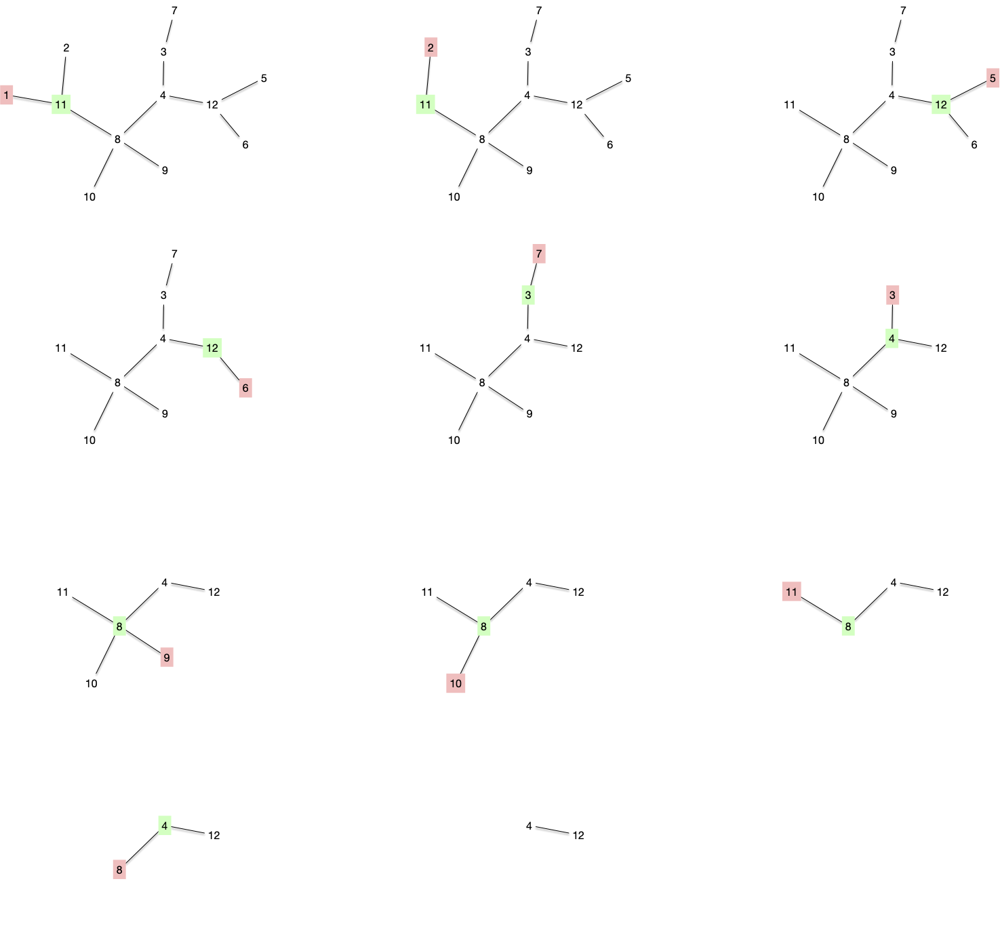

Explorer les propriétés et l'intérêt de l'arbre.


Un **_arbre_** est un _graphe_ $T = (V, E)$ qui est :

- [connexe](../chemins-cycles-connexite/#définition-connexe){.interne}
- [sans cycle](../chemins-cycles-connexite/#définition-cycle){.interne}



Par exemple, même si les deux graphes ci-dessous sont connexes, seul le graphe de droite est un arbre.

| :-: | :-: |
|||
|A|B|

Finissons cette partie par une définissions filant la métaphore botaniste :


Un _graphe_ dont chaque partie connexe est un arbre est appelée une **_forêt_**.



## Propriétés fondamentales

Nous allons montrer ici 5 propriétés équivalentes permettant de caractériser un arbre. Les propriétés sont intéressantes et la façon de les prouver également.

Commençons par une borne max sur les cycles :


Tout graphe sans cycle contient au maximum $\vert V \vert - 1$ arêtes.


On suppose alors qu'il existe un graphe $G= (V, E)$, tel que $\vert E \vert \geq \vert V \vert$ et qu'il n'y ait pas de cycles.

Commençons par remarquer que si $\vert E \vert \geq \vert V \vert$, alors forcément $\vert V \vert \geq 3$ et s'il n'a pas de cycle alors $\vert V \vert > 3$. De là, on peut choisir $G$ avec le plus petit nombre de sommets possible.

S'il existait dans ce graphe un sommet de degré plus petit ou égal à 1, on pourrait le supprimer du graphe et on aurait un graphe $G' = (V', E')$ avec strictement moins de sommets que $G$, tel que $\vert E' \vert \geq \vert V' \vert$ et qui ne contiendrait pas de cycle (on ne peut pas ajouter de cycle en supprimant une arête ou un sommet à un graphe). Ce qui est impossible par choix de $G$.

Donc tout sommet de $G$ a un degré d'au moins 2 et il existe un cycle ([c'est dans le cours](../chemins-cycles-connexite#prop-cycles-graphe){.interne}) : notre hypothèse était fausse.


Continuons par une borne min sur la connexité :


Tout graphe connexe contient au minimum $\vert V \vert - 1$ arêtes.



Par récurrence. La propriété est clairement vraie pour un graphe à 1 ou 2 sommets. On la suppose alors vraie jusqu'à $n$ sommets et on considère un graphe connexe à $n+1$ sommets.

Pour ce graphe on choisi un sommet, $x$, que l'on supprime du graphe. Ce dernier possède $1 \leq p \leq \delta(x)$ composantes connexes qui respectent l'hypothèse de récurrence : $\vert E_i \vert \geq \vert V_i \vert -1$ pour chacune d'elles. En sommant le tout on a alors :

$$\sum \vert E_i \vert \geq \sum (\vert V_i \vert -1)$$

On conclut en remarquant que $\sum \vert E_i \vert = \vert E \vert - \delta(x) \leq \vert E \vert - p$ et $\sum \vert V_i \vert = V - 1$.





La proposition précédente permet de créer un algorithme en $\mathcal{O}(\vert V \vert)$ pour savoir si un graphe $G=(V, E)$ est un arbre.




On commence par vérifier que le graphe a $\vert V \vert -1$ arêtes. Si c'est le cas, on utilise l'algorithme de recherche des composantes connexes qui est en $\mathcal{O}(\vert E \vert)$, donc en $\mathcal{O}(\vert V \vert)$ dans notre cas pour vérifier qu'il n'y a bien qu'une composante connexe.



Les deux propositions précédentes permettent de démontrer les cinq caractérisations des arbres :


Les cinq propositions suivantes sont équivalentes :

1. $G=(V, E)$ est un arbre
2. $G=(V, E)$ est connexe et $\vert E \vert = \vert V \vert - 1$
3. $G=(V, E)$ est sans cycle et $\vert E \vert = \vert V \vert - 1$
4. $G=(V, E)$ est sans cycle et l'ajout d'une arête crée un cycle
5. $G=(V, E)$ est connexe et la suppression d'une arête le déconnecte




Clair avec les deux proposition précédentes.


Le théorème précédent est important car il montre l'optimalité d'un arbre : c'est le graphe avec un nombre minimum d'arête qui est connexe. C'est pourquoi cette structure est très utilisé dans les problèmes de réseaux réels. Cette optimalité vient avec un coût puisque si une arête casse, on déconnecte le graphe.



Montrez qu'un graphe est un arbre si et seulement si quels que soient deux sommets $x$ et $y$, il n'existe qu'un seul chemin entre $x$ et $y$.



Le graphe est connexe.

S'il existait 2 chemins distincts pour aller de $x$ à $y$ on se placerait au premier élément distinct et au premier élément en commun après celui-ci et on aurait un cycle.


## Sommets et feuilles


Une **_feuille_** d'un arbre $T = (V, E)$ est un sommet de degré 1. Un **_sommet interne_** est un sommet de degré strictement supérieur à 1.


Commençons par une propriété sympathique des feuilles d'un arbre :


Tout arbre avec 3 sommets ou plus possède toujours :

- au moins 2 feuilles
- au moins un sommet interne.



Comme un arbre est connexe, tout sommet a un degré supérieur ou égal à 1.
S'il y avait 1 feuille ou moins, on aurait $\sum\delta(x) \geq 2(n-1) + 1 = 2n-1$. Or $\sum\delta(x) = 2\vert E \vert = 2n-2$, ce qui est impossible.

Enfin, si un arbre ne possédait que des feuilles, on aurait $\sum\delta(x) = n = 2\vert E \vert = 2n-2$, ce qui n'est possible que pour $n=2$.


Pour se familiariser avec les feuilles, commençons par résoudre l'exercice suivant :



Montrez que si $T = (V, E)$ est un arbre tel que tout sommet interne est de degré 3 (on appelle ces arbres **_ternaire_**) alors si $p$ est le nombre de ses feuilles on a :

- $\vert V \vert = 2p-2$
- $\vert E \vert = 2p-3$




Si on note $p$ le nombre de feuilles et $q$ le nombre de sommets intérieur, on a : $\vert V \vert = p + q = $\vert E \vert +1 $.

De plus, la somme des degrés, $p + 3q$ vaut 2 fois le nombre d'arête, donc $\vert E \vert = 1/2 \cdot (p+3q) = p + q - 1$.
On a alors $2(p+q-1) = p+3q$, ce qui donne $p = q + 2$ et termine la preuve.



Un des principal intérêt des feuilles est que cela permet d'associer aux arbres un **_schéma d'élimination_** aux arbres. Commençons par un petit exercice pour le voir :



Montrez que si $T = (V, E)$ est un arbre et $x\in V$ une de ses feuilles, alors $T\backslash \{x\}$ est un arbre.




Comme $x$ est une feuille de $T$ :

- $T\backslash \{x\}$ est connexe,
- $T\backslash \{x\}$ à $\vert V \vert - 2$ arêtes

C'est donc un arbre.


Et que se passe-t-il si on supprime un sommet interne ?



Montrez que si $T = (V, E)$ est un arbre et $x\in V$ un de ses sommets internes, alors $T\backslash \{x\}$ est une forêt avec strictement plus d'une partie connexe.




Si le degré de $x$ est strictement plus grand que 1, $T\backslash \{x\}$ ne peut pas être connexe (il n'a pas assez d'arête) mais chaque composante connexe ne peut avoir de cycles (sinon $T$ en aurait) : ce sont des arbres.


Les deux exercices précédents nous permettent de conclure sur l'existence des **_ordres d'effeuillage_** pur tout arbre :



Pour tout arbre $T = (V, E)$, les ordres $x_1, \dots, x_n$ de ses sommets tels que $T \backslash \{x_1, x_2, \dots x_i\}$ est un arbre pour tout $1\leq i < \vert V \vert$ sont appelées **_ordre d'effeuillage_**.


Les ordre d'effeuillage permettent tout un tas de raisonnements par récurrence et sont a la base de nombre d'algorithmes d'arbres car ils préserve la structure de l'arbre.

Terminons cette partie par un petit exercice utilisant les feuilles et les ordres d'effeuillages.



Montrez que tout automorphisme d'arbre laisse invariant au moins un sommet ou une arête.




> TBD écrire propre

1. vrai à 1 ou 2 sommets
2. les feuilles sont envoyées sur les feuilles par automorphisme
3. on supprime les feuilles
4. la restriction de l'automorphisme est un automorphisme de l'arbre effeuillé et la récursion passe.



## Nombre d'arbre

[La formule de Cayley](https://fr.wikipedia.org/wiki/Formule_de_Cayley) donne le nombre d'arbre différents que l'on peut faire à partir d'un ensemble $n$ de sommets donné :


Le nombre d'arbre que l'opn peut former avec un ensemble $V$ de $n$ sommets donné est $n^{n-2}$



Via le code de Prüfer que l'on verra juste après qui est une bijection.


Par exemple, pour les 4 sommets $\\{1, 2, 3, 4\\}$, il y a 16 arbres différents :


Attention, ceci n'est le nombre de formes d'arbres différents à 4 sommets, c'est à dire les différents classes d'équivalences des isomorphismes d'arbres à 4 sommets. Il n'y en a en effet que 2, [un chemin](https://fr.wikipedia.org/wiki/Graphe_chemin) et [une étoile](https://fr.wikipedia.org/wiki/Graphe_%C3%A9toile) :


### Code de Prüfer


[Codage de Prüfer](https://fr.wikipedia.org/wiki/Codage_de_Pr%C3%BCfer)


Le codage de Prüfer s'applique à un arbre dont les $n$ sommets peuvent s'ordonner totalement : lorsque les sommets sont des entiers par exemple.

#### Codage


Soit $T = (V, E)$ un arbre dont les $n$ sommets peuvent être totalement ordonnés. Le code de Prüfer de $T$ est une liste $L$ de $n-2$ sommets construite selon l'algorithme suivant :

```python
L  = []
tant que |V| > 2:
    soit x la plus petite feuille de T et xy son arête
    ajoute y à la fin de L
    supprime x de T

rendre L
```



En utilisant l'arbre suivant :


Le code de Prüfer est : $[11, 11, 12, 12, 3, 4, 8, 8, 8, 4]$ et correspond à la décomposition suivante :



Notez que par construction on clairement a la propriété suivante :


Le code de Prüfer associé à un arbre donné est unique.


On supprime à chaque fois une feuille d'un arbre, ce qui fait que :

- il y a une unique arête à considérer : le sommet $y$ à ajouter à $L$ est unique,
- le graphe suivant est toujours un arbre.


De plus :


Soit $T = (V, E)$ un arbre dont les $n$ sommets peuvent être totalement ordonnés et $L$ son code de Prüfer associé. Si $x$ est la plus petite de ses feuilles, le code de Prüfer de $T\backslash \\{x \\}$ vaut $L$ privé de son premier élément.


Clair.


Enfin :


Chaque sommet d'un arbre apparaît un nombre de fois égal à son degré moins 1.


Comme après chaque itération le graphe considéré est un arbre, on peut facilement prouver la propriété par récurrence. La propriété est évidemment vraie pour un arbre à 2 sommets, supposons la vraie pour un arbre à $n$ sommets.
Soit $T = (V, E)$ un arbre à $n+1$ sommets et $x$ la plus petite de ses feuilles et $xy$ son unique arête :

- $x$ n'apparaît pas dans $L$
- dans $T\backslash \\{x \\}$, le degré de $y$ est diminué de 1
- les sommets de $T\backslash \\{x \\}$ différent de $y$ ont même degré que dans $T$

Comme le code de Prüfer de $T\backslash \\{x \\}$ vaut $L$ privé de son premier élément ($y$) et qu'il satisfait l'hypothèse de récurrence :

- $y$ apparaît un nombre de fois égal à son degré dans $T$ moins 2 dans le code de $T\backslash \\{x \\}$ et donc apparaît son degré dans $T$ moins 1 dans le code de $T$
- les autres sommets ont même degrés dans $T\backslash \\{x \\}$ et $T$ et donc apparaissent leurs degrés dans $T$ moins 1 dans le code de $T$.


#### Décodage


$V$ un ensemble de $n$ éléments pouvant être totalement ordonnés. et $L$ une suite de $n-2$ éléments de $V$. On associe un arbre $T=(V, E)$ à $L$ en suivant l'algorithme suivant :

```python
E = ø
tant que L est non vide:
    soit x le plus petit élément de V qui n'est pas dans L
    soit y le premier élément de L
    ajoute l'arête xy à E
    supprime x de V
    supprime le premier élément de L

soient x et y les deux derniers éléments de V
ajoute l'arête xy à E

rendre E
```



Procédons au décodage de notre code précédent $L=[11, 11, 12, 12, 3, 4, 8, 8, 8, 4]$ pour l'ensemble $V = \\{1,\dots, 12\\}$> On a obtenir les graphes suivants :


On retrouve bien l'arbre original ! Mais avant de montrer que ce code est bijectif, montrons déjà que l'on retrouve bien un arbre :


Le graphe associé au décodage de $L$ pour l'ensemble $V$ est un arbre



La propriété est clairement vraie si $V$ possède 2 éléments ($L$ est vide). On suppose la propriété vraie pour un ensemble à $V$ à $n$ éléments et on considère un code $L$ associé à un ensemble $V$ de $n+1$ éléments.

Après la première itération on est face à un un ensemble $V\backslash \\{x\\}$ et un code $L'$ ($L$ privé de son premier élément) sur lui. Par hypothèse de récurrence, ceci va produire un arbre sur $V\backslash \\{x\\}$ et comme ajouter une feuille à un arbre reste un arbre, la récurrence est terminée.



#### Codage et décodage

On peut maintenant terminer cette partie en montrant que codage puis décodage est l'identité.


Soit $T = (V, E)$ un arbre dont les $n$ sommets peuvent être totalement ordonnés, $L$ son code de Prüfer associé et $T' = (V, E')$ l'arbre recodé.

On a $T = T'$.



Il est facile de voir que la première arête recodée est la première arête supprimée en codant. Une récurrence immédiate permet alors de conclure que les deux arbres sont identiques.



Le fait que le codage/recodage de Prüfer soit une bijection montre que le nombre d'arbres que l'on peut créer à partir d'un ensemble $V$ à $n$ éléments correspond au nombre de choix de $n-2$ éléments parmi $n$ avec remise, c'est à dire $n^{n-2}$.

### Tirage aléatoire d'un arbre

Trouver un arbre aléatoire d'un ensemble $V$ à $n$ éléments revient à tirer avec remise $n-2$ fois parmi son ensemble de sommets.


On tire aléatoire un arbre à $V$ fixé, **pas** une forme d'arbre.


## Représentation graphique

> TBD <https://cs.brown.edu/people/rtamassi/gdhandbook/chapters/trees.pdf>
>
> TBD tracé axial et radial

## Arbres et classes

> TBD X-arbre et représentation combinatoire des arbres par bi-partition.
> TBD Définition d'un arbre à la Buneman.
