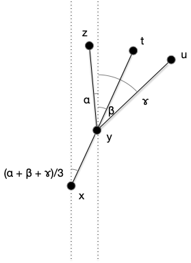
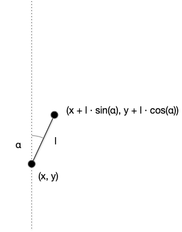
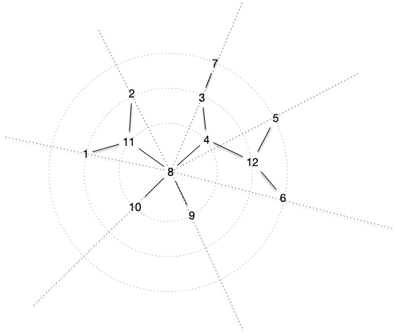

Il existe de nombreux tracés d'arbre possible. Nous allons en montrer deux, classiques et simple à mettre en œuvre.

> TBD Arbre + longueur sur les arêtes. 1 si on sait rien.

> TBD coder algo en python

## Tracé radial

Le tracé radial fonctionne en suivant un ordre de DFS à partir d'un sommet nommé racine. L'idée est d'associer un angle à chaque sommet à partir des feuilles équi-réparties sur $[0, 2\cdot \pi]$ dans l'ordre d'examen du DFS, puis de propager un angle à son parent.

Ceci est possible car le DFS assure que les sous arbres sont des intervalles de l'ordre.

Fixons nous les idées en regardant ce qu'il se passe avec l'arbre suivant :

En partant du centre 8.

L'ordre DFS que l'on a choisi est celui de la figure : $[1, 2, 11, 7, 3, 4, 5, 6, 12, 9, 10, 8]$

Il y a 7 feuilles, leurs angles seront :

- 0 pour la feuille 1
- $(2\cdot\pi)/7$ pour la feuille 2
- $(2\cdot\pi)\cdot (2/7)$ pour la feuille 7
- $(2\cdot\pi)\cdot (3/7)$ pour la feuille 5
- $(2\cdot\pi)\cdot (4/7)$ pour la feuille 6
- $(2\cdot\pi)\cdot (5/7)$ pour la feuille 9
- $(2\cdot\pi)\cdot (6/7)$ pour la feuille 10

Ensuite, l'angle de chaque élément sera la moyenne de ses successeurs dans les sous-arbre :

Ce qui donne pour les autres sommets, en suivant l'ordre du DFS :

- angle de $(2\cdot\pi)/14$ pour le sommet 11
- angle de $(2\cdot\pi)\cdot (2/7)$ pour le sommet 3
- angle de $(2\cdot\pi)\cdot (2/7)$ pour le sommet 4
- angle de $pi$ pour le sommet 12

Pour trouver les coordonnées, il suffit de reprendre les sommets dans l'ordre inverse du DFS :

Au final, en prenant les mêmes longueurs pour chaque arêtes on a le tracé :

Si le nombre de feuilles est connu, ce calcul peut se faire en deux passages de DFS :

- le premier dans le sens croissant pour déterminer les angles à partir des feuilles
- le premier dans le sens inverse pour déterminer les positions à partir du centre qui est en $(0, 0)$

On en déduit :


On peut trouver les coordonnées axiales d'un arbre en $\mathcal{O}(n)$ opérations.


Le centre peut a priori être tout sommet qui n'est pas une feuille, mais il pourra à être intéressant de prendre un sommet répartissant au mieux les sommets.



Montrer que pour tout arbre il existe soit :

- une arête unique qui découpe l'arbre en deux parties ayant exactement $n/2$ sommets
- un sommet unique qui découpe l'arbre en une forêt dont aucun arbre n'a plus que $n/2$ sommets



> TBD on part d'un sommet et on compte



Montrer que l'on peut déterminer en temps linéaire cette arête ou sommet.



> TBD avec un DFS on marque chaque sommet avec sa taille.



On peut aussi placer les sommets sur des cercle concentriques autour de la racine. Un sommet à distance de 2 arêtes de la racine étant placé sur le deuxième cercle :

## Tracé axial

> TBD tracé autour d'un chemin le plus long.

On organise le tracé autour d'u axe formé d'un chemin le plus long. On alterne les sous-arbres en les traçant radialement :

Les barres verticales montent des voisins de la racine du sous-arbre sur le chemin et l'angle initial correspond à l'intersection des barres avec un cercle de rayon la plus longue distance du sous-arbre à représenter. Ceci doit permettre de le représenter radialement sans déborder.

Trouver le chemin le plus long sur un arbre peut se faire en $\mathcal{O}(n^2)$ mais  Disjkstra donne un moyen en $\mathcal{O}(n)$ de le faire :

1. chemin le plus long depuis x, disons que c'est xy
2. chemin le plus long depuis y, disons que c'est yz

$yz$ est un chemin le plus long de l'arbre.


Prouvez que la procédure précédente fonctionne



> TBD si c'était un uv le max on regarde l'arbre xyz et on cherche à y ajouter u et v. Aucun cas ne fonctionne.



## Autre

> TBD <https://cs.brown.edu/people/rtamassi/gdhandbook/chapters/trees.pdf> et <https://www.csd.uoc.gr/~hy583/papers/ch8.pdf>
