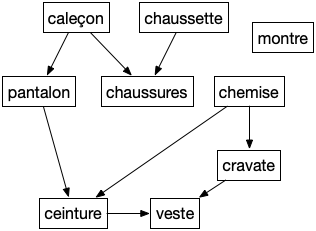
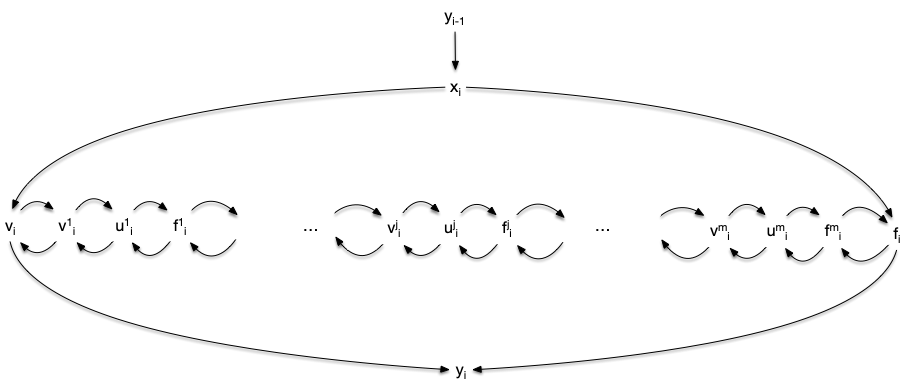
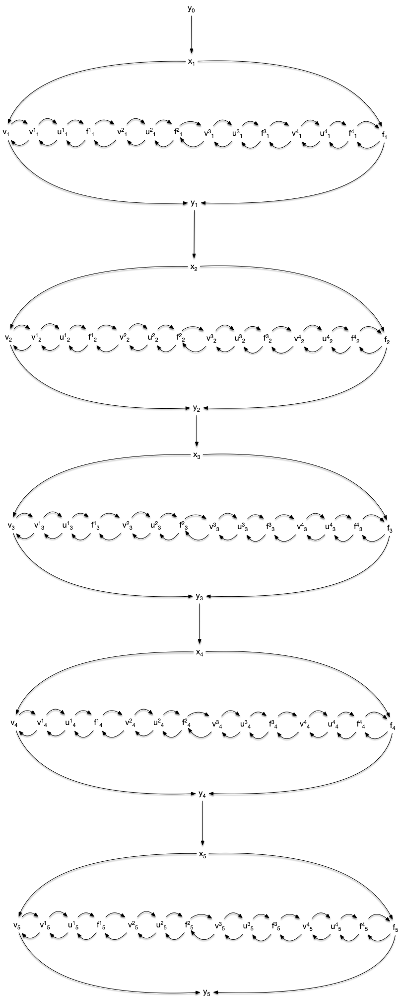
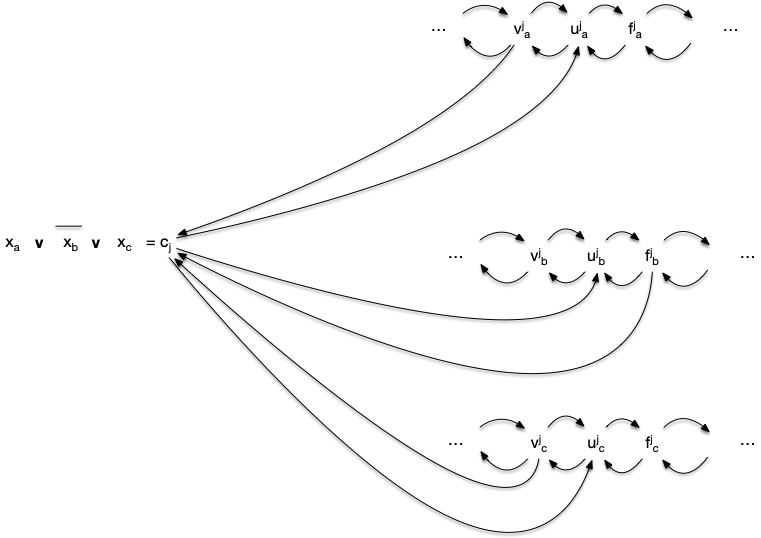
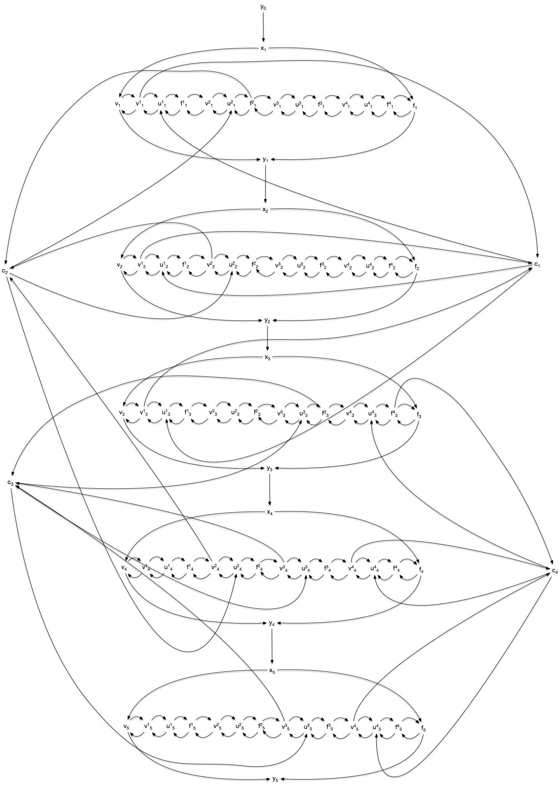
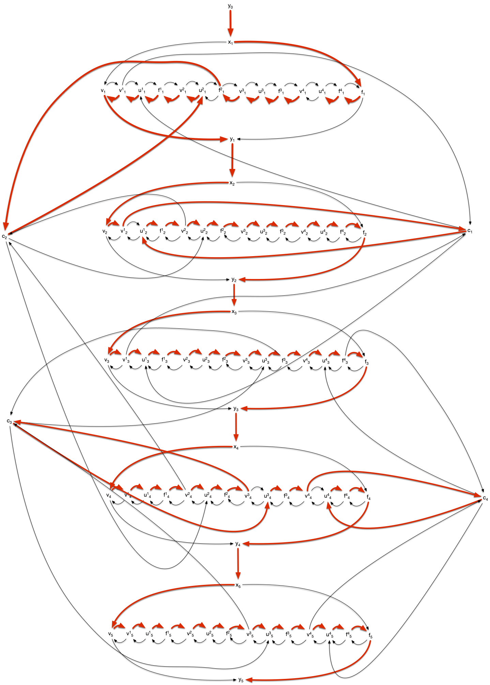
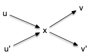
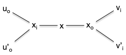

> TBD à réordonner. Mettre avec Hamilton 2 ?


Ca où on sait faire :
> - arbres 
> - acyclique pour chemin le plus long : et conséquence inattendue sr le BTP (pb d'ordonnancements. Aussi DFS !)

Cas particulier métrique et complet
>   1. pas simple : exhaustif avec backtrack + branch and bound
>   2. approximation : 
>     1. 2-opt 
>     2. performance garantie :  algo + ALM

## Ordonnancement

> TBD DFS et Problème d’ordonnancements
>
> TBD tri topologique dans un DAG avec un DFS + à la visite ajoute en fin de liste. Ensuite on regarde la liste à l'envers

Un [problème d'ordonnancement](https://fr.wikipedia.org/wiki/Th%C3%A9orie_de_l%27ordonnancement) peut se modéliser par un DAG nommé graphe de dépendances où si $xy$ est une arête alors il faut faire $x$ avant de pouvoir faire $y$.


Pourquoi ne doit-il pas y avoir de cycles dans un graphe de dépendance ?


Il est clair que s'il y a un cycle on ne peut réaliser le projet.


Vous résolvez des problèmes d'ordonnancement tous les jours comme par exemple comment s'habiller le matin (voir graphe ci-après)




Montrer que le tri topologique est une solution au problème d'ordonnancement. Appliquez le au problème de s'habiller le matin.


De plus un tri topologique fait que lorsque l'on s'attelle à la tache $v_i$ on a déjà fait tous ses prédécesseurs (ses prés-requis).


C'est encore un exemple où les contraintes sont locales et ou l'on cherche une solution globale.


## NP-complétude

> TBD Chemin le plus long ≥ chemin hamiltonien

Formalisons les problèmes du cycle hamiltonien dans ses versions orienté et non orienté :



- **Nom** : cycle (_resp._ circuit) hamiltonien
- **Entrée** : Un graphe (_resp._ graphe orienté) $G$
- **Question** : $G$ possède-t-il un cycle hamiltonien ?



Et faisons de même pour les chemins hamiltonien dans ses versions orienté et non orienté :



- **Nom** : chemin (_resp._ chemin orienté) hamiltonien
- **Entrée** : Un graphe (_resp._ graphe orienté) $G$
- **Question** : $G$ possède-t-il un chemin hamiltonien ?



Les quatre problèmes ci-dessus sont clairement des problèmes de décisions de NP. Nous allons montrer qu'ils sont NP-complet par des réduction depuis [le problème 3-SAT](/cours/algorithmie/problème-SAT/#3-sat){.interne}.

### Chemin orienté hamiltonien

Pour transformer une instance de 3-SAT en une instance de recherche d'un chemin hamiltonien dans un graphe, il faut :

- encoder les différentes variables dans leur état 1 ou 0
- gérer les clause pour que tout ne soit pas possible
- s'assurer qu'il n'existe de chemin hamiltonien que si et seulement si le système est satisfiable.

Nous allons appliquer la réduction à [l'exemple du problème 3-SAT](/cours/algorithmie/problème-SAT/#3-sat-exemple).

#### Encodage des variables

Chaque variable est encodé par le sous-graphe suivant :



Il possède uniquement deux chemins passant par tous les sommets :

- $y_{i-1}x_iv_iv^1_iu^1_if^1_i\dots v^j_iu^j_if^j_i\dots v^m_iu^m_if^m_if_iy_i$ : le chemin vrai
- $y_{i-1}x_if_if^1_iu^1_iv^1_i\dots f^j_iu^j_iv^j_i\dots f^m_iu^m_iv^m_iv_iy_i$ : le chemin faux

Le graphe de toutes les variables est composé de l'union de tous ces graphes. Pour l'exemple cela donne :



Il possède $2^5$ chemin hamiltoniens selon que l'on passe par le chemin vrai ou le chemin faux pour chaque variable.

#### Encodage des clauses

On encode chaque clause $c_i = l_i^1 \lor l_i^2 \lor l_i^3$ par un sommet $c_i$ que l'on ajoute au graphe des variables et tels que ses voisins sont, pour $1\leq k \leq 3$ :

- $v^i_jc_i$ et $c_iu^i_j$ si $l_i^k = x_j$,
- $f^i_jc_i$ et $c_iu^i_j$ si $l_i^k = \overline{x_j}$,



Le graphe complet de l'exemple est :



#### Satisfiabilité

Si la conjonction de clause est satisfiable, il existe un chemin hamiltonien passant pas les chemins vrais des variables vraies, les chemins faux des variables fausses et passant par chaque clause pour un des littéral vrai de la clause. Pour l'exemple :



Réciproquement s'il existe un chemin hamiltonien :

- il passe par les chemins vrais ou les chemins faut de chaque variable
- il passe par une clause en passant par le vrai ou le faux

Notez que pour un chemin hamiltonien, si $v^j_ic_i$ est un arc (_resp._ $f^j_ic_i$), alors $c_iu^j_i$ en est un aussi, sinon $f^j_i$ (_resp._ $v^j_i$) ne peut être atteint. Cette construction justifie le fait que la clause est satisfaite pour un de ses littéraux (ceci montre qu'il faut 3 sommets v, f et u pour cette construction et qu'on ne peut s'en sortir qu'avec des sommets v et f).

On en conclut :


Le problème de recherche d'un chemin hamiltonien dans un graphe dirigé est NP-complet.


### Circuit orienté hamiltonien

La précédente preuve s'applique de manière identique pour la recherche d'un circuit hamiltonien en ajoutant un arc de $y_n$ à $y_0$. On en conclut :


Le problème de recherche d'un circuit hamiltonien dans un graphe dirigé est NP-complet.


### Cycle et chemins hamiltonien

On va montrer ici que la recherche d'un chemin (_resp._ circuit) hamiltonien dans un graphe orienté est équivalent à chercher un chemin (_resp._ cycle) hamiltonien dans un graphe. Pour cela on va associer à tout graphe dirigé un graphe.

On effectue la transformation suivante, pour chaque sommet du graphe orienté :



On en associe 3 dans le graphe non orienté associé, permettant de séparer les arcs entrant des arcs sortants :



Il est alors évident que si le graphe non orienté a un chemin (_resp._ cycle) hamiltonien, alors le graphe orienté possède également un chemin (_resp._ circuit) hamiltonien. La réciproque est aussi trivialement vrai ce qui montre que les problèmes orientés ou non orientés sont équivalent.


[exemple de la réduction](https://www.youtube.com/watch?v=5SaQa_wlel8)


### Chemin le plus long

La NP-complétude des chemins et cycles hamiltoniens nous permet de conclure qu'il est illusoire de tenter de trouver un algorithme efficace pour résoudre le problème du chemin le plus long :



- **Nom** : chemin le plus long
- **Entrée** : Un graphe (_resp._ graphe orienté) $G$
- **Sortie** : Un chemin élémentaire le plus long possible.



Résoudre ce problème revient en effet clairement à résoudre le problème du chemin hamiltonien.


Montrer que si l'on pouvait résoudre le problème d'un chemin le plus long dans un graphe, on pourrait résoudre le problème du chemin hamiltonien.


Le plus long chemin élémentaire possible dans un graphe passe par tous les sommets. Donc un chemin élémentaire de longueur $\vert V \vert -1$ est hamiltonien.


Notez comment une petite différence — remplacer sommet (hamiltonien) par arête (eulérien) — rend un problème soit très simple soit très compliqué à résoudre.

Il existe un cas où trouver un chemin le plu long est facile : dans les graphes orientés qui ne contiennent pas de circuit (souvent appelé _DAG_, _direct acyclic graph_).

On appelle **_tri topologique_** d'un graphe orienté $G = (V, E)$ un ordre total $<$ sur les sommets du graphe tel que $xy \in E$ implique $x < y$ dans l'ordre.


Montrer que :

1. un graphe orienté ne peut admettre de tri topologique que s'il n'a pas de cycle
2. pour un DAG, il existe toujours un sommet qui n'a pas de voisins entrant (_resp._ sortant)
3. en déduire qu'un DAG admet un tri topologique
4. conclure sur le fait qu'un graphe est un DAG si et seulement s'il admet un tri topologique
   
   
   1 :

Soit $c_0\dots c_k$ un cycle ($c_k = c_0$), quelque soit l'ordre total entre les sommets du graphe, il existe $i$ tel que $c_{i+1} < c_i$ ce qui est impossible si un tel ordre était topologique.

2 :

Supposons que tout sommet d'un DAG admette un voisin entrant et un voisin sortant, et prenons une arête $x_0x_1$ de ce graphe. Il existe donc une arête $x_1x_2$. Si $x_2 = x_0$ il existe un cycle dans le graphe, sinon il existe un chemin $x_0x_1x_2$. Il existe donc une arête $x_2x_3$. Si $x_3 \in \{x_0, x_1 \}$ il existe un cycle et sinon on a un chemin $x_0x_1x_2x_3$. On peut ainsi recommencer jusqu'à tomber sur un cycle par finitude du graphe. Ce n'est pas un DAG.

Le raisonnement est identique pour les voisins entrant.

3 :

en supprimant itérativement les sommets sans voisins rentrant d'un DAG (le graphe obtenu en supprimant un sommet d'un DAG est toujours un DAG puisque supprimer un sommet ne rajoute pas de cycle), on obtient un tri topologique.

4 :

On a montré que :

- cycle implique non tri topologique
- DAG (non cycle) implique tri topologique

On a donc bien l'équivalence : tri topologique est équivalent à DAG.




Utiliser le tri pour trouver un chemin élémentaire de longueur maximum dans un DAG.


algorithme sur tri topologique :

```text
Entrée :
    - un graphe orienté G = (V, E)
    - un tri topologique V0 < ... < Vn des éléments de V
Initialisation :
    longueur(x) = 0 pour tout sommet x
    predecesseur(x) = x pour tout sommet x
    V' = {}, E' = {}
Algorithme :
    pour v allant de V0 à Vn:
        pour chaque voisin sortant w de v:
            si longueur(w) < longueur(v) + 1:
                longueur(w) = longueur(v) + 1
                predecesseur(w) = v
    soit a l'élément de V ayant la plus grande longueur
    chemin = [a]
    x = a
    tant que x est différent de predecesseur(x):
        x = predecesseur(x)
        ajoute x au début de chemin
Retour :
    chemin
```

La complexité est de $\mathcal{O}(\vert E \vert + \vert V \vert)$, ce qui est optimal.

Pour prouver l'algorithme, on montre par récurrence sur $\vert V \vert$ que `longueur(x)` est la longueur d'un plus long chemin finissant en `x`.

Si $\vert V \vert = 1$, c'est Ok. On suppose la propriété vraie à $\vert V \vert = n$. Pour $\vert V \vert = n +1$ on remarque que `longueur(Vi)` est la même pour le graphe $G$ et pour le graphe $G$ auquel on a enlevé $v_{n+1}$ pour tout $i \neq n+1$. Comme tous les prédécesseurs de $v_{n+1}$ seront vus pour l'algorithme et que `longueur(Vi)` ne change pas après l'étape $i$ on en conclut que la récurrence est vraie à $\vert V \vert = n +1$.


## Applications

### Voyageur de commerce

Problème vu sous l'angle algorithmique dans le cours d'algorithmie :


[Chemins et cycle](../projet-chemins-cycles){.interne}


> TBD formaliser ça en graphe.
