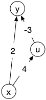

<!-- début résumé -->

Chemins de longueur minimum entre deux sommets pour un graphe orienté valué.

<!-- fin résumé -->

La recherche de chemins de poids minimum dans le cas général est plus complexe que le cas simple où la valuation est positive. On ne peut en particulier plus utiliser l'algorithme de Dijkstra car il ne garantit pas de trouver un chemin de longueur minimum.

L'exemple ci-après le montre :

Dijkstra trouvera $xy$ comme chemin de poids minimum entre $x$ et $y$ alors que c'est $xuy$.

## Algorithme de Bellman-Ford

Cas heureux, on peut résoudre les deux problèmes en même temps grâce à :


l'algorithme de [Bellman-Ford](https://fr.wikipedia.org/wiki/Algorithme_de_Bellman-Ford) qui :

- cherche un chemin de poids minimum entre deux sommets dans un graphe orienté valué
- donne un circuit absorbant entre $a$ et $b$ s'il y en a un

En $\mathcal{O}(\vert V \vert \cdot \vert E \vert)$ opérations.


La complexité de l'algorithme de Bellman-Ford est plus importante que celle de Dijkstra, évitez donc de l'utiliser si la valuation du graphe est positive.


[Algorithme de Bellman-Ford](./bellman-ford){.interne}


## Algorithme de Roy-Floyd-Warshall

Dans le cas d'un graphe orienté valué, si l'on cherche tous les chemins de poids minimum entre chaque paire de sommets, on peut utiliser :


L'algorithme de [Roy-Floyd-Warshall](https://fr.wikipedia.org/wiki/Algorithme_de_Floyd-Warshall) qui pour un graphe orienté valué :

- donne tous les chemins de poids minimum entre chaque paire de sommets
- donne un circuit absorbant s'il en existe

La complexité de cet algorithme est en $\mathcal{O}(\vert V \vert ^3)$ opérations.


La complexité de l'algorithme de Roy-Floyd-Warshall est plus grande que celle de Bellman-Ford, donc si vous n'avez besoin que de chercher les plus cours chemins ou les cycles absorbants entre 2 sommets il vaut mieux utiliser Bellman-Ford.

> TBD algo

## Conclusion

Si vous devez résoudre un problème de recherche de chemin de poids minimum dans une graphe orienté $G$ valué par une fonction $f$ :

- si les poids sont tous positifs, on utilise l’algorithme de Dijkstra que l'on peut implémenter de telle sorte que sa complexité soit $\mathcal{O}(\vert E \vert + \vert V \vert\log_2(\vert V \vert))$
- si l'on cherche un chemin précis, on utilise l'algorithme de Bellman-Ford dont la complexité est $\mathcal{O}(\vert E \vert \cdot \vert V \vert)$
- si l'on cherche tous les chemins, on utilise l'algorithme de Roy-Floyd-Warshall dont la complexité est $\mathcal{O}(\vert V \vert^3)$

Notez que les complexités sont de plus en plus importantes.
