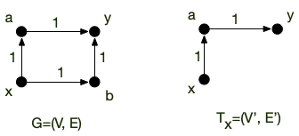
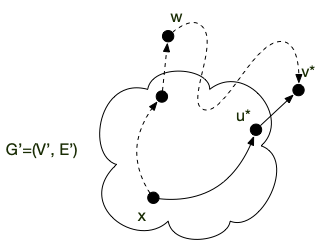

<!-- début résumé -->

Chemins de longueur minimum entre deux sommets pour un graphe orienté pour une valuation positive.

<!-- fin résumé -->

L'[algorithme de Dijkstra](https://fr.wikipedia.org/wiki/Algorithme_de_Dijkstra) permet, à partir d'un graphe orienté valué positivement, de trouver un chemin de longueur minimum entre deux sommets $d$ (départ) et $a$ (arrivée).

## Principe

Son principe est le suivant. Soit $G =(V, E)$ un graphe orienté valué par une fonction positive $f$. On suppose que l'on ait un ensemble $V' \subseteq V$ avec $x \in V'$ et $E' \subseteq E$ tel que pour tout $y \in V' :

* il existe un chemin **unique** $x$ et $y$ dans le graphe $G' = (V', E')$
* le chemin entre $x$ et $y$ dans $G'=(V', E')$ est un chemin de poids minimum entre $x$ et $y$ dans $G$ valué par $f$.

Le graphe ci-dessous en est une illustration :



Il existe d'autres chemins de poids minimum entre $x$ et $y$ dans $G$ ($xby$), mais celui de $G'$ ($xay$) est aussi un chemin de poids minimum pour $G$.


Étant donné un sommet $x$, un tel ensemble $V'$ existe toujours, il suffit de prendre $V'= \\{ x\\}$.


Le but est de faire grossir $V'$ depuis $\\{ x\\}$ jusqu'à $V$. Ceci est possible grâce à la proposition suivante :


Soit $G =(V, E)$ un graphe orienté valué par une fonction positive $f$. Soit $V' \subsetneq V$ avec $x \in V'$ et $E' \subsetneq E$ tel que pour tout $y \in V'$ :

* il existe un chemin $c_{xy}$ **unique** $x$ et $y$ dans le graphe $G' = (V', E')$
* le chemin entre $x$ et $y$ dans $G'=(V', E')$ est un chemin de poids minimum entre $x$ et $y$ dans $G$ valué par $f$.

Soit $W = \\{ uv \mid uv \in E, u \in V', v \in V \backslash V' \\}$ et $u^\star v^\star \in W$ un arc tel que :
$$f(c_{xy}) + f(u^\star v^\star) = \min_{uv \in W} f(uv) + f(c_{uv})$$

Alors $V'' = V \cup \\{ v^\star \\}$ et $E'' = E'' \cup \\{ u^\star v^\star \\}$ satisfont également les hypothèses.



Comme on ne rajoute qu'un arc à $E'$ pour créer $E''$, il ne peut exister 2 chemins différents pour aller de $x$ à un autre sommet $y$ de $G'' =(V'', E'')$.

Supposons qu'il existe un chemin entre $x$ et $y$ dans $G$. Comme $x \in V$, on peut noter $v'$ le premier sommet de ce chemin qui n'est pas dans $V'$. Si $v' \neq y$ on se retrouve dans le cas de la figure ci-dessous :



Le poids du chemin en pointillé de $x$ à $v'$ est par construction plus grand que le poids du chemin allant de $x$ à $v$ (en trait plein). Comme les poids sont positifs, le chemin en pointillé de $x$ à $v$ est donc de poids supérieur à celui en trait plein.

On conclut la preuve en notant que s'il n'y a qu'un seul chemin entre $x$ et tout élément de $V'$, la propriété est toujours vrai pour $V''$ puisque l'on a fat que rajouter un chemin (unique) entre $x$ et $v'$.



La proposition précédente permet de trouver itérativement un ensemble — on dira une ***arborescence*** — $G'= (V, E')$ tel qu'il existe un chemin unique entre un sommet $x$ donné et tout autre sommet $y \in V$ dans $G'$, ce chemin étant de plus un chemin de poids minimum entre $x$ et $y$ dans $G$.

## Implémentation

Une implémentation en python en utilisant le codage par dictionnaire des graphes et une valuation également codée par un dictionnaire dont les clés sont les arcs et les valeurs la valuation est donnée ci-après :

```python#
def dijkstra(G, f, départ, arrivé):
    prédécesseur = dict()
    coût_entrée = {départ: 0}
    sommets_examinées = {départ}

    pivot = départ
    while pivot != arrivé:
        for x in G[pivot]:
            if x in sommets_examinées:
                continue

            if (x not in coût_entrée) or (
                coût_entrée[x] > coût_entrée[pivot] + f[(pivot, x)]
            ):
                coût_entrée[x] = coût_entrée[pivot] + f[(pivot, x)]
                prédécesseur[x] = pivot

        new = None
        for x in G:
            if (x in sommets_examinées) or (x not in coût_entrée):
                continue

            if (new is None) or (coût_entrée[new] > coût_entrée[x]):
                new = x

        pivot = new
        sommets_examinées.add(pivot)

    chemin = [arrivé]
    x = arrivé
    while x != départ:
        x = prédécesseur[x]
        chemin.append(x)
    chemin.reverse()

    return chemin
```

L'algorithme précédent peut être décomposé en plusieurs parties :

1. initialisation (lignes 2 à 4) : `prédécesseur`{.language-} et `coût_entrée`{.language-} sont des dictionnaires et `sommets_examinées`{.language-} un ensemble
2. boucle principale, qui correspond au `while`{.language-} (lignes 6 à 27). Cette boucle est composée de deux parties :
   1. mise à jour (lignes 8 à 16) : on considère tous les voisins de `pivot`{.language-} qui ne sont pas encore dans `sommets_examinées`{.language-} (test des lignes 9 et 10) et on les met à jour si nécessaire (lignes 12 à 16) : soit on les découvre pour la première fois (`x not in coût_entrée`{.language-}) soit on à mieux (`coût_entrée[x] > coût_entrée[pivot] + f[(pivot, x)]`{.language-})
   2. recherche d'un nouveau `pivot`{.language-} (lignes 18 à 27) : on choisit un sommet non encore examiné de coût d'entrée le plus faible
   3. la boucle principale s'arrête une fois que l'on choisi l'arrivé comme `pivot`{.language-}
3. construction du chemin (lignes 29 à 34) : on remonte de prédécesseur en prédécesseur en partant de `arrivé`{.language-} jusqu'à remonter en `départ`{.language-}.

### Déroulement de l'algorithme

Avant de voir comment il fonctionne, testez le. Le graphe ci-après représente les différents vols et leurs durées entre différentes villes d'Europe :


Le codage en python est alors le suivant pour le graphe :

```python
G = {
    "Paris": {"Hambourg", "Amsterdam", "Londres"},
    "Hambourg": {"Stockholm", "Berlin"},
    "Amsterdam": {"Hambourg", "Oslo", "Londres"},
    "Londres": {"Édimbourg"},
    "Stockholm": {"Oslo", "Rana"},
    "Berlin": {"Stockholm", "Amsterdam", "Oslo"},
    "Oslo": {"Rana"},
    "Édimbourg": {"Amsterdam", "Oslo", "Rana"},
    "Rana": set(),
}
```

Et la fonction de valuation positive :

```python
f = {
    ("Paris", "Londres"): 4,
    ("Paris", "Amsterdam"): 3,
    ("Paris", "Hambourg"): 7,
    ("Hambourg", "Stockholm"): 1,
    ("Hambourg", "Berlin"): 1,
    ("Amsterdam", "Londres"): 1,
    ("Amsterdam", "Hambourg"): 2,
    ("Amsterdam", "Oslo"): 8,
    ("Londres", "Édimbourg"): 2,
    ("Stockholm", "Rana"): 5,
    ("Stockholm", "Oslo"): 2,
    ("Berlin", "Stockholm"): 2,
    ("Berlin", "Amsterdam"): 2,
    ("Berlin", "Oslo"): 3,
    ("Oslo", "Rana"): 2,
    ("Édimbourg", "Rana"): 6,
    ("Édimbourg", "Amsterdam"): 3,
    ("Édimbourg", "Oslo"): 7,
}
```


Faites un déroulé séquentiel de l'algorithme. Dans quel ordre les sommets sont-ils ajoutés dans `sommets_examinées`{.language-} ?


Les différentes étapes de l'algorithme sont représentées dans les graphes ci-dessous.

* La figure se lit de gauche à droite et de haut en bas.
* les sommets de `sommets_examinées`{.language-} sont en vert
* en orange les valeurs de `prédécesseur`{.language-} et de `coût_entrée`{.language-}
* en magenta `pivot`{.language-} et les modifications de `prédécesseur`{.language-} et de `coût_entrée`{.language-} s'il y en a




### <span id="preuve-Dijkstra"></span> Preuve


Pour un graphe orienté valué positivement $(G, f)$ et deux sommet $a$ et $b$ de $G$, l'algorithme de Dijkstra rend un chemin élémentaire de longueur minimum entre $a$ et $b$ (s'il existe).


On montre par récurrence qu'à chaque étape le chemin de `départ`{.language-} à `pivot`{.language-} constitué en remontant les prédécesseurs de `pivot`{.language-} jusqu'à arriver à `départ`{.language-} est de longueur minimale et de coût `coût_entrée[pivot]`{.language-}.

Au départ `pivot = départ`{.language-}, la propriété est donc vraie. On la suppose vrai jusqu'à la l'itération $i$ (qui correspond au fait que l'on ait $i$ sommets dans  `sommets_examinées`{.language-}). A l'étape $i+1$, on a choisi `pivot`{.language-} qui minimise le coût d'entrée parmi tous les sommets qui ne sont pas encore dans `sommets_examinées`{.language-}.

Comme tous les chemins alternatifs entre `départ`{.language-} et `pivot`{.language-} commencent en `départ`{.language-}, il existe un arc de ce chemin dont le départ  (disons $u$) est dans `sommets_examinées`{.language-} et l'arrivée (disons $v$) n'y est pas. Prenons la première arête $uv$ pour laquelle ça arrive.

Par hypothèse de récurrence, `coût_entree[u]`{.language-} est le coût minimum d'un chemin entre `départ`{.language-} et $u$ et `coût_entree[v]`{.language-} est donc plus grand que `coût_entree[u] + f[uv]`{.language-} (on a examiné ce cas lorsque l'on a fait rentrer $u$ dans `sommets_examinées`{.language-}) et de `coût_entree[pivot]`{.language-} (car c'est le min).

De là, le coût du chemin alternatif est plus grand également que `coût_entree[pivot]`{.language-} **car toutes les valuations sont positives** : notre hypothèse est vérifiée.



### Complexité


La complexité de l'algorithme de Dijkstra est en $\mathcal{O}(\vert E\vert + (\vert V \vert)^2)$


On ajoute à chaque étape un élément, donc il y a au pire $\vert V \vert$ étapes. A chaque choix on compare les voisins de `pivot`{.language-}. Ces comparaisons sont donc de l'ordre de $\mathcal{O}(\delta(\mbox{pivot}))$ opérations. Comme `pivot`{.language-} est différent à chaque étape, toutes ces comparaisons sont de l'ordre de $\mathcal{O}(\sum\delta(\mbox{pivot})) = \mathcal{O}(\vert E \vert)$ opérations.

On prend ensuite le minimum parmi les éléments de `sommets_examinées`{.language-}, ce qui prend $\mathcal{O}(\vert V \vert)$ opérations.

La complexité totale est alors en :
<p>
\[
\mathcal{O}(\underbracket{\vert E\vert}_{\mbox{mises à jour du coût d'entrée}} + \underbracket{(\vert V \vert)^2}_{\vert V \vert \mbox{ choix de pivot}})
\]
<\p>



En déduire que la complexité de l'algorithme de Dijkstra est en $\mathcal{O}((\vert V \vert)^2)$


Clair puisque $\vert E \vert \leq \vert V \vert)^2$.


On le voit dans la preuve de la proposition, le facteur limitant est la partie en $\mathcal{O}(\vert V \vert^2)$ qui n'est pas linéaire en la taille du graphe (en mémoire un graphe occupe de l'ordre de $\mathcal{O}(\vert E \vert + \vert V \vert)$ cases). Celle ci concerne le choix du nouveau pivot en cherchant un minimum de `coût_entree`{.language-}. En optimisant cette opération, on peut drastiquement diminuer la complexité de l'algorithme.

Une optimisation classique est d'utiliser un [tas](https://fr.wikipedia.org/wiki/Tas_(informatique)) pour trouver le min. On a alors que :

* une complexité de $\mathcal{O}(1)$  pour prendre un minimum
* une complexité de $\mathcal{O}(\log_2(M))$ où $M$ est le nombre d'éléments du tas pour mettre à jour la structure après chaque modification. Comme il va y a voir au maximum $V$ éléments dans ce tas, on peut borner cette complexité par $\mathcal{O}(\log_2(\vert V \vert))$

Enfin :

* il y a de l'ordre $\mathcal{O}(\vert V \vert)$ prise de minimum  : à chaque choix de `pivot`{.language-}
* il y a de l'ordre de $\mathcal{O}(\vert E \vert)$ modifications : à chaque modification de `coût_entree`{.language-}

On a donc une complexité de choix de `pivot`{.language-} qui passe alors de $\mathcal{O}(\vert V \vert^2)$ à $\mathcal{O}(\vert E \vert \log_2(\vert V \vert))$.

* S'il y a **peu d'arcs**, disons $\vert E \vert = \mathcal{O}(\vert V \vert)$, **c'est beaucoup mieux** puisque l'on a alors une complexité de : $\mathcal{O}((\vert V \vert)\log_2(\vert V \vert))$
* S'il y a **beaucoup d'arcs**, disons $\vert E \vert = \mathcal{O}(\vert V \vert^2)$, c'est **un peu moins bon**  puisque l'on a alors une complexité de : $\mathcal{O}((\vert V \vert)^2\log_2(\vert V \vert))$

La complexité de Dijkstra avec un tas est alors : $\mathcal{O}(\vert E \vert + (\vert E \vert + \vert V \vert)\log_2(\vert V \vert))$ ce qui est égal à $\mathcal{O}((\vert E \vert + \vert V \vert)\log_2(\vert V \vert))$ qui est beaucoup mieux que l'implémentation naïve si le graphe est peu dense et un peu moins bonne dans le cas où le graphe est dense

Comme souvent les graphes sont peu dense lorsque l'on cherche un chemin de poids min — pensez à google maps où il y a bien peu de routes par rapport aux nombre d'endroit où l'on peu aller — on utilise souvent cette implémentation.


La [page wikipédia](https://fr.wikipedia.org/wiki/Algorithme_de_Dijkstra#Complexit%C3%A9_de_l'algorithme) précise qu'en utilisant un tas amélioré, dit tas de Fibonacci, on arrive même à faire descendre la complexité totale à $\mathcal{O}(\vert E \vert + \vert V \vert\log_2(\vert V \vert))$, ce qui est du coup tout le temps mieux que la prise de minimum naïve, mais nécessite une structure bien plus compliquée.


## <span id="arborescence"></span> Arborescence

On peut continuer l'algorithme de Dijkstra après que  ait été rentré dans `sommets_examinées`{.language-}, jusqu'à ce que l'on ait plus que des éléments de coût infini à faire rentrer dans `sommets_examinées`{.language-} ou que `sommets_examinées`{.language-} soit égal à $V$.

<span id="preuve-Dijkstra-arborescence"></span>

Montrez que pour tous les sommets $x$ qui ne peuvent pas entrer dans `sommets_examinées`{.language-}, il n'existe pas de chemin entre `départ`{.language-} et $x$ dans $G$


A chaque fois que l'on ajoute un élément dans `sommets_examinées`{.language-} on vérifie tous ses voisins pour mettre à jour le coût d'entrée dans la structure. On procède comme le parcours en largeur et on a montré qu'il trouvait la composante connexe de sa racine.



Montrez que si l'on peut continuer l'algorithme de Dijkstra jusqu'à ce que $V'$ soit égal à $V$ on obtient un graphe $G' = (V, E')$ tel que :

* $\vert E' \vert = \vert V \vert -1$
* il existe un unique chemin entre $d$ et tout autre sommet
* le chemin entre $d$ et $x$ dans $G'$ est de poids minimum dans $G$


Cette preuve dérive directement de la preuve de l'algorithme de Dijkstra que l'on a fait précédemment.


## $A^\star$

Un algorithme beaucoup utilisé lorsque le graphe peut changer ou s'il est très grand, voir inconnu (un terrain de jeu) est [l'algorithme $A^\star$](https://fr.wikipedia.org/wiki/Algorithme_A*), qui est une variante de l'algorithme de Dijkstra qui accélère la procédure de choix en sacrifiant l'optimalité : on obtient alors *rapidement* une solution *acceptable* plutôt qu'obtenir *lentement* une solution optimale.

Cette approche est utile dans une grande variété de cas d'application où il est pus important d'aller vite que d'être exacte : comme dans les jeux vidéo par exemple où on utilise cet algorithme dans le [*pathfinding*](https://fr.wikipedia.org/wiki/Recherche_de_chemin) par exemple.

Son principe est identique à celui de Dijkstra, mais plutôt que de prendre à chaque fois l'élément de coût minimum on choisit un élément dont le `coût_entree`{.language-} + une distance heuristique sur sa distance à l'arrivée est minimum.

Cette modification est faite pour considérer moins de sommets que Dijkstra (on ne va pas choisir de sommets inutiles).


Proposez une implémentation de l'algorithme $A^*$ pour le parcours dans une salle d'un petit robot.



* On peut prendre comme graphe la grille 2D carré de pas 1m par exemple
* s'il y a des murs on ne mets pas d'arêtes
* l'heuristique sera la distance L1 entre la position et l'arrivée.

On peut même se déplacer à chaque itération et se rapprocher normalement du but petit à petit.


On peut aussi montrer que si l'algorithme $A^*$ a une heuristique qui ne surestime pas la distance finale, il va bien trouver un chemin de poids minimum.


Donner un exemple qui montre que si l'algorithme $A^*$ a une heuristique qui surestime le coût du chemin réel il se peut qu'il ne rende pas le bon chemin.


Pour montrer qu'il peut se tromper, on donne une estimation de coût 0 à un chemin qui n'est pas de longueur minimale et $+\infty$ à sous les autres.


## Chemine de poids minimum n'est pas équivalent à chemin de poids maximum

Penser que renverser les inégalités dans l'algorithme De Dijkstra (de rentrer dans la structure à chaque fois l'élément de plus grand coût), permet de trouver un chemin le plus long est une faute.

Donnons un exemple. Le graphe suivant avec une valuation de 1 sur tous les arc :


Le chemin de longueur maximum entre $1$ et $3$ est $132$. L'algorithme où l'on renverse toutes les inégalités trouvera ce chemin si les sommets sont examinés dans l'ordre $1$, $3$ puis $2$, **mais** il ne le trouvera pas si les sommets sont rentrés dans `sommets_examinées`{.language-} dans l'ordre 1, 2, 3 (ce qui est possible).

Même s'il existe des cas où l'algorithme de Dijkstra trouvera le chemin le plus long, il en existe d'autres où il ne le trouvera pas...
