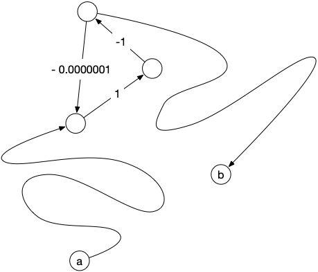

<!-- début résumé -->

Chemins de longueur minimum entre deux sommets pour un graphe orienté.

<!-- fin résumé -->

Pour ce cours, nous n'allons considérer **que des graphes orientés** car les notions et théorèmes présentés s'y prêtent mieux. Cela n'entraîne pas une grande perte de généralité : un graphe non orienté (valué) pouvant être considéré comme  un graphe orienté avec 2 arcs opposés (de même valuation).

Commençons par définir le problème :


Soit $G = (V, E)$ un graphe orienté et $a, b$ deux sommets. Un **chemin de longueur minimum entre $a$ et $b$** est un chemin $v_0 \dots v_{k-1}$ tel que :

* $a = v_0$ et $b=v_{k-1}$
* il n'existe pas de chemin entre $a$ et $b$ de [longueur](../chemins-cycles-connexite#définition-longueur){.interne} strictement plus petite que $k$ (il y a $k+1$ sommets, donc $k$ arêtes).


Que l'on généralise souvent aux **graphes orientés valués** :


Un **graphe orienté valué** est un couple $(G, f)$ où :

* $G=(V, E)$ est un graphe orienté
* $f: E \rightarrow \mathbb{R}$

Le **poids** d'une liste d'arc/arêtes $L$, noté $f(L)$ est la somme des valuations de ses arcs/arêtes et le poids d'un [pseudo-chemin](../chemins-cycles-connexite#définition-pseudo-){.interne} (les arcs peuvent se répéter) $c=v_0\dots v_{k-1}$, noté $f(c)$, est la somme $\sum_{0\leq i < k-1}f(v_iv_{i+1})$ (le poids de la liste des arc/arêtes constituant le pseudo-chemin).


Soit $(G, f)$ un graphe valué et $a, b$ deux sommets de $G$. Un **chemin de poids minimum entre $a$ et $b$** est un chemin $c=v_0 \dots v_{k-1}$ tel que :

* $a = v_0$ et $b=v_{k-1}$
* il n'existe pas de chemin $w_0\dots w_{k'-1}$ de poids plus petit que celui de $c$.


Il est clair qu'un chemin de longueur minimum d'un graphe est un chemin de poids minimum où toutes les valuations sont égales à 1.

Attention cependant :


Il peut exister **plusieurs chemins** de poids minimum entre $a$ et $b$ dans un graphe orienté valué $(G,f)$.


Le graphe orienté $G = (\\{a, b, c, d\\}, \\{ab, bc, ad, dc\\})$ admet deux chemins de longueur minimum entre $a$ et $c$.


Le problème du chemin de poids minimum fait partie de ces problèmes où l'on cherche à minimiser une fonction mais où ce qui nous intéresse c'est l'élément qui réalise le minimum. Ce genre de problème admet souvent un minimum (unique) réalisable par plusieurs éléments.

## Graphe à valuation positive

Commençons par restreindre le problème au cas intuitif où **la valuation $f$ des arcs correspond à un coût**. Pensez par exemple à google maps où les arcs sont des tronçons de route. Les valuations peuvent alors être la distance du tronçon, les péages ou encore le temps min (en respectant les limitations de vitesse) pour le parcourir.

Dans ce cas là, trouver un chemin de poids minimum ou un [chemin élémentaire](../chemins-cycles-connexite#définition-élémentaire){.interne} de poids minimum sont deux problème équivalents :


S'il existe un chemin entre $a$ et $b$ dans un graphe orienté $G$, alors **il existe** un pseudo-chemin de longueur minimum. De plus, un pseudo-chemin de longueur minimum est nécessairement **élémentaire**.

Plus généralement, si le graphe $G$ est valué par une fonction $f$ positive ($f: E \rightarrow \mathbb{R}^+$) alors :

* **il existe** un chemin de poids minimum
* parmi tous les chemins de poids minimum, ceux de longueur minimum sont **élémentaire**



Le problème de longueur minimum est un cas particulier de valuation positive (la valeur est toujours égale à 1), on considère donc :

* un graphe orienté valué positivement $(G, f)$
* deux sommets $a$ et $b$ de $G$
* un chemin $c$ entre $a$ et $b$

Un chemin $c'$ réalisant le minimum est donc tel que $0 \leq f(c') \leq f(c)$. Comme l'intervalle $[0, f(c)]$ est un compact, la fonction $f$ va atteindre son minimum pour un élément de l'ensemble des chemins $c'$ entre $a$ et $b$ telles que $0 \leq f(c') \leq f(c)$. On en conclut qu'il existe un chemin $c^\star$ entre $a$ et $b$ dans $G$ de poids minimum.

Si $c^\star$ est un chemin non élémentaire, il existe une boucle. Cette boucle est de longueur strictement positive, la supprimer ne change pas l'origine et la fin du chemin tout en diminuant strictement sa longueur : $c^\star$ ne peut pas être un chemin de poids minimum de longueur minimum.



De là :


On peut se restreindre à rechercher des **chemins élémentaires** de poids minimum sans perte de généralité.


Enfin, une propriété fondamentale des chemins de poids minimum pour des graphes valués positivement — et le moteur des algorithmes qui permettent de trouver des chemins de poids minimum — est qu'un chemin de poids minimum est lui-même composé de chemin de poids minimum :


Soit $c = v_0 \dots v_{k-1}$ un chemin de longueur minimum entre $v_0$ et $v_{k-1}$ pour un graphe orienté valué positivement $(G, f)$. Alors pour tout $0 \leq i < j < k$ : $c'= v_{i} \dots v_j$ est un chemin de longueur minimum entre $v_i$ et $v_j$



S'il existait un chemin $c'' = w_0 \dots w_{k'-1}$ entre $v_i$ et $v_j$ de poids strictement plus petit que $c'$, alors le pseudo-chemin : $c^\star = v_0\dots v_{i-1} w_0 \dots w_{k'-1} v_{j+1} \dots v_{k-1}$ serait de poids strictement plus petit que $c$. Comme de tout pseudo-chemin on peut extraire un chemin élémentaire (en supprimant itérativement les boucles) on peut *raffiner* $c^\star$ en un chemin élémentaire entre $v_0$ et $v_{k-1}$ de poids strictement plus petit que $c$, ce qui est impossible par hypothèse.



## Graphe à valuation quelconque

La définition que l'on s'est donné de chemin de poids minimum est intuitive : on cherche à aller d'un sommet $a$ à un sommet $b$ de la façon la plus rapide possible (pensez à un google maps par exemple). Mais cette notion est plus fine que l'on pourrait le croire lorsque l'on permet aux valuations d'être négatives. Il peut en effet exister des [circuits](../chemins-cycles-connexite#définition-circuit){.interne} de poids négatifs :


Soit $(G, f)$ un graphe orienté valué. Un **circuit absorbant** est un circuit $c$ de poids strictement négatif.


Même s'il existe toujours des chemins de poids minimum (on ne repasse pas deux fois par le même arc, il y en a donc un nombre fini), ils ne sont pas les plus rapides ! En effet il suffit de repasser une fois par le circuit absorbant pour aller encore plus vite... Par exemple dans le graphe orienté ci-dessous le poids du circuit $abca$ est de -3 :

Si je veux aller de $a$ à $c$, le chemin de poids minimum est $abc$ et vaut $-2$. Cependant :

* le pseudo-chemin de $a$ à $c$ : $abcabc$ est meilleur puisqu'il vaut $-2 - 3 = -5$
* mais on peut encore faire mieux en passant 2 fois par le circuit absorbant et obtenir le pseudo-chemin de $a$ à $c$ : $abcabcabc$ qui vaut $-5 - 3 = -8$
* et ainsi de suite...

Il **n'existe pas de plus court pseudo-chemin entre $a$ et $c$** car en ajoutant autant de fois que nécessaire le circuit absorbant on peut rendre le poids du pseudo-chemin aussi petit que l'on veut.


Même s'il existe un chemin de poids minimum dans un graphe valué quelconque, s'il existe des circuits absorbants alors il n'est potentiellement pas le plus court.


On peut déjà donner la proposition suivante, qui donne une condition nécessaire pour qu'il existe un pseudo-chemin de poids minimum entre deux sommets, et donc que le chemin de poids minimum soit bien le plus court :


Soit $(G, f)$ un graphe orienté valué ; $a$ et $b$ deux sommets de $G$.

S'**il existe** un pseudo-chemin $c=v_0\dots v_{k-1}$ entre $a$ et $b$ **tel que** : il existe $i < j$ tel que $v_i = v_j$ et  $f(v_i\dots v_j) < 0$ (c'est un circuit absorbant),
**Alors il n'existe pas** de pseudo-chemin de poids minimum entre $a$ et $b$ et le chemin de poids minimum n'est pas le plus court.



la portion $v_i \dots v_j$ de $c$ est une boucle. On peut donc créer un chemin $c_l$ où l'on répète cette boucle $l$ fois :

\[
c_l = v_0 \dots v_j \underbracket{\underbracket{v_{i+1} \dots v_j} \dots \underbracket{v_{i+1} \dots v_j}}_{\mbox{répété $l$ fois}}v_{j+1} \dots v_{k-1}
\]

Le poids de $c_l$ est : $c - l \cdot f(v_i\dots v_j) < c$. Comme $f(v_i\dots v_j)$ est une constante, on en conclut que :

\[
\lim_{l \rightarrow +\infty}f(c_l) = -\infty
\]



La proposition précédente nous indique qu'il suffit d'atteindre un circuit absorbant depuis $a$ et pouvoir en repartir pour atteindre $b$ pour qu'il n'existe pas de pseudo-chemin de poids minimum. Le circuit absorbant n'a pas besoin d'être *à côté* ni de valuation très négative pour poser soucis, par exemple :

C'est même une équivalence :


Soit $(G, f)$ un graphe orienté valué **ne contenant pas** de circuit absorbant ; $a$ et $b$ deux sommets $G$ tels qu'il existe un chemin entre eux.

Il existe un **chemin élémentaire** $c^\star$ entre $a$ et $b$ tel que pour tout pseudo-chemin $c$ entre $a$ et $b$ :

* la longueur de $c^\star$ est plus petite ou égale à la longueur de $c$
* le poids de $c^\star$ est plus petit ou égal au poids de $c$



Soit $c = v_0\dots v_{k-1}$ un chemin entre $a$ et $b$. S'il existe $i < j$ tel que $v_i = v_j$ alors : $f(v_i \dots v_j) \geq 0$ puisqu'il n'existe pas de circuit absorbant par hypothèse et donc le chemin $c' = v_0 \dots v_i v_{j+1} \dots v_{k-1}$ est de poids inférieur. Un pseudo-chemin avec boucle est donc toujours de poids supérieur à un pseudo-chemin sans boucle (c'est à dire un chemin élémentaire).

Comme il existe un chemin, donc un chemin élémentaire entre $a$ et $b$, l'ensemble des chemins élémentaires $\mathcal{C}$ entre $a$ et $b$ est non vide. Comme il n'y en a qu'un nombre fini, on peut prendre $c^\star \in \mathcal{C}$ tel que $f(c^\star) = \min \\{ f(c) \mid c \in \mathcal{C}\\}$. D'après ce qui précède $c^\star$ est aussi de poids minimum parmi tous les pseudo-chemins.


Pour un graphe orienté sans circuits absorbant, les notions de pseudo-chemins de poids minimum et de chemins de poids minimum coïncident donc ! On peut donc donner le théorème d'existence suivant :


Soit $(G, f)$ un graphe orienté valué ; $a$ et $b$ deux sommets tel qu'il existe un chemin entre $a$ et $b$ dans $G$.

**Il existe** un pseudo-chemin de poids minimum entre $a$ et $b$ si et seulement s'**il n'existe pas** de circuit absorbant $c=v_i\dots v_{j}$ (avec $v_i=v_j$) tel que :

* il existe un chemin entre $a$ et un $v_i$
* il existe un chemin entre un $v_j$ et $b$

De plus, s'il existe un pseudo-chemin $p$ entre $a$ et $b$, on peut en extraire un chemin élémentaire $p^\star$ entre $a$ et $b$ tel que $f(p^\star) \leq f(p)$.



Clair car tout circuit dans un pseudo chemin sera de poids positif ou nulle. On peut donc le supprimer du pseudo-chemin sans augmenter son poids.


Résoudre le problème du chemin de poids minimum entre $a$ et $b$ dans un graphe orienté à valuation quelconque il y a donc 2 problèmes à résoudre :

1. existe-t-il un circuit absorbant *entre* $a$ et $b$ ?
2. si non, trouver un chemin de poids minimum entre $a$ et $b$

Finissons cette partie par un exercice qui montre que les cycles absorbant peuvent être utiles ! En particulier pour devenir riche :


Soit $D$ un ensemble de devises et $f: D \times D \rightarrow \mathbb{R}^+$ la fonction qui à chaque couple de devises $(u, v)$ associe le taux de change pour convertir la devise $u$ en $v$ : 1 unité de $u$ vaut $f(u, v)$ unités de $v$.

Montrer que :

1. trouver une suite de devises $u_0\dots u_{k-1}$ tel que : $u_0 = u_{k-1}$ et $\Pi_{0 \leq i < k-1}f(u_i, u_{i+1}) > 1$ permet de devenir très riche.
2. on peut ramener ce problème à la recherche d'un circuit absorbant dans un graphe.



S'il existe une suite telle que demandée alors pour 1 unité de devise $u_0$, en faisant tous les taux de change on obtient au final strictement plus que 1 unité : on génère de l'argent par conversion successive.

$\Pi_{0 \leq i < k-1}f(u_i, u_{i+1}) > 1$ est équivalent à $\sum_{0 \leq i < k-1}-\ln(f(u_i, u_{i+1})) < 0$. Il suffit de considérer le graphe orienté $G=(D, E)$ où $E$ est l'ensemble de couples de devises possibles valué par $-\ln(f(u, v))$.

