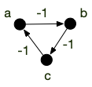

<!-- début résumé -->

Chemins de longueur minimum entre deux sommets pour un graphe orienté.

<!-- fin résumé -->

Pour ce cours, nous n'allons considérer **que des graphes orientés** car les notions et théorèmes présentés s'y prêtent mieux. Cela n'entraîne pas une grande perte de généralité : un graphe non orienté (valué) pouvant être considéré comme  un graphe orienté avec 2 arcs opposés (de même valuation).

Commençons par définir le problème :


Soit $G = (V, E)$ un graphe orienté et $a, b$ deux sommets. Un **chemin de longueur minimum entre $a$ et $b$** est un chemin $v_0 \dots v_{k-1}$ tel que :

* $a = v_0$ et $b=v_{k-1}$
* il n'existe pas de chemin entre $a$ et $b$ de longueur strictement plus petite que $k$.


Que l'on généralise souvent aux **graphes valués** :


Un **graphe orienté valué** est un couple $(G, f)$ où :

* $G=(V, E)$ est un graphe orienté
* $f: E \rightarrow \mathbb{R}$

Le **poids** d'une liste d'arc/arêtes $L$, noté $f(L)$ est la somme des valuations de ses arcs/arêtes et le poids d'un pseudo chemin $=cv_0\dots v_{k-1}$, noté $f(c)$, est la somme $\sum_{0\leq i < k-1}f(v_iv_{i+1})$ (le poids de la liste des arc/arêtes constituant le pseudo-chemin).


Soit $(G, f)$ un graphe valué et $a, b$ deux sommets de $G$. Un **chemin de longueur minimum entre $a$ et $b$** est un chemin $c=v_0 \dots v_{k-1}$ tel que :

* $a = v_0$ et $b=v_{k-1}$
* il n'existe pas de chemin $w_0\dots w_{k'-1}$ de poids plus petit que celui de $c$.


Il est clair qu'un chemin de longueur minimum d'un graphe est un chemin de poids minimum où toutes les valuations sont égales à 1.

Attention cependant :


Il peut exister **plusieurs chemins** de poids minimum entre $a$ et $b$ dans un graphe orienté valué $(G,f)$.


Le graphe orienté $G = (\\{a, b, c, d\\}, \\{ab, bc, ad, dc\\})$ admet deux chemins de longueur minimum entre $a$ et $c$.


Le problème du chemin de poids minimum fait partie de ces problèmes où l'on cherche à minimiser une fonction mais où ce qui nous intéresse c'est l'élément qui réalise le minimum. Ce genre de problème admet souvent un minimum (unique) réalisable par plusieurs éléments.

## Graphe à valuation positive

Commençons par restreindre le problème au cas intuitif où **la valuation $f$ des arcs correspond à un coût**. Pensez par exemple à google maps où les arcs sont des tronçons de route. Les valuations peuvent alors être la distance du tronçon, les péages ou encore le temps min (en respectant les limitations de vitesse) pour le parcourir.

Dans ce cas là, trouver un chemin de poids minimum ou un chemin élémentaire de poids minimum sont deux problème équivalents :

S'il existe un chemin entre $a$ et $b$ dans un graphe orienté $G$, alors :

* **il existe** un pseudo-chemin de longueur minimum
* un pseudo-chemin de longueur minimum est nécessairement **élémentaire**

Plus généralement Si le graphe $G$ est valué par une fonction $f$ positive ($f: E \rightarrow \mathbb{R}^+$) alors :

* **il existe** un chemin de poids minimum
* parmi tous les chemins de poids minimum, ceux de longueur minimum sont **élémentaire**



Le problème de longueur minimum est un cas particulier de valuation positive (la valeur est toujours égale à 1), on considère donc :

* un graphe orienté valué positivement $(G, f)$
* deux sommets $a$ et $b$ de $G$
* un chemin $c$ entre $a$ et $b$

Un chemin $c'$ réalisant le minimum est donc tel que $0 \leq f(c') \leq f(c)$. Comme l'intervalle $[0, f(c)]$ est un compact, la fonction $f$ va atteindre son minimum pour un élément de l'ensemble des chemins $c'$ entre $a$ et $b$ telles que $0 \leq f(c') \leq f(c)$. On en conclut qu'il existe $c^\star$, un chemin entre $a$ et $b$ dans $G$ de poids minimum.

Si $c^\star$ est un chemin non élémentaire, il existe une boucle. Cette boucle est de longueur strictement positive, la supprimer ne change pas l'origine et la fin du chemin tout en diminuant strictement sa longueur : $c^\star$ ne peut pas être un chemin de poids minimum de longueur minimum.



De là :


On peut se restreindre à rechercher des **chemins élémentaires** de poids minimum sans perte de généralité.


Enfin, un propriété fondamentale des chemin de poids minimum pour des graphes valués positivement — et le moteur des algorithmes qui permettent de trouver des chemins de poids minimum — est qu'un chemin de poids minimum est lui-même composé de chemin de poids minimum :


Soit $c = v_0 \dots v_{k-1}$ un chemin de longueur minimum entre $v_0$ et $v_k$ pour un graphe orienté valué positivement $G(G, f)$. Alors pour tout $0 \leq i < j < k$ :$c'= v_{i} \dots v_j$ est un chemin de longueur minimum entre $v_i$ et $v_j$



S'il existait un chemin $c'' = w_0 \dots w_{k'-1}$ entre $v_i$ et $v_j$ de poids strictement plus petit que $c'$, alors le [pseudo-chemin](../chemins-cycles-connexite#pseudo-) (les sommets et arêtes peuvent se répéter) : $c^\star = v_0\dots v_{i-1} w_0 \dots w_{k'-1} v_{j+1} \dots v_{k-1}$ serait de poids strictement plus petit que $c$. Comme de tout pseudo-chemin on peut extraire un chemin élémentaire (en supprimant itérativement les boucles) on peut *raffiner* $c^\star$ en un chemin élémentaire entre $v_0$ et $v_{k-1}$ de poids strictement plus petit que $c$, ce qui est impossible par hypothèse.



### Dijkstra

L'[algorithme de Dijkstra](https://fr.wikipedia.org/wiki/Algorithme_de_Dijkstra) permet, à partir d'un graphe orienté valué positivement, de trouver un chemin de longueur minimum entre deux sommets $d$ (départ) et $a$ (arrivée).

Une implémentation en python en utilisant le codage par dictionnaire des graphes et une valuation également codée par un dictionnaire dont les clés sont les arcs et les valeurs la valuation est donnée ci-après :

```python#
def dijkstra(G, f, départ, arrivé):
    prédécesseur = dict()
    coût_entrée = {départ: 0}
    sommets_examinées = {départ}

    pivot = départ
    while pivot != arrivé:
        for x in G[pivot]:
            if x in sommets_examinées:
                continue

            if (x not in coût_entrée) or (
                coût_entrée[x] > coût_entrée[pivot] + f[(pivot, x)]
            ):
                coût_entrée[x] = coût_entrée[pivot] + f[(pivot, x)]
                prédécesseur[x] = pivot

        new = None
        for x in G:
            if (x in sommets_examinées) or (x not in coût_entrée):
                continue

            if (new is None) or (coût_entrée[new] > coût_entrée[x]):
                new = x

        pivot = new
        sommets_examinées.add(pivot)

    chemin = [arrivé]
    x = arrivé
    while x != départ:
        x = prédécesseur[x]
        chemin.append(x)
    chemin.reverse()

    return chemin
```

L'algorithme précédent peut être décomposé en plusieurs parties :

1. initialisation (lignes 2 à 4) : `prédécesseur`{.language-} et `coût_entrée`{.language-} sont des dictionnaires et `sommets_examinées`{.language-} un ensemble
2. boucle principale, qui correspond au `while`{.language-} (lignes 6 à 27). Cette boucle est composée de deux parties :
   1. mise à jour (lignes 8 à 16) : on considère tous les voisins de `pivot`{.language-} qui ne sont pas encore dans `sommets_examinées`{.language-} (test des lignes 9 et 10) et on les met à jour si nécessaire (lignes 12 à 16) : soit on les découvre pour la première fois (`x not in coût_entrée`{.language-}) soit on à mieux (`coût_entrée[x] > coût_entrée[pivot] + f[(pivot, x)]`{.language-})
   2. recherche d'un nouveau `pivot`{.language-} (lignes 18 à 27) : on choisit un sommet non encore examiné de coût d'entrée le plus faible
   3. la boucle principale s'arrête une fois que l'on choisi l'arrivé comme `pivot`{.language-}
3. construction du chemin (lignes 29 à 34) : on remonte de prédécesseur en prédécesseur en partant de `arrivé`{.language-} jusqu'à remonter en `départ`{.language-}.

#### Déroulement de l'algorithme

Avant de voir comment il fonctionne, testez le. Le graphe ci-après représente les différents vols et leurs durées entre différentes villes d'Europe :


Le codage en python est alors le suivant pour le graphe :

```python
G = {
    "Paris": {"Hambourg", "Amsterdam", "Londres"},
    "Hambourg": {"Stockholm", "Berlin"},
    "Amsterdam": {"Hambourg", "Oslo", "Londres"},
    "Londres": {"Édimbourg"},
    "Stockholm": {"Oslo", "Rana"},
    "Berlin": {"Stockholm", "Amsterdam", "Oslo"},
    "Oslo": {"Rana"},
    "Édimbourg": {"Amsterdam", "Oslo", "Rana"},
    "Rana": set(),
}
```

Et la fonction de valuation positive :

```python
f = {
    ("Paris", "Londres"): 4,
    ("Paris", "Amsterdam"): 3,
    ("Paris", "Hambourg"): 7,
    ("Hambourg", "Stockholm"): 1,
    ("Hambourg", "Berlin"): 1,
    ("Amsterdam", "Londres"): 1,
    ("Amsterdam", "Hambourg"): 2,
    ("Amsterdam", "Oslo"): 8,
    ("Londres", "Édimbourg"): 2,
    ("Stockholm", "Rana"): 5,
    ("Stockholm", "Oslo"): 2,
    ("Berlin", "Stockholm"): 2,
    ("Berlin", "Amsterdam"): 2,
    ("Berlin", "Oslo"): 3,
    ("Oslo", "Rana"): 2,
    ("Édimbourg", "Rana"): 6,
    ("Édimbourg", "Amsterdam"): 3,
    ("Édimbourg", "Oslo"): 7,
}
```


Faites un déroulé séquentiel de l'algorithme. Dans quel ordre les sommets sont-ils ajoutés dans `sommets_examinées`{.language-} ?


Les différentes étapes de l'algorithme sont représentées dans les graphes ci-dessous.

* La figure se lit de gauche à droite et de haut en bas.
* les sommets de `sommets_examinées`{.language-} sont en vert
* en orange les valeurs de `prédécesseur`{.language-} et de `coût_entrée`{.language-}
* en magenta `pivot`{.language-} et les modifications de `prédécesseur`{.language-} et de `coût_entrée`{.language-} s'il y en a




#### <span id="preuve-Dijkstra"></span> Preuve


Pour un graphe orienté valué positivement $(G, f)$ et deux sommet $a$ et $b$ de $G$, l'algorithme de Dijkstra rend un chemin élémentaire de longueur minimum entre $a$ et $b$ (s'il existe).


On montre par récurrence qu'à chaque étape le chemin de `départ`{.language-} à `pivot`{.language-} constitué en remontant les prédécesseurs de `pivot`{.language-} jusqu'à arriver à `départ`{.language-} est de longueur minimale et de coût `coût_entrée[pivot]`{.language-}.

Au départ `pivot = départ`{.language-}, la propriété est donc vraie. On la suppose vrai jusqu'à la l'itération $i$ (qui correspond au fait que l'on ait $i$ sommets dans  `sommets_examinées`{.language-}). A l'étape $i+1$, on a choisi `pivot`{.language-} qui minimise le coût d'entrée parmi tous les sommets qui ne sont pas encore dans `sommets_examinées`{.language-}.

Comme tous les chemins alternatifs entre `départ`{.language-} et `pivot`{.language-} commencent en `départ`{.language-}, il existe un arc de ce chemin dont le départ  (disons $u$) est dans `sommets_examinées`{.language-} et l'arrivée (disons $v$) n'y est pas. Prenons la première arête $uv$ pour laquelle ça arrive.

Par hypothèse de récurrence, `coût_entree[u]`{.language-} est le coût minimum d'un chemin entre `départ`{.language-} et $u$ et `coût_entree[v]`{.language-} est donc plus grand que `coût_entree[u] + f[uv]`{.language-} (on a examiné ce cas lorsque l'on a fait rentrer $u$ dans `sommets_examinées`{.language-}) et de `coût_entree[pivot]`{.language-} (car c'est le min).

De là, le coût du chemin alternatif est plus grand également que `coût_entree[pivot]`{.language-} **car toutes les valuations sont positives** : notre hypothèse est vérifiée.



#### Complexité


La complexité de l'algorithme de Dijkstra est en $\mathcal{O}(\vert E\vert + (\vert V \vert)^2)$


On ajoute à chaque étape un élément, donc il y a au pire $\vert V \vert$ étapes. A chaque choix on compare les voisins de `pivot`{.language-}. Ces comparaisons sont donc de l'ordre de $\mathcal{O}(\delta(\mbox{pivot}))$ opérations. Comme `pivot`{.language-} est différent à chaque étape, toutes ces comparaisons sont de l'ordre de $\mathcal{O}(\sum\delta(\mbox{pivot})) = \mathcal{O}(\vert E \vert)$ opérations.

On prend ensuite le minimum parmi les éléments de `sommets_examinées`{.language-}, ce qui prend $\mathcal{O}(\vert V \vert)$ opérations.

La complexité totale est alors en :
<p>
\[
\mathcal{O}(\underbracket{\vert E\vert}_{\mbox{mises à jour du coût d'entrée}} + \underbracket{(\vert V \vert)^2}_{\vert V \vert \mbox{ choix de pivot}})
\]
<\p>



On le voit dans la preuve, le facteur limitant est la partie en $\mathcal{O}(\vert V \vert^2)$ qui n'est pas linéaire en la taille du graphe (en mémoire un graphe occupe de l'ordre de $\mathcal{O}(\vert E \vert + \vert V \vert)$ cases). Celle ci concerne le choix du nouveau pivot en cherchant un minimum de `coût_entree`{.language-}. En optimisant cette opération, on peut drastiquement diminuer la complexité de l'algorithme.

Une optimisation classique est d'utiliser un [tas](https://fr.wikipedia.org/wiki/Tas_(informatique)) pour trouver le min. On a alors que :

* une complexité de $\mathcal{O}(1)$  pour prendre un minimum
* une complexité de $\mathcal{O}(\log_2(M))$ où $M$ est le nombre d'éléments du tas pour mettre à jour la structure après chaque modification. Comme il va y a voir au maximum $V$ éléments dans ce tas, on peut borner cette complexité par $\mathcal{O}(\log_2(\vert V \vert))$

Enfin :

* il y a de l'ordre $\mathcal{O}(\vert V \vert)$ prise de minimum  : à chaque choix de `pivot`{.language-}
* il y a de l'ordre de $\mathcal{O}(\vert E \vert)$ modifications : à chaque modification de `coût_entree`{.language-}

On a donc une complexité de choix de `pivot`{.language-} qui passe alors de $\mathcal{O}(\vert V \vert^2)$ à $\mathcal{O}(\vert E \vert \log_2(\vert V \vert))$.

* S'il y a **peu d'arcs**, disons $\vert E \vert = \mathcal{O}(\vert V \vert)$, **c'est beaucoup mieux** puisque l'on a alors une complexité de : $\mathcal{O}((\vert V \vert)\log_2(\vert V \vert))$
* S'il y a **beaucoup d'arcs**, disons $\vert E \vert = \mathcal{O}(\vert V \vert^2)$, c'est **un peu moins bon**  puisque l'on a alors une complexité de : $\mathcal{O}((\vert V \vert)^2\log_2(\vert V \vert))$

La complexité de Dijkstra avec un tas est alors : $\mathcal{O}(\vert E \vert + (\vert E \vert + \vert V \vert)\log_2(\vert V \vert))$ ce qui est égal à $\mathcal{O}((\vert E \vert + \vert V \vert)\log_2(\vert V \vert))$ qui est beaucoup mieux que l'implémentation naïve si le graphe est peu dense et un peu moins bonne dans le cas où le graphe est dense

Comme souvent les graphes sont peu dense lorsque l'on cherche un chemin de poids min — pensez à google maps où il y a bien peu de routes par rapport aux nombre d'endroit où l'on peu aller — on utilise souvent cette implémentation.


La [page wikipédia](https://fr.wikipedia.org/wiki/Algorithme_de_Dijkstra#Complexit%C3%A9_de_l'algorithme) précise qu'en utilisant un tas amélioré, dit tas de Fibonacci, on arrive même à faire descendre la complexité totale à $\mathcal{O}(\vert E \vert + \vert V \vert\log_2(\vert V \vert))$, ce qui est du coup tout le temps mieux que la prise de minimum naïve, mais nécessite une structure bien plus compliquée.


#### <span id="arborescence"></span> Arborescence

On peut continuer l'algorithme de Dijkstra après que  ait été rentré dans `sommets_examinées`{.language-}, jusqu'à ce que l'on ait plus que des éléments de coût infini à faire rentrer dans `sommets_examinées`{.language-} ou que `sommets_examinées`{.language-} soit égal à $V$.


Montrez que pour tous les sommets $x$ qui ne peuvent pas entrer dans `sommets_examinées`{.language-}, il n'existe pas de chemin entre `départ`{.language-} et $x$ dans $G$

<span id="preuve-Dijkstra-arborescence"></span>

A chaque fois que l'on ajoute un élément dans `sommets_examinées`{.language-} on vérifie tous ses voisins pour mettre à jour le coût d'entrée dans la structure. On procède comme le parcours en largeur et on a montré qu'il trouvait la composante connexe de sa racine.



Montrez que si l'on peut continuer l'algorithme de Dijkstra jusqu'à ce que $V'$ soit égal à $V$ on obtient un graphe $G' = (V, E')$ tel que :

* $\vert E' \vert = \vert V \vert -1$
* il existe un unique chemin entre $d$ et tout autre sommet
* le chemin entre $d$ et $x$ dans $G'$ est de poids minimum dans $G$


Cette preuve dérive directement de la preuve de l'algorithme de Dijkstra que l'on a fait précédemment.


#### <span id="fausses-bonnes-idées"></span> Fausses bonnes idées

**Attention !** si le graphe possède des valuations positives et négatives, l'algorithme de Dijkstra trouvera un chemin s'il existe, mais il ne garantit pas de trouver un chemin de longueur minimum.

L'exemple ci-après le montre :


Une autre fausse bonne idée serait de penser que renverser les inégalités dans l'algorithme (de rentrer dans la structure à chaque fois l'élément de plus grand coût), permet de trouver un chemin le plus long. Cette approche ne fonctionne évidemment pas, reprenons le graphe précédent et valuons tous les arcs par 1 :


Le chemin de longueur maximum $132$ ne sera jamais trouvé si les sommets sont rentrés dans `sommets_examinées`{.language-} dans l'ordre 1, 2, 3 (ce qui est possible) : même s'il existe des cas où l'algorithme de Dijkstra trouvera le chemin le plus long, il en existe d'autres où il ne le trouvera pas...

### $A^\star$

Un algorithme beaucoup utilisé lorsque le graphe peut changer ou s'il est très grand, voir inconnu (un terrain de jeu) est [l'algorithme $A^\star$](https://fr.wikipedia.org/wiki/Algorithme_A*), qui est une variante de l'algorithme de Dijkstra qui accélère la procédure de choix en sacrifiant l'optimalité : on obtient alors *rapidement* une solution *acceptable* plutôt qu'obtenir *lentement* une solution optimale.

Cette approche est utile dans une grande variété de cas d'application où il est pus important d'aller vite que d'être exacte : comme dans les jeux vidéo par exemple où on utilise cet algorithme dans le [*pathfinding*](https://fr.wikipedia.org/wiki/Recherche_de_chemin) par exemple.

Son principe est identique à celui de Dijkstra, mais plutôt que de prendre à chaque fois l'élément de coût minimum on choisit un élément dont le `coût_entree`{.language-} + une distance heuristique sur sa distance à l'arrivée est minimum.

Cette modification est faite pour considérer moins de sommets que Dijkstra (on ne va pas choisir de sommets inutiles).


Proposez une implémentation de l'algorithme $A^*$ pour le parcours dans une salle d'un petit robot.



* On peut prendre comme graphe la grille 2D carré de pas 1m par exemple
* s'il y a des murs on ne mets pas d'arêtes
* l'heuristique sera la distance L1 entre la position et l'arrivée.

On peut même se déplacer à chaque itération et se rapprocher normalement du but petit à petit.


On peut aussi montrer que si l'algorithme $A^*$ a une heuristique qui ne surestime pas la distance finale, il va bien trouver un chemin de poids minimum.


Donner un exemple qui montre que si l'algorithme $A^*$ a une heuristique qui surestime le coût du chemin réel il se peut qu'il ne rende pas le bon chemin.


Pour montrer qu'il peut se tromper, on donne une estimation de coût 0 à un chemin qui n'est pas de longueur minimale et $+\infty$ à sous les autres.


## Graphe à valuation quelconque

La définition que l'on s'est donné de chemin de poids minimum est intuitive : on cherche à aller d'un sommet $a$ à un sommet $b$ de la façon la plus rapide possible (pensez à un google maps par exemple). Mais cette notion est plus fine que l'on pourrait le croire lorsque l'on permet aux valuations d'être négative. Il peut en effet exister des circuits de poids négatifs :


Soit $(G, f)$ un graphe orienté valué. Un **circuit absorbant** est un circuit $c$ de poids strictement négatif.


Même s'il existe toujours des chemins de poids minimum (on ne repasse pas deux fois par le même arc, il y en a donc un nombre fini), ils ne sont pas les plus rapides ! En effet il suffit de repasser une fois par le circuit absorbant pour aller encore plus vite... Par exemple dans le graphe orienté ci-dessous le poids du circuit $abca$ est de -3 :



Si je veux aller de $a$ à $c$, le chemin de poids minimum est $abc$ et vaut $-2$. Cependant :

* le [pseudo-chemin](../chemins-cycles-connexite#pseudo-) de $a$ à $c$ : $abcabc$ est meilleur puisqu'il vaut $-2 - 3 = -5$
* mais on peut encore faire mieux en passant 2 fois par le circuit absorbant et obtenir le pseudo-chemin de $a$ à $c$ : $abcabcabc$ qui vaut $-5 - 3 = -8$
* et ainsi de suite...

Il **n'existe pas de plus cours pseudo-chemin entre $a$ et $c$** car en joutant autant de fois que nécessaire le circuit absorbant on peut rendre le poids du pseudo-chemin aussi petit que l'on veut.


Même s'il existe un chemin de poids minimum dans un graphe valué quelconque, s'il existe des circuits absorbants alors il n'est potentiellement pas le plus court.


On peut déjà donner la proposition suivante, qui donne une condition nécessaire pour pour qu'il existe un pseudo-chemin de poids minimum entre deux sommets, et donc que le chemin de poids minimum soit bien le plus court :


Soit $(G, f)$ un graphe orienté valué ; $a$ et $b$ deux sommets de $G$.

S'**il existe** un pseudo-chemin $c=v_0\dots v_{k-1}$ entre $a$ et $b$ tel que :

* il existe $i < j$ tel que $v_i = v_j$
* qui est un **circuit absorbant** $f(v_i\dots v_j) < 0$

**Alors il n'existe pas** de pseudo-chemin de poids minimum entre $a$ et $b$ et le chemin de poids minimum n'est pas le plus court.


Le chemin :

<p>
\[
c_l = v_0 \dots v_j \underbracket{\underbracket{v_{i+1} \dots v_j} \dots \underbracket{v_{i+1} \dots v_j}}_{\mbox{répété $l$ fois}}v_{j+1} \dots v_{k-1}
\]
</p>
Est tel que :

<p>
\[
\lim_{l \rightarrow +\infty}f(c_l) = -\infty
\]
</p>



La proposition précédente nous indique qu'il suffit d'atteindre un circuit absorbant depuis $a$ et pouvoir en repartir pour atteindre $b$ pour qu'il n'existe pas de pseudo-chemin de poids minimum. Le circuit absorbant n'a pas besoin d'être *à côté* ni de valuation très négative pour poser soucis, par exemple :


C'est même une équivalence :


Soit $(G, f)$ un graphe orienté valué **ne contenant pas** de circuit absorbant ; $a$ et $b$ deux sommets $G$ tels qu'il existe un chemin entre eux.

Il existe un **chemin élémentaire** $c^\star$ entre $a$ et $b$ tel que pour tout pseudo-chemin $c$ entre $a$ et $b$ :

* la longueur de $c^\star$ est plus petite ou égale à la longueur de $c$
* le poids de $c^\star$ est plus petit ou égal au poids de $c$



Soit $c = v_0\dots v_{k-1}$ un chemin entre $a$ et $b$. S'il existe $i < j$ tel que $v_i = v_j$ alors : $f(v_i \dots v_j) \geq 0$ puisqu'il n'existe pas de circuit absorbant par hypothèse et donc le chemin $c' = v_0 \dots v_i v_{j+1} \dots v_{k-1}$ est de poids inférieur. Un pseudo-chemin avec boucle est donc toujours de poids supérieur à un pseudo-chemin sans boucle (c'est à dire un chemin élémentaire).

Comme il existe un chemin, donc un chemin élémentaire entre $a$ et $b$, l'ensemble des chemins élémentaires $\mathcal{C}$ entre $a$ et $b$ est non vide. Comme il n'y en a qu'un nombre fini, on peut prendre $c^\star \in \mathcal{C}$ tel que $f(c^\star) = \min \\{ f(c) \mid c \in \mathcal{C}\\}$. D'près ce qui précède $c^\star$ est aussi de poids minimum parmi tous les pseudo-chemins.


Pour un graphe orienté sans circuits absorbant, les notions de pseudo-chemins de poids minimum et de chemins de poids minimum coïncident donc ! On peut donc donner le théorème d'existence suivant :


Soit $(G, f)$ un graphe orienté valué ; $a$ et $b$ deux sommets tel qu'il existe un chemin entre $a$ et $b$ dans $G$.

**Il existe** un pseudo-chemin de poids minimum entre $a$ et $b$ si et seulement si **il n'existe pas** de circuit absorbant $c=v_0\dots v_{k-1}$ tel que :

* il existe un chemin entre $a$ et un $v_i$
* il existe un chemin entre un $v_j$ et $b$

De plus, s'il existe un pseudo-chemin $c$ entre $a$ et $b$, on peut en extraire un chemin élémentaire $c^\star$ entre $a$ et $b$ tel que $f(c^\star) \leq f(c)$.



Clair car tout circuit dans un pseudo chemin sera de poids positif ou nulle. On peut donc le supprimer du pseudo-chemin sans augmenter son poids.


Résoudre le problème du chemin de poids minimum entre $a$ et $b$ dans un graphe orienté à valuation quelconque il y a donc 2 problèmes à résoudre :

1. existe-t-il un circuit absorbant *entre* $a$ et $b$ ?
2. si non, trouver un chemin de poids minimum entre $a$ et $b$


Comme n l'a [vu précédemment](./#fausses-bonnes-idées), même s'il n'existe pas de circuit absorbant on ne peut pas utilser l'algorithme de Dijkstra pur résoudre le problème.


Cas heureux, on peut résoudre les deux problèmes en même temps grâce à :


l'algorithme de [Bellman-Ford](https://fr.wikipedia.org/wiki/Algorithme_de_Bellman-Ford) qui :

* cherche un chemin de poids minimum entre deux sommets dans un graphe orienté valué
* donne un circuit absorbant entre $a$ et $b$ s'il y en a un

En $\mathcal{O}(\vert V \vert \cdot \vert E \vert)$ opérations.


La complexité de l'algorithme de Bellman-Ford est plus importante que celle de celui de Dijkstra, évitez donc de l'utiliser si la valuation du graphe est positive.

## Tous les chemins

Dans le cas d'un graphe orienté valué, si l'on cherche tous les chemins de poids minimum entre chaque paire de sommets, on peut utiliser :


L'algorithme de [Roy-Floyd-Warshall](https://fr.wikipedia.org/wiki/Algorithme_de_Floyd-Warshall) donne pour un graphe orienté valué :

* donne tous les chemins de poids min entre chaque paire de sommets
* donne un circuit absorbant s'il en existe

La complexité de cet algorithme est en $\mathcal{O}(\vert V \vert ^3)$ opérations.


La complexité de l'algorithme de Roy-Floyd-Warshall est plus grande que celle de Bellman-Ford, donc si vous n'avez besoin que de chercher les plus cours chemins ou les cycles absorbants entre 2 sommets il vaut mieux utiliser ce dernier.
