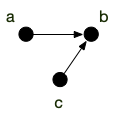
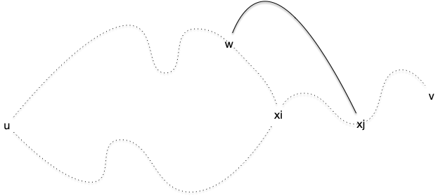

<!-- début résumé -->

Chemins, cycle et connexité dans les graphes : définitions et premières propriétés.

<!-- fin résumé -->

Un graphe $G=(V, E)$ rend compte d'une _relation_ (les arêtes) entre des objets (les sommets). Une grande part des applications des graphes viennent du fait que l'on cherche à décrire ou parcourir objets en suivant localement les relations. Cette courte partie vise à poser les diverses définitions relatives à ces notions et à exhiber quelques propriétés soit utiles, soit belles à démontrer, soit les deux.

> TBD ajout des parcours :
>
> - BFS
>   - Plus courts chemins (démonstration par rec)
> - BFS
>   - chemin et cycles/circuit avec BFS (nœud dans la pile)


## Chemin, cycles et circuits

<span id="definition-longueur"></span>

Soit $G = (V, E)$ un (multi-)graphe (non) orienté. Un **chemin allant de $v_0$ à $v_{k}$** est une suite finie :

$$C = v_0v_1\dots v_i \dots v_{k}$$

de sommets du graphe telle que :

1. $v_iv_{i+1}$ soit une arête (_resp._ arc) du graphe quelque soit $0 \leq i < k$
2. les arcs (_resp._ arêtes) sont deux à deux distinctes.

Le chemin $C$ à une **longueur** de $k$ (c'est le nombre d'arêtes). Un chemin de longueur $0$ est le chemin contenant un unique sommet, sans arc (_resp._ arête).



On peut affaiblir la notion de chemin pour les graphes orienté :


Soit $G = (V, E)$ un (multi-)graphe orienté. Une **chaîne** est une suite :

$$C = v_0v_1\dots v_i \dots v_{k}$$

de sommets du graphe telle que :

1. soit $v_iv_{i+1}$ soit $v_{i+1}v_i$ est un arc du graphe pour tout $0 \leq i < k$
2. les arcs sont deux à deux distincts.

La chaîne $C$ à une **longueur** de $k$ (c'est le nombre d'arcs).



Un chemin nous permet de définir un cycle pour les graphes non-orientés :

<span id="définition-cycle"></span>

Soit $G = (V, E)$ un (multi-)graphe non orienté. Un **cycle** est un chemin

$$C = v_0v_1\dots v_i \dots v_k$$

tel que $v_0 = v_k$

La cycle $C$ à une **longueur** de $k$ (c'est le nombre d'arêtes).


Pour les graphes orientés, ça se complique un peu car on a coutume de différentier cycle (le sens de l'arc est indifférent) de circuit (on peut parcourir le cycle dans l'ordre) :


Soit $G = (V, E)$ un (multi-)graphe orienté. Un **cycle** est une suite finie :

$$C = v_0v_1\dots v_i \dots v_k$$

de sommets du graphe telle que :

1. soit $v_iv_{i+1}$ soit $v_{i+1}v_i$ est un arc du graphe quelque soit $0 \leq i < k$
2. les arcs sont deux à deux distinctes.
3. $v_0 = v_k$



<span id="définition-circuit"></span>

Soit $G = (V, E)$ un (multi-)graphe orienté. Un **_circuit_** est un cycle :

$$C = v_0v_1\dots v_i \dots v_k$$

de sommets du graphe telle que $v_iv_{i+1}$ est un arc du graphe quelque soit $0 \leq i < k$



Terminons cette partie par un petit exercice :


Montrer qu'[un tournoi](../structure/#definition-tournoi){.interne} $G = (V, E)$ n'admet pas de cycle si et seulement si la relation $xRy \Leftrightarrow xy \in E$ est transitive.


Si la relation n'est pas transitive il existe $x$, $y$ et $z$ tels que $xy$ et $yz$ mais pas $xz$, ce qui implique que $xyzx$ est un cycle.

Réciproquement, s'il existe un cycle, prenons en un de longueur minimum : $c_0c_1c_2 \dots c_k$. Comme le cycle est de longueur minimum, $c_0c_2$ n'est pas une arête : le tournoi n'est pas transitif.



### Chemins et cycles élémentaires

Les définitions de chemins et cycles supposent que les arêtes ou arcs n'apparaissent pas deux fois. Si cette précaution permet d'éviter les chemin de taille infini, certains problèmes nécessitent de pouvoir passer plusieurs fois par les mêmes arêtes ou au contraire de ne passer qu'une seule fois par chaque sommet :

<span id="définition-pseudo-"></span>

Soit $G = (V, E)$ un graphe orienté. Un **_pseudo-chemin_** est une suite finie $C = v_0v_1\dots v_i \dots v_{k}$ une suite de sommets du graphe telle que $v_iv_{i+1}$ est un arc du graphe quelque soit $0 \leq i < k$.

<span id="définition-élémentaire"></span>

Soit $G = (V, E)$ un graphe orienté. Un **_chemin élémentaire_** (_resp._ cycle ou circuit élémentaire) est un chemin (_resp._ cycle ou circuit) $C = v_0v_1\dots v_i \dots v_{k}$ tel que $v_i \neq v_j$ quelque soit $i \neq j$.



Notez qu'un pseudo-chemin/pseudo-cycle/pseudo-circuit où chaque sommet n'apparaît qu'une seule fois est forcément un chemin/cycle/circuit élémentaire !


Ces notions sont bien sûr liées comme le montre les deux propositions ci-dessous :



- De tout pseudo-chemin, pseudo-chaîne, pseudo-cycle ou pseudo-circuit allant de $x$ à $y$ on peut extraire un chemin, chaîne, cycle ou circuit allant de $x$ à $y$.
- De tout chemin, chaîne, cycle ou circuit allant de $x$ à $y$, on peut extraire un chemin, chaîne, cycle ou circuit élémentaire allant de $x$ à $y$.
  
  
  Nous n'allons faire la preuve que pour les chemins. Les autres preuves sont équivalentes.

Soit $G=(V, E)$ un graphe et $c=v_0 \dots v_p$ un de ses pseudo-chemins qui n'est pas un chemin. Il existe donc $i < j$ tel que $v_iv_{i+1} = v_jv_{j+1}$ et $c'= v_0\dots v_iv_{j+1}\dots v_k$ est un autre pseudo-chemin allant de $v_0$ à $v_k$ ayant strictement moins de répétition d'arêtes que $c$ : on peut itérativement supprimer les répétitions d'arêtes d'un pseudo-chemin pour obtenir un chemin.

De là même manière, si $c=v_0 \dots v_p$ est un chemins non élémentaire, il existe $i < j$ tel que $v_i = v_j$ : le chemin $c' = v_0 \dots v_iv_{j+1}\dots v_k$ est un autre chemin allant de $v_0$ à $v_k$ ayant strictement moins de répétition de sommets que $c$ : on peut itérativement supprimer les répétitions de sommets d'un chemin pour obtenir un chemin élémentaire.



La réduction d'un pseudo-cycles (ou pseudo-circuit) peut engendrer un cycle (ou circuit) de longueur nulle ! Ce n'est pas le cas pour tous les autres cas.


## Connexité

<span id="définition-connexe"></span>

Un graphe est dit **connexe** si pour toute paire de sommets $x$ et $y$ il existe un chemin allant de $x$ à $y$ dans $G$.

Si le graphe est orienté :

- il est **connexe** si pour toute paire de sommets $x$ et $y$ il existe un chemin allant de $x$ à $y$ ou un chemin allant de $y$ à $x$ dans $G$.
- il est dit **fortement connexe** s'il existe pour toute paire $x$ et $y$ de sommet un chemin allant de $x$ à $y$ et un chemin allant de $y$ à $x$.
  

La connexité est une notion très importante en théorie des graphes. Elle permet de relier deux sommets entre eux par des relations. D'un point de vue pratique on aime bien les graphes connexes, pensez à _google maps_ où l'on aime bien pouvoir faire des aller-retours.


Soit $G=(V, E)$ un graphe orienté ou non.

- Un **ensemble connexe** $Y \subseteq V$ de $G$ est tel que quelque soit $x \neq y \in Y$ il existe un chemin entre $x$ et $y$ ou entre $y$ et $x$.
- Un **ensemble fortement connexe** $Y \subseteq V$ de $G$ est tel que quelque soit $x \neq y \in Y$ il existe un chemin entre $x$ et $y$ et entre $y$ et $x$.
- Une **composante (fortement) connexe** $Y \subseteq V$ de $G$ est un ensemble (fortement) connexe maximal pour l'inclusion.



Les composantes connexes d'un graphe $G$ forment ainsi un Souvent (toujours) si un graphe n'est pas connexe on le partitionnera en ses **composantes connexes** qui peuvent être vues en vertu de la proposition suivante comme des graphes distincts que l'on peut analyser séparément.



Si $G=(V, E)$ est un graphe, l'ensemble $\mathcal{C} = \{ V_1, \dots, V_p \}$ de ses composantes connexe est une partition :

- $V_i \cap V_j = \varnothing$ si $i \neq j$
- quelque soit $x \in V_i$ et $y\in V_j$ avec $i \neq j$, $xy \notin E$
- $ \sum_i V_i = V$

Si le le graphe est orienté, on a le même résultat en considérant l'ensemble de des composantes fortement connexes.



L'union de deux ensemble fortement connexes non disjointes est encore un ensemble fortement connexe : deux composantes fortement connexes sont forcément disjointes.


Les composantes connexes d'un graphe orienté ne sont pas forcément disjointes, comme le montre l'exemple ci-après :





Enfin, Du point de vue de la connexité, certains sommet ou arêtes sont plus important que d'autres :


Soit $G$ un graphe connexe.

- Un **isthme** est une arête qui déconnecte le graphe si on la supprime
- Un **nœud d'articulation** est un sommet qui déconnecte le graphe si on le supprime



Par exemple, dans des réseau routiers, les isthme et les nœuds n'articulations vont créer des bouchons s'ils sont saturés (le tunnel sous Fourvière par exemple).

<span id="k-connexité"></span>
Finissons par définir la $k$-connexité :

<span id="définition-k-connexité"></span>



Un graphe est dit $k$-connexe si la suppression de $k-1$ sommet de déconnecte pas $G$.



Il est clair qu'un graphe est connexe si et seulement si il est $1$-connexe. Les graphes 2-connexes vont avoir une certaine importance plus tard (lorsque l'on parlera de colorabilité et de planarité des graphes). Ils permettent d'avoir des graphes connexes qui résistent à la suppression d'un sommet. Les cycles sont un exemple canoniques de graphes 2-connexes :


Montrez que le degré d'un sommet d'un graphe $k$-connexe est forcément supérieur au égal à $k$


S'il existait un sommet avec un degré strictement plus petit que $k$, supprimer tous ses voisin le déconnecterait du reste du graphe ce qui est impossible pour un graphe $k$-connexe.


<span id="2-connexité-cycle"></span>


Soit $G$ un graphe 2-connexe de strictement plus de 2 sommets. Quels que soient $u \neq v$ deux de ses sommets, il existe un cycle élémentaire dans $G$ passant par $u$ et $v$.



Le graphe étant connexe, il existe un chemin élémentaire entre $u$ et $v$. Notons le $u = x_1\dots x_p = v$.

Soit $x_i$ le plus grand $i>1$ tel qu'il existe un cycle élémentaire entre $u$ et $x_i$ ($i> 1$ existe car le degré de $u$ est strictement plus grand que 1). Si $i=p$ on a gagné, donc on peut supposer sans perte de généralité que $1< i < p$. Notez que ce cycle ne peut contenir de sommets du chemin $x_{i+1}\dots x_p$

En supprimant $x_i$ du graphe, il reste connexe et donc il existe un chemin entre $u$ et $v$. Dans ce chemin considérons le plus grand élément, disons $w$, qui fait parti du cycle et $x_j$ le premier élément après $w$ qui fait parti du chemin $x_{i+1}\dots x_p$. Comme $v=x_p$, $w$ et $x_j$ existent. Or la portion de chemin entre $w$ et $x_j$ ne contient aucun élément ni du cycle ni du chemin $x_{i+1}\dots x_p$. On peut donc construire un cycle élémentaire entre $u$ et $x_j$ en allant de $u$ à $w$ puis de de $w$ à $x_j$ et en revenant à $u$ par $x_i$ et l'autre bout du cycle.



Comme $j>i$ on a une contradiction.



## Propriétés fondamentales d'existence

On le verra plus précisément lorsque l'on parlera d'arbres, mais les notions de connexités, de chemins et de cycles (notions globales) sont très liés aux degrés des différents sommets (conditions locales). Les propositions fondamentales d'existence ci après le montrent. Bien qu'elles soient très simples, elles se révèlent souvent utile, soit par les propriétés elles-mêmes soit par leurs schémas de preuves qui s'appliquent très souvent.

Commençons par donner des condition d'existence de chemins et cycles de longueur donnée :

<span id="prop-cycles-graphe"></span>

Soit $G = (V, E)$ un graphe. S'il existe un entier $k > 1$ tel que $\delta(x) \geq k$ pour tout $x \in V$, alors :

- pour tout $x \in V$ il existe un chemin élémentaire de longueur $k$ partant de $x$ ,
- il existe un cycle élémentaire de longueur au moins $k+1$,




Soit $c = v_0\dots v_i$ un chemin de longueur $i < k$ partant de $x = v_0$ (pour $i = 0< k$, ce chemin est réduit au seul point $x$).

Comme $\delta(v_i) = k > i$ il existe un voisin $y$ de $v_i$ qui n'est pas un élément du chemin. On peut donc nommer $v_{i+1} = y$ et étendre $c$ d'un élément à $c= v_0\dots v_iv_{i+1}$. Ceci montre que l'on peut étendre $c$ à un chemin de longueur $k$.

Une fois que $c = v_0\dots v_i$ a atteint la longueur $k$, on peut continuer cette procédure en cherchant à agrandir $c$ par un sommet $v_{i+1}$ tel que :

- $v_iv_{i+1}$ est une arête du graphe
- n'ayant aucun sommet $v_j$ avec $i+1 - k < j < i+1$ comme voisin (il y en a $k-1$)

De deux choses l'une :

1. soit $v_{i+1}$ n'a aucun voisin dans $c$, on peut agrandir $c$ et recommencer
2. soit $v_{i+1}$ a un voisin dans $c$ et on a trouvé un cycle de longueur au moins $k+1$

Par finitude du graphe il arrivera forcément un moment où l'on atteindra le cas 2 ce qui conclut la preuve.



Deux petits exercices pour montrer que la proposition précédente s'étend aux graphes orientés :

<span id="exercice-circuit-oriente"></span>

Soit $G = (V, E)$ un graphe orienté. S'il existe un entier $k \geq 1$ tel que $\delta^+(x) \geq k$ pour tout $x \in V$, alors :

- pour tout $x \in V$ il existe un chemin élémentaire de longueur $k$ partant de $x$ ,
- il existe un circuit élémentaire de longueur au moins $k+1$,




La preuve est identique à la proposition précédente puisqu'on ne fait que considérer les arêtes sortantes dans la preuve.



Soit $G = (V, E)$ un graphe orienté. S'il existe un entier $k \geq 1$ tel que $\delta^-(x) \geq k$ pour tout $x \in V$, alors :

- pour tout $x \in V$ il existe un chemin élémentaire de longueur $k$ finissant en $x$ ,
- il existe un circuit élémentaire de longueur au moins $k+1$,




La preuve est identique à l'exercice précédent en allant _à reculons_ dans la création du cycle.



De même pour garantir la connexité d'un graphe :

<div id="prop-connexe"></div>


Un graphe $G=(V, E)$ tel que (avec $\vert V \vert = n$ et $\vert E \vert = m$) :

$$
m > \frac{(n-1)(n-2)}{2}
$$

est connexe.


On montre la preuve par récurrence. Si $n=2$, il faut évidemment avoir $m > 0$ pour que le graphe soit connexe. On suppose la propriété vraie pour $\vert V \vert = n-1$ et on se place à $\vert V \vert = n \geq 2$.

Si le graphe est complet on a $m = \frac{n(n-1)}{2} > \frac{(n-1)(n-2)}{2}$ et le graphe est trivialement connexe. Il existe donc un sommet $x$ de degré $\delta(x) < n-1$. De plus, s'il existait un sommet sans voisin, le nombre d'arêtes serait plus petit (ou égal) à $\frac{(n-1)(n-2)}{2}$ ce qui est impossible. On a donc également $\delta(x) \geq 1$.

Le nombre d'arêtes $m'$ du sous-graphe $G'$ induit par la suppression de $x$ dans $G$ vaut :

<div>
$$
\begin{array}{ccl}
m' & = & m - \delta(x) \\
&\geq &m - (n-2) \\
&> &\frac{(n-1)(n-2)}{2} - (n-2)\\
&> &\frac{(n-2)(n-3)}{2}\\
\end{array}
$$
</div>

Le graphe $G'$ est donc connexe par hypothèse de récurrence, donc $G$ l'est aussi puisque $\delta(x) > 0$ (la composante connexe contenant $x$ intersecte $V \backslash \{ x\}$ qui est un ensemble connexe de $G$).



Notez bien que ces propositions ne sont que des implications. Si l'on prend le graphe $G=(\\{v_1, \dots, v_n\\}, E)$ avec $E = \\{ v_iv_{i+1} \mid 1 \leq i \leq n \\} \cup \\{ v_1v_n \\}$ il :

- est connexe alors qu'il a $n < \frac{(n-1)(n-2)}{2}$ arêtes si $n \geq 5$,
- admet un cycle de longueur $n$ alors que le degré de chaque élément est $2$.

## Algorithmes

> Faire en BFS ou DFS.

On utilisera le graphe suivant pour nos algorithmes :

```python
G = {
    "a": {"b", "c"},
    "b": {"a", "c"},
    "c": {"a", "b"},
    "d": set()
}
```


L'encodage par défaut des graphes sera toujours celui [par dictionnaires](../encodage#dict){.interne}.


### <span id="algorithme-connexe"></span> Algorithme de recherche de composante connexe

```python/
def composante_connexe(G, origine):
    composante = {origine}
    suivant = [origine]

    while suivant:
        x = suivant.pop()

        for y in G[x]:
            if y not in composante:
                composante.add(y)
                suivant.append(y)

    return composante
```

On utilise :

- méthodes des [liste](https://docs.python.org/fr/3/tutorial/datastructures.html#more-on-lists) :
  - la méthode `pop`{.language-} qui permet de supprimer le dernier élément de la liste et le rendre
  - la méthode `append`{.language-} qui permet d'ajouter un élément à la fin de la liste
- méthodes des [ensembles](https://docs.python.org/fr/3/tutorial/datastructures.html#sets) :
  - création avec les accolades
  - méthode `add`{.language-} qui ajoute un élément à l'ensemble

#### <span id="comp-conn-complexité"></span> Complexité

L'algorithme précédent utilise un ensemble pour stocker la composante connexe car :

- ajouter un élément à un ensemble prend $\mathcal{O}(1)$ opérations en moyenne
- savoir si un élément est dans un ensemble prend $\mathcal{O}(1)$ opérations en moyenne

Pour une liste :

- l'ajout d'un élément à la liste avec la méthode `append`{.language-} prend $\mathcal{O}(1)$ opérations
- la suppression d'un élément à la liste avec la méthode `pop`{.language-} prend $\mathcal{O}(1)$ opérations

La complexité de l'algorithme va ainsi dépendre :

- du nombre de fois où la boucle while de la ligne 5 va être exécutée
- de la nature des éléments $x$ de la boucle

Pour notre encodage, Toutes les opérations élémentaires de l'algorithme sont donc en $\mathcal{O}(1)$ opérations au maximum sauf le test de la ligne 9 et l'ajout à la composante de la ligne 10 qui est en $\mathcal{O}(1)$ opérations en moyenne.

Enfin, comme chaque sommet ne peut-être ajouté à suivant que s'il n'est pas encore dans la composante, chaque sommet ne peut y être ajouté qu'une fois : il y a au pire $\vert V \vert$ itérations de la boucle `while`{.language-} de la ligne 5 et chaque sommet ne peut être choisi qu'au pire 1 fois comme élément `x`{.language-} de la ligne 6. Et pour chaque élément la complexité de la boucle while sera de l'ordre de $\mathcal{O}(\delta(x))$ opérations en moyenne (le nombre de fois où l'on rentre dans la la boucle for)

On en conclut :


La complexité de l'algorithme `composante_connexe`{.language-} est pour un graphe encodé par dictionnaire de $\mathcal{O}(\vert E\vert)$ opérations en moyenne.

Il est donc linéaire en moyenne par rapport à la taille du graphe en entrée.



Dans le cas où l'encodage du graphe est une liste d'adjacence, on peut changer la structure de `composante`{.language-} pour que sa complexité (maximale) soit en $\mathcal{O}(\vert E \vert)$ opérations.

Quelle est cette structure ?


Dans le codage par liste d'adjacence, les sommets sont des entiers entre $0$ et $n-1$. On peut alors utiliser une liste de $n$ booléens pour composante. On place `composante[i]`{.language-} à `True`{.language-} lorsque l'on place le sommet $i$ dans la composante.

Toutes les opérations sur `composante`{.language-} effectuée par l'algorithme sont en $\mathcal{O}(1)$ opérations au maximum.



#### <span id="comp-conn-preuve"></span> Preuve

L'algorithme va progresser de voisinage en voisinage et ajouter petit à petit les éléments qu'il n'a pas encore vu. S'il existe un chemin entre $x$ et $y$, $y$ chaque élément de ce chemin va être petit à petit intégré à la composante.

#### <span id="algorithme-connexe-toutes"></span> Toutes les composantes


Utilisez l'algorithme `composante_connexe(G, origine)`{.language-} pour créer un algorithme qui rend toutes les composantes connexe d'un graphe.



```python
def les_composantes(G):
    composantes = []

    dans_une_composante = set()

    for x in G:
        if x in dans_une_composante:
            continue

        composantes.append(composante_connexe(G, x))
        dans_une_composante.update(composantes[-1])

    return composantes
```

Pour s'assurer de ne pas refaire plusieurs fois la même composante connexe, on stocke dans un ensemble les sommets déjà vu. On utilise pour cela le mot clé [`continue`{.language-}](https://docs.python.org/fr/3/tutorial/controlflow.html#break-and-continue-statements-and-else-clauses-on-loops).



### <span id="algorithme-fortement-connexe"></span> Algorithme de recherche de composante fortement connexe

> TBD avec un DFS

> TBD  connexes

- Kosaraju en 2 passes : <https://www.youtube.com/watch?v=RpgcYiky7uw>
- Tarjan en une passe : <https://www.youtube.com/watch?v=wUgWX0nc4NY>

> TBD <https://www.youtube.com/watch?v=m2mdGfxs_5E>


### Trouver un chemin

L'algorithme suivant, nommé `chemin`{.language-}, prend un graphe et deux sommets $a$ et $b$ en paramètres. Il rend soit un chemin entre $a$ et $b$ s'il existe soit le chemin vide si $a$ et $b$ sont dans deux composantes connexes différentes.

```python/
def chemin(G, a, b):
    examinés = {a}
    chemin = [a]

    x = a
    while x != b:
        suivants = G[x] - examinés
        if suivants:
            y = suivants.pop()
            examinés.add(y)
            chemin.append(y)
        else:
            chemin.pop()

        if chemin:
            x = chemin[-1]
        else:
            break

    return chemin
```

On utilise :

- méthodes des [liste](https://docs.python.org/fr/3/tutorial/datastructures.html#more-on-lists) :
  - la méthode `pop`{.language-} qui permet de supprimer le dernier élément de la liste et le rendre
  - la méthode `append`{.language-} qui permet d'ajouter un élément à la fin de la liste
  - le fait quel'on puisse accéder au dernier élément d'une liste avec un indice de `-1`{.language-}
- méthodes des [ensembles](https://docs.python.org/fr/3/tutorial/datastructures.html#sets) :
  - création avec les accolades
  - méthode `add`{.language-} qui ajoute un élément à l'ensemble
  - la soustraction de deux ensembles qui rend un nouvel ensemble contenant les éléments du premier ensemble non présent dans le second.
- la commande `break`{.langage-} qui sort de la boucle la plus imbriquée, ici la boucle `while`{.language-} de la ligne 6.
- les tests des lignes 8 et 15 qui rendent faut si l'ensemble ou la liste sont respectivement vides.

#### <span id="chemin-complexité"></span> Complexité

La complexité de chaque itération `while`{.language-} de la ligne 6 et de l'ordre de $\mathcal{O}(\delta(x))$ opérations car il faut trouver un voisin non encore examiné. Comme à chaque fois qu'un voisin est utilisé, il est examiné, un même sommet pourra être le `x`{.language-} de la boucle while au maximum $\delta(x)$ fois. De là, la complexité globale de l'algorithme est de l'ordre de :

$$
C = \mathcal{O}(\sum_x (\delta(x))^2) \leq \mathcal{O}((\sum_x \delta(x))^2) = \mathcal{O}((2 \vert E \vert)^2) = \mathcal{O}(\vert E \vert^2)
$$

> TBD lien


Notez que cet algorithme recalcule plein de fois la même chose : tous les voisins de $x$.

La encore, Une version optimisée de cet algorithme peut être faite avec le parcours en profondeur et que nous verrons plus tard, permet de faire la même chose avec une complexité linéaire (c'est à dire la taille du graphe): $\mathcal{O}(\vert E \vert)$.


#### <span id="chemin-preuve"></span> Preuve

Le preuve de l'algorithme repose sur la proposition suivante :


Soit $G = (V, E)$ un graphe connexe et $a, b\in V$.

S'il existe un chemin allant de $a$ à $x$ :

- ne passant pas par $b$
- tel que tous les voisins de $x$ soient dans le chemin

Alors il existe un chemin allant de $a$ à $b$ ne passant pas par $x$.



Soit $c= a\dots x = v_0\dots v_p$ le chemin allant de $a$ à $x$ et $c' = a \dots b = w_0\dots w_q$ un chemin allant de $a$ à $b$ passant par $x$.

On note $1 \leq i < q$ le plus grand indice tel qu'il existe $1\leq j < p$ avec $w_i = v_j$. Comme $x$ est sur $c'$ :

- cet élément existe
- il est placé après $x$ dans $c'$

Le chemin $v_0 \dots v_i w_{j+1} \dots w_q$ est un chemin allant de $a$ à $b$ ne passant pas pas $x$.



### Trouver un circuit ou un cycle

Pour trouver un cycle, on se place dans le cadre de la [proposition sur les degrés](./#prop-cycles-graphe){.interne}, en partant d'un sommet $a$ donné.


L'algorithme ne fonctionne que dans le cadre de la proposition.


<span id="algo-cycle-oriente"></span>

```python/
def circuit(G, a):
    chemin = [a]

    x = a
    while not G[x].intersection(chemin):
        x = set(G[x]).pop()
        chemin.append(x)

    début = (G[x].intersection(chemin)).pop()
    i = chemin.index(début)

    return chemin[i:] + [début]
```

<span id="algo-cycle-non-oriente"></span>
Il faut s'assurer que l'on n'utilise pas l'arête retour lorsque le graphe est non orienté :

```python/
def cycle_non_orienté(G, a):
    chemin = [a]

    x = a
    while not G[x].intersection(chemin[:-2]):
        x = (G[x] - set(chemin[-2:])).pop()
        chemin.append(x)

    début = (G[x].intersection(chemin[:-2])).pop()
    i = chemin.index(début)

    return chemin[i:] + [début]
```

### Trouver une composante 2-connexe

> TBD aussi avec un DFS
