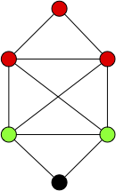
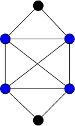
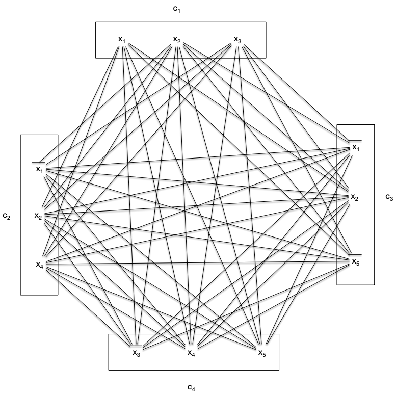
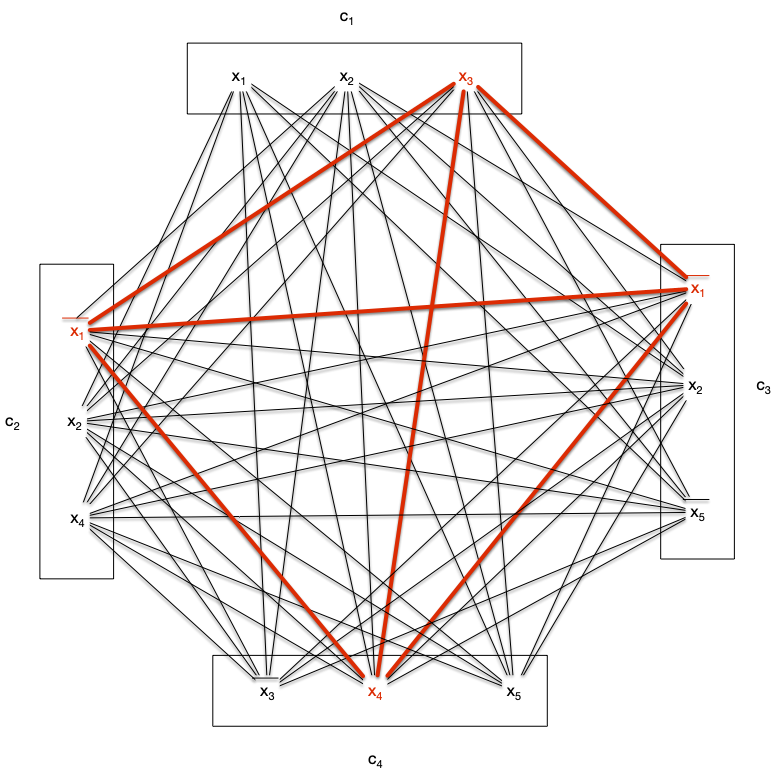

<span id="definition-clique"></span>

Une **_clique_** $C$ d'un graphe $G=(V, E)$ est un ensemble de sommet de graphe tel que quelque soient $x \neq y \in C \subseteq V$, $xy \in E$.


Un **_stable_** est l'opposé :

<span id="definition-stable"></span>


Une **_stable_** $S$ d'un graphe $G=(V, E)$ est un ensemble de sommet de graphe tel que quelque soient $x \neq y \in S$, $xy \notin E$.


Des deux définition précédentes, un sommet est à la fois une clique et un stable. Ils constituent les ensembles minimaux non vide. Réciproquement, on appelle **_clique maximale_** (_resp._ **_stable maximal_**) un ensemble maximal pour l'inclusion.

Dans le graphe suivant, les ensembles rouges et verts sont des cliques, mais seule l'ensemble rouge est maximal.



On appelle **_clique maximum_** (_resp._ **_stable maximum_**) une clique maximale (_resp._ **_stable maximal_**) maximum pour l'inclusion (il n'en existe pas de plus grande).

<span id="definition-notation-clique-stable-maximum"></span>

Soit $G$ un graphe. On note :

- $\omega(G)$ la taille de ses cliques maximum
- $\alpha(G)$ la taille de ses stables maximum



Notez que pour l'exemple précédent, l'ensemble de sommets rouges n'est pas une clique maximum.


Montrez que pour le graphe $G$ précédent, $\omega(G) = 4$.


Pour ce genre de preuves, il faut procéder en deux temps :

1. exhiber une clique de taille 4
2. montrer que tout ensemble de 5 sommets n'est pas une clique.

Le sous ensemble des sommets bleus suivant est une clique :



Si on prend 5 éléments, cela revient à supprimer 1 élément du graphe et aucuns de ceux ci n'est une clique.


Il est facile, itérativement à partir d'une clique possiblement réduite à un point, de trouver une clique maximale :

```pseudocode
algorithme clique_maximale(G: Graphe, x:sommet) -> {sommet}

C <- {x}
tant qu'il existe un sommet y de G \ C tel que C U {y} est une clique:
    C <- C U {y}
rendre C
```

Le problème est qu'il y a de nombreux minima locaux, ce qui fait que trouver $\omega(G)$ ou $\alpha(G)$ pour un graphe donné est un problème difficile.

## Problème de la clique/stable maximum

Trouver une clique maximum d'un graphe est un problème NP-complet. Considérons les deux problèmes suivant :



- **nom** : clique
- **Entrée** :
  - un graphe
  - un entier $K$
- **Question** : le graphe contient-il une clique de taille supérieure ou égale à $K$ ?





- **nom** : stable
- **Entrée** :
  - un graphe
  - un entier $K$
- **Question** : le graphe contient-il un stable de taille supérieure ou égale à $K$ ?



### NP-complétude

Les deux problèmes sont clairement dans NP puisque vérifier qu'un ensemble est une clique/stable se résout polynomialement (il suffit de vérifier toutes les paires de sommets) :

```pseudocode
algorithme vérification_clique_ou_stable(G: graphe<sommet>, A: {sommet}, clique: booléen):
  pour chaque x de A:
    pour chaque y de A:
        si x ≠ y:
            si xy est une arête de G et non clique:
              retourne Faux
            si xy n'est pas une arête de G et clique:
              retourne Faux
  retourne vrai

algorithme vérification_clique(G: graphe<sommet>, A: {sommet}):
  retourne vérification_clique_ou_stable(G, A, Vrai)

algorithme vérification_stable(G: graphe<sommet>, A: {sommet}):
  retourne vérification_clique_ou_stable(G, A, Faux)

```

Commençons par un petit échauffement : 


Montrez que en montrant que $clique \leq stable$ :



On utilise la réduction consistant à prendre en entrée de stable le graphe complémentaire de celui en entrée de clique. La construction de ce graphe est au pire de complexité $\mathcal{O}(n^2)$ avec $n$ le nombre de sommets du graphe (on peut être amené à ajouter de l'ordre de $\mathcal{O}(n^2)$ arêtes si le graphe initial est discret).

La solution du problème stable est aussi la solution de problème clique pour le graphe originel, il n'y a donc aucun ajustement à faire pour le retour.



L'exercice précédent nous permet de nous consacrer uniquement au problème clique, la NP-completude du problème stable en découlera immédiatement.
Il est de plus NP-complet :


Le problème clique est NP-complet.


On va le montrer par réduction depuis [le problème SAT](/cours/algorithmie/problème-SAT/#3-sat){.interne}.

Soit l'ensemble de clauses suivante, formant une entrée du problème 3-SAT, sur l'ensemble de variables $\\{ x_1, \dots, x_n \\}$ :

<div>
$$
\mathcal{C} = \land_{1\leq i \leq m}( l_i^1\lor \dots \lor l_i^{k_i})
$$
</div>

Avec pour tous $1\leq i \leq m$ et $1\leq j \leq k_i$, $l_i^j \in \\{x_i \vert 1\leq i \leq n \\} \cup \\{\overline{x_i} \vert 1\leq i \leq n \\}$.

On associe (polynomialement) à cette instance un graphe $G=(V, E)$ tel que :

- $V = \\{ l_i^j \vert 1\leq i \leq m, 1\leq j \leq k_i \\}$
- $l_i^jl_k^l$ est une arête si :
  - $i \neq k$
  - $l_i^j \neq \overline{l_k^l}$

Et on cherche s'il existe une clique de taille supérieure ou égale à $m$.

S'il existe une solution au problème 3-SAT alors il existe un littéral $l_i^{u_i}$ qui est vrai pour toute clause $1\leq i \leq m$. L'ensemble $\mathcal{C} = \\{ l_i^{u_i} \vert 1\leq i \leq m\\}$ est une clique de taille $K$ de $G$.

Réciproquement toute clique de $G$ ne peut contenir qu'au plus un littéral de chaque clause, donc une clique de taille $K$ contient un littéral par clause que l'on peut positionner à vrai.


Le problème stable est NP-complet.


En reprenant [l'exemple du problème 3-SAT](/cours/algorithmie/problème-SAT/#3-sat-exemple){.interne} on obtient le graphe associé $G=(V, E)$ :



Ce graphe possède de multiples cliques de taille 4, comme par exemple :



Ce qui fixe 1 littéral pour chaque clause :

- ${x_3}$ de la clause 1
- $\overline{x_1}$ des clauses 2 et 3
- ${x_4}$ de la clause clause 4

Qui fixe 3 variables. On aura toutes les clauses de vérifiées quelques soient les valeurs de $x_2$ et $x_5$ si :

- $x_3 = 1$,
- $x_1 = 0$,
- $x_4 = 1$

Dans la plupart des exemples réels, il y aura plus de clauses que de variables mais la clique max sera toujours compatible, la variable apparaissant toujours de façon identique pour chaque littéral de la clique : comme chez nous il y a 2 fois $\overline{x_1}$.

C'est le premier problème de graphe que l'on voit NP-complet, il va y en avoir tout un tas d'autres.

## Théorème de Ramsey

Le théorème de Ramsey est a priori surprenant. 
> TBD on y reviendra pour les graphes aléatoire/méthode probabiliste
>

## Exercice : problème de la couverture minimale 

> TBD problème de la couverture, voir DS.
 


- **nom** : clique
- **Entrée** :
  - un graphe
  - un entier $K$
- **Question** : le graphe contient-il une clique de taille supérieure ou égale à $K$ ?




